# 漏洞篇
day2

## 2.1 Web安全-Top10漏洞

### 什么是 OWASP
开放式 Web 应用安全项目 (OWASP) 是一个致力于 Web 应用安全的国际非营利组织。OWASP 的核心原则之一是，其网站免费提供所有资料并且可供用户轻松访问，以便任何人都可以提高自己的 Web 应用安全性。他们提供的资料包括：文档、工具、视频和论坛。他们最著名的项目或许是 OWASP Top 10 报告。

官网地址：https://owasp.org/Top10/2025/

### 什么是 OWASP Top10
OWASP Top 10 是一份定期更新的报告，概述了 Web 应用安全性的安全问题，重点关注 10 个最关键的风险。该报告由来自世界各地的安全专家小组汇总而成。OWASP 将 Top 10 称为“意识文档”，他们建议所有公司将该报告纳入流程中，以最大程度地减少和/或防护安全风险，下图是 2025 年的 Top10 漏洞列表。

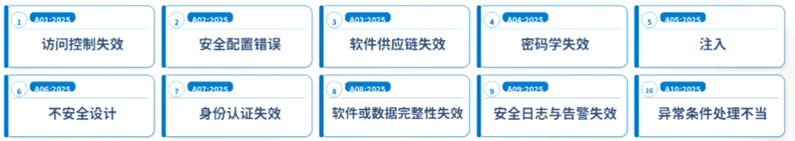

## 2.2 SQL注入

### 2.2.1 漏洞原理
SQL 注入（SQL Injection）是指攻击者把恶意 SQL 代码注入到应用对数据库的查询中，当应用直接把不可信的用户输入拼接进 SQL 语句并执行时，攻击者可读取、修改或删除数据库中的数据，绕过认证、获取敏感信息，甚至在严重情况下获得数据库或主机的完全控制。

**常见类型**：
- 基于错误的注入
- 盲注（布尔/时间盲注）
- 联合查询注入（UNION）

触发点通常是登录表单、搜索框、URL 参数和任何把输入当作 SQL 片段处理的地方。

**防御要点**：
- 始终使用参数化查询/预编译语句或 ORM 的绑定机制，**不要做字符串拼接**
- 对输入做最小化白名单校验与长度限制
- 限制数据库账户权限（最小权限原则）
- 对错误信息进行模糊化处理并开启查询日志审计
- 在必要时使用 Web 应用防火墙（WAF）作为补充
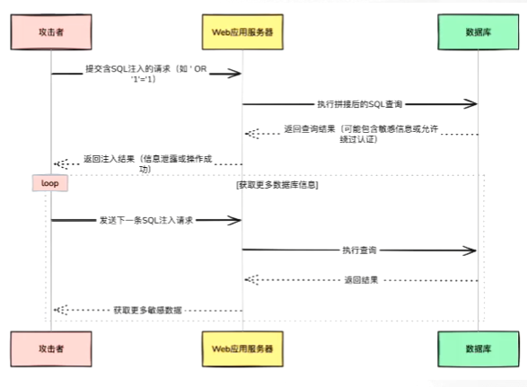

### 2.2.2 SQL漏洞利用方式

#### 万能密码
输入用户名 `' or '1'='1'#`、密码 `"123"`，点击“登录”按钮，提示登录成功。

登录成功后页面显示：`登录成功，欢迎用户: ' or '1'='1'#`
```php
//practice1/login.php
<!DOCTYPE html>
<html>
<head>
<title>SQL注入演示—"万能密码登录"</title>
</head>
<body>
<h4>用户登录</h4>
<form action="login.php" method="post">
    用户名: <input type="text" name="username" /><br>
    密 码: <input type="password" name="password" /><br>
    <input type="submit" value="登录" />
</form>

<?php
$conn = new mysqli('localhost', 'root', '123456', 'mydatabase'); // 建立数据库连接
if ($conn->connect_error) { // 检查连接是否成功
    die("连接失败: " . $conn->connect_error);
}
$username = $_POST['username']; // 获取用户名
$password = $_POST['password']; // 获取密码

if ($username != "" && $password != "") { // 判断用户名和密码是否为空
//危险注入点，直接拼接参数，没使用占位符或者过滤，导致注入
    $sql_query = "SELECT * FROM users WHERE username='$username' AND password='$password'"; // 构建SQL查询语句
    $result = $conn->query($sql_query); // 执行SQL查询
    if ($result && $result->num_rows > 0) { // 检查查询结果集是否为空、行数是否>0
        echo "登录成功，欢迎用户: $username";
    } else {
        echo "登录失败，请检查用户名和密码";
    }
}

$conn->close(); // 关闭数据库连接
?>
</body>
</html>
```

分析 `/practice1/login.php` 示例代码：尽管 `users` 数据表中不存在用户名为 `' or '1'='1'#` 的用户，但由于该特殊构造的用户名中包含SQL注入代码，导致在用户名和密码均不匹配的情况下仍然可以成功登录。出现这种现象是因为 `login.php` 页面存在SQL注入漏洞，攻击者能够利用该漏洞绕过正常的身份验证。

在该示例中，用户输入的单引号 `"` 与SQL语句中原有的单引号形成闭合，导致原本用于界定用户名的单引号发生逃逸，SQL语句的实际语义变为：

```sql
SELECT * FROM users WHERE username='用户名' or '1'='1'#' AND password='密码'
```
其中，"or '1'='1'" 导致 WHERE 条件为真，"#" 作为注释符将后续的 SQL 语句变为注释。因此无论输入什么密码，该 SQL 语句总能返回 users 数据表中的所有数据作为结果集，从而满足登录条件，实现 “万能密码登录”。SQL 注入的本质在于构造的恶意输入改变了 SQL 语句的预期语义，从而导致执行结果与 SQL 语句的预期结果不符。
在上述示例中，login.php 页面未对用户输入的恶意数据进行有效过滤，而是将用户输入的恶意数据直接拼接到 SQL 语句中并执行，这是导致安全漏洞的直接原因。对于 Web 开发者而言，“永远不要相信用户输入的数据” 是一条至关重要的安全准则。

#### UNION SELECT联合注入
联合注入是一种利用联合查询语句（即UNION SELECT）的特性获取更多数据库敏感信息的注入方式。在SQL中，UNION SELECT语句能够同时执行两条或多条SELECT语句，并将结果集纵向拼接成一张虚拟表，实现跨库、跨表查询的功能。

使用联合查询时需要注意：
1.  **字段一致性**：在联合查询中，联合查询必须与主查询具有相同数量的字段，且各个位置的字段类型应相同或兼容。例如，NULL和数字能够与大部分字段类型兼容。
2.  **重复行的处理**：在默认情况下，联合查询会自动去除重复的行，如需包含重复的行，应使用UNION ALL SELECT语句。

联合查询的注入点通常被拼接在WHERE操作符后，并且联合注入的使用需要页面能够回显数据。

eg.http://127.0.0.1/practice1/login.php/?id=-1+union+select+1,2,group_concat(table_name)+from+information_schema.tables+where+table_schema=database()

| 内置函数/变量 | 说明 |
| --- | --- |
| user() | 返回当前数据库连接的用户名和主机名 |
| version() | 返回MySQL的版本信息 |
| database() | 返回当前数据库的名称 |
| concat() | 将多个字符串拼接成一个完整的字符串，当用于多行记录时，它将对每一行分别执行拼接操作，而不会将多行记录的特定字段值拼接成一个字符串 |
| group_concat() | 将多行记录的特定字段值按照指定的分隔符拼接成一个完整的字符串，当用于多行记录时，它将对所有行的特定字段值进行拼接操作，拼接成一个字符串 |
| count() | 返回查询结果集中的行数 |
| length() | 返回输入字符串的长度 |
| substr() | 返回从字符串中截取指定位置和长度的子字符串 |
| substring() | 类似于substr()，返回从字符串中截取指定位置和长度的子字符串 |
| mid() | 类似于substr()，返回从字符串中截取指定位置和长度的子字符串 |
| ascii() | 返回字符对应的ASCII码 |
| char() | 将ASCII码转换为对应字符 |
| sleep() | 使MySQL进程暂停指定的秒数 |
| if() | 根据条件表达式返回不同的值，用于执行条件逻辑判断 |
| load_file() | 读取服务器文件系统中的文件内容 |

### 2.2.3 SQL盲注

在传统的SQL注入中，Web应用程序往往会直接返回数据库的查询结果或错误信息，这种情况下的SQL注入是直观的，接下来将介绍一种不直观的SQL注入——SQL盲注。

在SQL盲注中，攻击者无法直接从Web应用程序的响应中获取到具体的数据库信息，而是通过构造一系列“是”或“否”的问题推断数据库中的数据，通常通过观察Web应用程序的状态或响应时间等方式推断信息。SQL盲注的优点是即使Web应用程序不直接回显具体的数据库信息，也能够通过“旁敲侧击”的方式推断出来；其缺点是注入过程较为繁琐，通常伴随着大量的请求，容易引起安全监测系统的警报，从而暴露攻击者的行为。SQL盲注一般可分为布尔盲注和时间盲注。

#### 1. 布尔盲注
布尔盲注是一种通过返回页面的“正常”与“异常”两种状态推断数据库信息的攻击方式。例如，攻击者通过构造SQL语句“询问”数据库：当前用户名的第一个字符是否为“r”？如果猜测正确，返回页面会处于一种状态；如果猜测错误，返回页面则会处于另一种状态。通过对比这两种状态，攻击者可以确定第一个字符，以此类推，直至把所有位置的字符都猜解出来，从而获取当前用户名。

#### 2. 时间盲注
时间盲注通过观察页面响应时间的变化，从而推断数据库信息。例如，攻击者构造SQL语句“询问”数据库：当前用户名的第一个字符是否为“r”？如果猜测正确，执行sleep(5)使响应延时5秒；如果猜测错误，则没有延时。在这种情况下，通过监测请求的响应时间是否超过1秒，攻击者可以推断猜测是否正确。与布尔盲注不同，时间盲注并不关注页面状态的差异，而是关注响应时间的差异。MySQL中常见的三种延时方法如表所示。

| 方法 | 说明 |
|------|------|
| 使用sleep()函数造成延时 | sleep(N) 表示延时N秒，N越大，延时效果越明显 |
| 使用benchmark()函数造成延时 | select benchmark(1000000, md5(1)) 表示对md5(1)表达式重复执行1000000次，执行次数越多，延时效果越明显 |
| 使用笛卡尔积造成延时 | select * from tableA,tableB 表示对tableA和tableB进行笛卡尔积运算，这会返回tableA中每一条记录与tableB中每一条记录的组合。两表的字段数越大，延时效果越明显 |

### 2.2.4 SQL注入防御
为有效防御SQL注入，可以参考以下防御措施：

(1) **预编译技术**：该技术通过预先编译SQL语句，将所有用户输入视为数据而非SQL代码，从而确保用户输入不会改变SQL语句的结构和语义，预编译技术在防御SQL注入方面效果显著。

在构造SQL语句时，预编译技术通常使用**占位符**（一般为 "?"）替代用户输入的参数值。预编译的过程如下：首先，对包含占位符的SQL语句进行预编译，此时SQL语句的语法树结构已固定。然后，将用户输入的参数值绑定到对应的占位符，这些参数值只被视为数据，不会被解释为SQL代码。最后，执行已绑定参数的预编译语句。

(2) **对用户输入采取验证和过滤**：在PHP中，常用于防御SQL注入的内置函数如表所示。

(3) **应用最小权限原则**：最小权限原则要求在满足业务需求的前提下，用户或Web应用程序只应被授予完成功能所需的最低限度的权限，以降低潜在的安全风险。具体而言，用户或Web应用程序应只被授予访问和执行其工作必需的数据库对象和操作的权限，而不应拥有对整个数据库的完全访问权限。例如，如果某个用户的业务功能只限于查询操作，那么应仅为该用户赋予查询权限，而不应赋予修改、插入或删除等非必要的权限。

实际上，应用最小权限原则的目的在于减小SQL注入可能带来的影响，而不是直接防御攻击。通过最小化用户权限，即使攻击者成功注入了恶意SQL代码，能够执行的操作也会受到严格限制，从而有效降低SQL注入对系统的破坏程度和数据泄露的风险。

*具体SQL注入相关可跟踪后续文章发布*

## 2.3 RCE远程命令执行

### 2.3.1 漏洞原理

命令注入（Command Injection）是指当应用将不可信的用户输入拼接进系统命令并在服务器/主机上执行时，攻击者通过构造恶意输入（例如包含分号、管道、反引号、&&、|、$() 等 shell 元字符）使得原本的命令被追加或替换，进而执行任意操作系统命令；后果可从泄露敏感文件到完全取得主机控制权。常见触发点包括使用 system()、exec()、popen()、反引号或通过弱化的 shell 调用来处理文件名、参数或路径等。防御要点是：避免直接用字符串拼接构建命令，改用语言提供的参数化/安全 API（例如不经过 shell 的 execv 系列或受控的库函数）、对输入做严格白名单校验与最小化权限（least privilege）执行、对必要输入做适当的转义或隔离（例如使用容器/沙箱），并开启审计与日志告警以便及时发现异常命令执行行为。
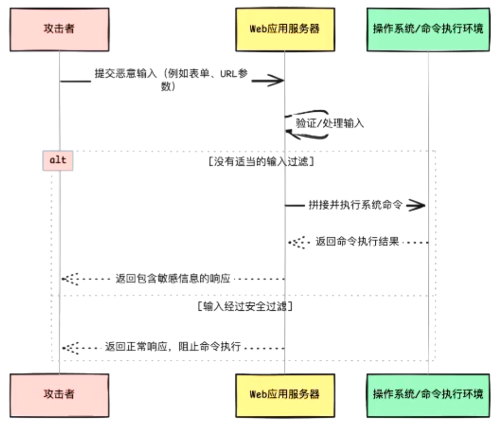

### 2.3.2 常用的命令执行函数与命令分隔符

在利用远程命令执行漏洞的过程中，攻击者通常使用命令分隔符构造恶意输入。通过命令分隔符，操作系统不仅会执行原有的命令，还会执行攻击者构造的恶意命令。下表列出了适用于Linux环境的常见命令分隔符、使用形式及其说明：

| 命令分隔符 | 使用形式       | 说明                                               |
|------------|----------------|----------------------------------------------------|
| ;          | cmd1; cmd2     | 从左到右依次执行各条命令                           |
| &          | cmd1 & cmd2    | 将cmd1置于后台运行，然后立即执行cmd2               |
| &&         | cmd1 && cmd2   | 先执行cmd1，若cmd1执行正确，才会执行cmd2           |
| \|         | cmd1 \| cmd2   | 将cmd1的输出作为cmd2的输入执行                     |
| \|\|       | cmd1 \|\| cmd2 | 先执行cmd1，若cmd1执行错误，才会执行cmd2           |

### 2.3.3 RCE远程命令执行漏洞防御

为有效防御远程命令执行漏洞，可以参考以下防御措施：

(1) **禁用高危函数**：可以通过在php.ini配置文件中设置`disable_functions`选项，以禁用部分高危函数，示例配置如下：
```ini
disable_functions = exec,passthru,shell_exec,system,proc_open,popen
(2) 采用黑名单策略过滤关键字符：可以使用正则表达式匹配输入中是否包含特殊字符，如果输入中包含特殊字符，waf()函数将返回true，示例代码如下：
// 定义WAF函数，过滤输入中的特定关键字
```
function waf($input)
{
  return preg_match(
'/\\;|\\&|\\||\\?|\\*|\\`|\\'|\\"|\\[|\\]|\\{|\\}|\\$|\\/|\\<|\\>|\\^/', $input);
}
```
(3) **使用escapeshellarg()和escapeshellcmd()函数对特殊字符进行转义**：
`escapeshellarg()`函数会通过单引号包裹输入的字符串，并对字符串中已存在的单引号进行转义或引用，确保传递给命令执行函数的内容始终作为一个完整的字符串被处理。在Windows系统中，`escapeshellarg()`函数会将百分号、感叹号和双引号替换为空格，并使用双引号包裹整个字符串。使用`escapeshellarg()`函数进行防御的示例代码如下：

```php
<?php
// 使用escapeshellarg()函数转义用户输入的IP地址
$target = escapeshellarg($_REQUEST['ip']);
// 在Linux或Unix系统执行ping命令
$cmd = shell_exec('ping -c 4 ' . $target);
// 输出命令执行结果
print($cmd);
?>
```

## 2.4 文件上传漏洞

### 2.4.1 漏洞原理

文件上传（File Upload）指 Web 应用允许用户将文件（图片、文档、压缩包等）上传到服务器的功能，但若未对上传内容、路径和处理流程进行严格控制，就会被滥用并造成严重安全问题：攻击者可上传包含恶意代码的脚本（web shell）、绕过扩展名检查的可执行文件、超大文件导致拒绝服务，或通过图片/文档中的恶意元数据触发漏洞。常见风险点包括仅靠文件名/扩展名判断类型、信任客户端 MIME-Type、不把文件存放在受限路径、以及把可上载文件直接当作可执行资源提供。
**防御措施要点**：
- 使用扩展名白名单 + 基于内容的文件类型检查（magic bytes）
- 限制文件大小、对文件名做随机化并避免使用原始名 
- 把上传目录放在 webroot 之外并禁止执行权限
- 对用户可访问的二进制/脚本进行严格内容扫描与杀毒
- 对图片等做重新编码（例如重采样）以去除隐藏载荷
- 以及在上传流程中做认证/授权与速率限制。
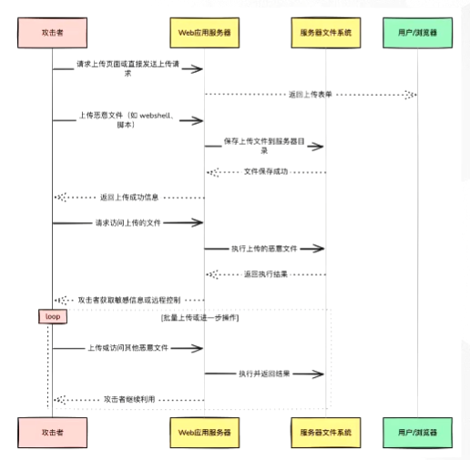

### 2.4.2 绕过前端JavaScript检测

针对只依赖前端JavaScript进行文件上传防御的手段，存在以下两种绕过方式：

(1) **禁用浏览器的前端JavaScript功能**：禁用前端JavaScript功能会导致前端JavaScript代码无法运行，从而绕过所有基于前端JavaScript的验证。以Chrome浏览器为例，用户可以在设置中搜索JavaScript，进入JavaScript选项卡并选择“不允许网站使用JavaScript”以禁用前端JavaScript功能，如图所示。

禁用JavaScript功能前，上传文件名为“phpinfo.php”的文件，其文件内容如下：
```php
<?php phpinfo();?>
```
*判断是前端还是后端，就是用抓包工具+上传，若是后端，则会成功被上传，若是前端，则会被拦截且抓包工具不会拦截到数据包*
(1)**禁用浏览器的JavaScript功能*。修改为符合其筛选条件的任意文件名，如“test.php.png”，上传后，绕过前端筛选
(2)**使用Burp Suite修改请求数据包**：首先攻击者上传符合前端要求的文件，再通过Burp Suite拦截并修改请求数据包中的文件名或文件内容，从而使前端JavaScript检测失效。例如，上传文件名为“phpinfo.jpg”的文件，“.jpg”是前端所允许上传的文件扩展名在 Burp Suite 中将文件扩展名 “.jpg” 修改为 “.php” 后再重新发送请求数据包
通过以上两种绕过方式可以看出：前端 JavaScript 检测并不可靠，甚至是一种 “形同虚设” 的防御措施。虽然使用前端 JavaScript 检测可以在一定程度上减少 Web 服务器的资源消耗，但不应将其作为主要防御措施，而应结合其他更有效的安全措施进行全面防御。

### 2.4.3 绕过文件扩展名检测

采用黑名单策略限制上传文件的扩展名是许多Web开发者常用的过滤手段，但同样存在缺陷。由于黑名单中收集的扩展名通常不够全面，攻击者能够通过上传不在黑名单中的文件扩展名绕过基于黑名单策略的文件上传验证。

此外，如果在过滤文件扩展名的过程中没有将扩展名转换为统一格式（例如统一转换为小写），攻击者可以利用大小写混合的方式绕过检测，例如使用 ".aSp" 或 ".aSa" 等大小写混合的扩展名。

| 编程语言 | 可能被解析的扩展名 |
|----------|--------------------|
| ASP/ASPX | asp, aspx, asa, asax, ascx, ashx, asmx, cer,<br>aSp, aSpx, aSa, aSax, aScx, aShx, aSmx, cEr |
| PHP | php, php5, php4, php3, php2, pHp, pHp5,<br>pHp4, pHp3, pHp2, phtml, pht, pHtml |
| JSP | jsp, jspa, jspx, jsw, jsv, jspf, jtml, jSp, jSpx,<br>jSpa, jSw, jSv, jSpf, jHtml |

### 2.4.4 绕过文件头检测

*文件头通常指文件内容的起始字节，用于标识文件的真实类型（如PNG、JPEG、PDF等）*
三种常见图片类型的文件头信息汇总如表所示。

| 类型  | 扩展名 | 十六进制文件头           | 文件头的字符形式 |
|-------|--------|-------------------------|------------------|
| PNG   | .png   | 89 50 4E 47 0D 0A 1A 0A | %PNG              |
| GIF   | .gif   | 47 49 46 38 39 61       | GIF89a           |
| JPEG  | .jpg   | FF D8 FF E0 00 10 4A 46 49 46 | ÿØÿà JFIF    |

为判断上传文件的类型，除了可以根据文件的扩展名，也有人提出通过文件头信息进行判断，其依据是每种文件类型都有其特定的文件头格式。

只通过校验**文件头信息**判断文件类型是不可靠的。攻击者可以在Webshell文件中加入任意所需的文件头，以此绕过文件头的校验。此外，对于一个包含脚本代码的文件，Web服务器能否解析其中的脚本代码，取决于文件的扩展名能否被Web服务器解析，与文件头信息无关。

### 2.4.5 绕过MIME类型检测

MIME（Multipurpose Internet Mail Extensions，多用途互联网邮件扩展）类型是一种在互联网中标识文件类型的标准。在HTTP请求或响应数据包的头部，Content-Type字段用于描述传输数据的类型和格式，该字段的值即为MIME类型。

不同类型的文件对应不同的MIME类型。例如，JPGE图片的MIME类型为“image/jpeg”，HTML文件的MIME类型为“text/html”，PHP文件的MIME类型一般为“application/octet-stream”或“application/x-httpd-php”。常见的MIME类型如表所示。

| 扩展名 | 文件类型 | MIME类型 |
|--------|----------|----------|
| .txt   | TEXT文件 | text/plain |
| .html  | HTML文件 | text/html |
| .gif   | GIF文件  | image/gif |
| .jpg   | JPEG文件 | image/jpeg |
| .png   | PNG文件  | image/png |
| .zip   | ZIP文件  | application/zip |
| .json  | JSON文件 | application/json |

检测HTTP请求中的Content-Type字段并不是有效的文件类型验证方法，因为该字段是浏览器自动生成的，攻击者可以随意修改。

### 2.4.6 NTFS数据流特性绕过

NTFS数据流是Windows NTFS文件系统的一项高级特性，允许一个文件包含多个数据流。每个文件至少有一个默认的主数据流（也称为未命名数据流），其类型是$DATA，通常表示为文件名本身；其他命名数据流（也称为备用数据流，Alternate Data Streams）默认不在资源管理器中显示。一个文件在NTFS中真正的文件名称格式为：

**<文件名>:< 数据流名 >:< 数据流类型 >**

例如，如果创建一个名为“Web.txt”的文件，它将在NTFS中存储为“Web.txt::$DATA”，其中数据流名默认为空，且数据流类型默认为“$DATA”。

当Web应用程序禁止上传扩展名为“.php”的文件时，攻击者可以尝试上传扩展名为“.php::$DATA”的文件以绕过限制，在Windows系统中，该文件会被标识为“.php”，文件内容仍然是所上传的内容。
### 2.4.7 上传.htaccess文件绕过

.htaccess（Hypertext Access，超文本入口）文件是Apache用于控制特定目录中服务器行为的配置文件，例如网页重定向、特定用户或目录的访问控制、目录索引等，该配置文件通常位于Web根目录或特定目录中。

### 2.4.8 文件上传漏洞防御

为有效防御文件上传漏洞，可以参考以下防御措施：

(1) **结合多种措施严格限制上传文件的扩展名和文件类型**：建议采用白名单策略限制文件扩展名，因为与黑名单相比，白名单更难绕过；除了严格限制文件扩展名，还应结合MIME类型检测、文件头检查等多种方式验证文件类型，以确保文件内容与其类型相匹配，而不仅仅依赖单一的检测方法。

(2) **随机化文件名和路径**：将上传文件进行随机命名并将其保存在随机生成的目录中，可以有效阻止攻击者直接访问或预测上传文件的路径。此外，还需保证上传文件的路径不被泄露。

(3) **将保存上传文件的目录权限设置为不可解析**：通过服务器配置将上传目录的权限设置为不可解析，确保上传的文件无法被Web服务器解析。例如，在头像上传的业务场景中，Web服务器只需对上传的文件进行读取和写入操作，将其作为图片资源处理，而不需要解析或执行这些文件。此外，还应检查Web服务器的版本和配置，以避免因服务器漏洞导致文件被错误地解析。

(4) **针对文件内容进行恶意代码检测**：在安全性要求极高的业务场景中，可以对上传文件内容进行恶意代码检测，以进一步保障安全性。不过，该方法可能会带来额外的资源开销，并有一定概率发生误报或漏报，因此需在性能和安全之间做好平衡。

(5) **对上传的图片进行二次渲染**：在上传图片的场景中，可以利用`imagecreatefromjpeg()`、`imagecreatefrompng()`、`imagecreatefromgif()`等函数对上传的图片进行二次渲染，此举可以去除原始图片中可能包含的恶意代码。
## 2.5 文件包含漏洞

### 2.5.1 漏洞原理

Web 安全中的 File Inclusion（文件包含）漏洞是指 Web 应用在动态加载文件时，未对用户输入进行严格过滤或路径限制，导致攻击者可以通过构造恶意参数让服务器包含任意文件。文件包含分为 **本地文件包含（LFI）** 和 **远程文件包含（RFI）**：
- LFI 通常利用相对路径或绝对路径读取服务器上的敏感文件（如 `/etc/passwd`、应用配置文件），甚至配合日志注入执行代码；
- RFI 则允许加载远程 URL 中的恶意脚本，在服务器端直接执行，从而获取服务器控制权。

该漏洞常出现在 PHP 的 `include`、`require`、`include_once`、`require_once` 等函数中。防御措施包括严格校验与白名单限制文件路径、禁用远程文件包含功能（如关闭 `allow_url_include`）、并确保应用运行在最小权限环境下。

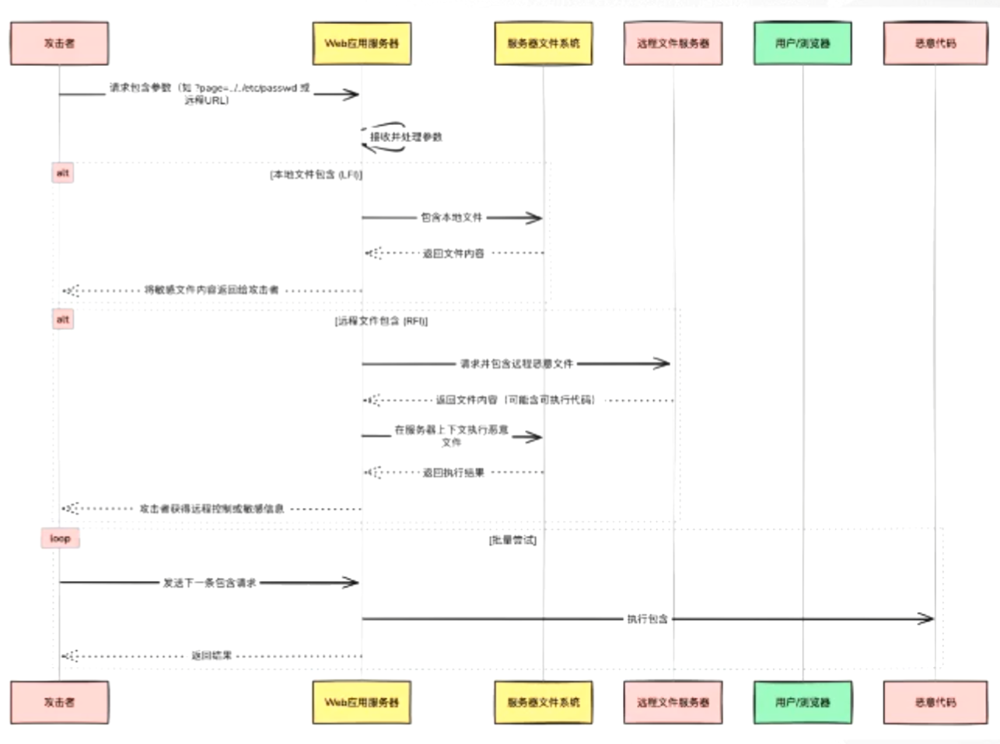

### 2.5.2 包含敏感文件

如果文件包含表达式的参数可控，攻击者可以通过文件包含漏洞读取Web服务器的敏感文件，通常使用 `../` 进行目录遍历或直接传入文件的绝对路径。在这种情况下，攻击者通过读取敏感文件能够获取操作系统信息、服务器配置信息、日志信息、网络配置信息等敏感信息。

#### 1. Linux系统常见敏感文件

| 文件 | 说明 |
|------|------|
| `/etc/passwd` | 存储系统所有用户的账户信息，包括用户名、用户ID、组ID、用户主目录和默认Shell等 |
| `/etc/shadow` | 存储系统所有用户的加密密码信息，以及密码过期和用户失效日期等安全相关信息 |
| `/etc/httpd/conf/httpd.conf` | Apache HTTP服务器的主配置文件，定义服务器的全局设置、虚拟主机和模块配置等 |
| `/etc/mysql/my.cnf` | MySQL数据库的主配置文件，包含数据库服务器的各种参数设置 |
| `/etc/network/interfaces` | 网络接口配置文件，用于在Debian/Ubuntu系统中配置网络接口参数 |
| `/etc/ssh/sshd_config` | SSH服务的配置文件，定义SSH守护进程的安全和连接设置 |
| `/etc/crontab` | 系统级定时任务配置文件，定义需要周期性执行的任务和计划 |
| `~/.bash_history` | 当前用户在Bash Shell中执行命令的历史记录文件 |

#### 2. Windows系统常见敏感文件

*Windows系统的敏感文件一般不固定，所以没有固定的路径*

| 文件 | 说明 |
|------|------|
| `C:\Windows\System32\drivers\etc\hosts` | 域名和IP地址的映射文件，用于本地DNS解析 |
| `C:\Windows\System32\config\SAM` | 存储本地用户账户和密码哈希的安全账户管理（SAM）数据库文件 |
| `C:\boot.ini` | 系统启动配置和版本信息（只适用于Windows XP及更早版本） |

### 2.5.3 包含上传文件

文件包含漏洞可以与文件上传漏洞结合，实现组合利用。在文件上传过程中，Web应用程序通常对文件扩展名进行严格检测，即使上传了包含恶意代码的文件，也难以被Web服务器解析为脚本文件执行。如果Web应用程序存在文件包含漏洞，攻击者可以包含上传的恶意文件，从而执行其中的恶意代码。

要实现文件上传漏洞与文件包含漏洞的组合利用，通常需要满足以下条件：
(1) **知晓上传文件的存储路径**：不同的Web应用程序对上传文件的处理方式有所不同，部分Web应用程序会对上传文件进行重命名，并将其存放在特定目录。攻击者需要知晓上传文件的存储路径才能成功包含所上传的文件。
(2) **对上传目录具有可执行权限**：Web开发者可能会将上传目录设置为不可执行。因此，攻击者需要判断Web服务器的系统用户是否对上传目录具有可执行权限。如果没有可执行权限，则无法利用该漏洞；反之，则能够利用。
(3) **存在可利用的文件包含漏洞**：攻击者需要控制文件包含表达式的输入，以便包含所上传的文件。

### 2.5.4 包含日志文件

#### Web日志文件常见参数信息

| 参数信息 | 说明 |
|----------|------|
| 客户端IP地址 | 发起请求的客户端IP地址 |
| 标识符 | 标识请求的客户端，通常为空 |
| 用户名 | 启用身份验证时的用户名 |
| 日期与时间 | 记录请求发生的日期与时间 |
| 请求方法 | HTTP请求方法，例如GET、POST、HEAD等 |
| 请求的URL | 被请求的资源路径 |
| HTTP版本 | 使用的HTTP协议版本 |
| 状态码 | Web服务器响应的状态码，表示请求的处理状态 |
| 返回的数据包大小 | Web服务器返回的数据包大小，以字节为单位 |
| 引用来源（Referer） | 标识请求来自哪个页面链接 |
| 用户代理（User-Agent） | 标识发起请求的客户端信息，例如浏览器类型、操作系统等 |

由于日志文件会记录每次HTTP请求的详细信息，攻击者可以通过在HTTP请求的特定字段（例如User-Agent字段）中注入恶意代码，使其被记录在日志文件中。然后，通过文件包含漏洞包含该日志文件，从而执行恶意代码。

### 2.5.5 利用PHP伪协议

PHP内置了多种URL风格的封装协议，称为**伪协议**。这些伪协议并非真正的网络协议，而是PHP提供的用于访问特定资源或执行特定任务的特殊方法，右表详细列出了PHP支持的伪协议。

在文件包含漏洞的利用过程中，攻击者可能会结合`php://filter`、`php://input`和`data://`等伪协议实施攻击，下面详细介绍这些伪协议的利用方式。

| 伪协议 | 说明 |
|--------|------|
| `file:///` | 访问本地文件系统中的文件 |
| `http:///` | 通过HTTP(S)协议访问网址 |
| `ftp:///` | 通过FTP协议访问远程文件 |
| `php:///` | 访问各个输入/输出流 |
| `zip:///` | 处理压缩流 |
| `data:///` | 直接在脚本中处理数据流 |
| `glob:///` | 查找匹配的文件路径模式 |
| `phar:///` | 操作Phar文件 |
| `ssh2:///` | 通过SSH协议安全访问远程系统 |
| `rar:///` | 访问RAR文件中的内容 |
| `ogg:///` | 访问Ogg多媒体文件中的内容 |
| `expect:///` | 处理交互式的流 |

#### 1. 结合php://filter读取文件
php://filter允许对数据流进行过滤和处理，使Web应用程序能够在读取或写入数据时灵活应用各种过滤器，攻击者可以利用这些过滤器对读取的数据执行编码、解码或其他转换操作。PHP提供的过滤器（例如convert.base64-encode、string.rot13等）可以通过串联成链的方式，对同一个数据流依次执行多步过滤操作，这种机制允许开发者或攻击者灵活组合多个过滤器，从而实现复杂的数据转换或绕过安全限制。php://filter的参数如下表所示。

| 参数名称 | 描述 |
| --- | --- |
| resource=&lt;要过滤的数据流&gt; | 必选参数，指定要过滤的数据流 |
| read=&lt;应用于读取链的过滤器列表&gt; | 可选参数，设置一个或多个读取过滤器，用 "|"（竖线）分隔 |
| write=&lt;应用于写入链的过滤器列表&gt; | 可选参数，设置一个或多个写入过滤器，用 "|"（竖线）分隔 |
| &lt;应用于两种链的过滤器列表&gt; | 可选参数，设置一个或多个未以read=或write=作为前缀的过滤器列表，将同时应用于读取链和写入链 |

#### 2. 结合php://input执行代码
php://input提供了一种只读流，用于访问HTTP请求的原始数据，能够直接读取HTTP请求中的请求体（Body）数据。

使用php://input执行代码需要满足以下条件：
1.  配置项 `"allow_url_include=On"`。
2.  请求的Content-Type不能为 `"multipart/form-data"` 类型。因为该编码类型将表单数据分割成多个部分，导致php://input无法直接读取完整的输入数据。

#### 3. 利用data://伪协议执行代码
data://伪协议能够直接在脚本中处理数据流，适用于需要直接处理数据而非从外部文件加载数据的场景。

使用data://伪协议需要满足以下条件：
1.  PHP的版本≥5.2。
2.  配置项 `"allow_url_fopen=On"`。
3.  配置项 `"allow_url_include=On"`。

data://伪协议支持两种使用方式：
```text
data://text/plain,<字符串>
data://text/plain;base64,<Base64编码后的字符串>
```

### 2.5.6 文件包含漏洞防御

#### (2) 利用open_basedir配置项限制脚本访问范围
open_basedir是PHP的一个安全配置项，用于限制PHP脚本所能访问的目录列表。通过合理设置open_basedir配置项的值，可以限制文件包含漏洞所能包含的文件，从而降低漏洞可能带来的危害。可以通过php.ini配置文件设置open_basedir配置项的值，如图所示。


### (3) 对包含的文件进行白名单或黑名单检查
在不影响业务功能的前提下，可以对文件包含表达式的输入进行白名单检查，确保只包含合法的文件，拒绝包含白名单之外的文件。示例代码如下：

```php
<?php
$file = $_GET['file'];

// 白名单列表
$file_ok = ['index.php', 'about.php'];

// 检查用户输入的文件名是否在白名单中
if (!in_array($file, $file_ok)) {
    die('Access Denied: Invalid file request.');
}
?>
```
#### (4) 避免使用动态文件包含
相比使用动态文件包含，使用静态文件包含能够有效降低因恶意输入导致的安全风险，示例代码如下：

```php
<?php
include("config.php");
?>
```

## 2.6 XSS跨站脚本攻击

### 2.6.1 漏洞原理

存储型跨站脚本攻击（Stored XSS）是一种 XSS 类型，攻击者将恶**意脚本存储在服务器端**（如数据库、留言板、评论区或用户资料等持久化存储），当其他用户访问包含恶意内容的页面时，脚本会在其浏览器端自动执行。

与反射型 XSS 不同，存储型 XSS 的危害更持久且传播范围更广，可用于盗取 Cookie、劫持会话、进行钓鱼攻击或执行任意客户端操作。

防御措施包括：对所有用户提交内容进行严格的上下文敏感转义（HTML、JavaScript、CSS、URL）、使用安全输出模板或框架、对上传内容进行清理与过滤、对富文本输入进行白名单限制、部署内容安全策略（CSP）以及对敏感操作增加额外验证。
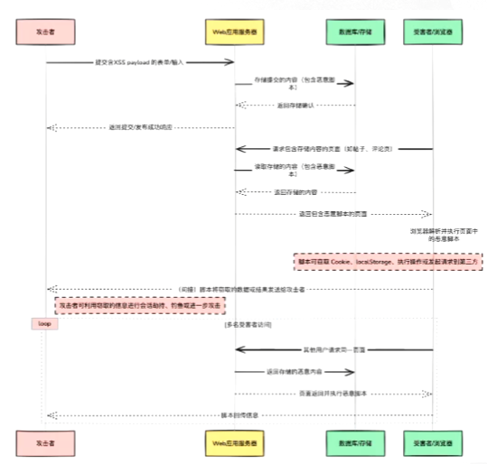

### 2.6.2 反射型XSS

反射型XSS，也称为非持久型XSS或参数型XSS，通常需要攻击者构造一个嵌入恶意代码的URL，然后通过特定方式（例如发送电子邮件、手机短信等）**诱导用户点击恶意URL**。

当用户访问该URL时，客户端浏览器会自动向URL所指向的Web服务器发送包含恶意代码的请求。Web服务器处理请求后将包含恶意代码的响应信息返回给用户。最终，客户端浏览器会解析并执行恶意代码，从而导致攻击成功，恶意代码可能会将用户的敏感数据发往攻击者。

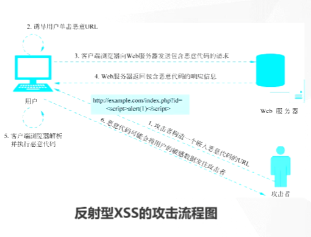

反射型XSS的**主要特点**：
- **非持久性**：恶意代码并未被存储在服务器，当用户访问包含恶意代码的URL时，这些恶意代码会随即被Web应用程序反射（显示）在客户端浏览器。
- **一次性**：用户访问包含恶意代码的URL时，恶意代码只会执行一次。

反射型XSS常见于登录框、搜索框等需要用户交互的功能模块，攻击者可以利用此类漏洞窃取用户的Cookie、密码，或发起钓鱼攻击等。

### 2.6.3 存储型XSS
存储型XSS，也称为**持久型XSS**，是指攻击者提交的恶意代码被存储在服务器的数据库中。当用户向存在存储型XSS漏洞的页面发起请求时，Web服务器会先从数据库中取出包含恶意代码的数据并将其嵌入HTML页面中，客户端浏览器从而解析并执行恶意代码，恶意代码可能会将用户的敏感数据发往攻击者。

存储型XSS的攻击流程如右图所示。
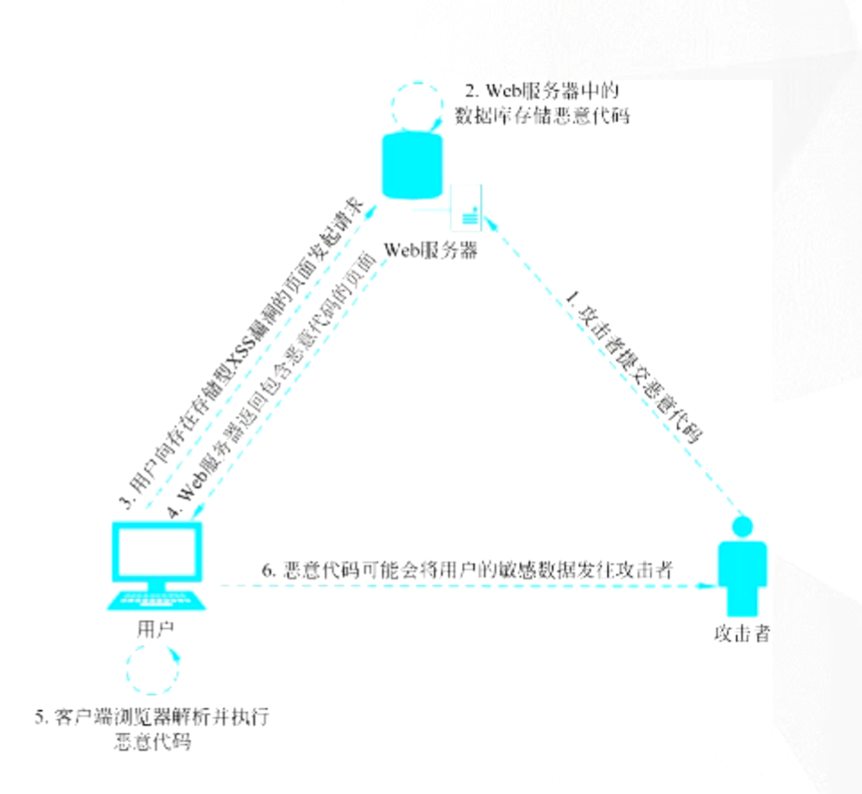

存储型XSS的**主要特点**是**持久性**，即恶意代码会被持久化存储在服务器。相较于反射型XSS，存储型XSS**无需用户访问包含恶意代码的URL**即可实现攻击。

存储型XSS常见于留言板、评论、博客日志等保存和展示用户输入的地方，攻击者可以利用此类漏洞进行XSS钓鱼、XSS挂马以及XSS蠕虫等攻击。

#### 2.6.4 XSS漏洞防御-输入过滤

输入过滤的关键在于严格检查、验证和过滤用户输入数据，绝不轻信用户提供的任何数据。具体需要考虑以下几个方面：

1.  **验证输入数据的类型是否符合预期**：例如，文本字段应只包含纯文本，不应包含HTML标签或其他格式化标记；URL字段应包含格式合法的URL。对于不符合预期的数据类型，应采取适当的处理或拒绝输入。
2.  **验证输入数据是否只包含允许的字符集**：例如，只允许字母数字，禁用特殊字符，检查数据是否符合特定格式要求（例如电子邮件地址、电话号码等格式）。
3.  **验证输入数据的长度是否在允许的范围内**：对超出长度限制的数据进行截断或拒绝输入。
4.  **过滤在XSS漏洞中常用的特殊字符**：例如 `<`、`>`、`&`、`"`、`'`、`;`、`:` 等。

(5) 检测并过滤常见的HTML关键字：例如 `<script>`、`javascript:`、`onerror` 等JavaScript关键字。
(6) 输入过滤应在服务端进行，因为客户端过滤可以被绕过：例如，攻击者可以通过Burp Suite工具修改客户端过滤后的请求数据包，从而绕过输入过滤。

输入过滤通常涉及黑名单和白名单两种防护策略：黑名单策略能够阻止已知的恶意输入，但攻击者可能使用未预见的攻击payload，因此黑名单策略通常不可靠；白名单策略只接受预先定义的安全输入，通常按照预设规则进行，能有效降低异常情况的发生，相较黑名单策略更加可靠。在实际应用中，应根据场景需求合理组合使用黑名单和白名单，以实现更全面的安全防护。

#### 2.6.5XSS漏洞防御-设置CSP策略

内容安全策略（Content Security Policy，CSP）是一种基于可信白名单的安全策略，用于指定浏览器能够加载哪些资源。通过设置CSP策略，Web应用程序所有者可以告知浏览器哪些来源的脚本、样式表、图片和其他资源能够被加载或执行，以降低XSS漏洞的风险。

#### 2.6.6 XSS漏洞防御-启用HttpOnly属性

盗取Cookie是XSS漏洞的利用方式之一，攻击者能够利用JavaScript中的`document.cookie`方法盗取用户的Cookie。为防御这种攻击，微软于2002年提出了HttpOnly属性，如今这一属性已逐渐成为一项标准。

HttpOnly是Cookie的一项属性，如果某个Cookie设置了该属性，浏览器将禁止客户端的JavaScript读取该Cookie，从而保护用户的Cookie不被盗取。注意：HttpOnly属性只能防止客户端的JavaScript读取Cookie，但并未从根本上防御XSS漏洞。

## 2.7 暴力破解漏洞

### 2.7.1 漏洞原理

**弱密码**：密码过于简单或过于简单，容易被破解。

**弱口令**：口令过于简单或过于简单，容易被破解。

暴力破解（Brute Force）是指攻击者通过自**动化工具对认证接口（如登录、API密钥验证、表单提交等）反复尝试大量凭证组合以获取合法访问权**的攻击手法。

**常见形式**：
- 对单个账号尝试大量密码（传统暴力破解）
- 对大量账号用常见密码尝试（密码喷洒，password spraying）
- 利用已泄露凭据批量尝试（credential stuffing）

攻击通常伴随高速、分布式请求以绕过单点封禁。后果可能是帐号被攻破、敏感数据泄露或被用于后续攻击。

有效防御措施有：强密码策略与定期密码更换、启用多因素认证（MFA）、速率限制与渐进式延迟、账户锁定或异常行为触发二次验证、使用rCAPTCHA或挑战-响应机制、基于IP/设备信誉的拦截以及实时登录审计与告警。
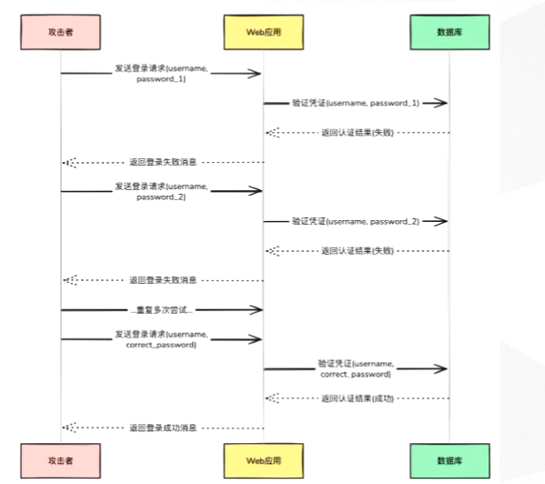

### 2.7.2 暴力破解登录凭证

登录凭证是系统进行身份验证的重要依据，用户需要提供正确的登录凭证才能获取相应的访问权限。然而，攻击者可能通过暴力破解手段获取用户的密码，一旦破解成功，即可获得对应用户的权限。

暴力破解通过穷举所有可能的组合以破解信息。在系统缺乏有效防护措施的情况下，理论上任何密码最终都可以被破解，只是破解时间存在差异。

### 2.7.3 暴力破解漏洞防御

系统可采取以下措施防范暴力破解：

1.  **强制使用强密码**：通常建议密码长度至少为8位，并至少包含大写字母、小写字母、数字和特殊符号中的三种。
2.  **部署额外的验证机制**：引入图形验证码、多因素认证或其他形式的用户验证机制以提高攻击者的暴力破解难度。
3.  **实施登录限制**：设置密码错误次数阈值，超过阈值则临时锁定账户。在正常情况下，用户登录的失败次数不会超过一个合理范围，频繁的登录失败可能预示暴力破解攻击。此时，系统可临时锁定账户，在指定时间内禁止该账户登录。该措施适用于电子商务、网上银行等安全要求较高的场景。


## 2.8 业务逻辑漏洞

### 2.8.1 漏洞原理

弱会话 ID（Weak Session IDs）指的是 Web 应用为会话（session）分配的标识符缺乏足够的不可预测性或熵，或长度 / 生命周期不当，导致攻击者可以通过猜测、枚举或重放成功劫持合法用户会话。
产生原因包括使用可预测的生成算法（如简单自增、时间戳或弱伪随机数）、过短或重复的 ID、未在传输 / 存储中保护会话令牌等。
风险包括会话固定（session fixation）、会话劫持与权限提升，从而访问用户数据或执行敏感操作。
防御措施：使用强随机数生成器和足够长的令牌（高熵）、在 HTTPS 下只通过 Secure/HttpOnly/SameSite Cookie 传输、为敏感操作 / 登录后重生成会话 ID、设置合理的过期与空闲超时、绑定会话到其他属性（例如部分设备指纹或 IP/UA 组合，注意平衡可用性）并对并发 / 异常会话行为做监控和强制登出。

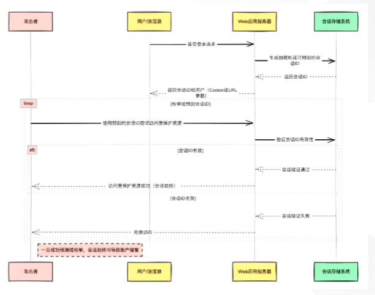

### 2.8.2 暴力破解验证码

验证码存在被暴力破解的可能性，这种情况通常发生在服务端**未对验证码的最大错误次数和有效时间进行合理限制**时，攻击者能够利用自动化程序，通过持续性的穷举尝试破解验证码。

验证码通常由4位或6位的纯数字组成，也存在字母与数字组合的形式。对于4位纯数字验证码，其组合空间为1万种，使用普通计算机能在2-3分钟内完成遍历；6位纯数字验证码虽然扩展至100万种可能的组合，但普通计算机仍能在1小时内完成遍历。由此可见，如果系统未对验证码实施有效的防护措施和使用限制，攻击者极有可能通过暴力破解方式获取有效验证码。

为防范暴力破解验证码，服务端应当实施最大错误次数限制，并在错误次数达到阈值后强制刷新验证码。另一种有效的防护措施是增加验证码的复杂性，例如使用更长的字符组合或其他类型的验证码。

### 2.8.3 短信验证码轰炸

短信验证码轰炸是一种针对系统短信服务的恶意攻击行为，攻击者通过自动化脚本或工具，持续触发系统的短信发送功能，导致特定手机号在短时间内接收大量短信验证码。

短信验证码轰炸通常源于系统短信服务设计存在逻辑缺陷，主要表现为未对短信发送频率和总量进行有效控制，导致攻击者能够突破正常业务限制，重复发送短信验证码。此类攻击不仅会对用户造成严重的骚扰，影响手机正常使用，而且由于发送短信需要购买短信资源，持续的短信验证码轰炸还将导致短信资源的过度消耗，进而造成经济损失。

短信验证码轰炸的效果如图所示，受害用户会在短时间内收到大量短信验证码。

为防范短信验证码轰炸，**系统应对短信验证码接口实施严格的发送次数和发送间隔限制**。例如，限制每日至多向单个手机号发送5条验证码，且发送间隔不少于1分钟。注意：这些限制不应只在客户端进行设置，更重要的是在服务端进行设置。

## 2.9 权限绕过漏洞

### 2.9.1 漏洞原理

授权绕过（Authorisation Bypass）是指**攻击者通过绕过或规避应用的访问控制机制，访问原本受限制的资源或执行敏感操作**的安全漏洞。常见手段包括：修改 URL、请求参数或 HTTP 头部访问其他用户的数据（如 IDOR：不安全的直接对象引用）、篡改客户端权限标识、利用未严格校验的接口或逻辑漏洞跳过角色检查。风险可能导致数据泄露、敏感操作被非法执行或权限升级。防御措施包括：在服务器端强制执行基于角色或属性的访问控制（RBAC/ABAC）、对所有请求进行严格权限验证、避免在客户端信任敏感信息、使用安全框架统一控制权限检查，并结合日志审计及时发现异常访问行为。

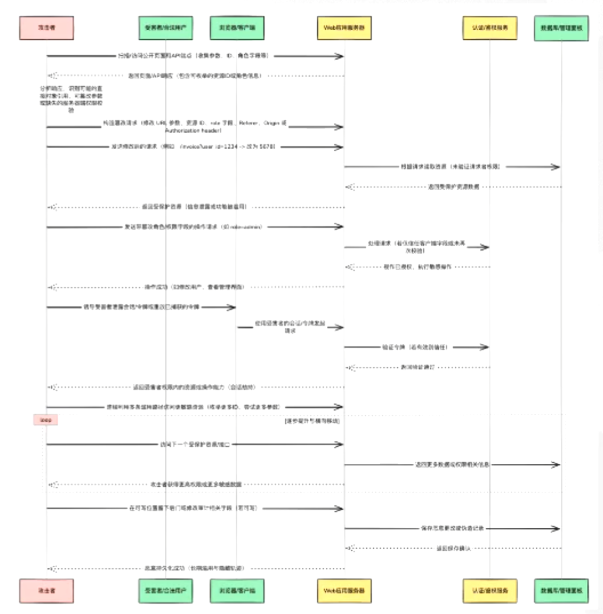

### 2.9.2 未授权访问

如图所示，当MongoDB运行在IP地址为192.168.1.104的27017端口时，使用数据库管理工具Navicat尝试连接MongoDB。在连接配置中，将“验证”选项设置为“None”（表示不使用身份验证），如果测试连接后返回“连接成功”的提示，则表明该MongoDB存在未授权访问漏洞。

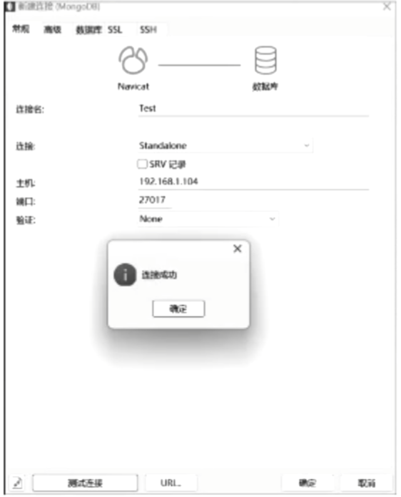

#### Web应用类未授权访问

Web应用程序可能存在未授权的文件上传或系统日志访问的漏洞，由于认证机制的缺失，本应需要授权才能执行的操作被攻击者绕过登录限制，进而得以执行。典型的例子包括Swagger未授权访问、Druid未授权访问和Solr未授权访问等。

以Swagger未授权访问漏洞为例，Swagger是一个开源的API文档生成工具，用于生成、描述、调用和可视化RESTful风格的Web服务，它提供了交互式界面，便于开发者查看和测试API接口。如果Swagger以默认配置启动且未设置身份验证，攻击者就可能未授权访问Swagger界面并查看API文档，进而执行未授权的数据操作。

### 2.9.3 水平越权

水平越权是指攻击者能够越过相同权限级别的权限限制，非法访问与其具有相同权限级别的其他用户资源。攻击者的权限与受害用户的权限始终处于同一权限级别，因此被称为水平越权。

假设用户A只拥有访问私有资源α的权限，用户B只拥有访问私有资源β的权限，两个用户的权限级别相同。如果Web应用程序只校验用户的权限级别，而未验证用户是否具备访问特定私有资源的权限，则可能导致用户A越权访问用户B的私有资源β，这种行为即为水平越权。水平越权的示意图如图所示。

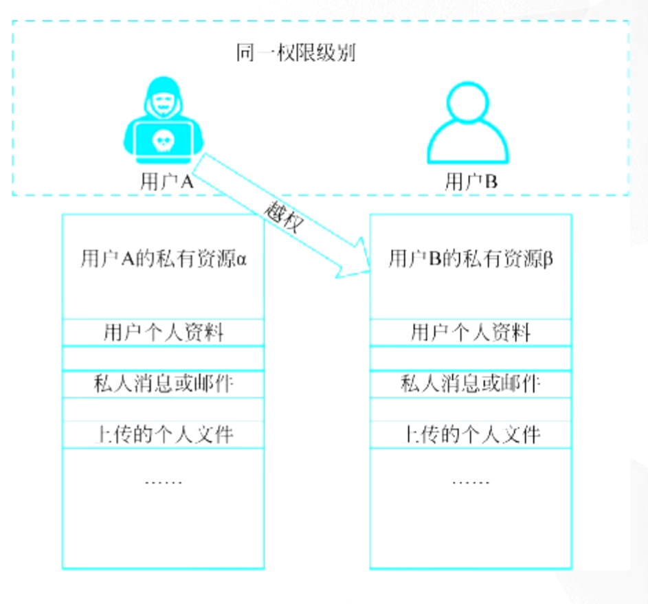
### 2.9.4 垂直越权

垂直越权是指攻击者能够**越过不同权限级别的权限限制，非法访问其他权限级别的资源或执行其他权限级别的操作**。在此过程中，攻击者的权限级别发生变化，因此被称为垂直越权。

- **垂直越权分类分类**：
    - 向上越权：指低权限用户越权访问高权限用户的资源或执行高权限操作；
    - 向下越权：指高权限用户访问低权限用户的资源（通常指对高权限用户屏蔽的资源）。
其中，向下越权的情况较为罕见，因此通常情况下垂直越权特指向上越权。

**垂直越权与水平越权恰好相反，其发生在不同权限级别之间**，典型场景是普通用户越权执行管理员操作。例如，在Web应用程序中，管理员具有发布文章、删除文章和创建用户等特权操作。如果系统后台未对不同身份用户实施严格的权限控制，或只在Web前端界面进行简单的权限验证，可能导致普通用户越权执行管理员特权操作，这种行为即为垂直越权。垂直越权的示意图如图所示。

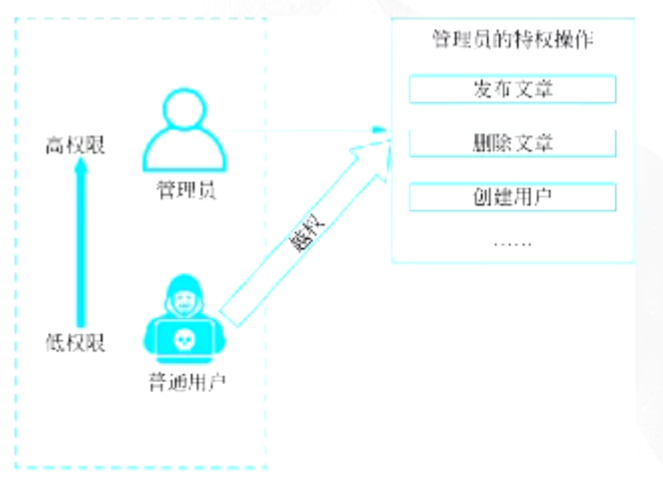

垂直越权的本质是权限验证机制的缺失或不完整。主要体现在系统未将功能访问权限与用户身份标识（例如Cookie、Session、Token）进行有效关联和验证。这类安全问题在实际开发过程中较为常见，多由开发阶段忽略了权限控制逻辑或身份认证方案不够完善所引起。

### 2.9.5 权限绕过漏洞防御

针对权限问题，可以参考以下防御措施。

(1) **明确最小权限原则**：根据用户的工作职责或系统服务的功能需求，严格分配必要的最小权限集合，防止权限过度授予导致的安全隐患。

(2) **构建精细化的访问控制机制**：创建访问控制列表（Access Control List，ACL），并结合基于角色的访问控制（Role-Based Access Control，RBAC）或基于属性的访问控制（Attribute-Based Access Control，ABAC）等高级策略。通过详细的访问规则和动态权限管理，精确规定用户可访问的系统资源及可执行的操作，确保权限分配的准确性和灵活性。

(3) **实施统一身份认证和授权**：集成统一的身份认证系统，确保用户在系统内的身份验证过程一致，并根据用户的身份信息进行精确授权。这有助于避免在系统的不同部分使用不同的身份验证和授权机制，降低了维护的复杂性，提高了系统整体的安全性。

(4) **实施多因素认证**：对于敏感操作需多次验证用户身份，可以通过短信验证码、邮箱确认或一次性密码（One Time Password，OTP）等方式，建立多重身份验证屏障。

(5) **严格管控参数传递**：将用户身份验证信息和关键权限参数（例如用户名、权限标识等）统一存储于服务端Session中。在进行权限验证时直接读取服务端Session，而不是依赖客户端传递的参数值，这样可以有效防止攻击者通过篡改客户端参数实施越权访问。

## 2.10 CSRF漏洞

### 2.10.1 漏洞原理

跨站请求伪造（CSRF, Cross-Site Request Forgery）是一种**利用用户已登录状态发起恶意请求**的攻击。攻击者诱导受害者在已认证的网站上执行未授权操作（如转账、修改密码、提交表单等），因为浏览器会自动携带目标站点的 Cookie、Session 等凭证，服务器会误以为是用户的真实请求。典型场景是用户在登录银行或论坛后点击了恶意链接或访问了带有隐藏表单的页面。防御措施包括：为关键操作引入 CSRF Token 并校验、使用 SameSite Cookie 属性限制跨站请求携带 Cookie、验证请求来源（Referer/Origin），以及为敏感接口增加二次验证（如验证码或多因素认证）。

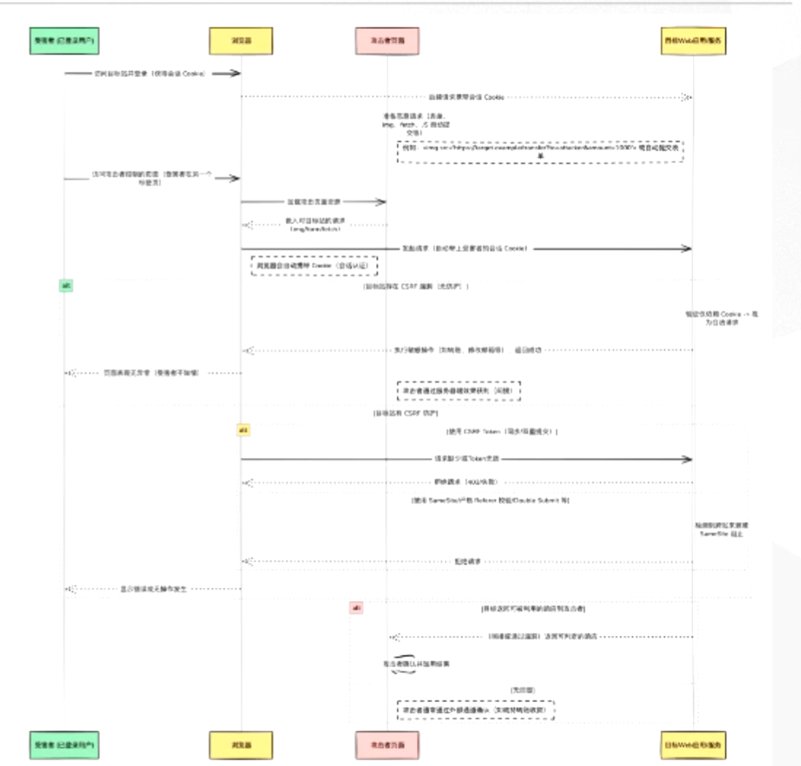

### 2.10.2 CSRF漏洞防御

为有效防御 CSRF 漏洞，可以参考以下防御措施：

(1) **使用 CSRF Token 校验**：Web 应用应在关键操作请求中加入一次性、不可预测的 CSRF Token，服务端对 Token 进行生成、存储与校验，未携带合法 Token 的请求直接拒绝。Token 应与用户会话强绑定，避免使用固定或可预测值，且在表单提交、AJAX 请求等涉及状态变更的操作中强制校验。

(2) **敏感操作增加二次验证**：对修改密码、修改手机号、支付、删除数据等高风险操作，增加短信验证码、邮箱验证码或登录密码二次确认，即使存在 CSRF 漏洞也可大幅降低被利用风险。

## 2.11 SSRF漏洞

### 2.11.1 漏洞原理

服务端请求伪造（SSRF, Server-Side Request Forgery）是一种**利用服务端发起请求的功能构造恶意请求的攻击**。攻击者诱导服务端向内部或外部系统发起网络请求（如访问内网服务、读取本地文件、扫描端口等），因为服务端通常位于受信任的网络区域且防火墙往往限制入站而非出站流量，服务器会误以为是合法的业务请求。典型场景是用户在触发图片加载、URL 预览、Webhook 回调或数据库管理功能时提供了可控的 URL 参数。防御措施包括：限制请求协议（仅允许 HTTP/HTTPS）、禁用 URL 重定向、过滤目标 IP 地址（禁止访问内网网段及本地回环地址）、统一错误返回信息，以及对请求目标进行白名单校验。

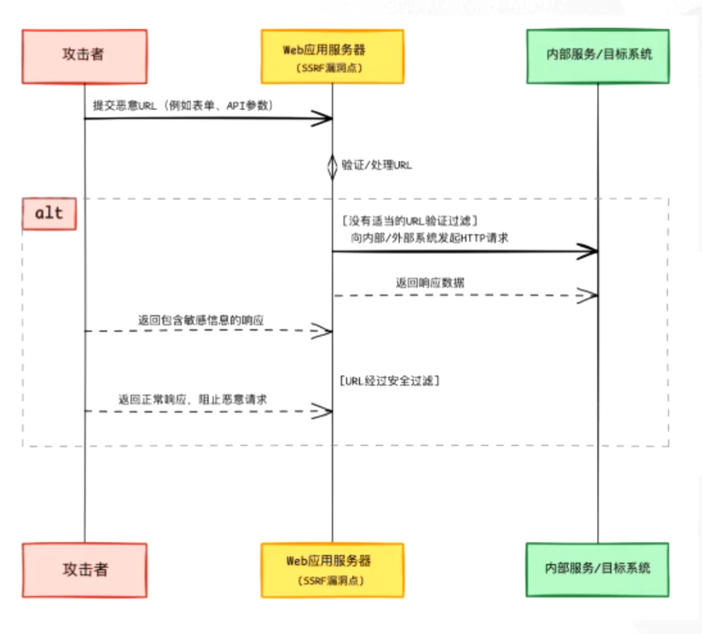

### 2.11.2 探测内网信息

SSRF漏洞可用于对内网信息进行探测，例如探测内网的Web服务、探测开放端口，以及对Web应用程序进行指纹识别。

### 1. 探测内网的Web服务

攻击者可通过SSRF漏洞向内网中的不同IP和端口发起HTTP请求，以探测内网中可能存在的Web服务。

### 2. 探测开放端口

除了探测Web服务，SSRF漏洞还可用于探测内网主机的开放端口，从而了解内网主机的配置和可能存在的漏洞。上述的“Python脚本探测内网的Web服务”是通过HTTP实现Web服务端口的探测，此外，还可以利用dict协议。

dict协议是字典服务器协议，允许客户端在使用过程中访问更多字典。在SSRF攻击中，攻击者能够使用dict协议获取目标服务的版本等信息。

### 2.11.3 读取敏感文件

在有回显的SSRF漏洞中，使用file协议可以读取敏感文件。例如，使用Chrome浏览器访问
`http://192.168.1.104/practice6/ssrf.php?url=file:////etc/passwd`
可以读取Web服务器（Linux系统）中的/etc/passwd文件，如图所示。

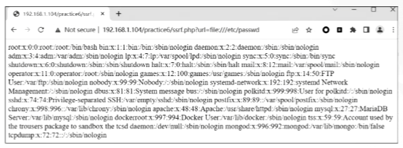

### 2.11.4 SSRF漏洞防御

为有效防御SSRF漏洞，可以参考以下防御措施：

(1) **实施严格的请求过滤**：Web应用程序在发起请求前，应当使用正则表达式、黑名单和白名单对请求的协议类型、主机和端口进行严格检查，应重点过滤访问内网资源的域名和IP地址。在大多数业务场景中，用户只需使用HTTP和HTTPS，因此，应将dict协议、file协议以及功能强大的Gopher协议列入黑名单。此外，应只允许用户请求特定的常用服务端口（例如80、443等端口），以降低被攻击的风险。另外，合理设置用户输入的长度限制也是防御SSRF漏洞的有效手段。在保证业务正常运行的前提下，建议优先考虑白名单策略，只允许用户使用预定义的安全协议访问特定的主机名和端口。

(2) **统一错误响应信息**：应统一错误响应信息，避免暴露具体的错误信息，此举能在一定程度上阻止攻击者结合SSRF漏洞和错误信息探测内网信息。

(3) **严格控制URL跳转**：禁止自动跳转功能，或在每次跳转操作前重新验证目标地址的合法性，防止攻击者利用重定向机制绕过安全检查。

(4) **加强内网安全防护**：对于内网中的应用程序，应及时更新至最新版本。对于默认无身份验证的服务（例如Redis、MongoDB、Memcached等），必须实施严格的身份验证机制。此外，建议将对外提供服务的Web服务器部署在DMZ区域，通过物理或逻辑隔离的方式与内网其他重要资源分离，从而降低SSRF漏洞被利用时的潜在影响，并有效避免内网的沦陷。

## 2.12 本章小结

本章详细阐述了Web安全Top10及常见逻辑漏洞，通过“原理剖析+源码审计+靶场实操”的闭环教学，深度剖析了涵盖SQL注入、RCE、XSS、文件上传/包含等OWASP Top 10核心风险，并进一步拓展至权限绕过、CSRF、SSRF及业务逻辑漏洞等深层威胁。课程坚持“理论溯源+代码审计+实战复现”的教学闭环，利用Burp Suite工具在DVWA与Pikachu靶场中完成了从漏洞原理分析到全链路利用的实操演示，不仅揭示了漏洞产生的底层代码逻辑，更强化了从黑盒测试到白盒审计的综合实战能力。希望各位学员通过本章学习，不仅能熟练掌握常见漏洞的利用手法，更能建立起“以攻促防”的安全思维，为后续开展专业的渗透测试与代码审计工作夯实基础。