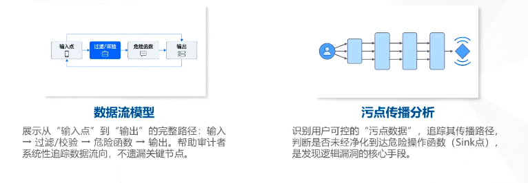

## 4.1 工具准备

### 4.1.1 操作系统与辅助软件

- **操作系统**
  Windows 10/11 或 Linux (推荐Ubuntu)
- **Web服务环境**
  PHPStudy / XAMPP / WAMP (一键搭建环境)
- **代码编辑器/IDE**
  PhpStorm (功能强大) / Visual Studio Code (轻量)
- **审计与辅助工具**
  审计: Seay源代码审计系统、RIPS
  辅助: Burp Suite (抓包)、Firefox/Chrome、sqlmap

### 4.1.2 Seay源代码审计系统

#### 简介
Seay源代码审计系统是一款专为PHP代码审计设计的工具，凭借其友好的交互和强大的功能，成为安全从业人员入门代码审计的首选利器。

#### 核心特点
- 完全开源免费，无商业使用限制
- 全中文操作界面，降低学习门槛
- 内置丰富的审计规则库，快速定位漏洞
- 操作逻辑简单，一键启动审计分析

#### 安装步骤
1. 从官方渠道下载最新版安装包
2. 解压压缩包，直接运行主程序（绿色免安装）

## 4.2 代码审计基础理论

### 4.2.1 什么是代码审计

**定义**：代码审计是一种通过检查源代码来发现安全缺陷和潜在漏洞的安全测试方法。它不仅关注代码的功能性，更关注其安全性，是保障Web应用安全的重要手段。

**重要性**：
1. 保障软件安全：从源头发现并修复漏洞，是保障Web应用安全的关键环节。
2. 符合合规要求：满足行业安全标准和法律法规的要求，规避法律风险。
3. 降低安全风险：减少因安全漏洞导致的数据泄露、财产损失等潜在风险。

代码审计如同建筑施工中的质量检查，只有确保每一行代码的安全性，整个应用系统才能稳固。它是构建安全可信Web应用的第一道防线，也是不可或缺的环节。

### 4.2.2 审计流程

代码审计是保障PHP应用安全的核心手段，它通过系统化的流程，从代码层面发现并消除安全隐患。这张图清晰展示了PHP代码审计的五步标准化全流程：

### 4.2.3 核心方法论

**核心思路**：代码审计的关键在于建立清晰的分析模型。通过“数据流模型”追踪数据的链路，依托“代码依赖于分析”识别用户可控数据的流向，从而精准定位未被妥善处理的危险操作点。

### 4.2.4 手工审计思路

### 4.2.4 手工审计思路

#### 危险函数追溯法（逆向审计）
这是 PHP 代码审计中高效的逆向审计方法，核心是从危险函数出发，逆向追溯数据来源。

- **找函数**：定位 `eval()`、`system()`、`file_get_contents()` 等高危函数。
- **追来源**：反向追踪函数参数的赋值、传递链路，找到参数原始来源。
- **查可控**：验证参数是否来自 `$_GET`/`$_POST` 等用户可控输入。
- **看过滤**：检查参数传递过程中是否有有效过滤/校验逻辑。只要危险函数的参数可被用户控制且无有效过滤，就存在漏洞风险。

#### 用户输入追踪法（正向审计）
这是 PHP 代码审计最基础的正向审计方法，核心是从用户可控输入出发，正向追踪数据流。

- **找入口**：定位 `$_GET`/`$_POST`/`$_COOKIE` 等用户可控输入点。
- **追流向**：跟踪变量赋值、传递过程，画出完整数据流链路。
- **查过滤**：检查数据是否经过 `htmlspecialchars()`、PDO 预处理等安全过滤。
- **看用途**：确认数据最终是否用于数据库查询、文件操作等危险场景。

#### 逻辑漏洞审计法
逻辑漏洞审计法：聚焦**业务逻辑缺陷**，不依赖危险函数，重点排查流程设计不合理问题。
- 梳理核心业务流程，标注关键校验节点；
- 排查权限越权、流程绕过、数据篡改等逻辑缺陷；
- 模拟异常请求，验证漏洞可利用性。

核心关注“流程合理性”，重点发现常规工具检测不到的业务层面漏洞。

#### 高效审计方法
- **优先审计核心模块**：重点关注登录、支付、订单等业务逻辑，这些是漏洞高发区，能快速发现高风险问题。
- **善用 IDE 功能**：利用 PHPStorm 等工具的代码跳转、断点调试、全局搜索功能，快速梳理执行流程，定位变量流转路径。
- **关注代码注释**：注释常暴露关键逻辑、调试信息甚至敏感数据，是挖掘隐藏漏洞的重要线索。
- **结合 PHP 版本特性**：注意不同 PHP 版本的函数差异与废弃特性，匹配目标环境，避免遗漏版本相关漏洞。
- **构造 Payload 验证**：对疑似漏洞必须构造实际 Payload 验证，拒绝空想，确保漏洞真实可利用。

#### 常见误区与避免
- **过度依赖工具**：工具仅能辅助扫描，复杂逻辑漏洞必须依靠人工分析，不能完全依赖自动化结果。
- **忽视上下文分析**：脱离业务场景孤立看代码易产生误判，需通读相关逻辑，结合上下文判断风险。
- **急于求成心态**：审计需要耐心与细心，逐行分析细节才能避免漏报，急躁会导致关键风险被忽略。

## 4.3 代码审计实战

### 4.3.1 SQL注入
#### SQL注入-漏洞原理和危害
SQL注入是最常见的Web安全漏洞之一，其核心在于输入验证的缺失。本页将详细解析其攻击原理及可能造成的严重后果。

**原理**：攻击者通过在用户可控的输入中注入恶意SQL语句，破坏原有SQL语句的结构，从而执行非授权的数据库操作。

**危害**：
- 数据泄露：窃取数据库中的敏感信息（如用户账号、密码、个人信息）。
- 数据篡改：修改或删除数据库中的数据。
- 权限提升：通过修改数据库内容，提升自身权限。
- 服务器控制：在特定条件下，可能通过数据库执行系统命令，完全控制服务器。

### 4.3.2 文件上传

#### 文件上传-漏洞原理与危害

文件上传漏洞是Web安全领域中最常见且危害巨大的漏洞之一。攻击者利用此类漏洞可以轻松突破防御，获取服务器权限。下面我们详细解析其原理与具体危害。

文件上传漏洞是指应用程序对用户上传的文件类型、大小、内容等验证不足或存在缺陷，导致攻击者可以上传恶意文件（如PHP脚本、WebShell等）到服务器，并通过访问该文件来执行恶意代码，从而控制服务器。

**危害主要包括：**
1.  远程代码执行：上传包含恶意代码的脚本文件，直接获取服务器控制权。
2.  服务器被植入后门：上传WebShell，长期控制服务器。
3.  数据泄露与破坏：通过恶意脚本读取或篡改服务器上的敏感数据。
4.  进一步攻击：利用服务器作为跳板，对内网进行横向渗透。

#### 文件上传-漏洞审计方法

文件上传漏洞是Web安全中常见且危害极大的漏洞类型。审计此类漏洞需要系统性地检查验证逻辑、存储路径和访问权限，不能仅依赖单一的验证方式。

1.  **定位文件上传功能**：查找所有包含文件上传表单的页面和处理上传请求的后端脚本。
2.  **检查前端验证逻辑**：查看是否仅在前端通过JavaScript进行文件类型验证，此类验证极易被绕过。
3.  **检查后端验证逻辑**：验证MIME类型、文件扩展名（是否存在大小写/双写绕过）及文件内容（文件头）。
4.  **检查文件存储路径**：确认上传文件是否存储在Web可访问目录下，以及文件名是否可被用户控制。
5.  **检查文件访问权限**：确认上传文件是否被错误设置了可执行权限，防止恶意脚本被执行。

### 4.3.3 文件包含

#### 文件包含-漏洞原理与危害

文件包含漏洞是**指应用程序在使用include()、require()等函数动态包含文件时，没有对用户输入的文件名进行严格的过滤和验证，导致攻击者可以通过构造特殊的路径，包含服务器上的任意文件，甚至远程文件**。

**主要危害：**
1.  敏感信息泄露：包含并读取服务器上的敏感文件，如/etc/passwd、配置文件等。
2.  远程代码执行：包含远程服务器上的恶意脚本文件，执行任意代码。
3.  配合利用：配合文件上传漏洞，上传恶意文件后通过文件包含漏洞执行。

#### 文件包含-漏洞审计方法

文件包含漏洞是PHP等动态语言中常见的高危漏洞。审计此类漏洞的核心在于检查程序是否对用户可控的输入进行了不当的文件包含操作。

1.  **定位文件包含函数**：查找代码中所有使用 `include()`、`require()`、`include_once()`、`require_once()` 等函数的地方。
2.  **检查参数可控性**：检查传递给这些函数的参数是否由用户输入（如 `$_GET`、`$_POST`）控制。
3.  **检查过滤与验证逻辑**：查看是否过滤了 `../` 等路径遍历字符；是否使用白名单机制；是否存在空字节截断漏洞（PHP < 5.3.4）。
4.  **检查远程文件包含**：检查 `php.ini` 配置中 `allow_url_include` 是否为 `On`，若开启则存在远程包含风险。

### 4.3.4 文件写入  

#### 文件写入-漏洞原理与危害

文件写入漏洞是指应用程序在使用 `file_put_contents()`、`fwrite()`、`file()`（写入模式）等文件操作函数时，没有对用户输入的文件名或文件内容进行严格的过滤和验证，导致攻击者可以写入任意内容到服务器的任意位置。

危害主要体现在三个方面：
1.  **植入后门程序**：写入包含恶意代码的文件（如WebShell），长期控制服务器。
2.  **篡改网页内容**：修改网站的页面内容，进行钓鱼或恶意宣传。
3.  **破坏文件系统**：写入大量垃圾数据，占用磁盘空间，甚至破坏重要系统文件。

此类漏洞的核心风险在于攻击者突破了服务器的写入限制，原本用于正常存储用户数据（如头像、文档）的功能被滥用，成为攻击入口。一旦成功利用，攻击者不仅能控制网站内容，还可能进一步提权获取服务器的最高管理权限。

#### 文件写入-漏洞审计方法

文件写入漏洞是Web安全中常见的高危漏洞，攻击者可通过该漏洞上传恶意文件，进而获取服务器控制权。审计此类漏洞需遵循特定步骤。

1.  **定位文件写入函数**：查找代码中所有使用 `file_put_contents()`、`fwrite()`、`file()`（写入模式）等文件写入函数的地方。
2.  **检查路径与内容可控性**：检查传递给这些函数的文件路径和内容是否由用户输入控制。
3.  **检查过滤与验证逻辑**：
    *   是否对用户输入的文件名进行了过滤，禁止使用特殊字符和路径遍历字符？
    *   是否对文件内容进行了验证，禁止包含恶意代码？
    *   是否限制了文件写入的目录？
4.  **检查文件权限**：写入的文件是否被设置了可执行权限？

### 4.3.5 代码执行

#### 代码执行-原理与危害

代码执行漏洞是Web安全中一种高危漏洞，它允许攻击者在服务器端注入并执行任意脚本代码，从而完全控制服务器。本页我们将深入探讨其原理与具体危害。

**原理**：应用程序在使用`eval()`、`assert()`、`preg_replace()`（带/e修饰符）等危险函数时，若未对用户输入参数进行严格过滤和验证，攻击者可构造恶意输入，导致服务器执行任意PHP代码。

**危害**：
- 远程代码执行：执行任意PHP代码，完全接管服务器控制权。
- 数据泄露与破坏：读取、修改或删除数据库及文件系统中的敏感数据。
- 植入后门：上传WebShell，建立长期隐蔽的控制通道。
- 权限提升：利用内核漏洞或配置错误提升系统权限。

#### 代码执行-审计方法

代码执行漏洞是Web安全中高危漏洞类型之一，审计此类漏洞的核心在于识别危险函数的使用场景及参数可控性，以下为具体的审计步骤与要点。

1.  **定位危险函数**：查找代码中使用`eval()`、`assert()`、`preg_replace()`（带/e修饰符）、`create_function()`等可执行代码的函数。
2.  **检查参数可控性**：重点核查传递给上述危险函数的参数是否由用户输入控制，是否存在外部输入直接流入执行逻辑的情况。
3.  **检查过滤与转义逻辑**：确认是否对用户输入参数严格过滤（如禁止PHP关键字），是否使用`htmlspecialchars()`等函数进行安全转义。
4.  **检查代码拼接方式**：排查是否将用户输入未加处理直接拼接到代码字符串中，此类拼接极易导致代码执行漏洞。

### 4.3.6 命令执行
#### 命令执行-原理与危害

命令执行漏洞，顾名思义，就是攻击者可以在服务器上执行任意系统命令。当网站使用`system`、`exec`这类函数来执行系统命令，并且用户可以控制命令的参数时，如果没有过滤，攻击者就可以插入额外的命令。

**原理**：命令执行漏洞是指应用程序在调用`system()`、`exec()`、`shell_exec()`等系统命令执行函数时，没有对用户输入的参数进行严格的过滤和验证，导致攻击者可以通过构造特殊的输入，注入并执行任意系统命令。

**危害**：
- 完全控制服务器：执行任意系统命令，获取服务器最高权限。
- 数据泄露与破坏：读取、修改、删除服务器上的任意文件。
- 植入后门程序：创建新用户、安装后门，长期控制服务器。
- 内网横向渗透：利用服务器作为跳板，攻击内网其他主机。

### 4.3.7 文件读取

#### 文件读取-原理与危害

文件读取漏洞是 Web 安全中常见的高危漏洞，发生在应用程序将用户可控的参数直接拼接到文件读取操作中，且未对文件路径、读取范围做严格校验时，攻击者可借此读取服务器上的任意敏感文件，甚至获取网站源码、数据库配置等核心信息。

**原理**：文件读取漏洞是指应用程序在使用`file_get_contents()`、`fopen()`、`readfile()`等文件操作函数时，未对用户输入的文件路径进行严格过滤和验证，导致攻击者可构造特殊路径读取服务器任意文件。

**危害**：
1.  敏感信息泄露：读取服务器上的配置文件、源代码、用户数据等敏感文件。
2.  进一步攻击：获取数据库密码、API密钥等信息，为后续渗透攻击提供条件。
3.  代码审计：读取网站源代码，分析并寻找其他潜在安全漏洞。
#### 文件读取-审计方法

文件读取漏洞是Web安全中常见的高危漏洞之一，攻击者可利用该漏洞读取服务器上的敏感文件（如配置文件、源代码等）。以下是针对此类漏洞的详细审计步骤。

1.  **定位文件操作函数**：查找代码中所有使用 `file_get_contents()`、`fopen()`、`readfile()`、`file()` 等文件操作函数的地方。
2.  **检查路径可控性**：检查传递给这些函数的文件路径是否由用户输入控制。
3.  **检查过滤与验证逻辑**：确认是否对用户输入的路径进行了严格过滤，如禁止使用 `../` 等路径遍历字符；是否实施了白名单机制，仅允许读取指定文件；以及是否限制了文件读取的根目录范围。
4.  **检查文件类型**：确认系统是否仅允许读取特定类型的文件，防止攻击者通过路径穿越读取敏感配置文件。

## 4.4 PHP框架漏洞

### 4.4.1 什么是PHP框架

**定义**：PHP框架是为简化Web开发而设计的基础架构，提供了一套通用的代码库和开发规范。

**优势**：提高开发效率、保证代码质量、增强可维护性、提供安全基础。

**安全重要性**：框架作为应用的基础，其安全性直接影响整个应用的安全。一旦框架存在漏洞，所有基于该框架开发的应用都可能受到影响。

**主流框架**：
- **ThinkPHP**：国内主流轻量框架，中文生态完善，MVC架构，TP5.x/6.x漏洞高发，二开违规易引发SQL注入、文件操作漏洞；
- **Laravel**：国际主流全功能框架，遵循PSR规范，漏洞集中在ORM查询、中间件配置不当；
- **Yii**：高性能框架，适配高并发场景，漏洞多源于路由过滤、参数验证缺失；
- **CodeIgniter**：轻量极简框架，无强规范约束，二开易出现命令/代码执行漏洞。

### 4.4.2 thinkphp原生框架漏洞

框架原生漏洞是指框架自身代码中存在的、由框架开发者引入的安全缺陷。这类漏洞通常源于框架底层设计或编码疏忽，一旦爆发，所有使用该版本框架的网站都可能受到影响。

**案例回顾：ThinkPHP 5.x RCE漏洞**
由于对控制器名处理不当，导致攻击者可以构造特殊的控制器名，绕过框架过滤，最终调用 `call_user_func_array` 等危险函数执行任意代码。这是典型的框架原生逻辑漏洞。

**危害与修复**：
框架原生漏洞影响范围广，波及所有使用该版本的应用。修复方式通常是升级框架到官方发布的安全版本，或应用官方提供的补丁。开发者应养成关注官方安全公告的习惯。

### 4.4.3 thinkphp二次开发漏洞

在了解了框架的基础结构后，我们来明确今天的另一个核心概念：二次开发漏洞。简单来说，这就是我们开发者自己在写代码时犯的错误。它和框架本身的漏洞不同，只影响我们自己的项目。

二次开发漏洞，是指开发者在基于成熟框架（如ThinkPHP）进行业务功能开发时，由于代码编写不规范、安全意识不足或对框架特性理解不深，而引入的安全问题。

**与框架原生漏洞的区别：**
1.  **根源不同**：原生漏洞源于框架本身的设计缺陷；二次开发漏洞源于开发者的编码错误。
2.  **影响范围**：原生漏洞影响所有使用该版本框架的项目；二次开发漏洞通常只影响当前项目。
3.  **修复方式**：原生漏洞需通过升级框架或打补丁修复；二次开发漏洞需修改业务代码。

**常见的二次开发漏洞类型：**
包括SQL注入、XSS跨站脚本、文件上传漏洞、权限控制不当以及敏感信息泄露等。这些漏洞通常是因为开发者未对用户输入进行有效校验或对身份验证不严格造成的。

#### thinkphp目录结构解析
**核心目录概览**：ThinkPHP 5.x 采用模块化设计，核心目录结构清晰，主要包含项目入口、业务逻辑、框架核心及第三方依赖四大部分，是进行代码审计的基础地图。

1.  **public/（入口目录）**：包含 index.php 应用入口文件及静态资源（CSS/JS/图片），所有请求均由此进入。
2.  **application/（应用模块）**：存放业务代码。包含 controller/（控制器）、model/（模型）、view/（视图）及各类配置文件（如 config.php, database.php）。
3.  **thinkphp/（框架核心）**：框架底层实现，包含 library/ 核心类库和 start.php 启动文件，一般不建议修改。
4.  **vendor/（依赖包）**：Composer 下载的第三方库目录。

**关键文件**：除入口文件外，`application/index/controller/Index.php` 是默认的首页控制器，是业务逻辑的起点。

## 4.5 本章小结

本次代码审计学习围绕工具准备、基础理论、实战操作及 PHP 框架漏洞四大核心展开，形成了从基础到实战的完整知识体系。工具层面，Seay 源代码审计系统作为核心工具，可覆盖参数追踪、危险函数定位、漏洞溯源等全流程操作，无需依赖复杂的 PhpStorm，适配新手快速上手；基础理论上，明确了文件上传、SQL 注入、命令执行等高频漏洞的核心成因 —— 均源于用户可控数据未做有效校验，审计需紧扣 “参数可控性 + 过滤逻辑” 三大要点；实战环节则验证了 “白名单校验” 是修复漏洞的核心思路，需针对不同漏洞类型（如文件读取、代码执行）制定组合防护策略。

PHP 框架漏洞需区分框架原生漏洞与二开漏洞：前者是框架封装功能的设计缺陷，需通过升级版本修复，影响范围广；后者是开发者违规使用框架导致，需规范 ORM 参数绑定、路由配置、文件操作等开发行为。整体而言，代码审计的核心逻辑是 “定位危险函数→溯源参数来源→验证过滤逻辑→制定防护方案”，既要掌握工具的高效使用方法，也要理解漏洞的本质成因，同时重视框架使用规范，才能从根源上规避 Web 安全风险，保障应用程序的安全性。