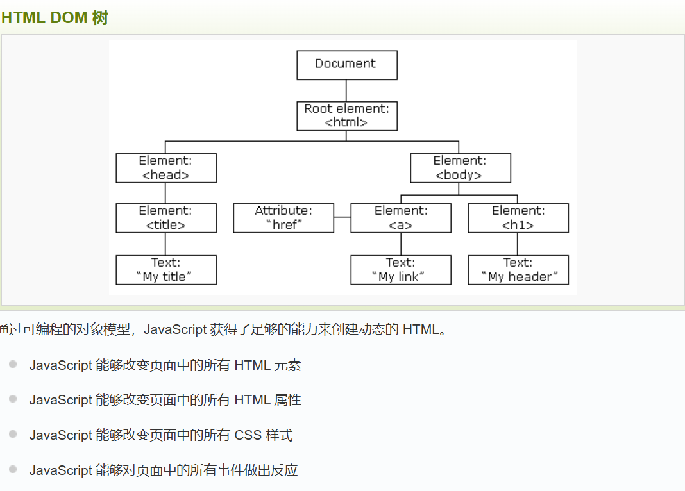

# JavaSctipt 输出

**window.alert()**: 弹出警告框
**document.write()**:将内容写到HTML文档中
**innerHTML**:写入到HTML元素中
**console.log()**:写入到浏览器的控制台

# JavaSctipt 语法

**数字**：小数、整数、科学计数法

**字符串**:'单引号'或"双引号"

**数组**:[40,100,1]

**var +变量名**：声明变量

**操作符**：+ - * / %等等


**函数定义**：function 函数名(参数){函数体}

**JavaScript对大小写敏感**

**字符集**：UTF-8

# JavaScript 语句


| 语句         | 描述                                                         |
| ------------ | ------------------------------------------------------------ |
| break        | 用于跳出循环。                                               |
| catch        | 语句块，在 try 语句块执行出错时执行 catch 语句块。            |
| continue     | 跳过循环中的一个迭代。                                       |
| do ... while | 执行一个语句块，在条件语句为 true 时继续执行该语句块。       |
| for          | 在条件语句为 true 时，可以将代码块执行指定的次数。          |
| for ... in   | 用于遍历数组或者对象的属性（对数组或者对象的属性进行循环操作）。 |
| function     | 定义一个函数                                                 |
| if ... else  | 用于基于不同的条件来执行不同的动作。                         |
| return       | 返回结果，并退出函数                                         |
| switch       | 用于基于不同的条件来执行不同的动作。                         |
| throw        | 抛出（生成）错误。                                           |
| try          | 实现错误处理，与 catch 一同使用。                            |
| var          | 声明一个变量。                                               |
| while        | 当条件语句为 true 时，执行语句块。                           |


**反斜杠换行**：document.write("你好 \
世界!");

# JavaScript 注释

单行注释：// 注释内容
多行注释：/* 注释内容 */

# JavaScript变量

**var**:ES5引入的变量声明方式，具有函数作用域
**let**：ES6引入的变量声明方式，具有块作用域
**const**:ES6引入的变量声明方式，常量，不可修改
>无需像c语言严格声明变量类型，JavaScript是弱类型语言(类似py)，可以直接赋值不同类型的值。

**变量名要求**：
- 必须以字母开头
- 可以以$和_开头(不推荐)
- 对大小写敏感
- 不能使用关键字

# JavaScript 数据类型

**值类型(基本类型)**：字符串（String）、数字(Number)、布尔(Boolean)、空（Null）、未定义（Undefined）、Symbol。

**引用数据类型（对象类型）**：对象(Object)、数组(Array)、函数(Function)，还有两个特殊的对象：正则（RegExp）和日期（Date）。

# JavaScript 对象

1. 定义对象(声明+键值对)：var person = {name: "John", age: 30, city: "New York"};
2. 定于对象方法：var person = {
    firstName: "John",
    lastName : "Doe",
    id : 5566,
    //对象方法
    fullName : function() 
	{
       return this.firstName + " " + this.lastName;
    }
}
3. 访问对象属性：person.name 或 person["name"]

4. 访问对象方法：person.fullName() 或 person["fullName"]()  

# JavaScript 函数

function functionName(parameter1, parameter2, parameter3){
    //执行代码
    //return 返回值;
}

# JavaScript 作用域

**局部作用域**：函数内部声明的变量，具有局部作用域，只能在函数内部访问，在函数执行完毕之后销毁

**全局作用域**：函数外部声明的变量，具有全局作用域，可以在函数内部或外部访问，在页面关闭后销毁

# JavaScript 事件

**定义**：HTML事件是发生在HTML元素上的事情，比如当用户点击一个按钮时，就会触发一个事件、HTML完成加载、HTML中input字段改变、HTML按钮被点击。JavaScript可以为HTML元素绑定事件，当事件发生时，JavaScript代码可以响应。

**事件合集**：
| 事件         | 描述                                   |
| ------------ | -------------------------------------- |
| onchange     | HTML 元素改变                          |
| onclick      | 用户点击 HTML 元素                     |
| onmouseover  | 鼠标指针移动到指定的元素上时发生       |
| onmouseout   | 用户从一个 HTML 元素上移开鼠标时发生   |
| onkeydown    | 用户按下键盘按键                       |
| onload       | 浏览器已完成页面的加载                 |

# JavaScript 字符串

**字符串**：由零个或多个字符组成的序列，使用单引号或双引号括起来。
**字符串访问**：通过[]索引来访问每一个字符
**字符串长度**：字符串变量可通过.length属性获取字符串长度
**转义字符的使用**：
# 常见转义字符对照表
| 代码 | 输出         |
| ---- | ------------ |
| \'   | 单引号       |
| \"   | 双引号       |
| \\\\ | 反斜杠       |
| \n   | 换行         |
| \r   | 回车         |
| \t   | tab(制表符)  |
| \b   | 退格符       |
| \f   | 换页符       |
**字符串属性**：
| 属性 | 描述 |
| ---  | ---  |
| length | 字符串长度 |
| constructor | 返回创建字符串属性的函数 |
| prototype | 允许您向对象添加属性和方法 |
**字符串方法**：
| 方法 | 描述 |
| :--- | :--- |
| charAt() | 返回指定索引位置的字符 |
| charCodeAt() | 返回指定索引位置字符的 Unicode 值 |
| concat() | 连接两个或多个字符串，返回连接后的字符串 |
| fromCharCode() | 将 Unicode 转换为字符串 |
| indexOf() | 返回字符串中检索指定字符第一次出现的位置 |
| lastIndexOf() | 返回字符串中检索指定字符最后一次出现的位置 |
| localeCompare() | 用本地特定的顺序来比较两个字符串 |
| match() | 找到一个或多个正则表达式的匹配 |
| replace() | 替换与正则表达式匹配的子串 |
| search() | 检索与正则表达式相匹配的值 |
| slice() | 提取字符串的片断，并在新的字符串中返回被提取的部分 |
| split() | 把字符串分割为子字符串数组 |
| substr() | 从起始索引号提取字符串中指定数目的字符 |
| substring() | 提取字符串中两个指定的索引号之间的字符 |
| toLocaleLowerCase() | 根据主机的语言环境把字符串转换为小写，只有几种语言（如土耳其语）具有地方特有的大小写映射 |
| toLocaleUpperCase() | 根据主机的语言环境把字符串转换为大写，只有几种语言（如土耳其语）具有地方特有的大小写映射 |
| toLowerCase() | 把字符串转换为小写 |
| toString() | 返回字符串对象值 |
| toUpperCase() | 把字符串转换为大写 |
| trim() | 删除字符串两端的空白字符 |
| valueOf() | 返回某个字符对象的原始值 |
**模板字符串**：使用反引号` `` `来定义模板字符串，可以将字符串中的变量替换为实际值。
>eg.`Hello, ${name}`,其中name是变量。
**字符串相加**：使用+运算符连接字符串，会自动将两个字符串拼接起来。
>字符串+数字=字符串

# JavaScript 运算符

## 算术运算符

| 优先级 | 运算符         | 描述           | 结合性       | 示例               |
|--------|----------------|----------------|--------------|--------------------|
| 1      | ()             | 小括号         | 从左到右     | (a + b) * c        |
| 2      | ++, --         | 自增、自减     | 右到左       | ++x, y--           |
| 3      | *, /, %        | 乘、除、取模   | 从左到右     | x * y / z          |
| 4      | +, -           | 加、减         | 从左到右     | x + y - z          |
| 5      | =, +=, -= 等   | 赋值运算符     | 右到左       | x = y + 2, x += 3  |

# JavaScript 比较和逻辑运算符

**比较运算符**：比较两个值，并返回一个布尔值
| 运算符 | 描述                                                     | 比较    | 返回值 |
| :----- | :------------------------------------------------------- | :------ | :----- |
| ==     | 等于                                                     | x==8    | false  |
|        |                                                          | x==5    | true   |
| ===    | 绝对等于（值和类型均相等）                               | x==="5" | false  |
|        |                                                          | x===5   | true   |
| !=     | 不等于                                                   | x!=8    | true   |
| !==    | 严格不等于运算符（值和类型有一个不相等，或两个都不相等） | x!=="5" | true   |
|        |                                                          | x!==5   | false  |
| >      | 大于                                                     | x>8     | false  |
| <      | 小于                                                     | x<8     | true   |
| >=     | 大于或等于                                               | x>=8    | false  |
| <=     | 小于或等于                                               | x<=8    | true   |

**逻辑运算符**：用于测定变量或值之间的逻辑

| 运算符 | 描述 | 例子 |
| :----- | :--- | :--- |
| &&     | and  | (x < 10 && y > 1) 为 true  |
| \|\|   | or   | (x==5 \|\| y==5) 为 false |
| !      | not  | !(x==y) 为 true           |

**条件运算符**：包含了基于某些条件对变量进行赋值的条件运算符
> variablename=(condition)?value1:value2   


# 条件语句

- if 语句 - 只有当指定条件为 true 时，使用该语句来执行代码
- if...else 语句 - 当条件为 true 时执行代码，当条件为 false 时执行其他代码
- if...else if....else 语句- 使用该语句来选择多个代码块之一来执行
- switch 语句 - 使用该语句来选择多个代码块之一来执行
> switch(n)
{
    case 1:
        执行代码块 1
        break;
    case 2:
        执行代码块 2
        break;
    default:
        与 case 1 和 case 2 不同时执行的代码
}


# JavaScript 循环

## for 循环

for 循环用于重复执行一段代码，直到指定的条件为 false。

> for (var i=0;i<cars.length;i++)
>{ 
>    document.write(cars[i] + >"<br>");
>}

## while 循环

while 循环用于重复执行一段代码，直到指定的条件为 false。
> while(条件){
>    //执行代码
>}

## do...while 循环

do...while 循环与 while 循环类似，不同的是，do...while 循环会先执行一次代码块，然后再判断条件是否为 true。
```javascript
do {
    //执行代码
}while(condition);
```

# JavaScript break和continue语句

break语句用于跳出循环。
continue语句用于跳过循环中的一个迭代。

# JavaScript typeof,null,undrfined 

## typeof 运算符

typeof 运算符用于检查变量的数据类型。 

| 表达式                | 返回值       | 说明                         |
| --------------------- | ------------ | ---------------------------- |
| `typeof undefined`    | "undefined"  | 未定义的值                   |
| `typeof true`         | "boolean"    | 布尔值                       |
| `typeof 42`           | "number"     | 所有数字类型                 |
| `typeof "text"`       | "string"     | 字符串                       |
| `typeof {a:1}`        | "object"     | 对象、数组、null             |
| `typeof function() {}`| "function"   | 函数                         |
| `typeof Symbol()`     | "symbol"     | ES6新增符号类型              |
| `typeof BigInt(10)`   | "bigint"     | ES2020新增大整数类型         |

## null 

null是一个只有一个值的特殊类型，表示一个空对象引用。

## undifined

undefined是一个只有一个值的特殊类型，表示一个未定义的值。

# JavaScript 错误

catch 语句处理错误。

throw 语句创建自定义错误。

finally 语句在 try 和 catch 语句之后，无论是否有触发异常，该语句都会执行。

```javascript
try {
    ...    //异常的抛出
} catch(e) {
    ...    //异常的捕获与处理
} finally {
    ...    //结束处理
}
```

# JavaScript HTML DOM(Document Object Model) 

## HTML DOM 树



### 查找HTML元素
- 通过该id找HTML元素：
> document.getElementById("id")；
- 通过标签名找HTML元素：
> document.getElementsByTagName("tagname")；
- 通过类名找HTML元素：
> document.getElementsByClassName("classname")；


### 改变HTML元素

#### 改变HTML输出流

 document.write()方法用于向 HTML 文档输出流写入内容。*绝对不要在文档(DOM)加载完成之后使用document.write()方法！这会覆盖该文档*

 #### 改变HTML内容

.innerHTML属性用于获取或设置元素的内容。
> `<script>
document.write(Date());
</script>`

eg. `document.getElementById("myDiv").innerHTML = "New content";`

#### 改变HTML属性

.attribute属性用于获取和设置元素的属性。
> document.getElementById(id).attribute=新属性值；
eg. `document.getElementById("myImage").src = "pic_bulbon.gif";`

### 改变CSS

.style.property属性用于获取或设置元素的CSS样式。
> document.getElementById(id).style.property=新样式值；

eg. `document.getElementById("myImage").style.color = "none";`

### DOM 事件处理

#### 事件

在事件发生时执行JavaScript，比如当用户点击按钮时。

- 当用户点击鼠标时
- 当网页已加载时
- 当图像已加载时
- 当鼠标移动到元素上时
- 当输入字段被改变时
- 当提交 HTML 表单时
- 当用户触发按键时

#### 事件分配

**利用事件属性**：HTML 元素的事件属性可用于分配事件。

> `<button onclick="displayDate()">点我</button>`

**使用JavaScript**: 使用 JavaScript 来分配事件。
```javascript
<script>
document.getElementById("myBtn").onclick=function(){displayDate()};
</script>
```

#### 事件分类

**JavaScript 事件分类（按使用频次排序：重→轻）**
| 事件分类       | 原生事件名 | on绑定形式 | 功能说明                                                                 |
|----------------|------------|------------|--------------------------------------------------------------------------|
| **鼠标事件**   | click      | onclick    | 鼠标左键单击元素时触发                                                   |
|                | mouseover  | onmouseover| 鼠标指针移入元素（或其子元素）时触发                                     |
|                | mouseout   | onmouseout | 鼠标指针移出元素（或其子元素）时触发                                     |
|                | mousedown  | onmousedown| 鼠标按键按下（左键/右键/中键）时触发                                     |
|                | mouseup    | onmouseup  | 鼠标按键松开时触发                                                       |
|                | mouseenter | onmouseenter| 鼠标指针进入元素（仅自身，不包含子元素）时触发（无冒泡）                 |
|                | mouseleave | onmouseleave| 鼠标指针离开元素（仅自身，不包含子元素）时触发（无冒泡）                 |
|                | mousemove  | onmousemove| 鼠标指针在元素内移动时持续触发                                           |
|                | dblclick   | ondblclick | 鼠标左键双击元素时触发                                                   |
|                | contextmenu| oncontextmenu| 鼠标右键点击元素时触发（打开上下文菜单）                                 |
| **键盘事件**   | keydown    | onkeydown  | 键盘按键按下时触发（包括功能键，重复按下会持续触发）                     |
|                | keyup      | onkeyup    | 键盘按键松开时触发                                                       |
|                | keypress   | onkeypress | 按下产生字符的键时触发（已废弃，建议用 keydown/keyup 替代）              |
| **表单事件**   | change     | onchange   | 表单元素的值改变且失去焦点时触发（如输入框、下拉框）                     |
|                | input      | oninput    | 表单元素的值实时变化时触发（输入框、文本域等）                           |
|                | focus      | onfocus    | 元素获得焦点时触发（如点击输入框）                                       |
|                | blur       | onblur     | 元素失去焦点时触发                                                       |
|                | submit     | onsubmit   | 表单提交时触发                                                           |
|                | select     | onselect   | 选中文本框（input/textarea）中的文本时触发                               |
|                | reset      | onreset    | 表单重置时触发                                                           |
| **文档/窗口事件** | load      | onload     | 页面或资源（图片、脚本等）加载完成时触发                                 |
|                | scroll     | onscroll   | 页面或元素滚动时触发                                                     |
|                | resize     | onresize   | 浏览器窗口大小改变时触发                                                 |
|                | beforeunload | onbeforeunload | 页面即将卸载时触发（可提示用户是否离开）                                 |
|                | unload     | onunload   | 页面关闭或刷新时触发（部分浏览器已限制）                                 |
| **触摸事件**   | touchstart | ontouchstart | 手指触摸屏幕时触发                                                       |
|                | touchmove  | ontouchmove | 手指在屏幕上滑动时触发                                                   |
|                | touchend   | ontouchend | 手指离开屏幕时触发                                                       |
|                | touchcancel | ontouchcancel | 触摸事件被中断时触发（如弹窗、电话）                                     |
| **拖放事件**   | dragstart  | ondragstart | 开始拖动元素时触发                                                       |
|                | drop       | ondrop     | 将拖动元素放置到目标元素时触发（需取消 dragover 默认行为）               |
|                | dragover   | ondragover | 拖动元素在目标元素上移动时持续触发                                       |
|                | dragend    | ondragend  | 结束拖动元素时触发                                                       |
|                | dragenter  | ondragenter | 拖动元素进入目标元素时触发                                               |
|                | dragleave  | ondragleave | 拖动元素离开目标元素时触发                                               |
|                | drag       | ondrag     | 拖动元素过程中持续触发                                                   |
| **媒体事件**   | play       | onplay     | 音频/视频开始播放时触发                                                   |
|                | pause      | onpause    | 音频/视频暂停时触发                                                       |
|                | ended      | onended    | 音频/视频播放结束时触发                                                   |
|                | timeupdate | ontimeupdate | 音频/视频播放进度改变时触发（每秒触发 4-6 次）                           |
|                | volumechange | onvolumechange | 音频/视频音量改变时触发                                                   |

#### 事件监听

**事件监听添加语法**：

> document.getElementById(id).addEventListener(event,function,userCapture);

**参数**：

- event：事件类型，如"click"、"mousedown"等
- function:事件触发时执行的函数
- userCapture：是否在捕获阶段触发事件，默认false*事件传递有两种方式：**捕获**和**冒泡**，前者外部元素事件先触发，然后才是内部元素事件，后者内部元素事件先触发，然后才是外部元素事件。默认False表示在冒泡阶段触发事件。*


**注意**:
不要使用"on"+事件名，如"onclick"，否则会覆盖原生事件。
同一个元素可以添加多个事件监听(句柄),且不会覆盖已存在的事件

**事件监听移除语法**：

> document.getElementById(id).removeEventListener(event,function,userCapture);

### JavaScript 添加/移除DOM元素

**在已存在的元素中添加新的元素--.appendChild()方法**
*需要创建新的一个元素，然后在已存在的元素中添加它*

```javascript
<script>
var para = document.createElement("p");//创建一个新的p标签
var node = document.createTextNode("这是一个新的段落。");//创建文本新标签的文本内容
para.appendChild(node);//将文本内容添加到p标签中
 
var element = document.getElementById("div1");//找到已存在的元素
element.appendChild(para);//将p标签添加到div1元素中
</script>
```

**移除已存在的元素--.removeChild()方法**
*移除一个元素，需要知道其父元素*

```javascript
<script>
var parent = document.getElementById("div1");
var child = document.getElementById("p1");
parent.removeChild(child);
</script>
```

**替换已存在的元素--.replaceChild()方法**
*仍然需要知道其父元素*

```javascript
<script>
var para = document.createElement("p");//创建一个新的p标签
var node = document.createTextNode("这是一个新的段落。");//创建文本新标签的文本内容
para.appendChild(node);//将文本内容添加到p标签中
 
var element = document.getElementById("div1");//找到已存在的元素
var child = document.getElementById("p1");//找到需要被替换的元素
parent.replaceChild(para, child);
</script>
```

### JavaScript DOM集合(Collection)

**HTMLCollection 对象**
getElementsByTagName() 方法返回 HTMLCollection 对象--一个包含所有元素的集合

**属性**：
.length:返回集合中元素的数量

.item(index):返回集合中指定索引的元素

**注意**：
- HTMLCollection 不是一个数组！

- HTMLCollection 看起来可能是一个数组，但其实不是。你可以像数组一样，使用索引来获取元素。

- HTMLCollection 无法使用数组的方法： valueOf(), pop(), push(), 或 join() 。

### JavaScript DOM 节点列表

**NodeList 对象**

NodeList 对象是一个从文档中获取的**节点列表 (集合)** 。

NodeList 对象类似 HTMLCollection 对象。

一些旧版本浏览器中的方法（如：getElementsByClassName()）返回的是 NodeList 对象，而不是 HTMLCollection 对象。

**属性**：
.length:返回集合中元素的数量

**HTMLCollection 与 NodeList 的区别**：
HTMLCollection 是 HTML 元素的集合。

NodeList 是一个文档节点的集合。

NodeList 与 HTMLCollection 有很多类似的地方。

NodeList 与 HTMLCollection 都与数组对象有点类似，可以使用索引 (0, 1, 2, 3, 4, ...) 来获取元素。

NodeList 与 HTMLCollection 都有 length 属性。

HTMLCollection 元素可以通过 name，id 或索引来获取。

NodeList 只能通过索引来获取。

只有 NodeList 对象有包含属性节点和文本节点。