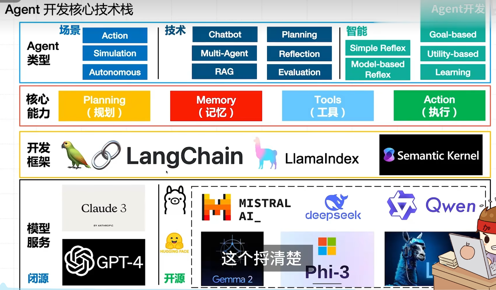

# agent开发指南

### AI Agent 是什么？

AI Agent（人工智能代理）是一个能够自主行动的软件程序，通过感知环境、收集数据、并基于这些数据来执行自我决定的任务，以实现预定目标。**LLMs（大模型）** 是现代AI代理的核心，因为它们提供了最关键的推理层，并且可以方便地衡量性能。其关键特点包括**自主性、交互能力、学习能力和多模态支持**。

### 最简 AI Agent 核心组件

Agents 通过传感器（Sensors）收集各类数据（Percepts），借助**推理引擎（Reasoning Engine）**提出合理解决方案（Rational Solutions），并通过控制系统（Actuators）执行动作（Action），以此提升能力。

-----

### AI Agent 典型分类（基于应用场景）

#### 规划（Planning）
- 提示（Prompt）：
  - LLM 多角色赋能
  - 给予充分的上下文（例：从 Memory 获取）
  - 学习策略（例：思维链 CoT）
- 代理（Agent）：决策下一步做什么

#### 记忆（Memory）
- 短期（Short-term）：内存
- 长期（Long-term）：向量数据库

#### 工具（Tools）
- 百花齐放的外部可调用服务

#### 智能代理分类：
- **行动代理（Action agents）**：旨在决定行动序列（工具使用）（例如 OpenAI Function Call，ReAct）。
`https://github.com/aiquan1111/DjiangoiPeng/top/ai-quickstart`
- **模拟代理（Simulation agents）**：通常设计用于角色扮演，在模拟环境中进行（例如生成式智能体，CAMEL）。
`斯坦福小镇`
- **自主智能体（Autonomous agent）**：旨在独立执行以实现长期目标（例如 Auto-GPT，BabyAGI）

### Agent 类型（基于技术实现）

| Agent 类型               | 子类型                                  | 描述                                                                 |
|--------------------------|-----------------------------------------|----------------------------------------------------------------------|
| **Chatbots**             | Customer Support                        | 构建用于管理航班、酒店预订的客服聊天机器人                           |
|                          | Prompt Generation from User Requirements | 构建用于信息收集的聊天机器人                                         |
|                          | Code Assistant                          | 构建用于代码分析和生成的助手                                         |
| **Multi-Agent Systems**  | Collaboration                           | 使两个智能体协作完成任务                                             |
|                          | Supervision                             | 使用大语言模型（LLM）来协调并委派给各个智能体                         |
|                          | Hierarchical Teams                      | 协调嵌套的智能体团队以解决问题                                       |
| **RAG**                  | Adaptive RAG                            | 动态调整检索策略，根据查询的特性和检索结果优化信息的处理，处理复杂或模糊的查询，确保获取最相关的数据 |
|                          | Agentic RAG                             | 智能体自主进行查询重组和与检索工具的互动，逐步优化检索，适用于需要多次检索以获得最准确结果的场景 |
|                          | Corrective RAG                          | 通过迭代反馈机制对生成的响应进行评估和修正，减少错误，保障最终输出的准确性 |
|                          | Self-RAG                                | 集成记忆功能，保留并回忆相关的过去交互信息，增强系统在处理上下文和连续性的能力 |
| **Planning Agents**      | Plan-and-Execute                        | 实现一个基本的规划与执行智能体                                       |
|                          | Reasoning without Observation           | 通过将观察结果保存为变量来减少重新规划的次数                         |
|                          | LLMCompiler                             | 从规划器中流式传输并急切地执行任务的DAG                              |
| **Reflection & Critique**| Basic Reflection                        | 提示智能体反思并修改其输出                                           |
|                          | Reflexion                               | 批判遗漏和多余的细节以指导下一步行动                                 |
|                          | Language Agent Tree Search              | 通过反思和奖励驱动智能体树的搜索                                     |
|                          | Self-correction Agents                  | 分析一个能够学习自身能力的智能体                                     |
| **Evaluation**           | Agent-based                             | 通过模拟用户交互评估聊天机器人                                       |
|                          | In LangSmith                            | 在LangSmith中通过对话数据集评估智能体                                 |

### AI Agent 典型分类(基于智能程度)
| 智能体类型 | 决策依据 (Action) | 记忆 (Memory) | 规划能力 (Planning) | 学习能力 (Learning) | 示例行为 |
| --- | --- | --- | --- | --- | --- |
| Simple Reflex Agents (简单反射型智能体) | 当前感知 | 无 | 无 | 无 | 仅根据当前情况做出反应，不考虑过去的事件。 |
| Model-based Reflex Agents (基于模型的反射型智能体) | 当前感知 + 转换模型 | 有（跟踪状态） | 有限（基于转换模型） | 无 | 使用过去的感知更新内部状态，以便做出当前决策。 |
| Goal-based Agents (基于目标的智能体) | 实现特定目标 | 有（状态和目标） | 有（规划行动） | 无 | 规划一系列行动以实现特定目标。 |
| Utility-based Agents (基于效用的智能体) | 预期效用 | 有（状态、目标和效用） | 有（最大化效用） | 无 | 选择那些能最大化整体效用的行动，考虑各种情况。 |
| Learning Agents (学习型智能体) | 环境反馈 | 有（状态、目标和效用） | 有（随着时间推进） | 有（随时间改进） | 根据反馈持续改进行为。 |

## AI Agent 基本框架
Planning：(规划)
Memory：（记忆）
tools：（工具）
Action（执行）

## 开发框架

**LangChain**:全生命的agent开发测试+部署
<!-- Semantic 
**LangGraph**: -->

**Llamalndex**:为llm应用程序打造的数据框架，提供数据连接器，数据结构化工具，高级检索接口--**数据检索方面**

**Semantic Kernel**:帮助开发者集成和使用LLMs等ai技术的开发框架，从而提升应用程序的agent交互和处理能力

### Agent生产部署平台

Ollama：私有化大模型的部署，提供一套用于下载、运行和管理LLMs的工具和服务

LangServe：将LangChain快速部署为REST API能力，同时集成FaskAPI和pydantic数据验证功能

LangSmith：提供可视化监控和全面评估LLM应用平台

### 外围技术

#### 前端：

**Gradio Sentnce Builder**
**Streamlit**

