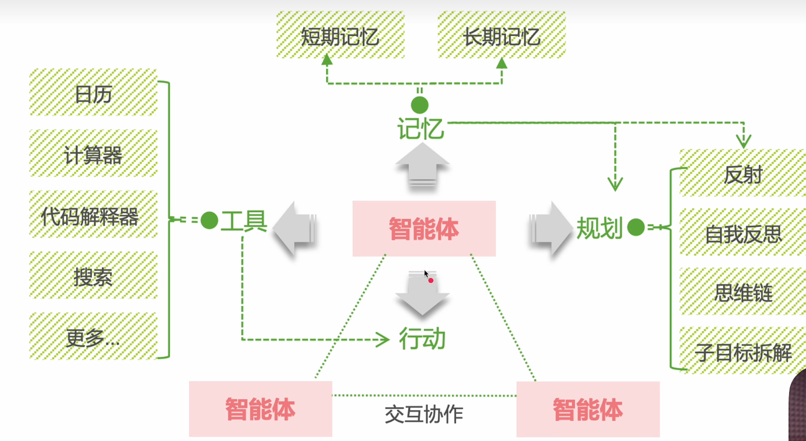

# 什么是AI Agent？

planning + memory + tools + actions

## 核心定义
AI Agent（人工智能代理）是一种能够**自主感知环境、进行思考、做出决策并执行任务**的智能软件系统。与传统聊天机器人不同，AI Agent的核心在于具备"代理权"（Agency），能够主动地"做事"，而不仅仅是"回答问题"。

| 普通聊天机器人 | AI Agent |
| :--- | :--- |
| - 只能根据用户输入进行文本生成或信息检索 - 能力边界受限于单次对话的上下文 - 仅能提供信息或回答问题 - 被动响应用户需求 | - 能够自行作出决策并执行复杂任务 - 在执行过程中进行自我评估和调整 - 可以主动规划并采取行动 - 像智能助手一样完成用户委托的任务 |

> 💡 举例：聊天机器人只会告诉你"如何预订机票"，而AI Agent则能直接帮你完成"预订机票"这个动作。

# 多agent协作

1. 提高各个agent的专精程度和准确度
2. 执行流程更加清晰

# 框架推荐

## MetaGPT 多代理框架

## Qodo Cover 代码测试