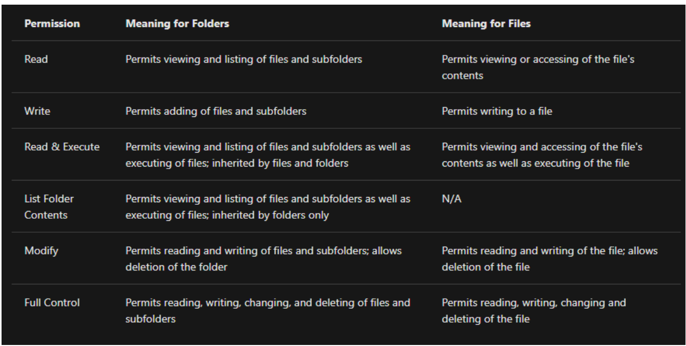

# tryhackme.com

## broswer skills

"":精准匹配，不拆分关键词
site:只在指定网站搜索。eg:site:www.baidu.com successful stories
- :减去搜索范围 eg: -tourism pyramids
filetype:指定文件搜索 eg：filetype:PDF cyber security

## Technical Documentation

**Linux Manual Pages** : man cat

**Microsoft Windows**:**https://learn.microsoft.com/zh-cn/** 可以用来查看微软相关命令或文档 eg:netstat

**Official Product Documentation**:查看文件/产品的官方介绍

## Social Media

like:facebook,Twitter,LinkedIn可以了解到公司以及个人的某些信息

## Linux Fundamentals 

### defination

Linux is just another operating system and one of the most popular in the world powering smart cars, android devices, supercomputers, home appliances, enterprise servers, and more.

### few command

**echo**:Output any text that we provide
**whoami**:Find out what user we're currently logged in as!
**ls**:listing
**cd**:change directory
**cat**:concatenate
**pwd**:print working directory
**find**:find some files eg:find *.txt ../
**grep**:find some word in one file eg:grep -R "PRETTY_NAME" /etc/

### shell Operators

|Symbol/Operator|Description|
|---|---|
|&|This operator allows you to run commands in the background of your terminal.|
|&&|This operator allows you to combine multiple commands together in one line of your terminal.|
|>|This operator is a redirector - meaning that we can take the output from a command (such as using cat to output a file) and direct it elsewhere.|
|>>|This operator does the same function of the > operator but appends the output rather than replacing (meaning nothing is overwritten).|

## windows Fundamentation

**file system**:NTFS

## windows command line

### Basic System Information

**set**:to check your path from the command line

**var**:to determine the operating system(OS) version

**systeminfo**:to list various information about your system

### Network Troubleshooting

**ipconfig /all**:show the basic imformation of network like IP address,subnet musk..

**ping**:to show the network connectivity

**tracert**:stands for trace route

**nslookup**:域名解析(ip->domain name/domain name->ip)

**netstat**:display current network connections and listening ports

-a:displays all established connections and listening ports
-b:shows the program associated with each listening port and established connection
-o:reveal the process ID associated with the connection
-n:uses a numerial form for addresses and port numbers

### File and Disk Management

**cd**:change director and show where am i

**dir**:view child directories 
/a:Displays hidden and syste files as well
/s:Displays files in the current directory and all subdirectories

**mkdir**:stands for make directory

**rmdir**:stands for remove directory

**copy**:copy files from one location to another

**move**:move files and change the filename

### Task and Process Management

**tasklist**:list the running processes
/?:check all available filters by displaying the help page

**shutdown**:to ditermine the state of system
-s:shut down
-r:restart

