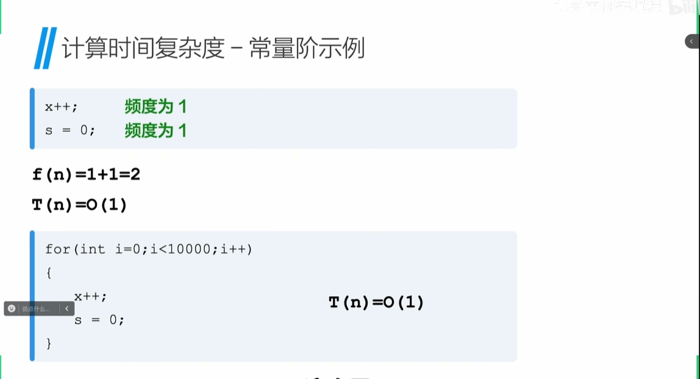
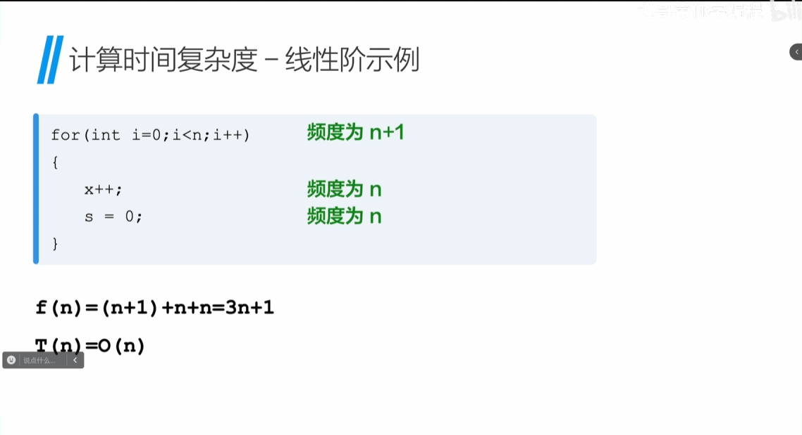
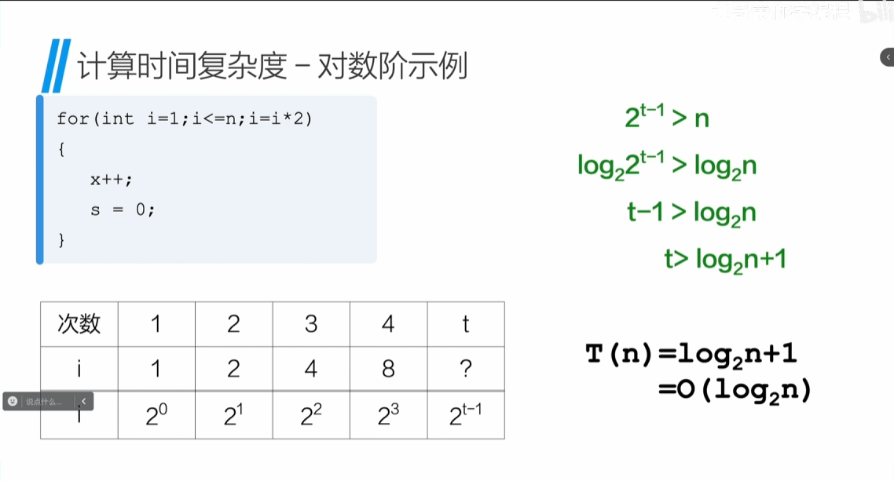
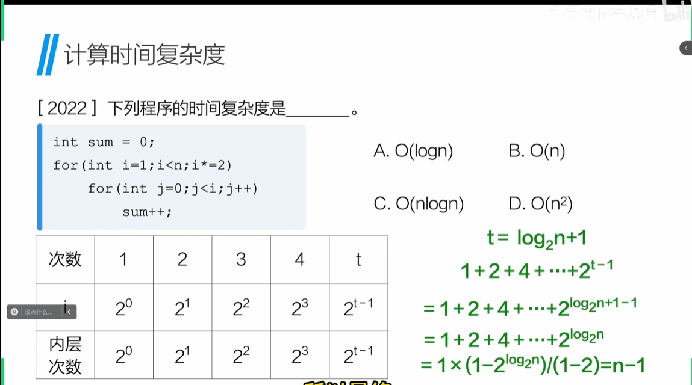
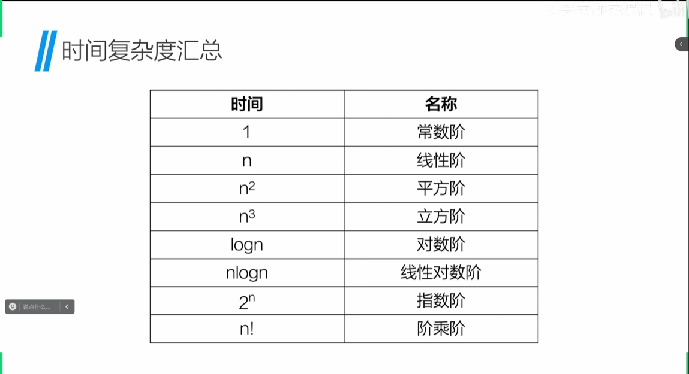

# 第一章 数据分析概论
 
## 算法分析

时间复杂度
空间复杂度
抽象数据类型ADT

### 算法满足的5个特性

*有穷性*
*确定性*
*可行性*
*输入*
*输出*

### 评价算法优劣的基本标准

*正确性*
*可读性*
*健壮性*
*时间效率高*
*存储量低*

## 算法的效率

### 时间复杂度

T(n) = O(f(n))
随着问题规模n的增大，算法执行时间的增长率和f(n)的增长率相同，称作算法的时间复杂度，简称时间复杂度
来源：
1. 执行每条语句的耗时
2. 每条语句的执行效率
>计算：
>
>
>
>
>
>
分类：
1. 最坏时间复杂度：在最坏情况下，算法所需要执行的基本操作次数

2. 平均时间复杂度：算法执行过程中所需要执行的基本操作次数的期望值

3. 最好时间复杂度：在最好情况下，算法所需要执行的基本操作次数

### 空间复杂度

S(n) = O(f(n))
  
*空间复杂度*：主要来描述某个算法对应的程序想在计算机上执行，除了用来存储代码和输入数据的内存空间外，还需要额外的空间

### 抽象数据类型（ADT）

含义：一种编程概念，用于定义数据类型机器操作，而不涉及具体的实现细节（设计图纸）

> ADT 电视机{
    开机；
    关机；
    调频；
    音量加；
    音量减；
}

