# 图(图搜索策略)

##  图的基本概念

### 图的定义

**定义**：是由顶点的又穷非空集合和顶点之间边的集合组合的
***tension:对于图这种数据结构，不允许没有顶点，但边集可以为空***

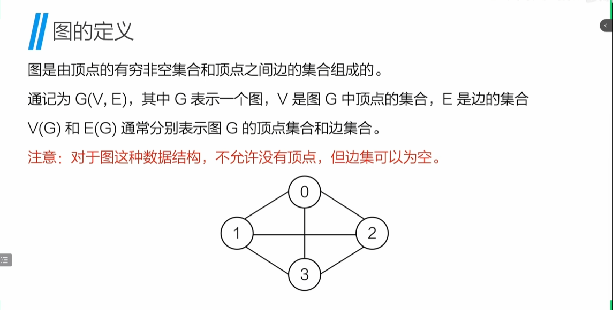

### 有向图和无向图

**有向图**：箭头指向有方向
**无向图**：箭头指向无方向(*弧头/弧尾*)

### 简单图和多重图

**简单图**：满足一下限制
- 限制一：图中不能有从顶点到其自身的边
- 限制二：同一条边不能出现两次或两次以上

**多重图**：不满足以上限制的图

### 完全图

**定义**：具有最多边数的图
- 对于一个具有n个顶点的无向完全图，边舒利昂的最大值为n(n-1)/2
- 对于一个具有n个顶点的有向完全图，边数量的最大值为n(n-1)

### 路径和路径长度

**路径**：从一个顶点开始，经过一系列的边到达另外一个顶点的序列
**路径长度**：路径上边的条数
**回路(环)**：期待你和终点相同，路径{0，3，1，0}是一个贿赂

### 简单路径

**简单路径**：如果路径中不出现相同的顶点，则称为简单路径
**简单回路**：除了第一个顶点和最后一个顶点外，其余顶点不重复出现的回路称为简单回路

### 顶点的度

**度**：对于无向图，顶点的度指的是该顶点相关联边的数目
**入度**：在有向图中，对于顶点v，箭头指向v的边的数目
**出度**：在有向图中，对于顶点v，从该顶点出发的边的数目

### 度与边的关系

- 在无向图中，假设具有n个顶点，e条边
图中所有顶点度数之和等于边数的两倍
- 对于有向图，所有顶点的度数之和与入度之和相等==弧的数量(弧头=弧尾)也相等

### 子图

### 连通图

**连通**：在*无向图*，如果从顶点v到顶点w有路径，则称顶点v到顶点w是连通的
**连通图**：如果对于图中任意两个顶点都是连通的，则称此图为连通图（只要有路径能够到达就是连通的）

### 连通分量

**连通分量**：无向图中的极大连通图称为连通分量
***连通分量为子图，子图为连通图，连通子图含有极大顶点数，具有极大顶点数的连通子图包含依附于这些顶点的所有边***

### 强连通图

**定义**：在有向图中，对于每一对顶点v和w，从v->w和从w->v都有路径，则称为强连通图

**强连通分量**：有向图中极大连通子图称为有向图的强连通分量

### 生成树

**定义**：只含有图中全部顶点的技校连通子树
***包含所有顶点n，但只有足以构成一棵树的n-1条边

### 边的权和网

**权**：在每一个图中，每一条边可以标注上某一个代表某种含义的数值，称为这个边的权值
**网**：边上带的权值的图，也称*带权图*

## 图的存储和遍历

### 邻接矩阵

无向邻接矩阵
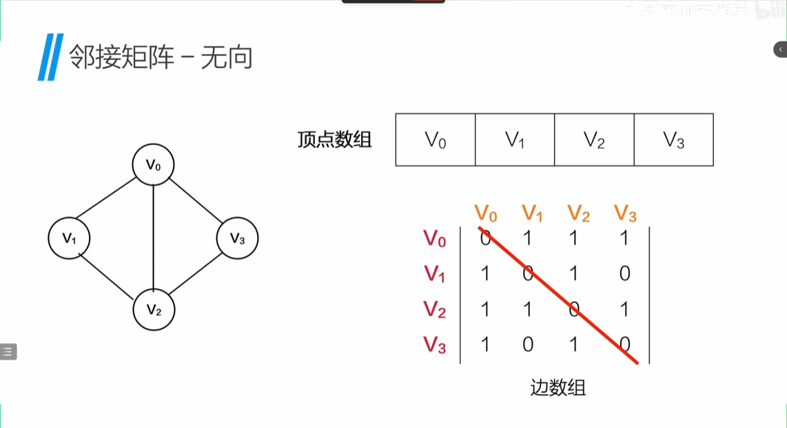
带权值的邻接矩阵
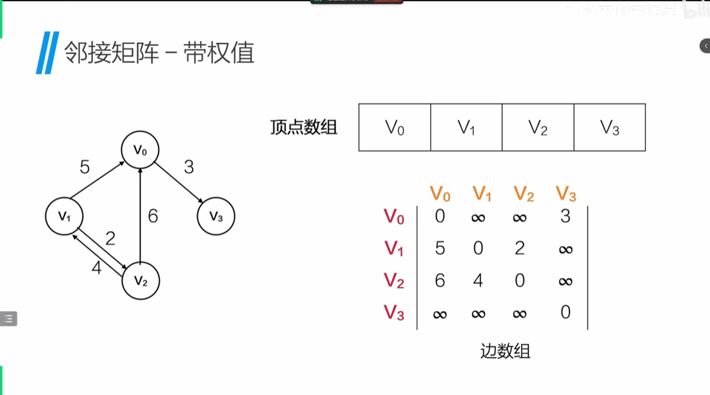

### 无向邻接表

>数字1，2，3表示数组下标,且下标顺序不唯一
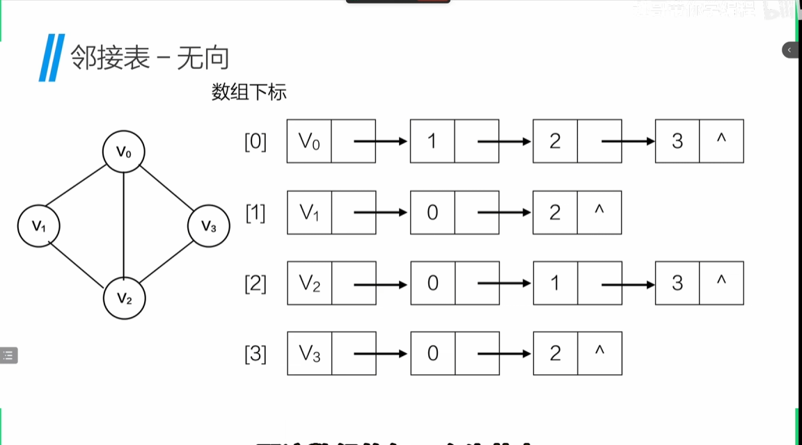

### 有向邻接表

>表示的是出边方向
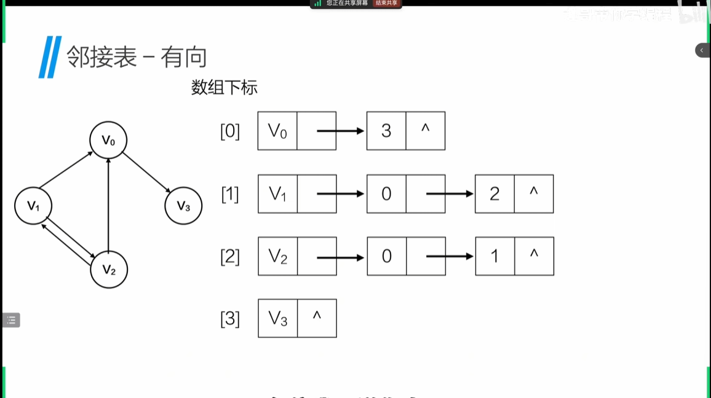

### 十字链表

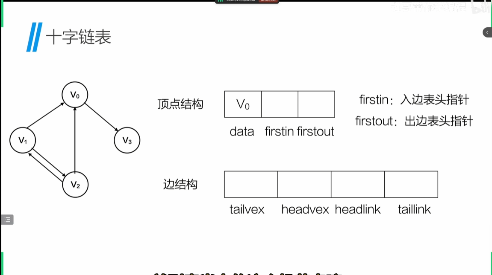

### 邻接多重表

### 图的遍历

#### 深度优先遍历(dfs)

类似 **数的前序遍历**:先每一个深挖，再从左向右

#### 广度优先遍历(bfs)

类似 **层序遍历(队列queue)**：先每一层向外挖，从上到下

## 最小生成树

**都不能包含回路**

### 普利姆Prim算法

**关注顶点之间的相邻去选择**
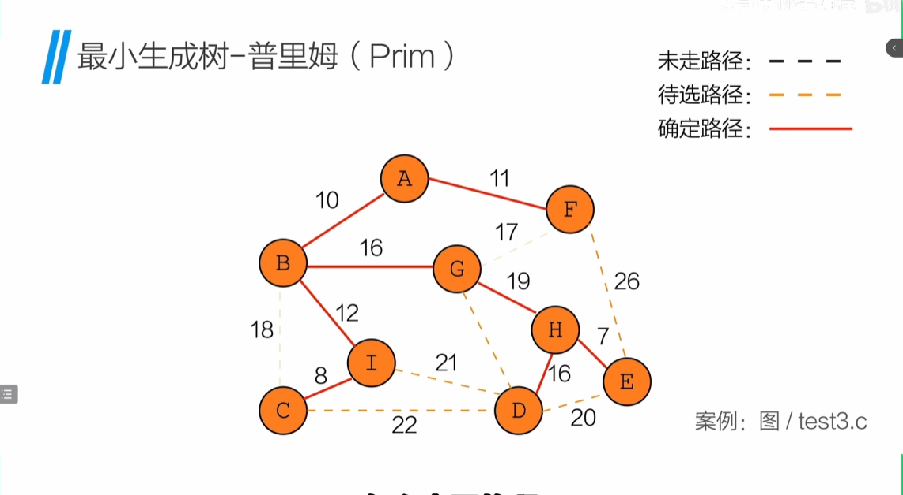

### 克鲁斯卡尔(Kruskal)算法

**关注边，按照边的最小权值去选择**
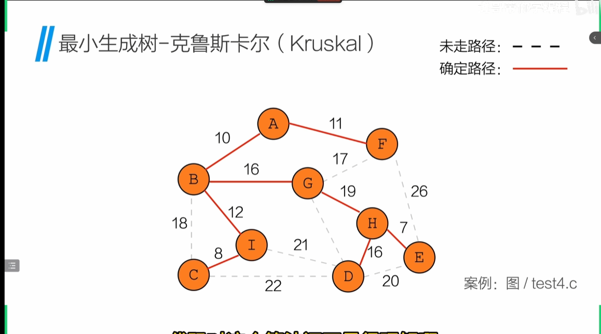

## 最短路径

### 迪杰斯特拉(Dijkstra)算法

**观察每一个顶点到起始顶点的最小权值的路径+每一个点最小权值的顶点+从最后一个顶点到起始顶点的最小权值**
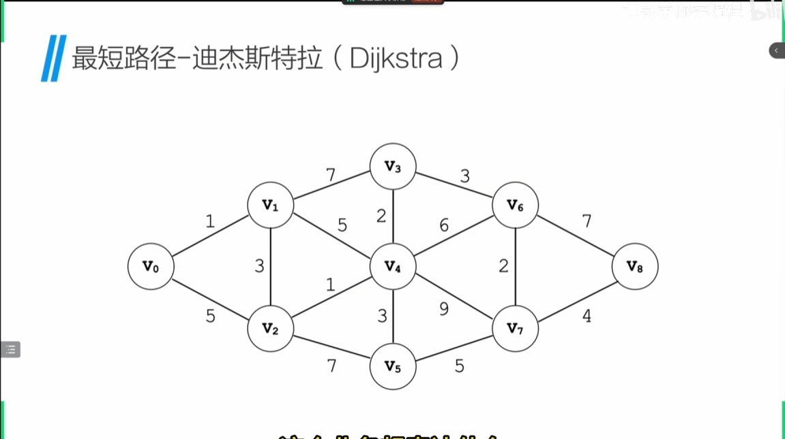

### 弗洛伊德(Floyd)算法

**观察每一个顶点到下一个顶点之间有没有其他路径有中转流转点的权值之和更小**
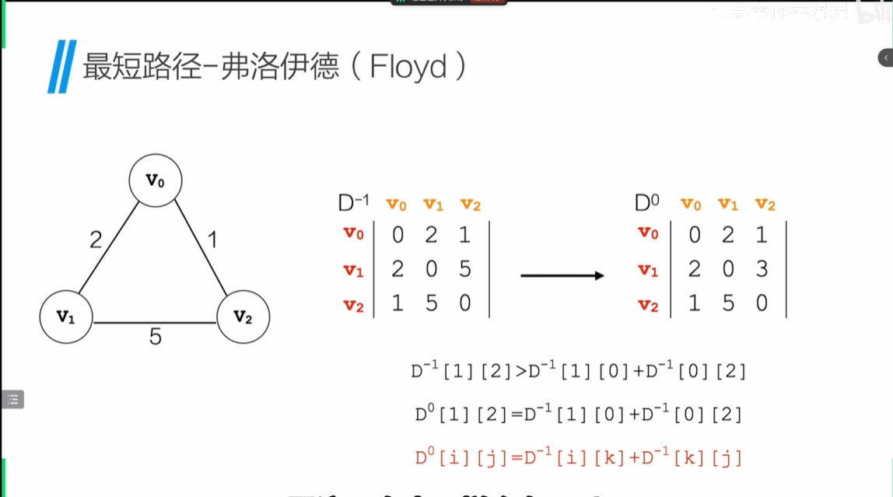

## 拓扑排序与关键路径

**AOV网(Activity On Vertex Network)**：在一个表示工程的有向图中，用顶点表示活动，用弧表示活动之间的优先级，这样的有向图为顶点表示活动的网

**拓扑排序**:持续寻找入度为0的顶点，然后入栈和出栈

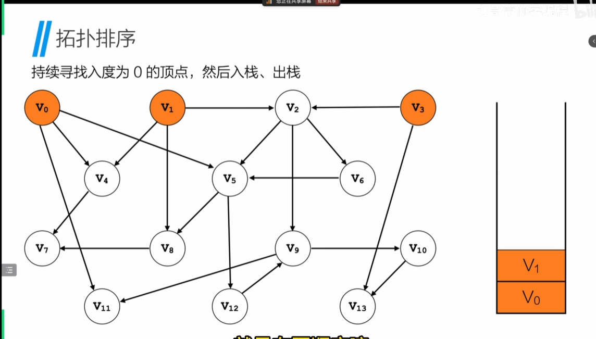

**关键路径**：在一个表示工程的带权有向图中，用顶带你表示事件，用有向边表示活动，用边上的权值表示活动持续的时间，这样的有向图的边表示活动的网，称为AOE(Activity On Edge)
**etv**：事件最早发生事件(earliest time of completion),每一个顶点必须要所有入度都完成后才能开始
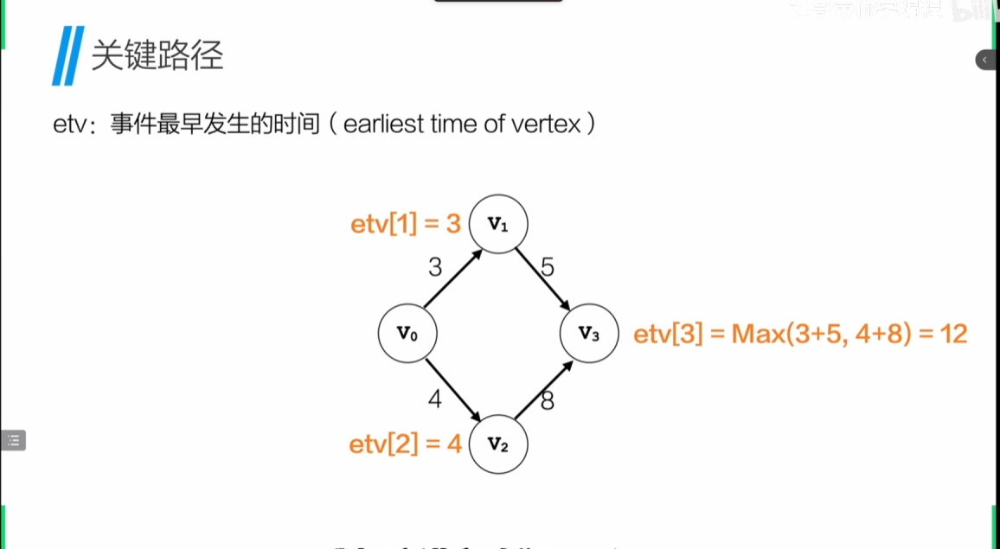
**ltv**：事件最迟发生事件(latest time of completion),每一个顶点必须要在最迟发生事件前完成
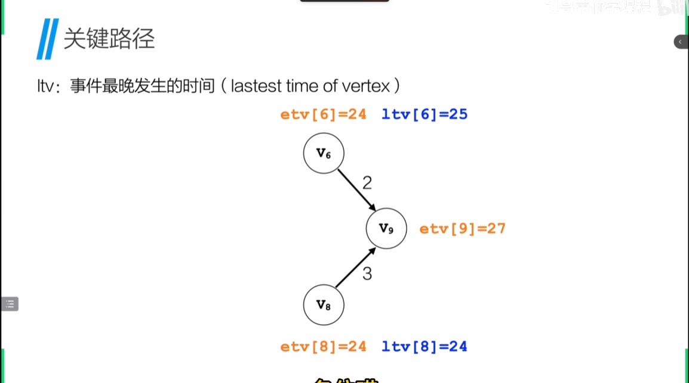

> etv和ltv的相同的顶点就是关键路径的顶点
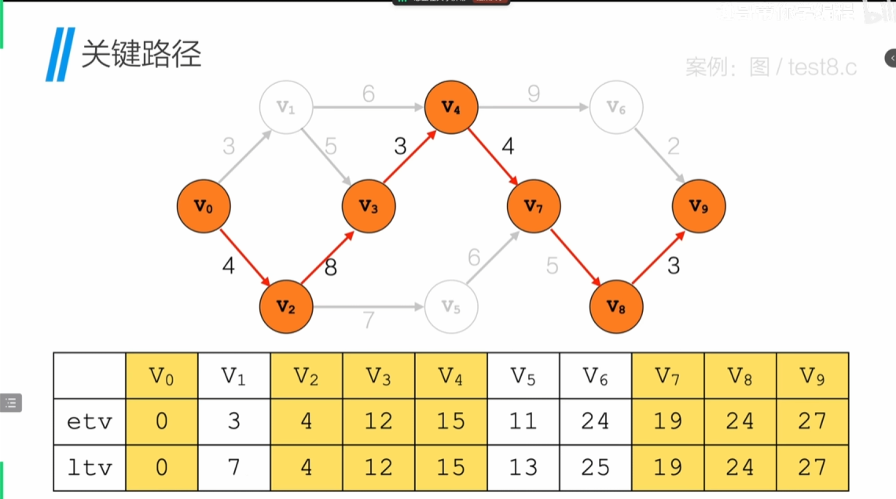
## 图的应用