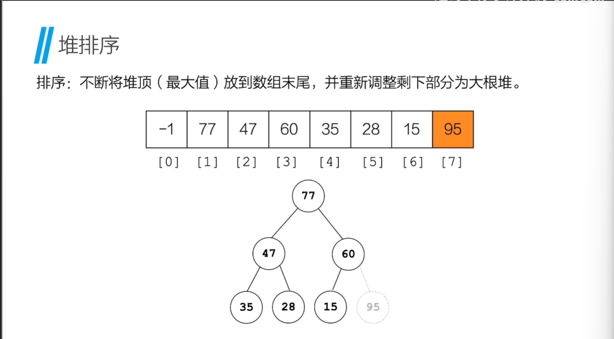
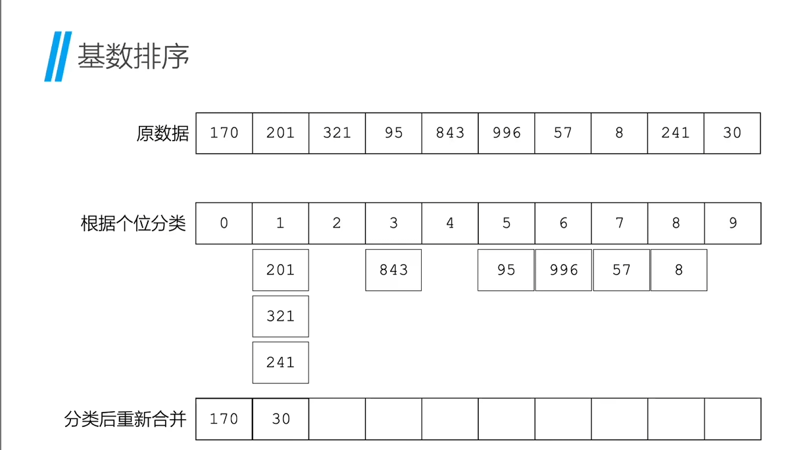
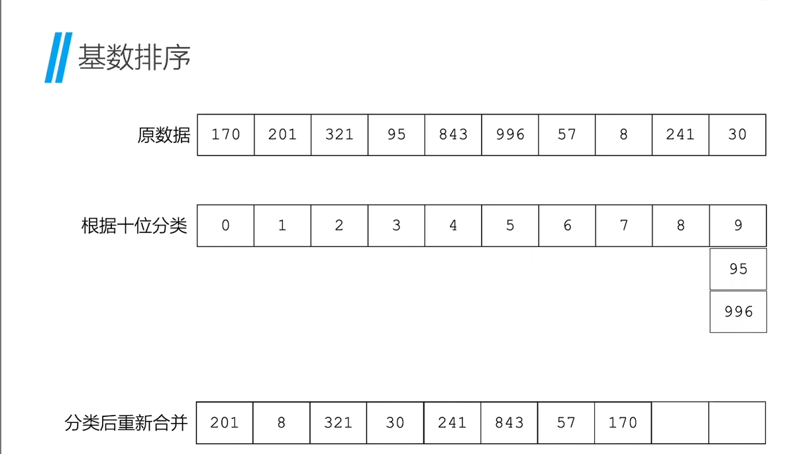
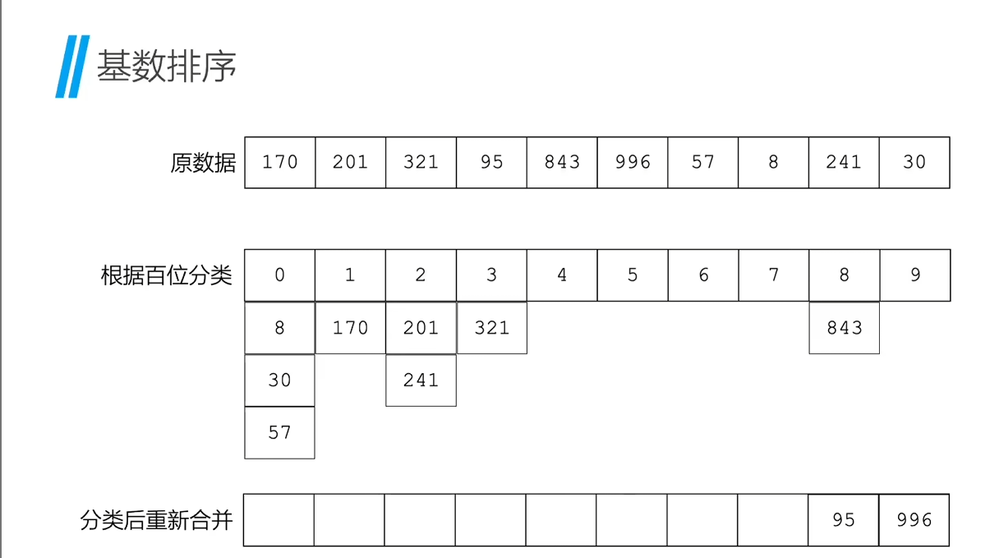

# 排序

**排序**：将一组数据元素按照某种规则重新排列成有序的过程

- 时间复杂度
- 空间复杂度
- 排序的稳定性(稳定排序：如果两个相等的元素，排序后，他们的相对位置不变)

## 简单的排序算法(小数据量/不稳定性要求等场景)

### 冒泡排序

冒泡排序的思想：每次比较相邻的两个元素，如果前一个元素大于后一个元素，则交换两个元素的位置，直到最后一个元素，则最后一个元素就是最大的元素。

**代码**：
```c
void swap(int * data,int i,int j){
    int temp = data[i];
    data[i] = data[j];
    data[j] = temp;
}

void bubble_sort(int * data,int length){
    //外层循环控制整体循环的次数，需要length-1次循环就可以
    for(int i = 0;i<length;i++){
        //内层对比相邻两个元素，如果前一个元素大于后一个元素，则交换两个元素的位置
        for (int j = 0;j<length-i-1;j++){
            if (data[j]>data[j+1]){
                swap(data,j,j+1);
            }
        }
    }
}
```

### 插入排序(抓牌)

插入排序的思想：将一个元素插入到已排序的数组中，直到所有元素都插入到已排序的数组中

**代码**：
```c
void insert_sort(int *data,int length){
    int key;//临时变量，用于存储当前需要插入的元素
    //从第二个元素开始，依次循环比较data[i]之前已经排序好的元素，如果data[i]小于data[j]，则将data[i]插入到data[j]之前
    for(int i=1;i<length;i++){
        key = data[i];
        int j = i-1;
        while(j>=0 && data[j]>key){
            //依次循环比较data[i]之前已经排序好的元素，如果data[j]>key,则将data[j]依次向后移动，直到找到正确的插入位置
            data[j+1] = data[j];
            j--;
        }
        data[j+1] = key;//将key插入正确的位置

    }
}
```

### 折半插入排序

**插入排序的优化**：
使用二分查找法，在插入元素时，先找到插入的位置，再将插入位置之后的元素依次向后移动，再将元素插入到正确的位置，这样可以减少比较的次数

### 简单选择排序

每次循环排列出最小的那一个元素，并放到数组之前

```c
void select_sort(int *data,int length){
    //每次循环排列出最小的那一个元素，并放到未排序的部分数组之前
    for(int i=0;i<length;i++){
        int min = i;//min记录最小值的索引
        //内层循环：依次比较i+1到length-1的元素，找到未排序的部分数组中最小的元素的索引
        for(int j=i+1;j<length;j++){
            if(data[j]<data[min]){
                min = j;
            }
        }
        //如果最小值不是i，则交换两个元素的位置,将后续未排序的元素中最小的元素放到i的位置上
        if (min!=i){
            swap(data,i,min);
        }
    }
}
```
## 堆和堆排序

**堆排序**：是一种基于完全二叉树的选择排序，利用堆这种结构选出当前无序部分的最大/最下元素，进而完成排序操作

**堆**：通常使用的是**大根堆**(每个节点都大于等于其子节点)，或**小根堆**(每个节点都小于等于其子节点)

### 堆的插入操作

1. 保证形态未完全二叉树的基础上插入
2. 逐层调整

### 堆的删除操作

1. 用最后一个节点替换要删除的节点
2. 逐层调整

### 堆排序的步骤



## 高效的排序算法(大数据量/稳定性要求等场景)

### 希尔排序

**思想**：先按一定的“步长”进行排序，逐渐减小步长，最终步长为1时完成最终的排序

### 归并排序

归并排序是一种典型的“分治合”思想的应用。简单来说，它的做法是：把一个大问题，拆成小问题分别解决，再把解决后的结果合并起来。

分：就是把数组分成两半，一直分，直到每个子数组只剩一个元素。

治：就是递归地对每个子数组排序。

全：把两个有序的子数组合并成一个有序数组。

```c
void merge(int* data, int left, int mid, int right)
{
    int temp[100]; // 临时数组，用于存放合并结果
    int i = left;  // 左半部分起始索引
    int j = mid + 1; // 右半部分起始索引
    int k = 0;    // 临时数组下标

    // 将两个有序部分按照大小关系依次放入 temp 中
    while (i <= mid && j <= right)
    {
        if (data[i] <= data[j])
        {
            temp[k++] = data[i++];
        }
        else
        {
            temp[k++] = data[j++];
        }
    }

    // 将剩余的左边部分拷贝到 temp 中（如果有）
    while (i <= mid)
    {
        temp[k++] = data[i++];
    }

    // 将剩余的右边部分拷贝到 temp 中（如果有）
    while (j <= right)
    {
        temp[k++] = data[j++];
    }

    // 将 temp 中的结果拷贝回原数组中，完成合并
    for (int t = 0; t < k; t++)
    {
        data[left + t] = temp[t];
    }
}
void mergeSort(int* data, int left, int right)
{
    if (left < right) // 至少两个元素才需要排序
    {
        int mid = (left + right) / 2;

        // 对左半部分排序
        mergeSort(data, left, mid);

        // 对右半部分排序
        mergeSort(data, mid + 1, right);

        // 将排好序的左右两部分合并
        merge(data, left, mid, right);
    }
}
```
### 快速排序

快速排序是一种非常高效的排序算法，采用了分治思想（Divide and Conquer）。其基本策略是：
1. 从序列中选择一个 “基准元素”
2. 将序列划分为两个子序列，所有比基准元素小的放到左边，比基准元素大的放到右边。
3. 对左右两个子序列递归进行快速排序
4. 直到子序列长度为 1 或 0，排序完成

## 基数排序

**思想**：把整数按“位”分配到不同的桶中，再按“位”合并，通过多轮这样的分配和合并，最终完成排序






## 外部排序

**外部排序**：是指排序的数据量过大，无法一次性加载到内存中进行排序的排序算法，通常时借助外部存储设备完成排序的策略(将大文件分装成能装入内存的数据块，每一块再内存中完成排序，然后将有序小块归并为一个整体有序文件)。*冒泡排序，归并排序等都假设数据可以全部装入内存中处理*

外部排序时间 = 内部排序时间 + 归并排序时间

### 多路平衡归并

对于同一个文件，归并路数越大，归并趟数越小，所需磁盘读写次数也越少
归并趟数 → S = ⌈logₖm⌉ ← 初始归并段数↑归并路数
提升外部排序效率：增加归并路数 k，减少初始归并段个数 m
k 越大，所需要的内存空间也越大，缓冲区的个数变多，生成归产段也会变长，归并段的个数就会下降
