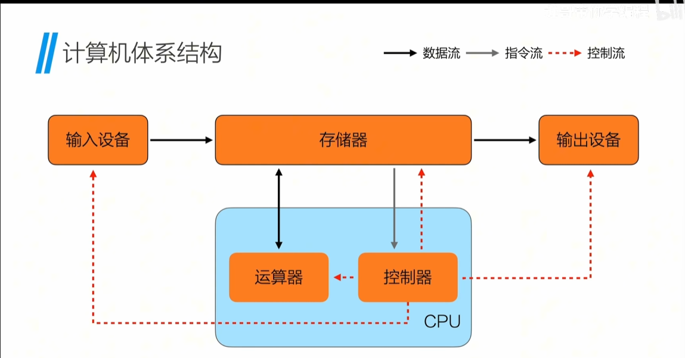

# 数据结构简介

*数据*：是描述客观事物的一个符号系统。
*结构*：数据的*组织形式*，数据的存储和管理形式。
*数据结构*：是相互之间存在*一种或多种特定关系*的数据元素的*集合*。是存储、组织数据的方式，旨在便于访问和修改
数据结构的三要素：逻辑结构、存储结构、物理结构。
逻辑结构：数据元素之间的逻辑关系
存储结构：数据元素的存储方式
物理结构：数据元素的物理位置
算法：一个*有穷规则的集合*，它用规则规定了解决某一特定类型问题的运算序列，或者任务执行或问题求解的一系列步骤

## c语言的前置知识

### 函数

*函数*：实现某个具体功能的代码块，增加代码复用性，降低编程难度，对内隐藏细节，对外暴露接口
四种形式：
1. 无参无返回值
2. 有参无返回值
3. 无参有返回值
4. 有参有返回值

### 字符串

> 无字符串类型，是数组+\0的组合表示字符串
> 对具体的`str1=char[11];`数组，需要借用`string.h`中的`strcpy(str1,"hello world")`来赋值

### 内存



*内存地址* ：操作系统将内存条、显卡、适配器等各自的存储地址空间抽象成一个巨大的一维数组空间，对于内存的每一个字节分配一个32位或64位编号，这个编号就是内存地址

### 数组

**数组*：相同数据类型的集合
使用取地址符&获取数组的地址是，返回的是数组第0个元素的内存地址
>数组的长度一旦定义就不能改变
>数组中的每一个元素可以用下标表示位置，如果一个位数组中有n个元素，那么下标的取值范围是0~n-1
>数组名就是数组首元素的地址，可以直接赋值给指针变量
>一般用sizeof(数组名)/sizeof(数组名[0])来获取数组的长度


### 指针

*指针*：用来存放地址的变量
解引用：*p,获取p指向的内存地址的
```c
    int a =10;
    int *p = &a;
    print("a的地址是%p,a的值是%d\n",&a,a)
    print("p的地址是%p,p的值是%p\n",&p,p)
```
