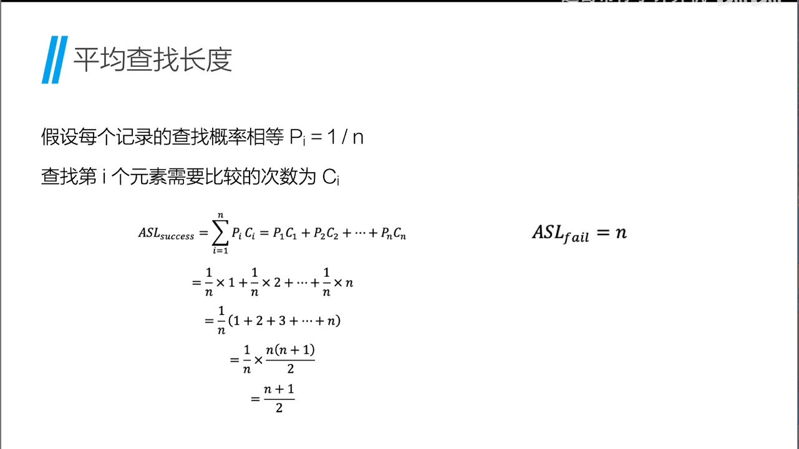
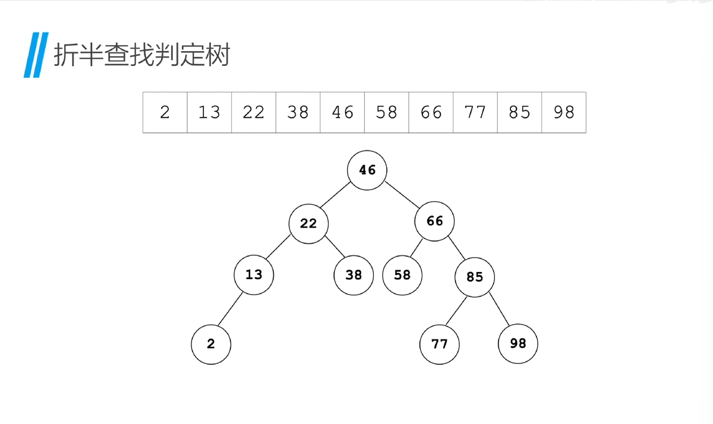

# 查找

## 基础概念

**定义**：是一组具有相同数据类型得数据元素组成得集合，这些元素通常保存在一张结构化得数据表中，用于支持对其中元素得查找操作

**关键字**：数据元素中能唯一标识该元素得属性，查找时就是通过关键字来定位对应得元素

**查找**：在查找表中根据给定的”关键字”找出对应元素的过程

**平均查找长度**：是指在一种查找方法下，查找一个元素所需要比较的关键字的平均次数，是衡量查找算法效率的重要指标
分类：


## 线性表的查找

### 顺序查找

**算法描述**：从表头开始，依次比较关键字，若找到关键字，则返回该元素；若遍历完整个表，仍未找到关键字，则返回“未找到”

```c
int search(int *data,int length,int value){
    //data：查找表
    //length：查找表长度
    //value：要查找的值
    for(int i=0;i<length;i++){
     if(data[i]==value){
        return i;
     }   
     return -1;//未找到
    }
}
```


### 二分查找

**前提**:查找表必须是有序表，无序的数据使用折半查找是完全没有意义的

**算法描述**：
1. 假设查找表的起始下标为low，结束下标为high
2. 计算mid= (low+high)/2,向下取整
3. 如果要查找的值等于mid位置的值，则返回mid
4. 如果要查找的值小于mid位置的值，则high=mid-1
5. 如果要查找的值大于mid位置的值，则low=mid+1
6. 重复2-5步，直到low>high，则返回-1    

```c
#include <stdio.h>
//折半查找函数
int binary_search(int* data, int len, int value)
{
    //data:查找表 n:表中元素个数 value:要查找的内容
    int low = 0; //查找表的起始下标为low
    int high = len - 1; //假设查找表的结束下标为high
    int mid;
    while(low <= high)
    {
        mid = (low + high) / 2; //计算中间下标: mid = (low + high) / 2
        if (value > data[mid])
        {
            low = mid + 1; //如果关键字大于a[mid]，则在右半部分继续查找，令low = mid + 1
        }
        else if(value < data[mid])
        {
            high = mid - 1; //如果关键字小于data[mid]，则在左半部分继续查找，令high = mid - 1
        }
        else
        {
            return mid; //如果关键字等于data[mid]，查找成功，返回下标
        }
    }
    return -1;
}
```

#### 二分查找判定树



### 二叉排序树-查找

#### 二叉排序树(查找)

**二叉排序树（Binary Search Tree，BST）**：是一种特殊的二叉树，它通过巧妙的节点排列方式，实现了“查找效率高、插入删除灵活”的目标，它满足以下特性：

1.  对于树中任意一个节点，其左子树上所有节点的值都小于该节点的值
2.  对于树中任意一个节点，其右子树上所有节点的值都大于该节点的值，并且左右子树本身也都是一棵二叉排序树

注意：构造二叉排序树的目的，并不是为了排序，而是为了提高查找、插入以及删除关键字的速度


#### 二叉排序树(插入)

**算法思路**：依次从根节点开始，如果要插入的值小于当前节点的值，则向左子树查找，否则向右子树查找，直到找到空节点，插入到该节点上。时间复杂度O(n)


#### 二叉排序树(删除)

- 叶子结点直接删除不影响

- 只有一个子节点的节点，直接删除，并将子节点替换到删除节点的位置

- 有两个子节点的节点，需要找到右子树中最小的结点或左子树中最大的结点(都是最接近它的值)，替换到删除结点的位置，然后删除对应的结点

### 平衡二叉树(AVL树)-查找

**平衡二叉树**：是一种特殊的**二叉排序树**，任意一个结点的左子树与右子树的高度之差绝对不超过1，避免二叉排序树退化为链表
**平衡因子**：是衡量结点平衡程度的指标，等与结点的左子树的高度减去右子树的高度
**最小不平衡子树**：从插入点向上回溯，第一个失衡的点，对失衡的平衡二叉树进行调整，需要先找到最小不平衡子树
**调整方法**：
1. 左左(LL)型调整：插入点的左子树的左子树高度大于右子树高度，则右旋转
2. 右右(RR)型调整：插入点的右子树的右子树高度大于左子树高度，则左旋转
3. 左右(LR)型调整：插入点的左子树的右子树高度大于右子树高度，则先右旋转，再左旋转
4. 右左(RL)型调整：插入点的右子树的左子树高度大于左子树高度，则先左旋转，再右旋转

### B树-查找

#### B树的定义与性质

**B树**：是一种多路平衡查找树，或者叫“平衡多叉树”，如果将二叉树看成是“每个节点最多两个分支”的树，那么B树允许每个节点有多个关键字和孩子，这种结构能有效压缩树的高度

**B树的性质**：
1. 每个节点最多有m个孩子，m称为B树的阶
2. 根节点至少有两个孩子，中间节点至少有m/2个孩子
3. 每个非叶子结点有k个孩子，就有k-1个关键字
4. 关键字按照中序遍历是有序的**B树是按照中序遍历去查找的**
5. 所有叶子结点都在同一层

#### B树的增删查

#### B树的好处

1. 查找效率高，平均查找长度与树的高度成正比

2. 减少磁盘的读写次数：由于结点内存储多个关键字，树的高度被显著降低，从而减少了磁盘访问
3. 适用于大数据量场景：B树特别适用于数据库索引和文件系统等需要高效读写大量数据的应用


### B+树-查找

#### B+树的定义与性质

**定义**：B+树其实是 B 树的一个变种，是在数据库系统、文件系统中应用最广泛的一种平衡查找树结构。它的本质仍然是“分层、多分支、平衡”的，但与 B 树相比，它在结构上做了两处关键性的优化：

（1）所有关键字只出现在叶子结点中，非叶子结点仅用于索引。
（2）所有叶子结点按大小顺序通过指针连接，形成有序链表。

### 散列表(hash表)-查找

*上述的所有查找方式都需要作比较，如果数据量大，比较次数多，则查找效率低*

**散列表**：用一个“函数”直接计算出数据存储(一个或多个数据)的位置，从而实现快速查找

**散列函数**：根据音译，通常也被称作哈希函数，是一种将关键字（Key）映射到散列表中某个地址（位置）的函数。它的作用是根据关键字，快速计算出该元素应该存储的位置。

可以把散列函数想象成一个“指路神器”或“数学变压器”，它接受一个输入（比如学号、名字、手机号），然后通过某种计算规则，把这个输入变成一个储物格编号（地址），告诉你数据该放在哪。

\[
H(\text{key}) = \text{key} \ \% \ 10
\]

**散列冲突**：当多个关键字映射到同一个地址时，称为散列冲突。解决散列冲突的方法有两种：

- 开放寻址法：当发生冲突时，再寻找另一个空闲位置，直到找到为止。
- 再散列法：当发生冲突时，用另一个散列函数计算出另一个地址，直到找到为止。

**散列表的构造方法(为了减少冲突，增大散列程度)**：
- 除留余数法：H(key) = key % p，其中p是一个质数，一般取p=2^m，m为所需的散列表的大小。
- 数字分析法：根据关键字的分布情况，选取关键字的若干位作为散列地址。
- 平方去中法：先对关键字进行平方运算，然后从所得中间结果若干位中取出一部分数字，作为散列地址

**影响散列表查找性能的因素**：
- 散函数是否均匀
- 处理冲突的方法
- 散列表的装填因子(装填因子=已插入元素个数/散列表的长度)