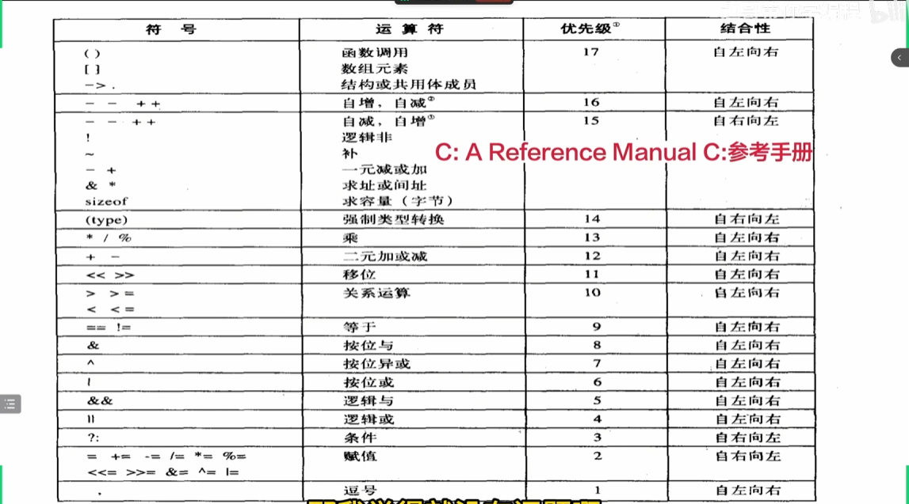
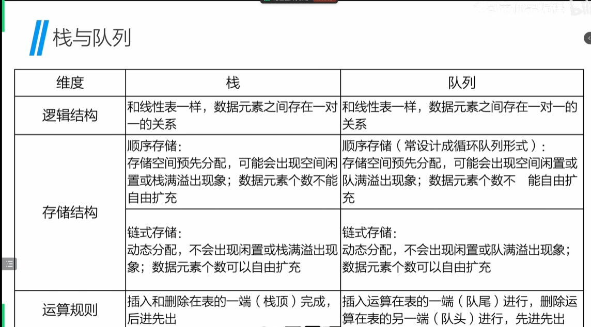

# 栈和队列

## 栈

**栈**：是仅限于在表尾（栈顶）进行插入或删除操作的线性表。表尾端有特殊含义，成为**栈顶**，表头端称为**栈底**。不含元素的栈称为**空栈**。
***后进先出***

栈的实现：../zhan.c/test1.c文件
栈的动态内存分配(堆内存)：../zhan.c/test2.c文件
栈的链式结构：../zhan.c/test3.c文件

## 队列

**队列**：是一种先进先出的线性表，插入操作在表尾进行，删除操作在表头进行。允许删除的一端被称为**队头**，允许插入的一端被称为**队尾**。

***先进先出***
**循环队列**：当队列满时，如果再往队列中添加数据，那么队列中最先添加的数据将被覆盖。因此，为了解决这种情况，我们可以将队列的空间设计成一个环形，将队头和队尾的指针放在同一位置。

队列的实现：../queue.c/test1.c文件
队列的链式结构：../queue.c/test4.c文件
循环队列的实现：../queue.c/test2.c文件

***双端队列***
融合队列（先进先出，FIFO）和栈（后进先出，LIFO）的特性，允许在队列的两端（前端和后端）同时进行插入和删除操作，无需像普通队列那样只能从一端插入、另一端删除，也无需像栈那样只能从一端操作。

## 递归

**递归**：是指在函数的定义中使用函数自身的方法，函数调用自身称为递归调用。*递归终止条件+递推关系*

eg1:计算1-n的非递归方式：../recursion.c/test1.c文件
eg2:计算1-n的递归方式：../recursion.c/test2.c文件

eg3:斐波那契额数列:../recursion.c/test3.c文件
eg4:斐波拉契数列递归：../recursion.c/test4.c文件

## 表达式求值

### 枚举

**枚举**：将变量的值一一列举，变量的值只限于列举出来的值的范围内，在每个枚举中列出的每一个值，称为枚举元素
```c
enum weekday{
    mon,tue,wed,thu,fri,sat,sun
    //mon =1 ,tue =2,wed =3,thu =4,fri =5,sat =6,sun =7
};
// 枚举元素的值默认从0开始，也可以自己指定值,如mon(0),tue(1),wed(2)...
int main(){
    enum weekday wd;//wd只能赋值枚举元素的值
    wd = mon;
    printf("%d\n",wd);//wd会被对应为相应的值
    return 0;
}
```

### 中缀/后缀表达式

中缀表达式：5+3*8  b*c/d

**后缀表达式**(计算机运算逻辑)：计算后缀表达式的唯一工具是栈，步骤固定且无需任何判断，全程从左到右遍历表达式：
遇到操作数：直接压入栈中；
遇到操作符：从栈中弹出 2 个操作数（先弹的是右操作数，后弹的是左操作数），用操作符对两个数进行计算，将计算结果压回栈中；
遍历结束后：栈中仅剩一个元素，即为表达式的最终结果。eg:563*+  bc*c/

**中缀转后缀**：
按顺序遍历中缀表达式的每一个字符，对不同类型字符执行固定操作，遍历结束后需处理栈中剩余操作符，步骤如下：
步骤 1：遇到「操作数」
直接将操作数加入结果列表；若为多位数，需拼接所有连续数字后再加入（避免拆分）。
步骤 2：遇到「左括号 (」
(在栈外属于最高优先级，当(在栈内，属于最低优先级
直接压入栈中，仅作为优先级分界，不参与结果输出。
步骤 3：遇到「右括号 )」
如果是),且栈顶元素不是(，则持续出栈并输出，直到栈顶为(出栈结束，最后也将(出栈
步骤 4：遇到「操作符 +-×/」
循环判断栈顶元素：
如果优先级大于栈顶元素，压入栈中
如果优先级小于等于栈顶元素，出栈并输出，再继续判断栈顶元素
步骤 5：遍历结束后（所有字符处理完）
将栈中剩余的所有操作符依次弹出，逐个加入结果列表（栈中此时无括号，仅剩操作符）。
*C语言优先级*：


### 栈和队列的对比

