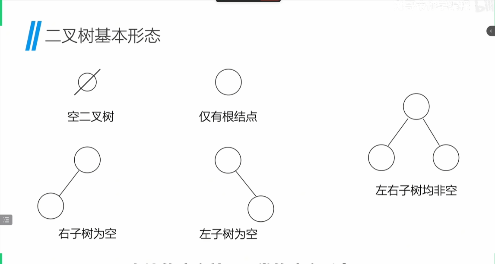
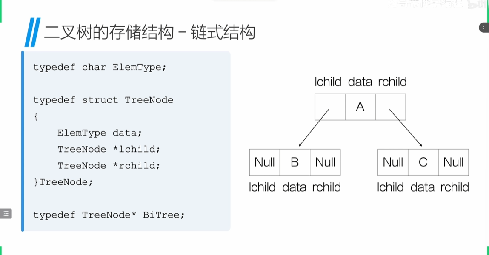
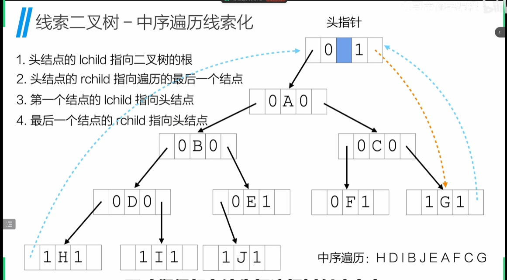
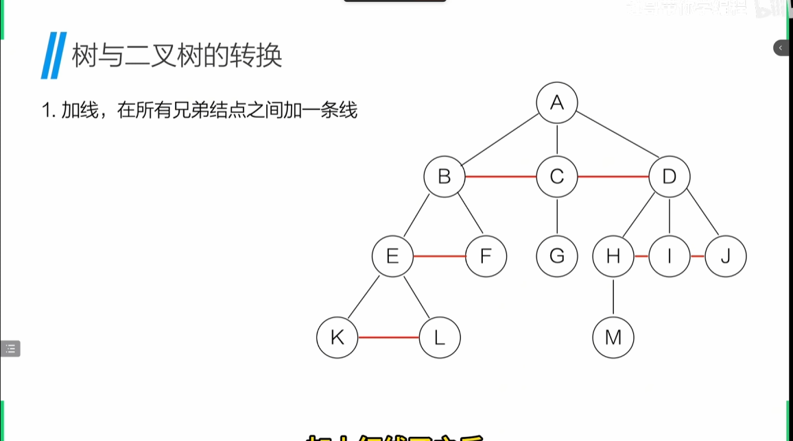
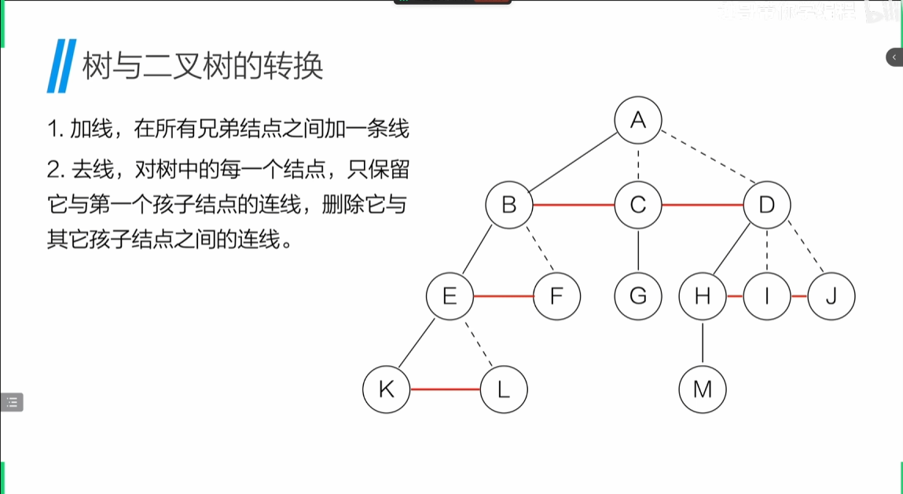
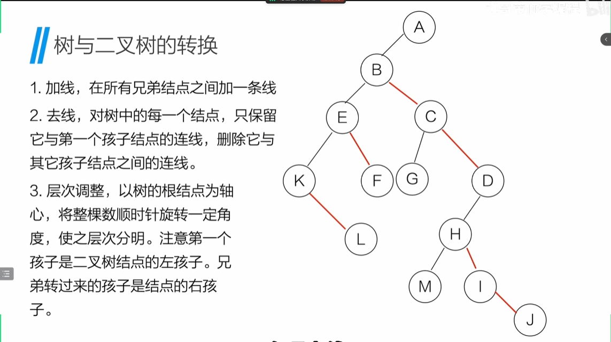
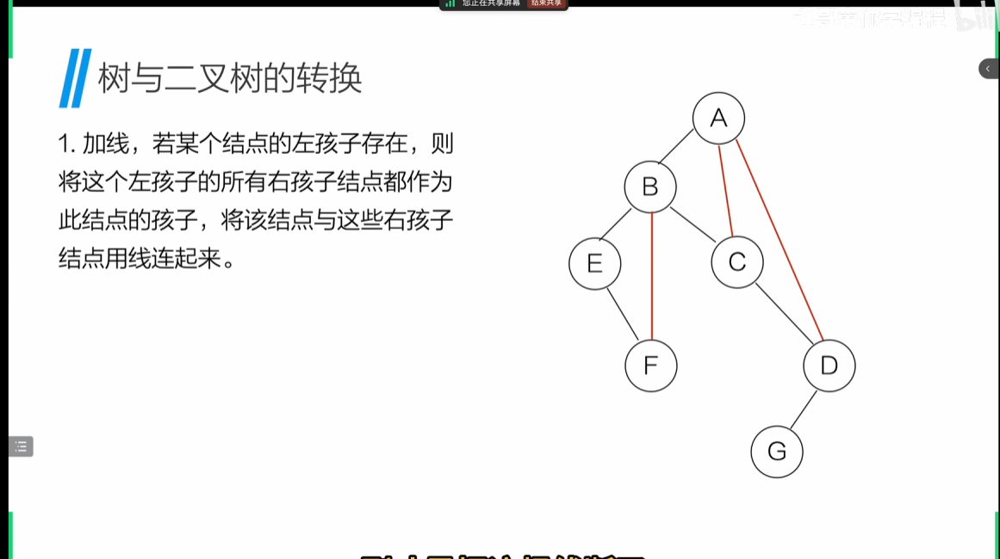
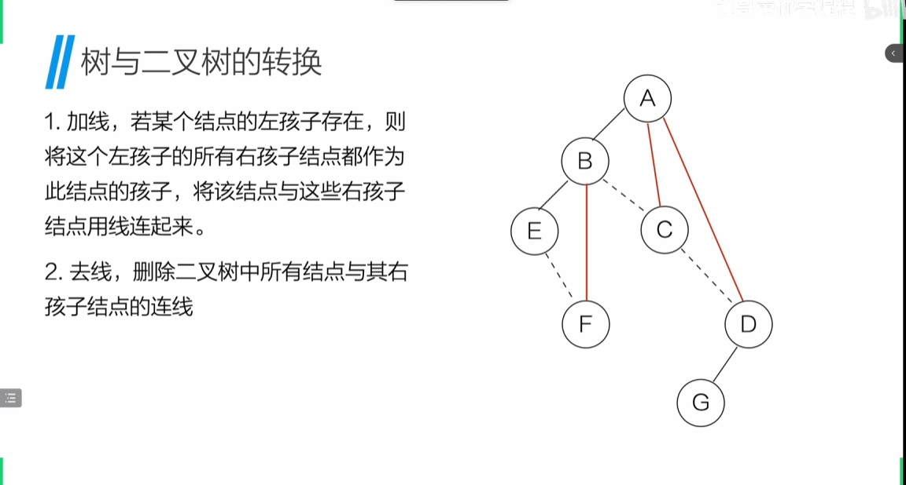
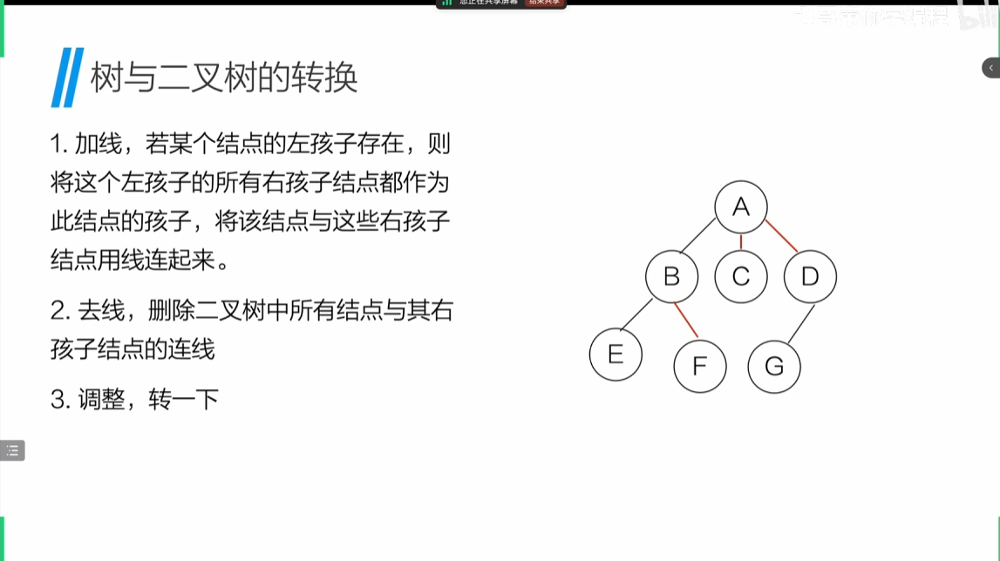
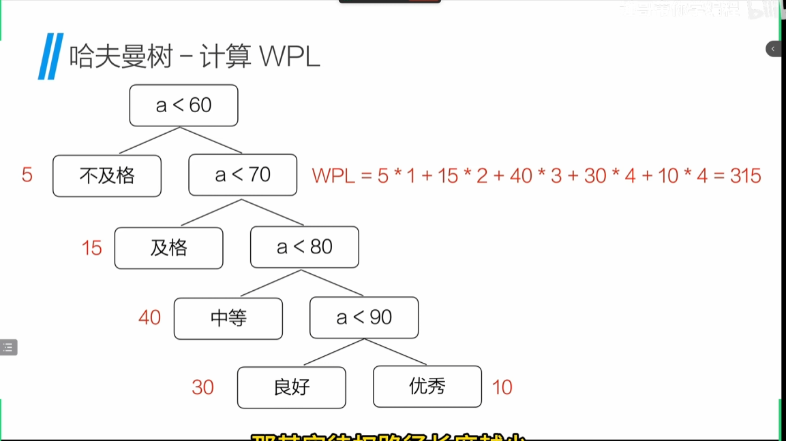

# 树和二叉树

## 树和二叉树的定义:

### 树:

**树**：树是一个或者多个节点的有限集合，存在一个称为root的特定节点，其余节点被分为n个互不相交的集合T1、T2、T3...Tn，其中T1、T2、T3...Tn本身又是一棵树，称为根节点root的**子树**。

**结点**：树中一个独立的单元

**节点的度**：节点拥有的子树的个数称为节点的度

**树的度**：树内各结点度的最大值

**叶子**：度为0的节点或终端节点

**非终端节点**：度不为0的节点或非终端节点

**双亲和孩子**：结点的子树的根称为该结点的孩子，相应的，该节点称为该子树的双亲

**层次**：节点的层次从根开始定义，根为第一层，根的孩子为第二层，以此类推。

#### 树的基本性质

**性质一**：树中的所有结点数等于所有结点的度数之和+1(所有结点的度数就是除了根节点以外的所有结点，+1就是根结点)

**性质二**：对于度为m的树，第i层上最多有m[^(i-1)]个结点（最多的情况：第一层m，第二层m^2，第三层m^3...）

**性质三**：*对于高度为h，度为m的树，，最多有(m^h-1)(m-1)个结点*

## 二叉树的实现和遍历

**二叉树**：是n(n>=0)个结点所构成的集合，它或为空树(n=0)，或为非空树，对于非空树：
- 有且仅有一个称为根的结点
- 除根结点以外的其余结点分为两个互不相交的子集T1、T2，分别为T的左子树和右子树，且T1和T2本身又都是二叉树
- 二叉树的每个结点之多只有两棵子树
- 二叉树的子树有左右之分，其次序不能任意颠倒

### 二叉树基本形态



### 二叉树的性质

**性质一**：二叉树的第i层最多有2^(i-1)(i>=1)个结点(除了根结点以外每个一结点都有两个子结点，即左右子树全满)

**性质二**：深度为k的二叉树最多有2^k-1个结点(即满树，满树的性质是：深度为k，有2^k-1个结点)

**性质三**：对于任何非空的二叉树T，如果叶子结点的个数为n0，度为2的结点树为n2，则n0=n2+1

**性质四**：具有n个结点的完全二叉树的深度为log2n+1(向下取整)

**性质五**：如果对一棵有n个结点的完全二叉树（其深度为$\log_2n+1$（向下取整））的结点按层序编号（从第1层到第$\log_2n+1$（向下取整层），每层左到右），则对任一结点i（$1\leq i\leq n$），以下结论成立。
（1）如果i=1，则结点i是二叉树的根，无双亲；如果结点i>1则其双亲是结点i/2（向下取整）
（2）如果2i>n，则结点i无左孩子（结点i为叶子结点）；否则其左孩子是结点2i
（3）如果2i+1>n，则结点i无右孩子；否则其右孩子的结点是2i+1。

### 特殊的二叉树

**满二叉树**：深度为k且含有2^k-1个结点的二叉树，所有叶子结点只能出现在最后一层
> 对于同样深度的二叉树，满二叉树的根结点个数最多，叶子结点的数量也是最多的
> 如果对满二叉树进行编号，根结点从1开始，从上到下从左到右，对于编号为i的结点，若存在左孩子，则编号为2i，若存在右孩子，则编号为2i+1

**完全二叉树**：深度为k的，有n个结点的二叉树，当且仅当其每一个结点都与深度为k的满二叉树中的编号从1到n的结点一一对应时，称之为完全二叉树(***没有左子树，不能有右子树，上一层没有铺满，不能有下一层***)
> 特点：
> - 叶子结点只能再层次最大的两层上出现
> - 对任一结点，若其右分支下的子孙的最大层次为i，则其左分支下的最大层必为i或i+1

**斜树**：斜树是只存在左子树或右子树的二叉树

### 二叉树的存储结构

#### 顺序存储结构
除了满二叉树和完全二叉树外，其他二叉树都无法用顺序存储结构来存储，因为二叉树的存储结构是非线性的，无法用顺序存储结构来存储。

#### 链式存储结构



链式存储二叉树的实现：./code/chaintree.c

### 二叉树的遍历

前序遍历(先输出) 中序遍历(中间输出) 后序遍历(最后输出)

二叉树遍历的实现：./code/chaintree.c
    递归写法
    非递归写法

二叉树遍历的性质：
- 已知前序遍历和中序遍历，可以唯一确定一棵二叉树
- 已知中序和后续遍历，可以唯一确定一棵二叉树
- 已知前序遍历和后续遍历，不能确定一棵二叉树

### 线索二叉树

通过遍历可以得到二叉树的线性排列，但这样的线性序列只有在遍历时才能得到，而将二叉树线索化得线索二叉树可以解决这个问题
线索化：利用叶子结点得空余空间记录前驱、后驱（左孩子放前驱、右孩子放后继）***一个二叉树有N个值，就有N+1个空位***

#### 线索二叉树的存储结构

```c
typedef char ElemType;
typedef struct ThreadNode{
    ElemType data;
    struct TreadNode* lchild;
    struct TreadNode* rchild;
    int ltag;//表示左右指针是否为NULL，若是，则可以化为线索指针，
    int rtag;
}TreadNode;

typedef TreadNode* ThreadTree;
```
#### 线索二叉树-中序遍历线索化

1. 头结点的lchild指向二叉树的根结点
2. rchild指向二叉树的最后一个结点
3. 第一个结点的lchild指向头结点
4. 最后一个结点的rchild指向头结点


### 树和二叉树的转化

### 树转为二叉树
1. 加线：在所有同双亲结点的兄弟结点之间加一条线

2. 去线：对树的每一个结点，只保留它与第一个孩子结点的连线，删除它与其他孩子结点的连线

3. 层次调整：以树的根结点为轴，将整个树顺时针旋转一定角度，使其层次分明，注意第一个孩子是二叉树结点的左孩子，兄弟转过来的孩子是结点的右孩子


#### 二叉树转为树
1. 加线，若某结点的左孩子存在，则将这个左孩子所有右孩子结点都作为此2结点的孩子，将该结点与这些右孩子结点用线连起来

2. 去线，删除二叉树所有结点与其右孩子结点的连线

3. 调整，旋转


## 树和森林

### 树
如上讲解

### 森林

**定义**：n多个不同的树

### 森林转二叉树
1. 所有树转二叉树
2. 第一棵二叉树不动，从第二棵树开始，依次把后一二叉树的根结点作为前一棵二叉树的根结点的右孩子，然后用线连接
### 二叉树转森林
1. 从根结点开始，若右孩子存在，则把右孩子结点的连线删除
2. 拆
3. 二叉树转换成树

## 哈夫曼树

### 基本概念
**结点的权**：实际应用中，给树种的结点赋予代表某种含义的数值
结点的带权路径长度：从该结点到跟之间的路径长度与该结点权的乘积
树的带权路径长度：树中所有**叶子结点**带权路径长度之和
**定义**：带权路径长度最小的树
计算WPL:

### 哈夫曼树的产生

> 1. 初始化把每个权值单独看成一棵只有根节点的二叉树，组成森林。
> 2. 重复以下步骤，直到森林只剩 1 棵树
>   1. 在森林中选出 权值最小的两棵树。
>  把它们作为左右子树(小的权值放左子树)，合并成一棵新树。
>   2. 新树的根节点权值 = 两棵子树权值之和。
>   3. 从森林中删除那两棵小树，加入这棵新树。
> 3. 最后剩下的那棵树，就是哈夫曼树。

传统编码：简单的01二进制表示。A=01，B=10...
哈夫曼编码：根据字母的不同使用频率来进行编码（根据频率森林画出哈夫曼树，然后左子树置0，右子树置1，写出编码

## 层序遍历

**广度优先遍历**：
```python
def level_ordered_traversal(root:TreeNode):
    '''基于队列实现二叉树的层序遍历'''
    if root is None:
        return 
    #初始化队列
    queue = deque([root])

    while queue:
        current_node = popleft(queue)#删除队列的出口节点的同时取出旧的节点
        print(current_node.val)
        #如果左节点不为空，则加入队列
        if current_node.left:
            queue.append(current.left)
        #如果右节点不为空，则加入队列
        if current_node.right:
            queue.append(current.right)

```

## 红黑树的定义

红黑树是二叉排序树：**左子树 ≤ 根节点 ≤ 右子树**

1.  每个节点不是红色就是黑色 **左根右**
2.  根节点一定是黑色 **根叶黑**
3.  叶子节点(NULL)一定是黑色
4.  不允许存在两个相邻的红色节点 **不红红**
5.  从任一节点到达任一叶子节点的路径上，黑色节点的数量相同 **黑路同**

--> 节点到叶子节点的路径长度不超过最短路径的两倍