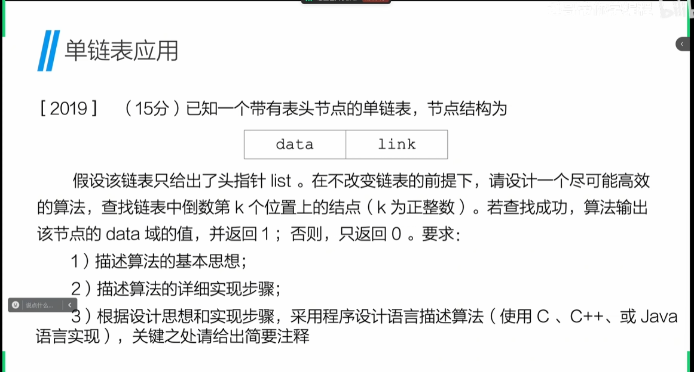
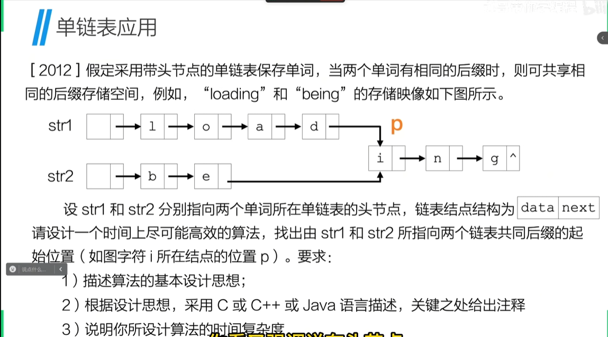
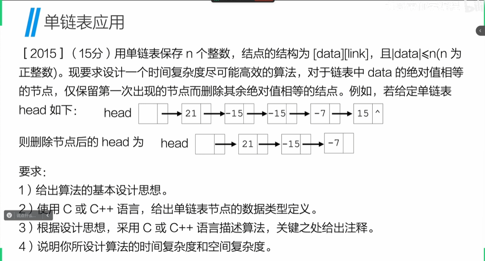
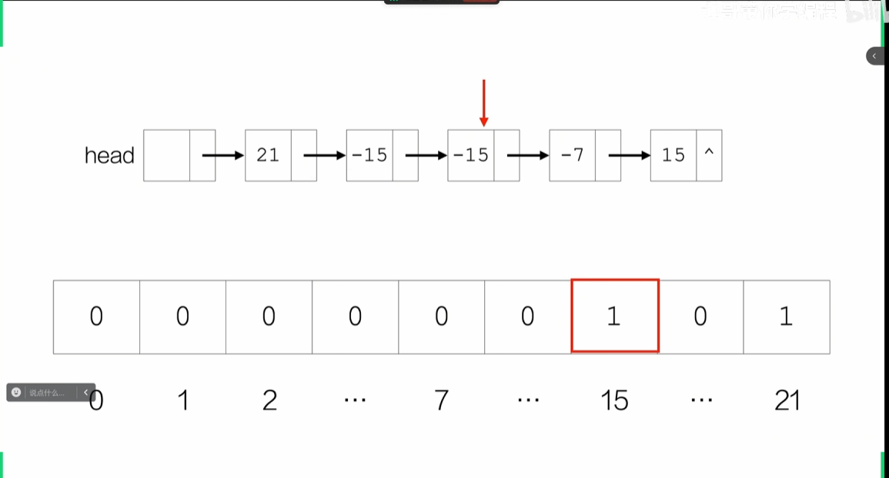

# 单链表

## 线性表

**定义**：由n(n>=0)个数据特性相同的元素构成的有限序列，先线性表中元素的个数n称为线性表的长度，n=0时，线性表为空表

**特点**：
1. 存在唯一一个被称作“第一个”的数据元素
2. 存在唯一一个被称作“最后一个”的数据元素
3. 除第一个和最后一个元素外，其他数据元素均有唯一的前驱和后继

### 顺序表

**含义**：线性表的一种实现方式，用一组地址连续的存储单元依次存储线性表的数据元素
*py中的列表的实现原理也是顺序表，append、insert等方法都是具体方法*

```c
 #define MAXSIZE 20
 typedef int ElemType;
 
 //定义顺序表
 typedef {
    ElemType data[MAXSIZE];
    int length;
 }Seqlist;

//初始化顺序表
void initList(Seqlist *L){
    l->length = 0;
}

```

运用：
- 末尾添加元素：test2.c文件
- 遍历顺序表元素：test3.c文件
- 插入元素：*先移动后面所有元素，再插入*test4.c文件
- 删除元素：*依次移动要删除元素位置的后面元素以覆盖前一元素，最后length-1*test5.c文件
- 查找元素：*循环遍历查找元素第一次出现的位置*test6.c文件

### 链表

**特点**：用一组任意连续得存储线性表得数据元素（这组存储单元可以是利阿努也可以不连续）

**节点**：除了**本身的信息**之外，还需要存储一个知识**直接后继的信息**，这两部分信息组成一个节点

```c
//定义节点
typedef int ElemType;

typedef struct Node{
    ElemType data;
    struct Node *next;
}Node;
```

- 插入数据
  - 头插法：*每次在头节点后面插入元素***会导致插入顺序和排列顺序是相反的**Linklist/test2.c文件
  - 尾插法：*每次在尾节点后面插入元素***会导致插入顺序和排列顺序是相同的，应该先获取尾节点的地址**Linklist/test4.c文件
  - 指定位置插入：*先找到要插入位置的前一个节点，再插入*Linklist/test5.c文件
- 遍历 *头节点不是第一个有数据的节点*
- 删除节点 *先找到要删除节点的前一个节点，用前驱节点指向后驱节点，再删除（free）*Linklist/test6.c文件
- 获取链表长度 *遍历链表*Linklist/test7.c文件


## 单链表的应用
# 单链表应用

**题目1**：


> 单链表应用
> 双指针/快慢指针
```c
int findMiddle(Node *L,int k){
    Node *slow = L;
    Node *fast = L;
    for (int i=0;i<k;i++){
        fast = fast->next;
    }
    while (fast->next != NULL){
        slow = slow->next;
        fast = fast->next;
    }
    printf("倒数第%d个元素是：%d\n",k,slow->data);
    return 1;
}
```

**题目2**


> 单链表应用2
> 双指针/快慢指针：*同一方向多走k步*
```c
int findsameindex(Node *L1,Node *L2){
    //获取两个链表的长度，并比较长度，长度大的链表指针先走k步
    length1 = listLength(L1);
    length2 = listLength(L2);
    Node *fast = length1>length2?L1:L2;
    Node *slow = length1>length2?L2:l1;
    for (int i = 0; i<abs(length1-length2);i++){
        fast = fast->next;
    }
    //两个指针同时走，直到两个指针相等，即为相同的后缀起始点
    while (fast->next != slow->next ){
        fast = fast->next;
        slow = slow->next;
    }
    printf("相同的后缀起始点是：%p\n",fast->next);
    return fast->next;
}
```
**题目3**

> 单链表应用3
> 1. 双指针/快慢指针
> 2. 空间换空间
> 
```c
int removeSame(Node *L,int n){
    Node *p = L;
    int index;//作为数组下标使用
    int *q = (int *)malloc(sizeof(int)*(n+1));
    for (int i =0;i<n;i++){
        *(q+i) = 0;//初始化计数为0
    }
    while (p->next != NULL){
        index = p->data;
        if (*(q+index)==0){
            //计数为0，则计数+1，指针后移
            *(q+index) = 1;
            p = p->next;
        }else{
            //计数不为0，删除节点
            Node *temp = p->next;
            p->next = temp->next;
            free(temp)
        }
        free(q);
        return 1;
    }
}

## 反转链表
> 三指针
 ```c 
int reverseList(Node *L){
    Node *first = NULL;
    Node *second = *L;
    Node *third ;
    while (second != NULL){
        third = second->next;
        second->next = first;
        first = second;
        second = third;
    }
    Node * head = ininitList();//创造新的头节点
    head->next = first;
    return head;
 }
 ```

 ## 删除中间节点数据
 > 双指针/快慢指针:*快指针每次走两步，慢指针每次走一步*

**题目5**：

解决方法：


# 单向循环链表

**定义**：单链表的变形，在单链表的基础上，将尾节点的指针指向头节点，整个链表形成一个环（循环遍历的时候，判别条件应该是p->next != head/L）

**题目**：
判断是否有环（快慢指针），快慢的指针会在环上碰上

进阶：确定环的起始位置
    1. 计算环的长度（count从相遇点开始计数，快指针走一圈，就是环的长度）
    2.让快指针从头节点开始，提前走环的长度
    3. 快慢指针同时走，相遇位置就是环的起始位置 


## 双向链表

*双向链表*：双向链表是链表的一种，它的每个数据结点中都有两个指针，分别指向直接后继和直接前驱。所以，从双向链表中的任意一个结点开始，都可以很方便地访问它的前驱结点和后继结点。

```c
typedef int ElemType;
typedef struct {
    ElemType data;
    struct DNode *prior;
    struct DNode *next;
}DNode;
```

### 双向链表的插入
1. 头插法：*每次在头节点后面插入元素***会导致插入顺序和排列顺序是相反的
```c
int insertHead(DNode *L,ElemType e){
    //头插法插入元素e
    DNode *p = (DNode *)malloc(sizeof(DNode));
    p->data = e;
    p->prior = L;
    p->next = L->next;
    if (L->next != NULL){
        DNode *origial_next =(DNode *)malloc(sizeof(DNode));
        original_next = L->next;
        original_next->prior = p;
    }
    L->next = p;
    return 1;
}
```
2. 尾插法：*每次在尾节点后面插入元素*
```c
DNode * insertTail(DNode *tail,ElemType e){
    //尾插法插入元素e
    DNode *p = (DNode *)malloc(sizeof(DNode));
    tail->data = e;
    tail->next = p;
    p->next = NULL;
    p->prior = tail;
    return p;
}
```
3. 指定位置插入数据
```c
int insert(DNode *L,int pos,ELemType e){
    //找到第pos个的前置节点
    DNode *p = L;
    int i =0;
    for (i;i<pos-1;i++){
        p=p->next;
        if (p==NULL){
            return 0;
        }
    }
    //创造元素+改变指针指向
    DNode *q = (DNode *)malloc(sizeof(DNode));
    q->data = e;
    q->next = p->next;
    q->prior = p;
    p->next = q;
    p->next->prior = q;
    return 1;

}
```
4. 删除节点
```c
int delete(DNode *L,int pos){
    //找到第pos个的前置节点
    DNode *p = L;
    int i =0;
    for (i;i<pos-1;i++){
        p=p->next;
        if (p==NULL){
            return 0;
            }
    //删除节点
    DNode *q = (DNode *)malloc(sizeof(DNode));
    q = p->next;
    p->next = q->next;
    q->next->prior = p;
    free(q);
    return 1;
}
```

## 顺序表和链表的比较
