# CSRF（跨站请求伪造）

## 一、概述

跨站请求伪造（CSRF）是一种攻击手段，它会**强制终端用户在其已登录认证的 Web 应用中执行非自身意愿的操作**。借助少量**社会工程学**手段（例如通过邮件或聊天软件发送链接），攻击者便可诱骗 Web 应用用户执行其预设的恶意操作。
若受害者为普通用户，一次成功的 CSRF 攻击可迫使其执行修改状态类请求，如资金转账、修改邮箱地址等；若受害者为管理员账号，CSRF 攻击则可能导致整个 Web 应用系统被攻陷。

### 描述
跨站请求伪造（CSRF）是一种诱骗受害者提交恶意请求的攻击。它会**继承受害者的身份与权限**，以受害者的名义执行非预期操作（但需注意，登录型CSRF这一特殊攻击形式并不符合这一特点，下文会对此进行说明）。对于大多数网站而言，浏览器发出的请求会**自动携带该网站相关的身份凭证**，例如用户的会话Cookie(最常见的身份凭证)、IP地址、Windows域凭证等。因此，若用户当前已在该网站完成身份认证，网站将无法区分受害者提交的伪造请求与合法请求。**(攻击者只需要构造url，然后诱导用户点击，浏览器会自动带上凭证，然后服务端会认为是合法请求，执行操作，这就是CSRF攻击)**

CSRF攻击针对的是**会在服务器端造成状态变更的功能**，例如修改受害者的邮箱地址或密码、进行商品购买等。强制受害者获取数据对攻击者没有任何好处，因为攻击者无法收到响应结果，响应只会返回给受害者。因此，CSRF攻击的目标均为状态变更类请求。

攻击者可以通过一种特殊的攻击形式——**登录型CSRF**，来获取受害者的私密数据。攻击者会强制未登录的用户登录到一个由攻击者控制的账号。如果受害者没有察觉，可能会将信用卡信息等个人数据添加到该账号中。之后，攻击者便可重新登录该账号，查看这些数据以及受害者在该Web应用中的操作记录。

CSRF攻击有时还可以被**存储在存在漏洞的网站自身**，这类漏洞被称为**存储型CSRF漏洞**。实现方式可以是在支持HTML的字段中直接插入IMG或IFRAME标签，也可以通过更复杂的跨站脚本攻击实现。如果攻击代码能够存储在目标网站中，攻击的危害程度会大幅提升。一方面，受害者访问包含攻击内容页面的概率，远高于访问互联网上某个随机恶意页面；另一方面，受害者此时必然已在该网站完成登录认证，这也进一步提高了攻击成功率。

### 例子

#### 攻击是如何生效的？
诱骗终端用户在Web应用中加载信息或提交数据的方式有很多种。要实施一次攻击，我们首先需要构造一个有效的恶意请求，供受害者执行。以如下场景为例：Alice希望通过存在CSRF漏洞的bank.com应用向Bob转账100美元。攻击者Maria则想诱骗Alice将这笔钱转给自己，攻击流程如下：
1. 构造恶意URL或恶意脚本
2. 利用社会工程学（Social Engineering）诱骗Alice执行该操作

#### GET请求场景
若该Web应用设计为主要通过GET请求传递参数、执行操作，那么转账操作可能简化为如下请求：
```http
GET http://bank.com/transfer.do?acct=BOB&amount=100 HTTP/1.1
```
此时 Maria 可利用该 Web 应用的漏洞，以 Alice 为攻击目标。她先构造恶意 URL，该 URL 会将 Alice 账户中的 100000 美元转账至自己的账户 ——Maria 将原请求中的收款人姓名替换为自己，并大幅提高转账金额。恶意 URL 如下：http://bank.com/transfer.do?acct=MARIA&amount=100000
攻击中的社会工程学环节，会诱骗 Alice 在登录银行应用的情况下访问该 URL。通常会通过以下手段实现：
- 发送包含 HTML 内容的未授权邮件
- 在受害者进行网上银行操作时，将恶意 URL 或脚本植入其易访问的页面
恶意 URL 可伪装成普通链接，诱导受害者点击：
```html
<a href="http://bank.com/transfer.do?acct=MARIA&amount=100000">View my Pictures!</a>
```
也可嵌入 0x0 尺寸的伪造图片中：
```html

```
即便邮件中未显示任何图片内容，浏览器仍会向bank.com提交请求，且用户不会察觉该转账操作已发生。

2008年针对uTorrent应用的CSRF攻击漏洞，是该攻击方式在大规模恶意软件传播场景中的真实应用案例，主要用于诱导用户下载恶意软件。

#### POST请求场景
GET与POST类型的CSRF攻击，唯一区别在于受害者执行攻击的方式。假设某银行的存在漏洞的转账请求如下：
```http
POST http://bank.com/transfer.do HTTP/1.1
acct=BOB&amount=100
```
此类请求无法通过标准的<a>标签或标签发起，但可通过<form>标签实现：
```html
<form action="http://bank.com/transfer.do" method="POST">
<input type="hidden" name="acct" value="MARIA"/>
<input type="hidden" name="amount" value="100000"/>
<input type="submit" value="View my pictures"/>
</form>
```
该表单需要用户点击提交按钮才能执行攻击，不过也可以通过 JavaScript 实现自动执行：
```html
<body onload="document.forms[0].submit()">
<form...
```
其他 HTTP 请求方法
现代 Web 应用接口常使用 PUT、DELETE 等其他 HTTP 方法。假设该存在漏洞的银行接口采用 PUT 方法，且入参为 JSON 数据块，请求示例如下：
```http
PUT http://bank.com/transfer.do HTTP/1.1
{ "acct":"BOB", "amount":100 }
```
此类请求可通过嵌入恶意页面的 JavaScript 代码完成执行。

```html
<script>
function put() {
    var x = new XMLHttpRequest();
    x.open("PUT","http://bank.com/transfer.do",true);
    x.setRequestHeader("Content-Type", "application/json");
    x.send(JSON.stringify({"acct":"BOB", "amount":100}));
}
</script>

<body onload="put()">
```
幸运的是，由于 ** 同源策略（same-origin policy）** 的限制，现代浏览器不会执行此类请求。该限制默认启用，除非目标网站通过以下 CORS（跨域资源共享）响应头，明确允许来自攻击者（或所有来源）的跨域请求：
```
Access-Control-Allow-Origin: *
```

*参考：*
*[OWASP-CSRF](https://owasp.org/www-community/attacks/csrf)*
*[csrf-faq](https://www.cgisecurity.com/csrf-faq.html)*
*[wiki百科](https://en.wikipedia.org/wiki/Cross-site_request_forgery)*
## 二、DVWA中的CSRF漏洞

页面显示：
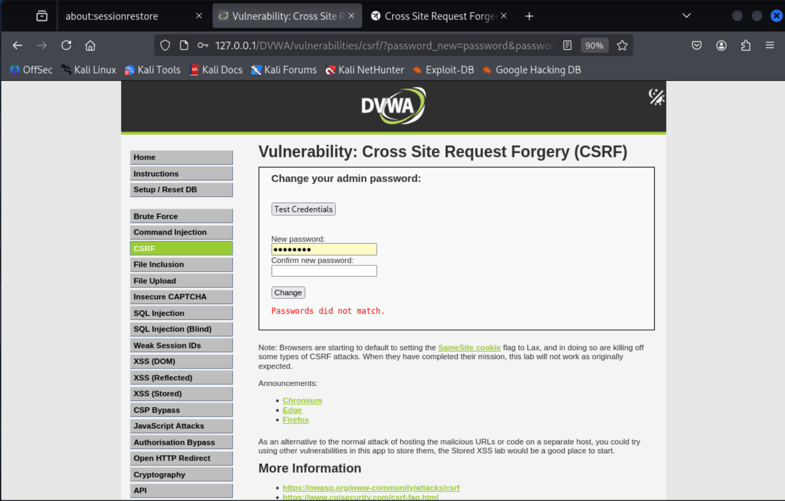

### DVWA中的CSRF low 级别

**源码**：
```php
<?php

if( isset( $_GET[ 'Change' ] ) ) {
    // Get input
    //①处，未对url进行筛查，不能直接知晓是否是用户发送的请求
    //②处，直接获取password_new、password_conf参数值
    $pass_new  = $_GET[ 'password_new' ];
    $pass_conf = $_GET[ 'password_conf' ];

    // Do the passwords match?
    //③处，直接对比参数值是否相等？
    if( $pass_new == $pass_conf ) {
        // They do!
        //④处，mysql_real_escape_string()函数对特殊字符进行mysql字符转义,防止SQL注入(最好还是用占位符来防止SQL注入)
        $pass_new = ((isset($GLOBALS["___mysqli_ston"]) && is_object($GLOBALS["___mysqli_ston"])) ? mysqli_real_escape_string($GLOBALS["___mysqli_ston"],  $pass_new ) : ((trigger_error("[MySQLConverterToo] Fix the mysql_escape_string() call! This code does not work.", E_USER_ERROR)) ? "" : ""));
        //⑤处，对密码进行hash算法md5加密存储，提高安全性，但是md5容易被彩虹表暴力破解
        $pass_new = md5( $pass_new );

        // Update the database
        //⑥处，dvwaurrentUser()函数通过绘画中的(Session/Cookie)获取当前用户，
        // 然后直接将获取的参数插入数据库中

        $current_user = dvwaCurrentUser();
        $insert = "UPDATE `users` SET password = '$pass_new' WHERE user = '" . $current_user . "';";
        $result = mysqli_query($GLOBALS["___mysqli_ston"],  $insert ) or die( '<pre>' . ((is_object($GLOBALS["___mysqli_ston"])) ? mysqli_error($GLOBALS["___mysqli_ston"]) : (($___mysqli_res = mysqli_connect_error()) ? $___mysqli_res : false)) . '</pre>' );

        // Feedback for the user
        echo "<pre>Password Changed.</pre>";
    }
    else {
        // Issue with passwords matching
        echo "<pre>Passwords did not match.</pre>";
    }

    ((is_null($___mysqli_res = mysqli_close($GLOBALS["___mysqli_ston"]))) ? false : $___mysqli_res);
}

?>
```

*prompt:There are no measures in place to protect against this attack. This means a link can be crafted to achieve a certain action (in this case, change the current users password). Then with some basic social engineering, have the target click the link (or just visit a certain page), to trigger the action.*

**原理说明**：
*low级别，没有对任何因素进行检查，无论是谁发来的请求，后端都会对比+执行是否修改密码(无任何csrf防护)*

- ①处，未对输入进行筛查，不能直接知晓是否是用户发送的请求
- ②处，直接获取password_new、password_conf参数值
- ③处，直接对比参数值是否相等？
- ④处，使用mysql_real_escape_string()函数对特殊字符进行mysql字符转义,防止SQL注入(最好还是用占位符来防止SQL注入)
- ⑤处，对密码进行hash算法md5加密存储，提高安全性，但是md5容易被彩虹表暴力破解
- ⑥处，dvwaCurrentUser()函数通过绘画中的(Session/Cookie)获取当前用户，然后直接将获取的参数插入数据库中

**payload展示**：
*由于是攻击者构造url，诱导用户点击，且low没有任何防御，假设攻击者构造如下url，用户点击，就会发送新的请求，完成对密码的修改(用户处于未知或者觉得点击链接没有任何安全问题的情况下，密码还被修改了)：*

```
http://127.0.0.1/DVWA/vulnerabilities/csrf/?password_new=123456&password_conf=123456&Change=Change#
```
笔者之前的密码为password，假设笔者在不知情的情况下，点击了上述url：
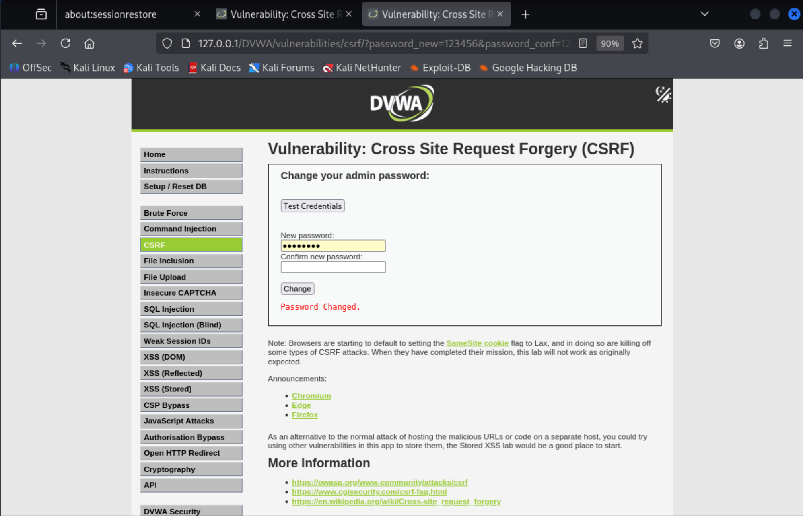

然后笔者尝试用原来的密码password登录账号，会发现登录失败(因为此时密码已经被修改为123456了)：


可以看到显示"login failed"，说明密码已经被修改，但是用户并不知情.

### DVWA中的CSRF medium 级别

**源码**：
```php
<?php

if( isset( $_GET[ 'Change' ] ) ) {
    // Checks to see where the request came from
    //①处，stripos()函数检查请求头中的Referer字段是否包含当前服务器的域名，如果包含，则认为是用户发送的请求，执行操作，否则认为是攻击者发送的请求，不执行操作
    if( stripos( $_SERVER[ 'HTTP_REFERER' ] ,$_SERVER[ 'SERVER_NAME' ]) !== false ) {
        // Get input
        //②处，同low级别，直接获取password_new、password_conf参数值
        $pass_new  = $_GET[ 'password_new' ];
        $pass_conf = $_GET[ 'password_conf' ];

        // Do the passwords match?
        //③处，同low级别，直接对比参数值是否相等？
        if( $pass_new == $pass_conf ) {
            // They do!
            //④处，同low级别，使用mysql_real_escape_string()函数对特殊字符进行mysql字符转义,防止SQL注入(最好还是用占位符来防止SQL注入)
            $pass_new = ((isset($GLOBALS["___mysqli_ston"]) && is_object($GLOBALS["___mysqli_ston"])) ? mysqli_real_escape_string($GLOBALS["___mysqli_ston"],  $pass_new ) : ((trigger_error("[MySQLConverterToo] Fix the mysql_escape_string() call! This code does not work.", E_USER_ERROR)) ? "" : ""));
            $pass_new = md5( $pass_new );

            // Update the database
            //⑤处，同low级别，dvwaCurrentUser()函数通过绘画中的(Session/Cookie)获取当前用户
            $current_user = dvwaCurrentUser();
            $insert = "UPDATE `users` SET password = '$pass_new' WHERE user = '" . $current_user . "';";
            $result = mysqli_query($GLOBALS["___mysqli_ston"],  $insert ) or die( '<pre>' . ((is_object($GLOBALS["___mysqli_ston"])) ? mysqli_error($GLOBALS["___mysqli_ston"]) : (($___mysqli_res = mysqli_connect_error()) ? $___mysqli_res : false)) . '</pre>' );

            // Feedback for the user
            echo "<pre>Password Changed.</pre>";
        }
        else {
            // Issue with passwords matching
            echo "<pre>Passwords did not match.</pre>";
        }
    }
    else {
        // Didn't come from a trusted source
        echo "<pre>That request didn't look correct.</pre>";
    }

    ((is_null($___mysqli_res = mysqli_close($GLOBALS["___mysqli_ston"]))) ? false : $___mysqli_res);
}

?>
```

*prompt:For the medium level challenge, there is a check to see where the last requested page came from. The developer believes if it matches the current domain, it must of come from the web application so it can be trusted.It may be required to link in multiple vulnerabilities to exploit this vector, such as reflective XSS.*

**原理说明**:
*medium级别添加了对http请求头中的Referer字段的检查，如果包含当前服务器的域名，则认为是用户发送的请求，执行操作，否则认为是攻击者发送的请求，不执行操作，一定程度上增加了安全性*
- ①处，stripos()函数检查请求头中的Refer字段是否包含当前服务器的域名，如果包含，则认为是用户发送的请求，执行操作，否则认为是攻击者发送的请求，不执行操作
- ②处，同low级别，直接获取password_new、password_conf参数值
- ③处，同low级别，直接对比参数值是否相等？
- ④处，同low级别，使用mysql_real_escape_string()函数对特殊字符进行mysql字符转义,防止SQL注入(最好还是用占位符来防止SQL注入)
- ⑤处，同low级别，dvwaCurrentUser()函数通过绘画中的(Session/Cookie)获取当前用户
- 最后返回不同的结果

仔细分析，发现只要攻击者能够修改请求头中的Referer字段，无论是哪里发送的请求，就可以绕过检查，从而成功修改密码。

**payload展示**：

我们通过构造修改密码的请求，直接在浏览器的初始界面发送修改密码的请求(模拟从外部点击链接url)`http://127.0.0.1/DVWA/vulnerabilities/csrf/?password_new=123456&password_conf=123456&Change=Change`(**注意：只要是当前域名都可以，比如`http://127.0.0.1/`或者`http://127.0.0.1/DVWA/`等等都可以**)，然后通过burpsuite抓包，如下图：

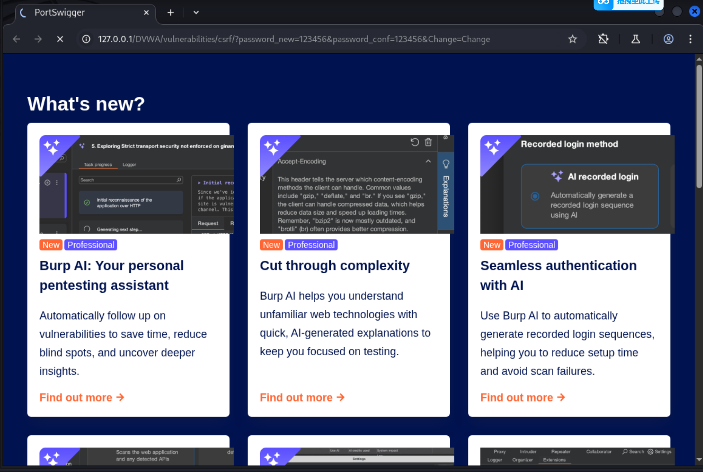

然后修改Referer字段为当前服务器的域名`http://127.0.0.1/DVWA/vulnerabilities/csrf/`，如下图：

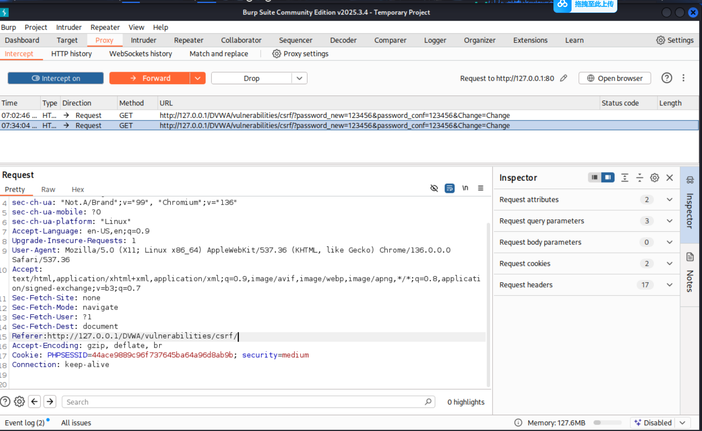

然后发送请求，回到浏览器界面，就会发现密码已经被修改为123456了：

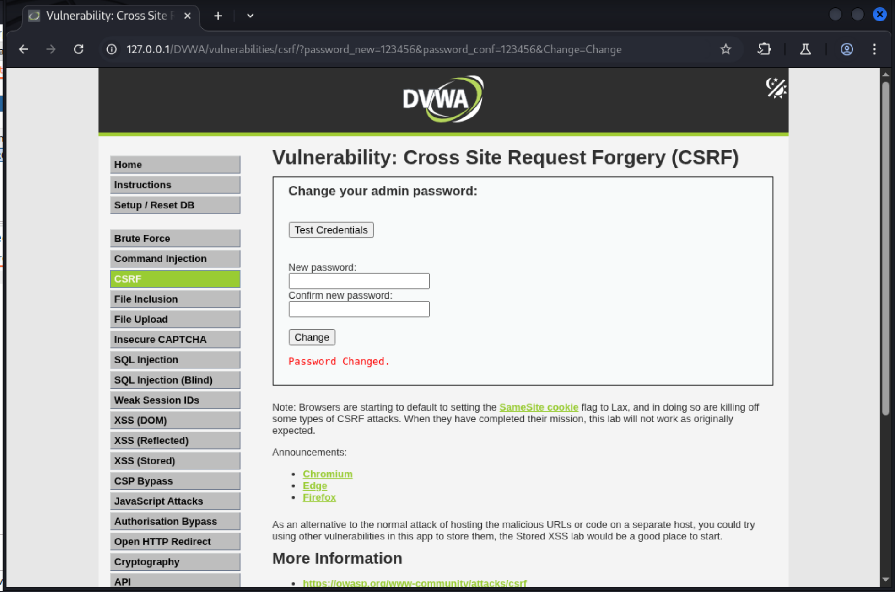

所以只要能修改请求头中的Referer字段，就可以绕过检查，从而成功修改密码，但是实际上，攻击者是无法修改请求头中的Referer字段的，因为浏览器会自动添加Referer字段，攻击者无法修改，除非攻击者能**实时监听你的请求流量，然后篡改Referer字段**，但是这种方法太过于复杂，不容易实现，再次就是如果该网站有XSS漏洞，攻击者可以**直接利用XSS漏洞**，从而注入一些修改Referer字段的js代码，从而实现绕过检查，修改密码。

### DVWA中的CSRF high 级别

**源码**：
```php
<?php
//①处，定义change变量为false，request_type变量为"html"，return_message变量为"Request Failed"
$change = false;
$request_type = "html";
$return_message = "Request Failed";

//②处，$_SERVER['REQUEST_METHOD'] == "POST"：确保是 POST 请求；
//$_SERVER['CONTENT_TYPE'] == "application/json"：确保请求体是 JSON 格式；
//即是否满足为JSON格式的POST请求
if ($_SERVER['REQUEST_METHOD'] == "POST" && array_key_exists ("CONTENT_TYPE", $_SERVER) && $_SERVER['CONTENT_TYPE'] == "application/json") {
    //③处，读取POST请求体中的JSON数据，并解析为json数组；
    $data = json_decode(file_get_contents('php://input'), true);
    $request_type = "json";
    //④处，检查是否存在user_token、password_new、password_conf、Change四个参数，并赋予新的变量
    if (array_key_exists("HTTP_USER_TOKEN", $_SERVER) &&
        array_key_exists("password_new", $data) &&
        array_key_exists("password_conf", $data) &&
        array_key_exists("Change", $data)) {
        $token = $_SERVER['HTTP_USER_TOKEN'];
        $pass_new = $data["password_new"];
        $pass_conf = $data["password_conf"];
        $change = true;
    }
} else {
    //⑤处，如果不是POST请求(如普通表单请求GET/POST)，则检查是否存在user_token、password_new、password_conf、Change四个参数，并赋予新的变量
    if (array_key_exists("user_token", $_REQUEST) &&
        array_key_exists("password_new", $_REQUEST) &&
        array_key_exists("password_conf", $_REQUEST) &&
        array_key_exists("Change", $_REQUEST)) {
        $token = $_REQUEST["user_token"];
        $pass_new = $_REQUEST["password_new"];
        $pass_conf = $_REQUEST["password_conf"];
        $change = true;
    }
}

if ($change) {
    // Check Anti-CSRF token
    //⑥处，调用checkToken()函数，检查user_token是否正确，如果正确，则继续执行；否则返回Request Failed；
    checkToken( $token, $_SESSION[ 'session_token' ], 'index.php' );

    // Do the passwords match?
    //⑦处，同low级别，直接对比参数值是否相等？
    if( $pass_new == $pass_conf ) {
        // They do!
        $pass_new = mysqli_real_escape_string ($GLOBALS["___mysqli_ston"], $pass_new);
        $pass_new = md5( $pass_new );

        // Update the database
        //⑧处，同low级别，dvwaCurrentUser()函数通过绘画中的(Session/Cookie)获取当前用户
        $current_user = dvwaCurrentUser();
        $insert = "UPDATE `users` SET password = '" . $pass_new . "' WHERE user = '" . $current_user . "';";
        $result = mysqli_query($GLOBALS["___mysqli_ston"],  $insert );

        // Feedback for the user
        $return_message = "Password Changed.";
    }
    else {
        // Issue with passwords matching
        $return_message = "Passwords did not match.";
    }

    mysqli_close($GLOBALS["___mysqli_ston"]);

    if ($request_type == "json") {
        //⑨处，生成新的session_token，并返回json格式的数据，其中Message字段为$return_message
        generateSessionToken();
        header ("Content-Type: application/json");
        print json_encode (array("Message" =>$return_message));
        exit;
    } else {
        echo "<pre>" . $return_message . "</pre>";
    }
}

// Generate Anti-CSRF token
generateSessionToken();

?>
```

>prompt:POST /vulnerabilities/csrf/ HTTP/1.1
>Host: dvwa.test
>Content-Length: 51
>Content-Type: application/json
>Cookie: PHPSESSID=0hr9ikmo07thlcvjv3u3pkfeni; security=high
>user-token: 026d0caed93471b507ed460ebddbd096

>{"password_new":"a","password_conf":"a","Change":1}

**原理说明**:
*high级别，增加了对POST请求体的检查，确保请求体是JSON格式或者是传统表单提交的GET/POST等形式的HTTP请求，并增加了对user_token的检查，增加了对csrf防护，增加了对json格式的返回数据。*

- ①处，定义change变量为false，request_type变量为"html"，return_message变量为"Request Failed",后续根据其值进行操作
- ②处，$_SERVER['REQUEST_METHOD'] == "POST"：确保是 POST 请求；$_SERVER['CONTENT_TYPE'] == "application/json"：确保请求体是 JSON 格式；即是否满足为JSON格式的POST请求
- ③处，读取POST请求体中的JSON数据，并解析为json数组；
- ④处，检查是否存在user_token、password_new、password_conf、Change四个参数，并赋予新的变量
- ⑤处，如果不是POST请求(如普通表单请求GET/POST)，则检查是否存在user_token、password_new、password_conf、Change四个参数，并赋予新的变量
- ⑥处，调用checkToken()函数，检查user_token是否正确，如果正确，则继续执行；否则返回Request Failed；
- ⑦处，同low级别，直接对比参数值是否相等？
- ⑧处，同low级别，dvwaCurrentUser()函数通过绘画中的(Session/Cookie)获取当前用户
- ⑨处，生成新的session_token，并返回json格式的数据，其中Message字段为$return_message    
- 最后返回不同的结果

**补充说明**：
1. token是一个服务端随机生成的字符串或者数字等等，除了基础的cookie等可以用来当作凭据，token也可以用来防止csrf攻击，其原理是在之前的响应页面中放入token，任意位置都可以放入，所以随机性更强，身份性也更具有代表，一个页面值能对应一个token，对应一个用户，所以除了攻击者能够获取到token，其他人是无法获取到token的，所以攻击者也无法伪装成其他用户发送请求，以下是DVWA中csrf的token：
  - 在浏览器中检查页面代码
  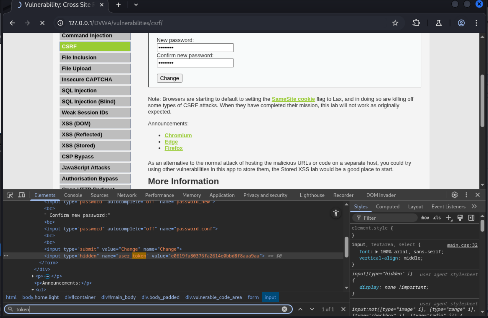

  - 下一次发送修改密码的请求，在抓包工具中查看：
  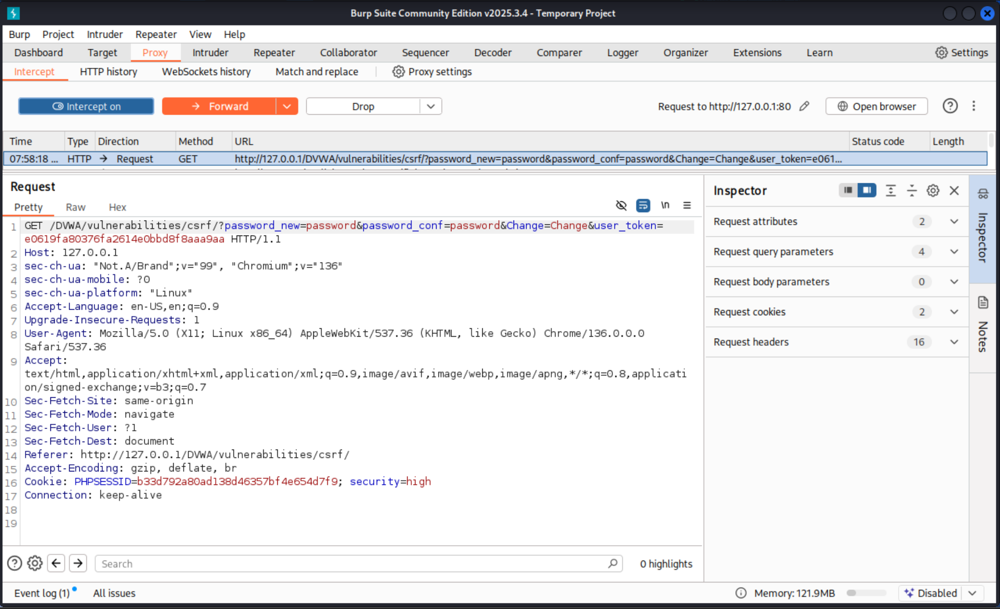

  - 可以看到页面中的token被携带到了请求头中，用以后端的校验
2. 关于为什么要分别校验JSON形式的POST请求，还是表单提交的产生的GET/POST请求，是为了提高兼容性，前者为现代接口而生，很多网页传输数据都是通过AJAX等方式，需要JSON格式的数据，支持复杂的数据结构，且异步不刷新页面/而后者则为传统的表单提交，虽然无需JS处理，纯html表单就可以提交，兼容性极强，但只能键值对格式的数据传输，而且不能使用JSON那种嵌套的数据结构，还需要刷新页面。为此，后端进行了不同场景的校验


**payload展示**：

直接用burp suite抓包，然后修改请求头中的数据，带上token，然后发送，如下图：
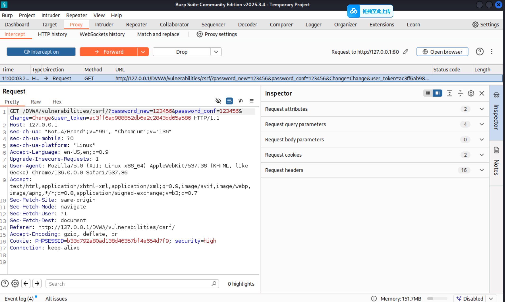

可以看见当发送请求的时候，浏览器会自动带上页面中的token，然后放在GET请求参数中，所以一旦攻击者拿到你的token，他就可以按照上述格式构造新的请求，使用你的token，进而实现CSRF攻击，同medium级别中检查Referer一样，攻击者除非能拿到你页面中的token，否则是无法伪用你的凭证发送请求的。*读者可以尝试着构造请求，然后在浏览器中查看结果*，一下构造携带JSON格式的POST请求，带上token，修改密码，如下：

首先，获取页面中的token和cookie：
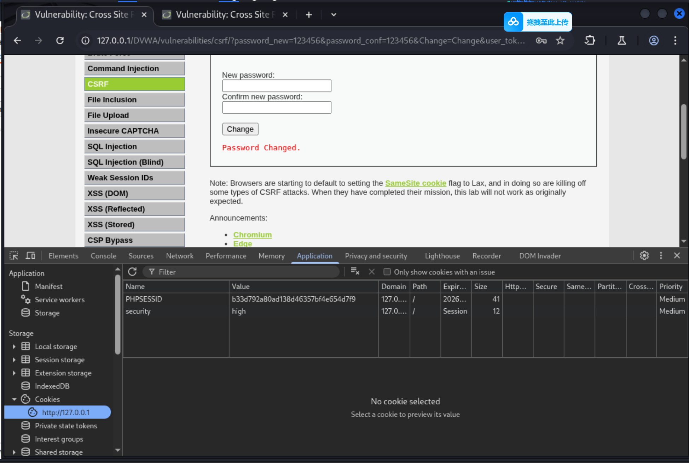
然后，构造请求，带上token和cookie：
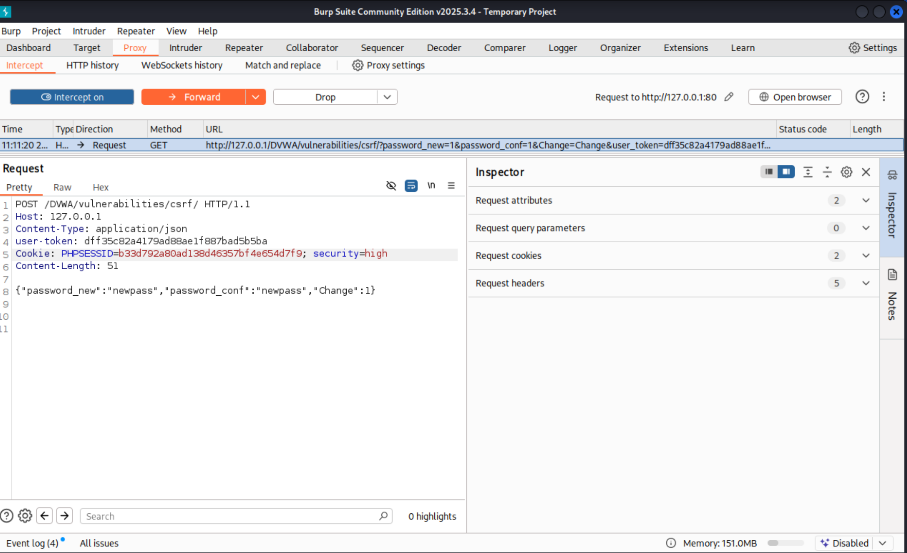

发送请求，返回结果如下图：
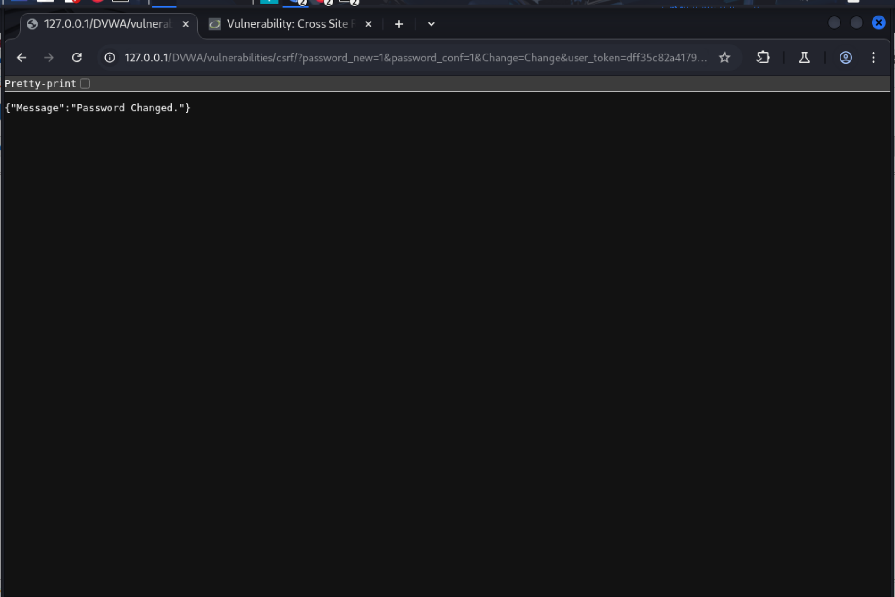
显示密码已经被修改了，说明构造的请求没问题，主要就是Cookie和token的获取和校验。

最后，测试使用新密码`newpass`登录，显示成功登录，如下图：
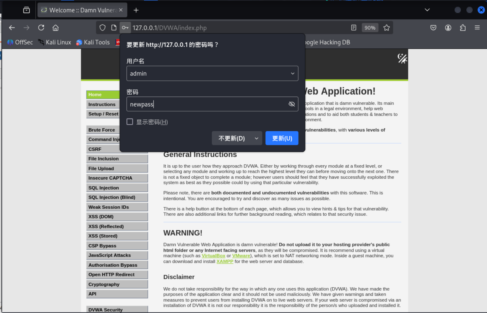


**补充**：
*传统表单提交的GET/POST请求和JSON格式的POST请求的区别以及如何构造*：
| 特性          | 传统表单                                      | JSON 请求                                      |
|---------------|-----------------------------------------------|------------------------------------------------|
| Content-Type  | `application/x-www-form-urlencoded`           | `application/json`                             |
| 数据格式      | `key=value&key=value`（URL 编码）             | 结构化 JSON 对象                               |
| Token 传递    | 通常放在表单字段（如 `user_token`）           | 可放在自定义请求头（如 `user-token`）          |
| 后端解析方式  | PHP 中通过 `$_POST` 获取                      | 需从 `php://input` 读取并 `json_decode`        |

### DVWA中的CSRF Impossible 级别

**源码**：
```php
<?php

if( isset( $_GET[ 'Change' ] ) ) {
    // Check Anti-CSRF token
    //①处，首先检查anti-csrf token是否与session_token一致
    checkToken( $_REQUEST[ 'user_token' ], $_SESSION[ 'session_token' ], 'index.php' );

    // Get input
    //②处，获取当前密码，新密码，确认密码
    $pass_curr = $_GET[ 'password_current' ];
    $pass_new  = $_GET[ 'password_new' ];
    $pass_conf = $_GET[ 'password_conf' ];

    // Sanitise current password input
    //③处，对当前密码进行字符转义等处理，防止SQL注入
    $pass_curr = stripslashes( $pass_curr );
    $pass_curr = ((isset($GLOBALS["___mysqli_ston"]) && is_object($GLOBALS["___mysqli_ston"])) ? mysqli_real_escape_string($GLOBALS["___mysqli_ston"],  $pass_curr ) : ((trigger_error("[MySQLConverterToo] Fix the mysql_escape_string() call! This code does not work.", E_USER_ERROR)) ? "" : ""));
    $pass_curr = md5( $pass_curr );

    // Check that the current password is correct
    //④处，对当前密码进行查询并对比，是否与数据库中的密码一致？
    $data = $db->prepare( 'SELECT password FROM users WHERE user = (:user) AND password = (:password) LIMIT 1;' );
    $current_user = dvwaCurrentUser();
    $data->bindParam( ':user', $current_user, PDO::PARAM_STR );
    $data->bindParam( ':password', $pass_curr, PDO::PARAM_STR );
    $data->execute();

    // Do both new passwords match and does the current password match the user?
    //⑤处，对新密码进行确认，并且还要数据库中的当前密码能够匹配
    if( ( $pass_new == $pass_conf ) && ( $data->rowCount() == 1 ) ) {
        // It does!
        //⑥处，与其他级别类似，转义等处理+更新数据库中的密码
        $pass_new = stripslashes( $pass_new );
        $pass_new = ((isset($GLOBALS["___mysqli_ston"]) && is_object($GLOBALS["___mysqli_ston"])) ? mysqli_real_escape_string($GLOBALS["___mysqli_ston"],  $pass_new ) : ((trigger_error("[MySQLConverterToo] Fix the mysql_escape_string() call! This code does not work.", E_USER_ERROR)) ? "" : ""));
        $pass_new = md5( $pass_new );

        // Update database with new password
        $data = $db->prepare( 'UPDATE users SET password = (:password) WHERE user = (:user);' );
        $data->bindParam( ':password', $pass_new, PDO::PARAM_STR );
        $current_user = dvwaCurrentUser();
        $data->bindParam( ':user', $current_user, PDO::PARAM_STR );
        $data->execute();

        // Feedback for the user
        echo "<pre>Password Changed.</pre>";
    }
    else {
        // Issue with passwords matching
        echo "<pre>Passwords did not match or current password incorrect.</pre>";
    }
}

// Generate Anti-CSRF token
//⑦处，生成新的session_token，用于下一次请求的校验
generateSessionToken();

?>
```

*prompt:At this level, the site requires the user to give their current password as well as the new password. As the attacker does not know this, the site is protected against CSRF style attacks.*

**原理说明**：
*impossible级别，相对于high级别的token，增加了对当前密码的校验，整体上token+密码验证就能够防御CSRF攻击，倘若长时间的红队渗透或者其他更严重的漏洞任然会对web造成危害，但已经超出了CSRF的讨论范畴。*

- ①处，首先检查anti-csrf token是否与session_token一致，如果不一致，则返回Request Failed；
- ②处，获取当前密码，新密码，确认密码；
- ③处，对当前密码进行字符转义等处理，防止SQL注入；
- ④处，对当前密码进行查询并对比，是否与数据库中的密码一致？如果一致，则继续执行；否则返回Request Failed；
- ⑤处，对新密码进行确认，并且还要数据库中的当前密码能够匹配；
- ⑥处，与其他级别类似，转义等处理+更新数据库中的密码；
- ⑦处，生成新的session_token，用于下一次请求的校验；

## 总结和推荐防御措施

| 等级 | 核心防御机制 | 绕过方法 |
|------|--------------|----------|
| Low | 无任何防护，直接接收GET请求修改密码。 | 构造恶意URL（如 `?password_new=123456&password_conf=123456&change=Change`），诱导用户点击即可修改密码。 |
| Medium | **Referer头检查**：验证请求来源页面是否包含服务器域名，若包含则放行，否则拒绝。 | 攻击者无法直接修改受害者的Referer，但若网站存在XSS漏洞，可注入脚本修改Referer；或将恶意页面托管在同域下。 |
| High | **Anti-CSRF Token**：服务器在页面中嵌入随机Token，请求时必须携带该Token，并与Session中的Token比对。支持传统表单（`user_token` 参数）和JSON API（`user-token` 头）两种方式。 | 攻击者需获取当前有效的Token才能绕过。若网站存在XSS漏洞，可通过脚本窃取页面中的Token；否则无法成功。 |
| Impossible | **Token + 当前密码验证**：在High级别基础上，增加对用户当前密码的校验。只有同时提供正确Token和正确当前密码，才能修改密码。 | 攻击者即使通过XSS窃取Token，也无法获知用户当前密码；若密码弱或通过社会工程学获取，仍可绕过，但攻击难度显著增加。 |

防御CSRF的核心是让服务器能够区分合法请求与伪造请求，常用方案如下：

1.  **Anti-CSRF Token（最可靠）**
    服务器生成随机Token嵌入页面，请求时验证。Token应随机、一次性（使用后刷新），可通过表单字段或自定义请求头传递。

2.  **SameSite Cookie属性（浏览器层防护）**
    设置Cookie的`SameSite`属性为`Lax`或`Strict`，限制跨站请求携带Cookie。现代浏览器默认启用，可防御大量CSRF攻击。

3.  **二次验证（敏感操作）**
    对修改密码、转账等高风险操作，要求用户输入当前密码、验证码等额外信息，即使Token泄露也无法绕过。

4.  **检查Referer/Origin（辅助防御）**
    验证请求来源是否可信域名，但不可单独依赖，可作为纵深防御的一环。


