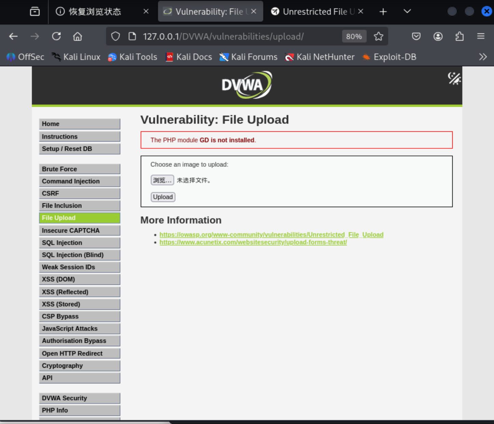
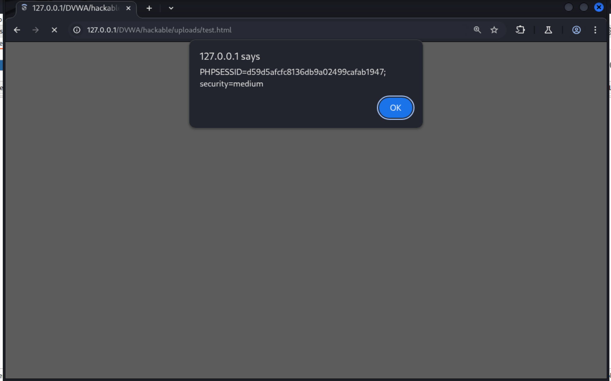

# File Upload

## 一、概述

### 描述
上传的文件会给应用程序带来极高的安全风险。绝大多数网络攻击的第一步，都是向目标系统植入恶意代码，随后攻击者只需找到让代码执行的方法即可。而文件上传功能，正是攻击者完成 “代码植入” 这第一步的绝佳途径。
无限制文件上传的危害多种多样，包括：服务器完全被接管、文件系统 / 数据库被撑满导致拒绝服务、向后端系统发起链式攻击、客户端侧攻击，或是简单的网站篡改。具体危害程度，完全取决于应用程序对上传文件的处理逻辑，尤其是文件的存储位置。
这类漏洞本质上分为两类核心问题：
1. 文件元数据问题：例如文件路径、文件名。这类数据通常由传输协议（如 HTTP 多部分编码）提供，攻击者可利用这些数据诱骗应用程序覆盖关键系统文件，或将文件存储在危险路径中。在使用这类元数据前，必须进行极其严格的校验。
2. 文件大小 / 内容问题：这类问题的影响范围，完全取决于文件的实际用途。下文的攻击示例会详细说明文件被滥用的常见场景。要防范此类攻击，必须全面梳理应用程序对文件的所有处理流程，并仔细评估涉及的各类处理逻辑与解释器。

### 风险因素
- 该漏洞的**影响程度极高**：若恶意代码可在服务器端或客户端执行，将造成严重危害；攻击者**发现并利用该漏洞的概率极高**，且该漏洞在实际场景中**普遍存在**，因此其**整体风险等级为高危**。
- 必须检查文件上传模块的访问控制策略，才能准确评估其风险。
- **服务器端攻击**：攻击者可通过上传并执行Webshell攻陷Web服务器，利用Webshell执行系统命令、浏览系统文件、访问本地资源、攻击其他服务器，或利用本地漏洞进行进一步渗透等。
- **客户端攻击**：上传恶意文件会使网站面临客户端攻击风险，如跨站脚本（XSS）、跨站内容劫持（Cross-site Content Hijacking）等。
- 当应用程序的其他脆弱模块需要访问同一服务器或可信服务器上的文件时，上传的恶意文件可被利用来渗透这些模块，再次引发客户端或服务器端攻击。
- 上传的文件可能触发客户端存在漏洞的库/应用程序（如iPhone MobileSafari浏览器的LibTIFF缓冲区溢出漏洞）。
- 上传的文件可能触发服务器端存在漏洞的库/应用程序（如引发“ImageTragick”漏洞的ImageMagick组件缺陷）。
- 上传的文件可能触发存在漏洞的实时监控工具（如通过解压RAR文件利用赛门铁克杀毒软件的漏洞）。
- 攻击者可将Unix Shell脚本、Windows病毒、含危险公式的Excel文件、反向Shell等恶意文件上传至服务器，等待管理员或网站维护人员后续操作时，在受害者主机上执行恶意代码。
- 攻击者可在网站中植入钓鱼页面，或直接篡改网站内容（网站挂马/篡改）。
- 文件存储服务器可能被滥用来托管恶意软件、盗版软件、色情内容等违规文件；上传的文件也可能包含恶意软件的命令与控制数据、暴力骚扰信息，或犯罪组织使用的隐写数据。
- 上传的敏感文件可能被未授权人员非法访问，造成信息泄露。
- 文件上传功能的错误提示信息可能泄露服务器内部路径等关键敏感信息。  

---

## 二、DVWA中的File Upload漏洞

初始界面：

### DVWA中的File Upload low 级别

**源码**：
```php
<?php
//①处，获取POST方法中的Upload是否有参数提交
if( isset( $_POST[ 'Upload' ] ) ) {
    // Where are we going to be writing to?
    //②处，文件放入的父路径
    $target_path  = DVWA_WEB_PAGE_TO_ROOT . "hackable/uploads/";

    //③处，讲表单提交的文件名添加到$target_path中，构成新的待放入的路径
    $target_path .= basename( $_FILES[ 'uploaded' ][ 'name' ] );

    // Can we move the file to the upload folder?
    //④处，move_uploaded_file()函数将上传的文件移动到$target_path中，没有做任何的校验
    if( !move_uploaded_file( $_FILES[ 'uploaded' ][ 'tmp_name' ], $target_path ) ) {
        // No
        //⑤处，移动失败返回错误信息
        echo '<pre>Your image was not uploaded.</pre>';
    }
    else {
        // Yes!
        //⑥处，移动成功返回成功信息
        echo "<pre>{$target_path} succesfully uploaded!</pre>";
    }
}

?>
```
*prompt:Low level will not check the contents of the file being uploaded in any way. It relies only on trust.*
**源码分析**：
low级别，直接拼接上传文件名到目的目录下，然后没有经过任何过滤或者校验，直接调用move_uploaded_file()函数将上传的文件移动到$target_path中，攻击者可以传入任何恶意文件如PHP WEBSHELL,从而在服务器上执行任意代码。
- ①处，获取POST方法中的Upload是否有参数提交
- ②处，文件待放入的父路径固定目录
- ③处，讲表单提交的文件名添加到$target_path中，构成新的待放入的路径
- ④处，move_uploaded_file()函数将上传的文件移动到$target_path中，没有做任何的校验
- ⑤处，移动失败返回错误信息 

此处我们随便上传一张图片，可以在服务器对应文件夹中看到，并且可以随意访问。

所以我们根据上述漏洞，可以构造一下payload

1. 上传一个php webshell(一句话木马)的php文件(由于一点没过滤且可以访问)，文件内容如下
```php
//获取GET请求中的cmd参数，然后命令执行该参数
<?php system($_GET['cmd']); ?>

```
2. 上传后门程序，上传加密或混淆的恶意脚本，用于持久化控制、反弹 shell、下载木马等。
3. 如果上传的文件在服务器上以 HTML 形式被访问（如 .html 或 .svg 文件），且未做过滤，可注入 JavaScript 代码，诱骗其他用户点击触发 XSS，如：
```html
//上传一个.html文件，被访问时输出用户的cookie弹窗
<p>THere is a severe File Upload vulnerability</p>
<script>alert(document.cookie)</script>
```
4. 上传恶意文件进行钓鱼或社会工程，上传看似正常的文件（如 .exe 或带有宏的 Office 文档），诱导其他用户下载并执行，从而传播恶意软件。

5. 上传文件过大导致拒绝服务，上传超大文件耗尽磁盘空间或带宽，影响服务可用性。

*由于文件上传的扩展很多方向，也有很多变种，一旦有上传漏洞上传的文件可以千变万化，相应的危害也十分巨大*

此处简单演示1和3的payload:

示例1：
1. 首先编写一个文件如下

2. 然后上传

3. 随即访问路径，然后GET中请求参数中的?cmd=id,既可看到当前用户的uid,gid等信息，当然其他命令也是可以被执行的


示例2：
1. 首先编写一个html文件，内容如下：

2. 然后上传

3. 随即访问路径，然后在弹窗中即可看到用户的cookie信息


### DVWA中的File Upload medium 级别

**源码**：
```php
<?php
//①处，同low级别，获取是否有Upload参数
if( isset( $_POST[ 'Upload' ] ) ) {
    // Where are we going to be writing to?
    //②处，同low级别，定义待放入的父文件夹+添加文件名
    $target_path  = DVWA_WEB_PAGE_TO_ROOT . "hackable/uploads/";
    $target_path .= basename( $_FILES[ 'uploaded' ][ 'name' ] );

    // File information
    //③处，获取文件的上传信息，在http请求中的Content-Disposition、Content-Type等字段
    $uploaded_name = $_FILES[ 'uploaded' ][ 'name' ];
    $uploaded_type = $_FILES[ 'uploaded' ][ 'type' ];
    $uploaded_size = $_FILES[ 'uploaded' ][ 'size' ];

    // Is it an image?
    //④处，判断文件的类型和大小，如果不是图片或者超过大小，就返回报错
    if( ( $uploaded_type == "image/jpeg" || $uploaded_type == "image/png" ) &&
        ( $uploaded_size < 100000 ) ) {

        // Can we move the file to the upload folder?
        //⑤处，同low级别，将移动文件到目标文件中
        if( !move_uploaded_file( $_FILES[ 'uploaded' ][ 'tmp_name' ], $target_path ) ) {
            // No
            echo '<pre>Your image was not uploaded.</pre>';
        }
        else {
            // Yes!
            echo "<pre>{$target_path} succesfully uploaded!</pre>";
        }
    }
    else {
        // Invalid file
        //⑥处，不符合条件输出错误信息
        echo '<pre>Your image was not uploaded. We can only accept JPEG or PNG images.</pre>';
    }
}

?>
```

*prompt：When using the medium level, it will check the reported file type from the client when its being uploaded.*

**原理说明**：
medium级别，在low级别的基础上，**增加了对MIME类型的检查和大小限制**，但存在明显缺陷：
1. MIME类型的值来自浏览器发送的Content-Type字段，可以被攻击者随意伪造
2. 后端仍使用用户提供的原始文件名（basename）。攻击者可将恶意文件命名为 shell.php.jpg（双重扩展名），虽然 MIME 类型被改为 image/jpeg，但服务器可能仍会以 .jpg 后缀保存
3. 文件内容未检查:代码未对文件内容进行任何校验（例如使用 getimagesize() 检查是否为真实图片）。即使攻击者上传一个包含 PHP 代码的图片（图片马），只要文件头伪装成 PNG/JPEG，仍可通过检查。
4. 大小的限制对于图片木马或者小型的WEBSHELL(如一句话木马)足够。

- ①处，同low级别，获取是否有Upload参数
- ②处，同low级别，定义待放入的父文件夹+添加文件名
- ③处，获取文件的上传信息，在http请求中的Content-Disposition、Content-Type等字段
- ④处，判断文件的类型和大小，如果不是图片或者超过大小，就返回报错
- ⑤处，同low级别，将移动文件到目标文件中
- ⑥处，不符合条件输出错误信息

**payload展示**：
我们仍然可以上传low级别的脚本文件，然后用burpsuite抓包，修改Content-Type字段，将其改为image/jpeg，再上传，即可触发medium级别的漏洞。
1. 选择low级别中的php脚本文件，然后上传用burpsuite抓包，修改Content-Type字段为image/jpeg，然后上传

2. 然后返回浏览器，随机访问路径

3. 最后触发上传文件，并返回用户的cookie警告弹窗


### DVWA中的File Upload high 级别

**源码**：
```php
<?php
//①处，同medium，是否有Upload表单提交
if( isset( $_POST[ 'Upload' ] ) ) {
    // Where are we going to be writing to?
    //②处，同medium，定义待放入的父文件夹+添加文件名
    $target_path  = DVWA_WEB_PAGE_TO_ROOT . "hackable/uploads/";
    $target_path .= basename( $_FILES[ 'uploaded' ][ 'name' ] );

    // File information
    //③处，同medium，但获取了上传文件的基础信息+增加了substr( $uploaded_name, strrpos( $uploaded_name, '.' ) + 1)扩展名/strrpos 取最后一个点后的扩展名,可绕过
    $uploaded_name = $_FILES[ 'uploaded' ][ 'name' ];
    $uploaded_ext  = substr( $uploaded_name, strrpos( $uploaded_name, '.' ) + 1);
    $uploaded_size = $_FILES[ 'uploaded' ][ 'size' ];
    $uploaded_tmp  = $_FILES[ 'uploaded' ][ 'tmp_name' ];

    // Is it an image?
    //④处，同medium，白名单校验，必须是.png、.jpg、.jpeg，且大小小于100kb的文件
    //⑤处，增加了getimagesize()函数，用于校验文件内容是否为图片
    if( ( strtolower( $uploaded_ext ) == "jpg" || strtolower( $uploaded_ext ) == "jpeg" || strtolower( $uploaded_ext ) == "png" ) &&
        ( $uploaded_size < 100000 ) &&
        getimagesize( $uploaded_tmp ) ) {

        // Can we move the file to the upload folder?
        if( !move_uploaded_file( $uploaded_tmp, $target_path ) ) {
            // No
            echo '<pre>Your image was not uploaded.</pre>';
        }
        else {
            // Yes!
            echo "<pre>{$target_path} succesfully uploaded!</pre>";
        }
    }
    else {
        // Invalid file
        echo '<pre>Your image was not uploaded. We can only accept JPEG or PNG images.</pre>';
    }
}

?>
```

*prompt：Once the file has been received from the client, the server will try to resize any image that was included in the request.Spoiler: need to link in another vulnerability, such as file inclusion.*

**原理说明**：
high级别在medium级别的基础上，去除了依赖HTTP字段中的Content-Type字段判断是否执行代码，而增加了对文件头类型的检验，以及图片白名单过滤，但是攻击者仍然可以构造双重扩展名(.php.jpg)+图片木马(在图片中植入php代码)来绕过，但是，即使上传成功了文件，扩展名为.php.jpg，访问时不会被服务器当作php文件来执行，所以需要结合其他漏洞获取修改文件权限等等从而多漏洞组合实现File UPload。

- ①处，同medium，是否有Upload表单提交   
- ②处，同medium，定义待放入的父文件夹+添加文件名
- ③处，同medium，但获取了上传文件的基础信息+增加了substr( $uploaded_name, strrpos( $uploaded_name, '.' ) + 1)扩展名/strrpos 取最后一个点后的扩展名,可绕过
- ④处，同medium，白名单校验，必须是.png、.jpg、.jpeg，且大小小于100kb的文件
- ⑤处，增加了getimagesize()函数，用于校验文件内容是否为图片  
- ⑥处，同medium，不符合条件输出错误信息 

*注：由于DVWA中每一个漏洞类型只有相应的实现程度，所以在File Upload中，没有File Injection等其他漏洞，所以暂时是安全的*

### DVWA中File Upload Impossible 级别

**源码**:
```php
<?php
//同high级别，检查是否有POST表单提交
if( isset( $_POST[ 'Upload' ] ) ) {
    // Check Anti-CSRF token
    //①处，增加了对Token的检验，防止CSRF攻击
    checkToken( $_REQUEST[ 'user_token' ], $_SESSION[ 'session_token' ], 'index.php' );


    // File information
    //②处，同high级别，获取文件对应信息
    $uploaded_name = $_FILES[ 'uploaded' ][ 'name' ];
    $uploaded_ext  = substr( $uploaded_name, strrpos( $uploaded_name, '.' ) + 1);//获取扩展名
    $uploaded_size = $_FILES[ 'uploaded' ][ 'size' ];
    $uploaded_type = $_FILES[ 'uploaded' ][ 'type' ];
    $uploaded_tmp  = $_FILES[ 'uploaded' ][ 'tmp_name' ];

    // Where are we going to be writing to?
    //③处，同high级别，定义待放入的父文件夹+添加文件名
    $target_path   = DVWA_WEB_PAGE_TO_ROOT . 'hackable/uploads/';
    //$target_file   = basename( $uploaded_name, '.' . $uploaded_ext ) . '-';
    //④处，增加对文件名的重命名且唯一（去除路径遍历+覆盖风险），不直接使用用户上传的文件名
    $target_file   =  md5( uniqid() . $uploaded_name ) . '.' . $uploaded_ext;
    $temp_file     = ( ( ini_get( 'upload_tmp_dir' ) == '' ) ? ( sys_get_temp_dir() ) : ( ini_get( 'upload_tmp_dir' ) ) );//获取可用的临时文件夹(安全手术室)
    $temp_file    .= DIRECTORY_SEPARATOR . md5( uniqid() . $uploaded_name ) . '.' . $uploaded_ext;

    // Is it an image?
    //⑤处，检查是否是图片（文件扩展名+文件头类型），且大小小于100kb
    if( ( strtolower( $uploaded_ext ) == 'jpg' || strtolower( $uploaded_ext ) == 'jpeg' || strtolower( $uploaded_ext ) == 'png' ) &&
        ( $uploaded_size < 100000 ) &&
        ( $uploaded_type == 'image/jpeg' || $uploaded_type == 'image/png' ) &&
        getimagesize( $uploaded_tmp ) ) {

        // Strip any metadata, by re-encoding image (Note, using php-Imagick is recommended over php-GD)
        //⑥处，使用GD库，重新编码图片，并保存到临时文件中，去除文件中的元信息(如图片中带有一句话木马)，
        if( $uploaded_type == 'image/jpeg' ) {
            $img = imagecreatefromjpeg( $uploaded_tmp );//imagecreatefromjpeg()函数用于创建基于JPEG图像的Gd2图像资源,只读取像素，不读取文字等内容
            imagejpeg( $img, $temp_file, 100);//imagejpeg，将文件100%保存到临时文件中
        }
        else {
            $img = imagecreatefrompng( $uploaded_tmp );//同imagecreatefromjpeg()函数，只读取像素，不读取文字等内容
            imagepng( $img, $temp_file, 9);//同imagejpeg()函数，将文件90%(压缩)保存到临时文件中
        }
        imagedestroy( $img );//销毁临时处理文件

        // Can we move the file to the web root from the temp folder?
        //⑦处，尝试将处理过的完全图片的临时文件移动到web根目录的uploads文件夹中，并最后给出反馈
        if( rename( $temp_file, ( getcwd() . DIRECTORY_SEPARATOR . $target_path . $target_file ) ) ) {
            // Yes!
            echo "<pre><a href='{$target_path}{$target_file}'>{$target_file}</a> succesfully uploaded!</pre>";
        }
        else {
            // No
            echo '<pre>Your image was not uploaded.</pre>';
        }

        // Delete any temp files
        if( file_exists( $temp_file ) )
            unlink( $temp_file );
    }
    else {
        // Invalid file
        echo '<pre>Your image was not uploaded. We can only accept JPEG or PNG images.</pre>';
    }
}

// Generate Anti-CSRF token
//⑧处，生成新的Token，以便下次请求发送
generateSessionToken();

?>
```

*prompt：This will check everything from all the levels so far, as well then to re-encode the image. This will make a new image, therefore stripping any "non-image" code (including metadata).*


**原理说明**：
impossible级别，在high级别基础上，**增加了不使用用户上传的文件名防止了路径遍历+覆盖风险，同时增加了对文件名的重命名，并且使用安全隔离的临时文件去除了文件中的元信息(如图片中带有一句话木马)**，最后将处理过的完全图片的临时文件移动到web根目录的uploads文件夹中，彻底杜绝了上传恶意文件(恶意文件，双重扩展名+图片木马)的行为发生。

- ①处，增加了对Token的检验，防止CSRF攻击
- ②处，同high级别，获取文件对应信息
- ③处，同high级别，定义待放入的父文件夹+添加文件名
- ④处，增加对文件名的重命名且唯一（去除路径遍历+覆盖风险），不直接使用用户上传的文件名
- ⑤处，检查是否是图片（文件扩展名+文件头类型），且大小小于100kb
- ⑥处，使用GD库，重新编码图片，并保存到临时文件中，去除文件中的元信息(如图片中带有一句话木马)，
- ⑦处，尝试将处理过的完全图片的临时文件移动到web根目录的uploads文件夹中，并最后给出反馈
- ⑧处，生成新的Token，以便下次请求发送  

----

## 三、总结和防御措施

| 等级       | 核心防御机制                                                                                                                               | 绕过/利用方法                                                                                     | 关键启示                                                                                               |
| :--------- | :----------------------------------------------------------------------------------------------------------------------------------------- | :------------------------------------------------------------------------------------------------- | :----------------------------------------------------------------------------------------------------- |
| Low        | 无任何检查，直接移动上传文件到目标目录。                                                                                                   | 直接上传任意恶意文件（如 PHP WebShell、HTML 钓鱼页面等），即可在服务器端或客户端执行代码。         | 对用户上传的文件完全信任是文件上传漏洞的根本原因，必须进行严格验证。                                   |
| Medium     | 检查客户端传来的 MIME 类型（`image/jpeg`、`image/png`）和文件大小（<100KB）。                                                              | 使用 Burp Suite 等工具伪造 `Content-Type` 头，将恶意文件的 MIME 类型改为图片类型，绕过检查。       | 依赖客户端提供的文件类型信息不可靠，攻击者可轻易伪造。                                                 |
| High       | 1. 扩展名白名单（仅允许 `.jpg`、`.jpeg`、`.png`）。<br>2. `getimagesize()` 验证文件头是否为真实图像。<br>3. 文件大小限制。                    | 制作“图片马”（在合法图像末尾附加 PHP 代码），上传后需结合本地文件包含（LFI）等漏洞才能执行代码。   | 单一白名单无法防御图片马，但可阻止直接执行；必须与其他漏洞配合才能完全利用。                           |
| Impossible | 1. CSRF 令牌防护。<br>2. 扩展名白名单 + MIME 类型检查 + `getimagesize()`。<br>3. 图像重编码（使用 GD 库重新生成图像，丢弃所有非图像数据）。<br>4. 随机化文件名，避免路径遍历和覆盖。 | 无法绕过。任何恶意代码（包括图片马中的附加代码）都会在重编码过程中被彻底清除，最终保存的是纯净的图像文件。 | 纵深防御 + 内容重编码是防御文件上传的最强组合，从根本上消除了恶意内容。                                 |

### 常见防御手段（但往往不够）

- **MIME 类型检查**：仅依赖客户端 `Content-Type` 不可靠，应结合服务端验证。
- **扩展名黑名单**：如禁止 `.php`、`.asp` 等，但攻击者可利用双重扩展名（`.php.jpg`）或利用解析漏洞绕过。
- **文件头检查（如 `getimagesize()`）**：能确保文件头部符合图像格式，但无法检测尾部附加的恶意代码。
- **限制文件大小**：可防止拒绝服务，但无法阻止小体积的 WebShell 或图片马。

### 攻击者的常用思路

1.  **直接上传可执行脚本**：如 PHP、JSP、ASP 文件，若服务器未禁止执行，即可获得 WebShell。
2.  **伪造 MIME 类型**：将脚本文件的 `Content-Type` 改为图片类型，绕过简单的类型检查。
3.  **制作图片马**：在合法图像文件末尾插入 PHP 或 JavaScript 代码，利用服务器解析漏洞（如 Apache 的 `AddHandler`）或结合文件包含漏洞执行。
4.  **利用文件名欺骗**：使用双重扩展名（如 `shell.php.jpg`），若服务器仅检查最后一个扩展名，可能允许上传，再通过配置错误导致 `.jpg` 被当作 PHP 解析。
5.  **目录遍历**：在文件名中使用 `../` 等路径穿越符，将文件写入预期目录之外，可能覆盖关键文件。
6.  **结合其他漏洞**：如文件包含、XSS、反序列化等，形成复合攻击链。

### 最终防御：白名单 + 重编码 + 纵深防御

最根本的防御是**白名单 + 内容重编码**。对于图片上传，应：

- 使用白名单限制扩展名（仅允许 `jpg`、`png` 等）。
- 通过 `getimagesize()` 验证文件头是否为真实图像。
- 使用图像处理库（如 GD、ImageMagick）**重新编码图像**，丢弃所有非图像数据（包括元数据、附加代码）。
- 重命名文件为随机字符串，避免文件名被猜测或利用。
- 将上传目录配置为**禁止脚本执行**（如通过 `.htaccess` 或 Nginx 配置）。
- 添加 CSRF 令牌，防止攻击者诱导用户上传恶意文件。

**核心原则**：永远不要信任用户上传的文件内容，通过多层验证和彻底的内容重构，确保最终存储的文件是安全、纯净的数据。


