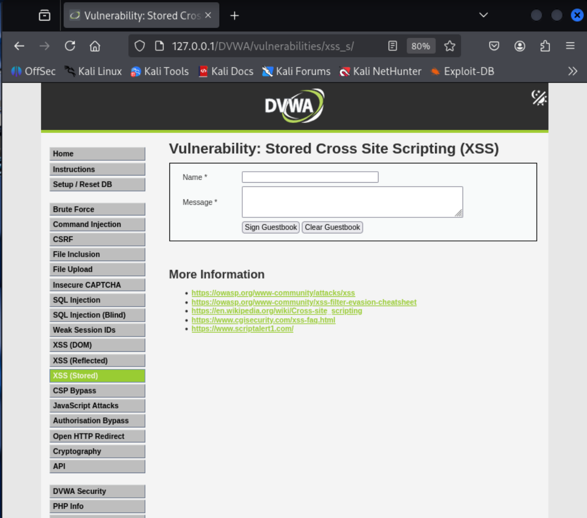
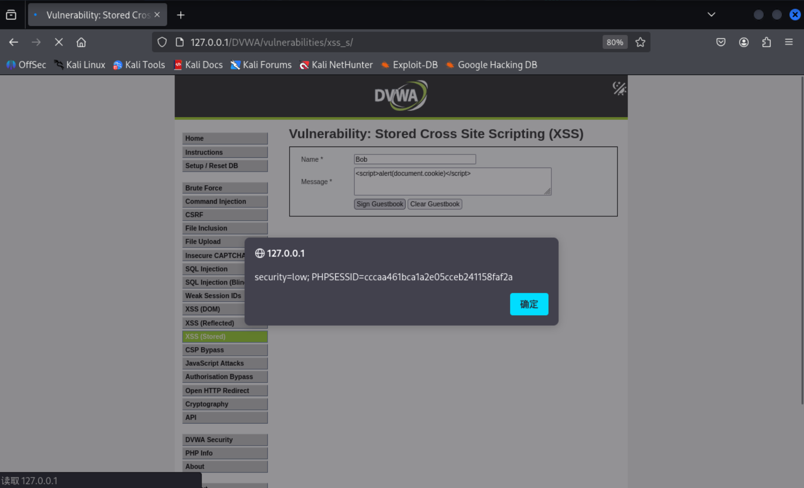
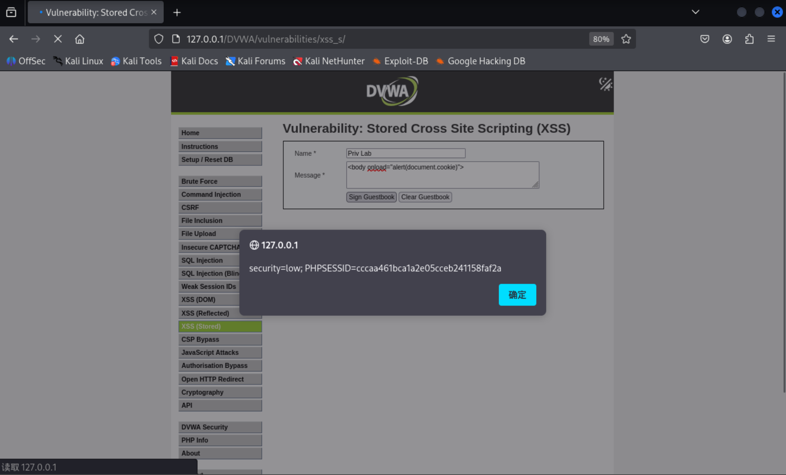
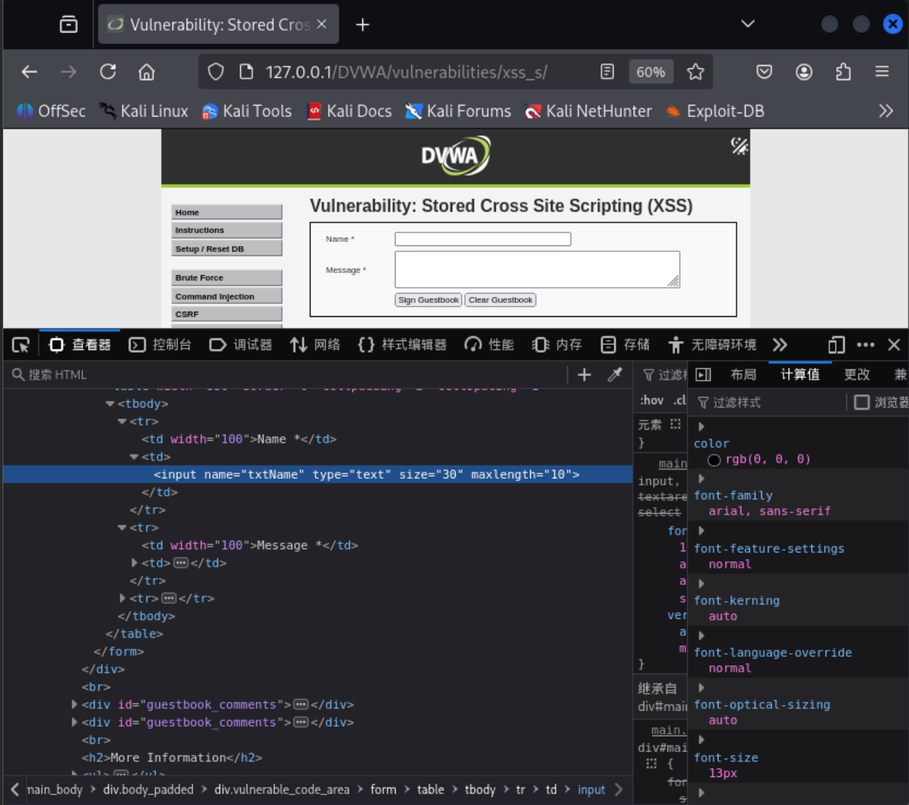
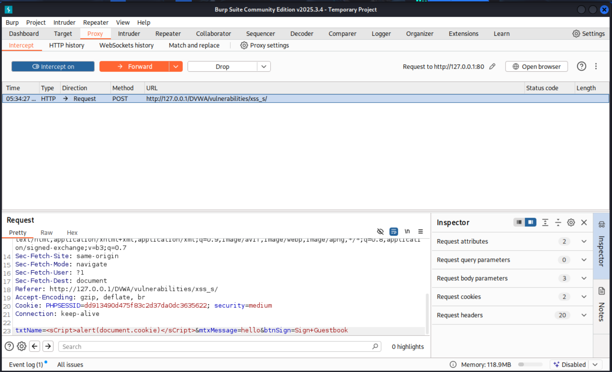
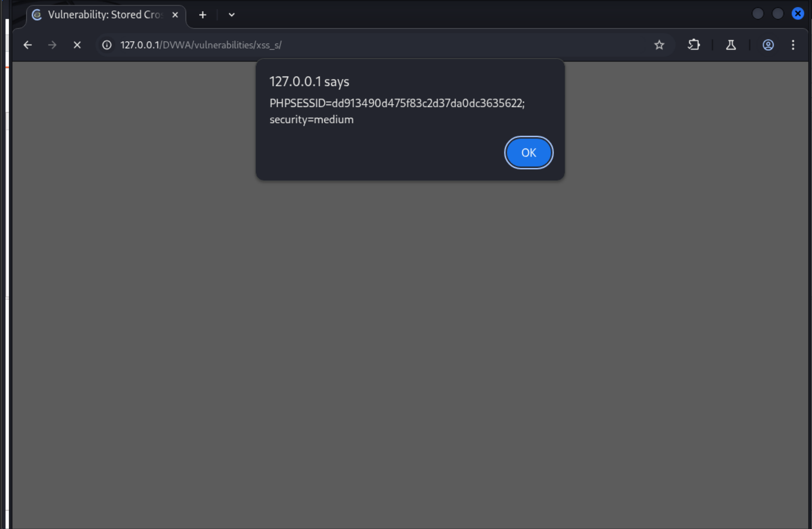
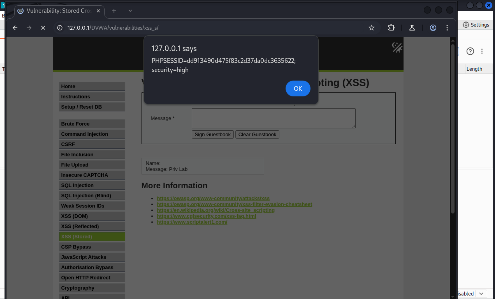

# XSS stored 

## 一、XSS(stored)类型简介

存储型XSS（Stored XSS）是一种常见的Web安全漏洞，**攻击者将恶意代码注入到Web应用程序中，并将其存储在服务器端。当其他用户访问这些页面时，嵌入的恶意代码会被执行，从而导致攻击**。

**攻击路径和危害**:

存储型XSS的攻击路径通常是：浏览器 -> 服务器 -> 存储介质 -> 服务器 -> 受害者浏览器。与反射型XSS不同，存储型XSS的攻击代码会被存储在数据库等存储介质中，因此攻击效果持久。

攻击者可以利用存储型XSS在**留言板、评论区**等位置注入恶意代码，**当用户访问这些页面时，恶意代码会在用户的浏览器中执行**（所以一旦注入，其他用户访问就可能加载对应的注入代码，最著名的就是2005年的Samy Kamkar 利用 MySpace 网站的 XSS 漏洞编写，有兴趣的读者可以自行搜索），可能导致以下危害：

- 窃取用户的Cookie信息

- 劫持用户会话

- 执行任意JavaScript代码

- 重定向用户到恶意网站

*由于前两篇文章已经介绍了反射型XSS和DOM型XSS，本章将不赘述XSS相关的基础只是，只复现DVWA中的XSS(stored)*

## 二、DVWA中的XSS(stored)

初始界面：


### XSS(stored) low 级别

**源码**：
```php
<?php
//判断是否提交表单，然后才进行操作
if( isset( $_POST[ 'btnSign' ] ) ) {
    // Get input
    //①处，获取'mtxMessage'和'txtName'的值的输入，并使用trim()函数去除两端的空格，清理输入
    $message = trim( $_POST[ 'mtxMessage' ] );
    $name    = trim( $_POST[ 'txtName' ] );

    // Sanitize message input
    //②处，使用stripslashes()函数去除反斜杠，使用mysql_real_escape_string()函数转义SQL语句中的特殊字符，以防止SQL注入攻击   
    $message = stripslashes( $message );
    $message = ((isset($GLOBALS["___mysqli_ston"]) && is_object($GLOBALS["___mysqli_ston"])) ? mysqli_real_escape_string($GLOBALS["___mysqli_ston"],  $message ) : ((trigger_error("[MySQLConverterToo] Fix the mysql_escape_string() call! This code does not work.", E_USER_ERROR)) ? "" : ""));
    // Sanitize name input
    //③处，与massege类似预处理
    $name = ((isset($GLOBALS["___mysqli_ston"]) && is_object($GLOBALS["___mysqli_ston"])) ? mysqli_real_escape_string($GLOBALS["___mysqli_ston"],  $name ) : ((trigger_error("[MySQLConverterToo] Fix the mysql_escape_string() call! This code does not work.", E_USER_ERROR)) ? "" : ""));

    // Update database
    //④处，将"message"和"name"插入到数据库中
    $query  = "INSERT INTO guestbook ( comment, name ) VALUES ( '$message', '$name' );";
    //⑤处，执行查询并处理错误
    $result = mysqli_query($GLOBALS["___mysqli_ston"],  $query ) or die( '<pre>' . ((is_object($GLOBALS["___mysqli_ston"])) ? mysqli_error($GLOBALS["___mysqli_ston"]) : (($___mysqli_res = mysqli_connect_error()) ? $___mysqli_res : false)) . '</pre>' );

    //mysql_close();
}

?>
<html>
```

*prompt：Low level will not check the requested input, before including it to be used in the output tex*

**原理分析**：
- ①处，获取'mtxMessage'和'txtName'的值的输入，并使用trim()函数去除两端的空格，清理输入。

- ②处stripslashes()：移除字符串中的反斜杠 \。在旧版 PHP 或开启了magic_quotes_gpc 的服务器上，
    ET/POST 数据中的引号会被自动加上反斜杠转义。stripslashes 用于恢复原始输入，避免后续转义时出现双重转义。

    mysqli_real_escape_string()：对字符串中的特殊字符进行转义，使其可以安全地用于 SQL 语句。它会转义：
    '（单引号） → \'
    "（双引号） → \"
    \（反斜杠） → \\
    其他控制字符（如 \n、\r、\x00、\x1a 等）
    此步骤一是为了规范输出，二是为了防止SQL注入，但是是通过mysqli_real_escape_string()函数来实现的，通过之前的SQL注入篇可知最佳防止注入方式是使用预处理语句，而不是黑名单过滤转义等操作。

- ③处，与massege类似预处理name的输入。

- ④处，将经过 SQL 转义后的 $message 和 $name 拼接进 SQL 语句。
    由于已经转义，单引号不会破坏 SQL 语法，因此 SQL 注入被成功防御。
    
- ⑤处，执行插入操作，如果失败则输出详细的数据库错误信息，错误信息可能包含敏感性息（如表名，字段名），但非本章关注核心

**可能的payload展示**：

1. 基于HTML标签的直接注入
    直接在留言内容或用户名中插入可执行脚本的HTML标签，浏览器解析时会执行：
    - **`<script>`标签**：直接插入`<script>alert('XSS')</script>`。
    - **``标签事件**：利用`onerror`事件，例如``。
    - **`<svg>`标签事件**：`<svg onload=alert(1)>`。
    - **`<body>`标签事件**：`<body onload=alert(1)>`。
    - **`<iframe>`标签**：`<iframe src="javascript:alert(1)"></iframe>` 或 `<iframe srcdoc="<script>alert(1)</script>"></iframe>`。
    - **`<input>`标签事件+autofocus**：`<input onfocus=alert(1) autofocus>`。
    - **`<details>`标签事件**：`<details open ontoggle=alert(1)>`。
    - **`<video>`/`<audio>`标签事件**：`<video src=x onerror=alert(1)>`。

2. 基于HTML事件属性的注入
    利用任何HTML元素支持的事件属性，将JavaScript代码赋值给事件触发执行：
    - **通用事件处理器**：`<div onmouseover="alert(1)">hover</div>`、`<button onclick="alert(1)">click</button>`。
    - **自动触发的事件**：`<body onload="alert(1)">`、``。

3. 基于JavaScript伪协议的注入
    在支持URL的属性（如href、src、action）中使用`javascript:`协议（通常需用户交互）：
    - **`<a>`标签**：`<a href="javascript:alert(1)">click me</a>`。
    - **`<iframe>`标签**：`<iframe src="javascript:alert(1)"></iframe>`。
    - **`<form>`标签action属性**：`<form action="javascript:alert(1)"><input type="submit"></form>`。

4. 基于CSS的注入（仅旧版IE生效）
    利用CSS表达式`expression()`在IE旧版本中执行JavaScript：
    - **style属性中的expression**：`<div style="width: expression(alert(1));"></div>`。

5. 基于编码绕过的注入（补充知识）
    当存在简单过滤时，通过编码让payload不被匹配，浏览器解码后执行：
    - **HTML实体编码**：`&lt;script&gt;alert(1)&lt;/script&gt;`（输出在HTML上下文且被解码时生效）。
    - **URL编码**：`%3Cscript%3Ealert(1)%3C/script%3E`（用于属性值且浏览器自动解码时生效）。
    - **JavaScript Unicode转义**：`eval("\u0061\u006c\u0065\u0072\u0074(1)")`（适用于注入到JS字符串中）。
    - **Base64编码+data:协议**：`<iframe src="data:text/html;base64,PHNjcmlwdD5hbGVydCgxKTwvc2NyaXB0Pg=="></iframe>`。

6. 基于DOM操作的注入（提示）
    若前端通过`innerHTML`等方式动态写入页面数据，存储的payload会被二次触发：
    - **示例**：前端将评论内容通过`innerHTML`插入时，`` 同样生效。

*读者可以自行尝试以上Payload，并观察是否触发XSS漏洞，经过笔者尝试，最有可能的就是利用标签和属性注入的方式*

**部分payload结果展示**：

*由于前端对Name和Message都有字数限制，Message中可以提交更多字数，也更好注入，(但也可以通过抓包工具修改数据包，躲过前端的过滤，一般前端进行的过滤对防护来讲没什么作用。抓包发送示例可以在下文的medium级别中看到)提醒：本示例是通过表单POST方法提交，所以不能像之前一样直接修改URL中的参数(URL中也没有参数)*

- Name:Bob/Message:`<script>alert(document.cookie)</script>`



- Name:Priv Lab/Message:<body onload="alert(document.cookie)">



### XSS(stored) medium 级别

**源码**：
```php
<?php

if( isset( $_POST[ 'btnSign' ] ) ) {
    // Get input
    //①处，去除两端的空格，清理输入
    $message = trim( $_POST[ 'mtxMessage' ] );
    $name    = trim( $_POST[ 'txtName' ] );

    // Sanitize message input
    //②处，使用addslashes()函数对特定的字符(' " \等等)前添加反斜杠进行转义避免破坏语法结构，strip_tags()函数移除字符串中所有HTML和PHP标签，能有效阻止XSS注入
    $message = strip_tags( addslashes( $message ) );
    $message = ((isset($GLOBALS["___mysqli_ston"]) && is_object($GLOBALS["___mysqli_ston"])) ? mysqli_real_escape_string($GLOBALS["___mysqli_ston"],  $message ) : ((trigger_error("[MySQLConverterToo] Fix the mysql_escape_string() call! This code does not work.", E_USER_ERROR)) ? "" : ""));
    //③处，将特殊的字符转为HTML实体，进一步确保输出安全
    $message = htmlspecialchars( $message );

    // Sanitize name input
    //④处，将$name中的<script>删除，仅对小写的<script>标签进行删除，其他变体未处理
    $name = str_replace( '<script>', '', $name );
    $name = ((isset($GLOBALS["___mysqli_ston"]) && is_object($GLOBALS["___mysqli_ston"])) ? mysqli_real_escape_string($GLOBALS["___mysqli_ston"],  $name ) : ((trigger_error("[MySQLConverterToo] Fix the mysql_escape_string() call! This code does not work.", E_USER_ERROR)) ? "" : ""));

    // Update database
    //⑤处，将"message"和"name"插入到数据库中
    $query  = "INSERT INTO guestbook ( comment, name ) VALUES ( '$message', '$name' );";
    $result = mysqli_query($GLOBALS["___mysqli_ston"],  $query ) or die( '<pre>' . ((is_object($GLOBALS["___mysqli_ston"])) ? mysqli_error($GLOBALS["___mysqli_ston"]) : (($___mysqli_res = mysqli_connect_error()) ? $___mysqli_res : false)) . '</pre>' );

    //mysql_close();
}

?>
```

**原理分析**：
**相较于low级别对Message的输入有了XSS防御，但对name的输入，仅限于<script>标签，很容易绕过**

- ①处，去除两端的空格，清理输入。
- ②处，strip_tags()函数移除字符串中所有HTML和PHP标签，能有效阻止XSS注入。addslashes()函数在字符串中添加反斜杠转义特殊字符（如单引号、双引号、反斜杠和NULL），防止SQL注入攻击。
- ③处，htmlspecialchars()函数将特殊的字符转为HTML实体，进一步确保输出安全。
- ④处，将$name中的<script>删除，仅对小写的<script>标签进行删除，其他变体未处理。
- ⑤处，将经过 SQL 转义后的 $message 和 $name 拼接进 SQL 语句。

**name没有像message那样做过滤，所以我们还是能够通过name变量实现注入，但是由于前端对Message和name的输入限制，如下图，我们可以尝试用burp suite拦截并修改数据包，从而实现XSS注入**：



**payload展示**：

我们打开burp suite并进行抓包拦截，将数据包中的name的值改为
`<sCript>alert(document.cookie)</sCript>`，message任意，(这里提醒进行抓包拦截之前，需要填入任意数据才可以发送，否则会发送失败):



发送之后就可以看到注入并执行成功了：




### XSS(stored) high 级别

**源码**：
```php
<?php

if( isset( $_POST[ 'btnSign' ] ) ) {
    // Get input
    //①处，同样获取输入并去除两边的空格字符
    $message = trim( $_POST[ 'mtxMessage' ] );
    $name    = trim( $_POST[ 'txtName' ] );

    // Sanitize message input
    //②处，使用addslashes()函数对特定的字符(' " \等等)前添加反斜杠进行转义避免破坏语法结构，strip_tags()函数移除字符串中所有HTML和PHP标签，能一定程度上阻止XSS注入，但对用户原始输入有改动，不推荐
    $message = strip_tags( addslashes( $message ) );
    $message = ((isset($GLOBALS["___mysqli_ston"]) && is_object($GLOBALS["___mysqli_ston"])) ? mysqli_real_escape_string($GLOBALS["___mysqli_ston"],  $message ) : ((trigger_error("[MySQLConverterToo] Fix the mysql_escape_string() call! This code does not work.", E_USER_ERROR)) ? "" : ""));
    //③处，将特殊的字符转为HTML实体，进一步确保输出安全
    $message = htmlspecialchars( $message );

    // Sanitize name input
    //④处，对name的输入对<script>类似标签使用正则匹配过滤，不区分大小写
    $name = preg_replace( '/<(.*)s(.*)c(.*)r(.*)i(.*)p(.*)t/i', '', $name );
    $name = ((isset($GLOBALS["___mysqli_ston"]) && is_object($GLOBALS["___mysqli_ston"])) ? mysqli_real_escape_string($GLOBALS["___mysqli_ston"],  $name ) : ((trigger_error("[MySQLConverterToo] Fix the mysql_escape_string() call! This code does not work.", E_USER_ERROR)) ? "" : ""));

    // Update database
    //⑤处，将过滤后的"message"和"name"插入到数据库中
    $query  = "INSERT INTO guestbook ( comment, name ) VALUES ( '$message', '$name' );";
    $result = mysqli_query($GLOBALS["___mysqli_ston"],  $query ) or die( '<pre>' . ((is_object($GLOBALS["___mysqli_ston"])) ? mysqli_error($GLOBALS["___mysqli_ston"]) : (($___mysqli_res = mysqli_connect_error()) ? $___mysqli_res : false)) . '</pre>' );

    //mysql_close();
}

?>
```
*prompt:The developer believe they have disabled all script usage by removing the pattern "<s\*c\*r\*i\*p\*t".*

**原理说明**:
**相较于medium级别，对name的过滤更严格了，使用正则表达式匹配过滤了<script>标签的各种变体，但仍然存在绕过的可能性（如利用其他标签或属性[^HTML EVENT]实现注入）
- ①处，去除两端的空格，清理输入。
- ②处，strip_tags()函数移除字符串中所有HTML和PHP标签，能有效阻止XSS注入。addslashes()函数在字符串中添加反斜杠转义特殊字符（如单引号、双引号、反斜杠和NULL），防止SQL注入攻击。
- ③处，htmlspecialchars()函数将特殊的字符转为HTML实体，进一步确保输出安全。
- ④处，将$name中的的<script>标签使用正则匹配过滤，不区分大小写(仅对该标签过滤更加严格，但还是可以通过其他标签或属性完成注入)
- ⑤处，将经过 SQL 转义后的 $message 和 $name 拼接进 SQL 语句。

**payload展示**：

同样如medium级别中的burp suite抓包操作，将payload改为其他标签注入如``也可以达到注入目的，如下图：



### XSS(stored) impossible 级别

**源码**：
```php
<?php

if( isset( $_POST[ 'btnSign' ] ) ) {
    // Check Anti-CSRF token
    //①处，CSRF防御，调用checkToken验证请求中的user_token和session_token是否匹配
    checkToken( $_REQUEST[ 'user_token' ], $_SESSION[ 'session_token' ], 'index.php' );

    // Get input
    //②处，同样获取输入并去除两边的空格字符
    $message = trim( $_POST[ 'mtxMessage' ] );
    $name    = trim( $_POST[ 'txtName' ] );

    // Sanitize message input
    //③处，移除字符中的反斜杠
    $message = stripslashes( $message );
    //④处，使用mysql_escape_string()函数对特殊字符进行转义，防止SQL注入攻击
    $message = ((isset($GLOBALS["___mysqli_ston"]) && is_object($GLOBALS["___mysqli_ston"])) ? mysqli_real_escape_string($GLOBALS["___mysqli_ston"],  $message ) : ((trigger_error("[MySQLConverterToo] Fix the mysql_escape_string() call! This code does not work.", E_USER_ERROR)) ? "" : ""));
    //⑤处，最关键，将字符中的特殊字符转为实体如<转为&lt
    $message = htmlspecialchars( $message );

    // Sanitize name input
    //⑥处，同③
    $name = stripslashes( $name );
    //⑦处，同④
    $name = ((isset($GLOBALS["___mysqli_ston"]) && is_object($GLOBALS["___mysqli_ston"])) ? mysqli_real_escape_string($GLOBALS["___mysqli_ston"],  $name ) : ((trigger_error("[MySQLConverterToo] Fix the mysql_escape_string() call! This code does not work.", E_USER_ERROR)) ? "" : ""));
    //⑧处，同⑤
    $name = htmlspecialchars( $name );

    // Update database
    //⑨处，使用PDO预处理语句，将过滤后的"message"和"name"插入到数据库中，从根本上杜绝了SQL注入攻击
    
    $data = $db->prepare( 'INSERT INTO guestbook ( comment, name ) VALUES ( :message, :name );' );
    $data->bindParam( ':message', $message, PDO::PARAM_STR );
    $data->bindParam( ':name', $name, PDO::PARAM_STR );
    $data->execute();
}

// Generate Anti-CSRF token
generateSessionToken();

?>
```

*Using inbuilt PHP functions (such as "htmlspecialchars()"), its possible to escape any values which would alter the behaviour of the input.*

**原理说明**：
**与 Low、Medium、High 级别相比，它采用了最严谨的防御策略，彻底修复了 XSS 和 SQL 注入漏洞。下面逐部分解析其安全机制。**
- ①处，CSRF防御，调用checkToken验证请求中的user_token和session_token是否匹配-->**CSRF防御关键**
- ②处，去除两端的空格，清理输入。
- ③处，移除字符中的反斜杠，配合后续的mysqli_real_escape_string()函数使用,避免后续转义失真
- ④处，使用mysqli_real_escape_string()函数对特殊字符进行转义，防止SQL注入攻击
- ⑤处，使用htmlspecialchars()函数将特殊的字符转为HTML实体字符如<转为&lt等，确保后续存入数据库中的是普通文本(标签也不会被执行，后续取出由浏览器解析编码，进而显示最原本的输入，而不是被当作标签解析执行)-->**XSS防御关键**
- ⑥处，同③
- ⑦处，同④
- ⑧处，同⑤
- ⑨处，使用PDO预处理语句，将过滤后的"message"和"name"插入到数据库中-->**SQL注入防御关键**

### DVWA中XSS(stored)的总结

存储型XSS的核心在于攻击者将恶意脚本持久化存储在服务器端，当其他用户访问相关页面时，这些脚本被浏览器执行，危害范围广且难以彻底清除。DVWA的四个安全等级清晰地展示了从**无防御**到**纵深防御**的演进过程，也揭示了黑名单过滤的局限性以及输出编码的必要性。

---

#### 1. Low 级别：完全无防御
- **后端处理**：仅使用`mysqli_real_escape_string`进行SQL转义（防止SQL注入），**对XSS未做任何过滤或编码**。用户输入直接存入数据库，前端展示时原样输出。
- **绕过手段**：直接提交任何XSS payload均可成功，如`<script>alert(1)</script>`、``等。由于没有前端限制，表单提交即可注入。
- **教训**：仅关注SQL注入而忽略XSS，攻击者可轻易窃取数据或劫持会话。

---

#### 2. Medium 级别：不一致的防护
- **后端处理**：
  - `$message`：经过`strip_tags`（移除所有HTML标签）→ `addslashes` → SQL转义 → `htmlspecialchars`（HTML实体编码）。多重防护使`$message`字段彻底安全。
  - `$name`：仅用`str_replace`删除小写的`<script>`标签，再SQL转义。**黑名单极不完整**。
- **绕过手段**：利用`$name`字段注入不含`<script>`的payload，例如``或`<svg onload=alert(1)>`。前端有字数限制，可通过Burp Suite等工具修改POST数据包绕过。
- **教训**：防护不一致导致漏洞依然存在，黑名单无法穷举所有攻击向量。

---

#### 3. High 级别：加强但仍有疏漏
- **后端处理**：
  - `$message`：同Medium，安全。
  - `$name`：改用正则`preg_replace('/<(.*)s(.*)c(.*)r(.*)i(.*)p(.*)t/i', '', $name)`，删除包含`script`序列的标签（不区分大小写，允许中间任意字符），能拦截大多数script变体。
- **绕过手段**：正则仅针对包含`script`的标签，攻击者仍可使用其他标签和事件属性，如``、`<body onload=alert(1)>`。同样需要抓包绕过前端字数限制。
- **教训**：黑名单无论如何完善，都无法覆盖所有可能的HTML语法，XSS防御必须转向输出编码。

---

#### 4. Impossible 级别：纵深防御
- **后端处理**：
  - **CSRF令牌**：验证请求来源，防止跨站请求伪造。
  - **统一输出编码**：对`$message`和`$name`均使用`htmlspecialchars`进行HTML实体编码（同时保留原始数据），将`<`、`>`、`&`、`"`、`'`等转为无害实体，任何标签或事件属性都失去执行能力。
  - **预处理语句**：使用PDO参数化查询，彻底阻断SQL注入。
  - **数据预清理**：`stripslashes`去除可能存在的自动反斜杠，确保编码前数据纯净。
- **为何无法绕过**：所有用户输入在存入数据库前已被编码，即便插入恶意内容，也只作为普通文本存储和展示。攻击者无法再让浏览器将其解析为可执行代码。
- **额外优势**：保留了用户输入的原貌（如用户想输入带格式的文本，`htmlspecialchars`只是编码特殊字符，不会删除内容），不影响功能的同时保障安全。

---

## 三、总结与推荐防御措施

| 等级       | 核心防御机制                                                                 | 绕过方法                                                                                     | 关键启示                                                                                 |
| ---------- | ---------------------------------------------------------------------------- | -------------------------------------------------------------------------------------------- | ---------------------------------------------------------------------------------------- |
| **Low**    | 仅使用 `mysqli_real_escape_string` 进行SQL转义，对XSS无任何过滤或编码。用户输入直接存入数据库，前端原样输出。 | 直接提交任意XSS payload（如 `<script>alert(1)</script>`、``）即可成功注入，影响所有访问页面的用户。 | 仅关注SQL注入而忽略XSS，攻击者可轻易窃取数据或劫持会话；存储型XSS的危害具有持久性和广泛性。 |
| **Medium** | 防护不一致：<br>- `$message`：经 `strip_tags` → `addslashes` → SQL转义 → `htmlspecialchars`，彻底安全。<br>- `$name`：仅用 `str_replace` 删除小写 `<script>` 标签，再SQL转义，黑名单极不完整。 | 利用 `$name` 字段注入不含 `<script>` 的payload（如 ``、`<svg onload=alert(1)>`），并通过Burp Suite等工具绕过前端字数限制。 | 防护不一致导致漏洞依然存在；黑名单无法穷举所有攻击向量，必须采用统一的输出编码策略。 |
| **High**   | 黑名单增强：<br>- `$message`：同Medium，安全。<br>- `$name`：改用正则 `preg_replace('/<(.*)s(.*)c(.*)r(.*)i(.*)p(.*)t/i', '', $name)`，删除包含 `script` 序列的标签（不区分大小写，允许中间任意字符），能拦截大多数script变体。 | 正则仅针对包含 `script` 的标签，攻击者仍可使用其他标签和事件属性，如 ``、`<body onload=alert(1)>`。同样需要抓包绕过前端限制。 | 黑名单无论如何完善，都无法覆盖所有可能的HTML语法；XSS防御必须从黑名单思维转向输出编码。 |
| **Impossible** | 纵深防御：<br>- CSRF令牌：验证请求来源，防止跨站请求伪造。<br>- 统一输出编码：对 `$message` 和 `$name` 均使用 `htmlspecialchars` 进行HTML实体编码，将特殊字符转为无害实体。<br>- 预处理语句：使用PDO参数化查询，彻底阻断SQL注入。<br>- 数据预清理：`stripslashes` 去除自动反斜杠，确保编码前数据纯净。 | 无法绕过。所有用户输入在存入数据库前已被编码，恶意内容只作为普通文本存储和展示，无法被浏览器解析为可执行代码。 | 输出编码是防御XSS的黄金法则；结合CSRF令牌、预处理语句和数据预清理，构建纵深防御体系；安全需要系统性设计，单一措施无法应对复杂攻击。 |

1. **输出编码是根本**：对所有输出到HTML页面的用户可控数据，根据上下文进行编码。在HTML标签或属性中，使用`htmlspecialchars($string, ENT_QUOTES, 'UTF-8')`将特殊字符转换为实体。这是最通用、最有效的XSS防御手段。
2. **预处理语句防SQL注入**：使用PDO或MySQLi的参数化查询，避免拼接SQL语句。
3. **CSRF令牌**：为敏感操作添加一次性令牌，防止跨站请求伪造。
4. **内容安全策略（CSP）**：作为深度防御，限制脚本加载来源和执行内联脚本。
5. **避免黑名单过滤**：不要依赖删除特定标签或关键词，因为攻击者总能找到新的绕过方式。输入验证可作为辅助（如限制用户名只含字母数字），但不能替代输出编码。

通过DVWA的逐步进阶，可以深刻理解：**安全需要系统性设计，单一的过滤或转义不足以应对复杂攻击，只有将数据与代码严格分离，才能构建可信的Web应用。**