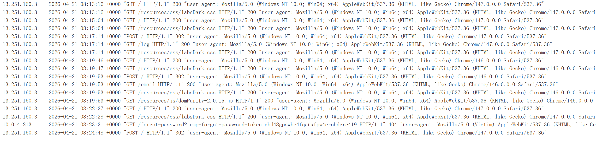
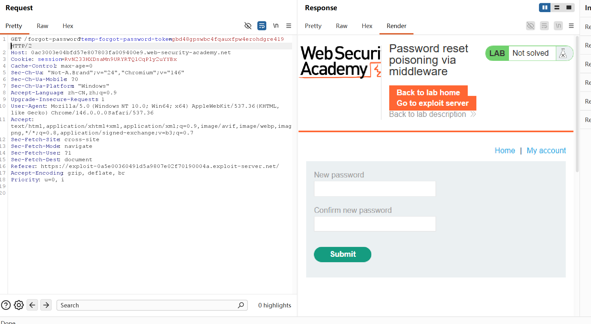
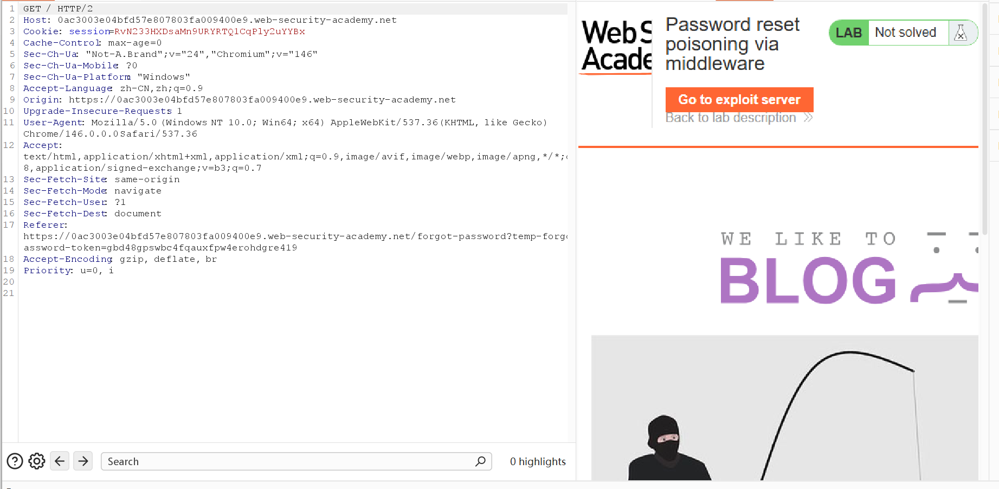
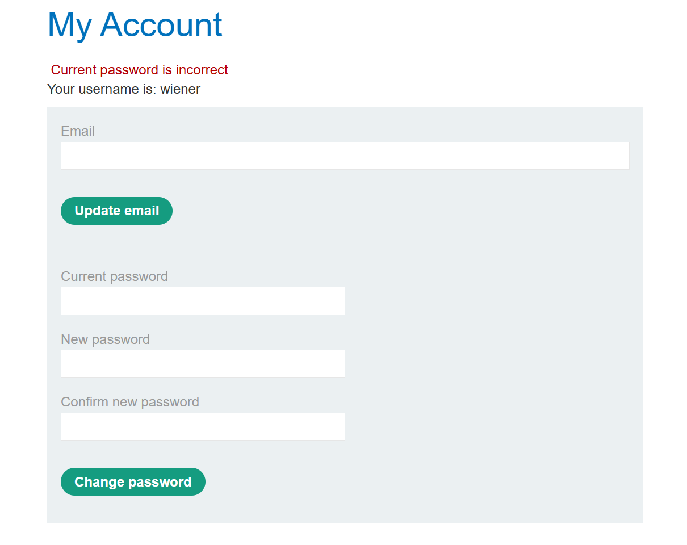
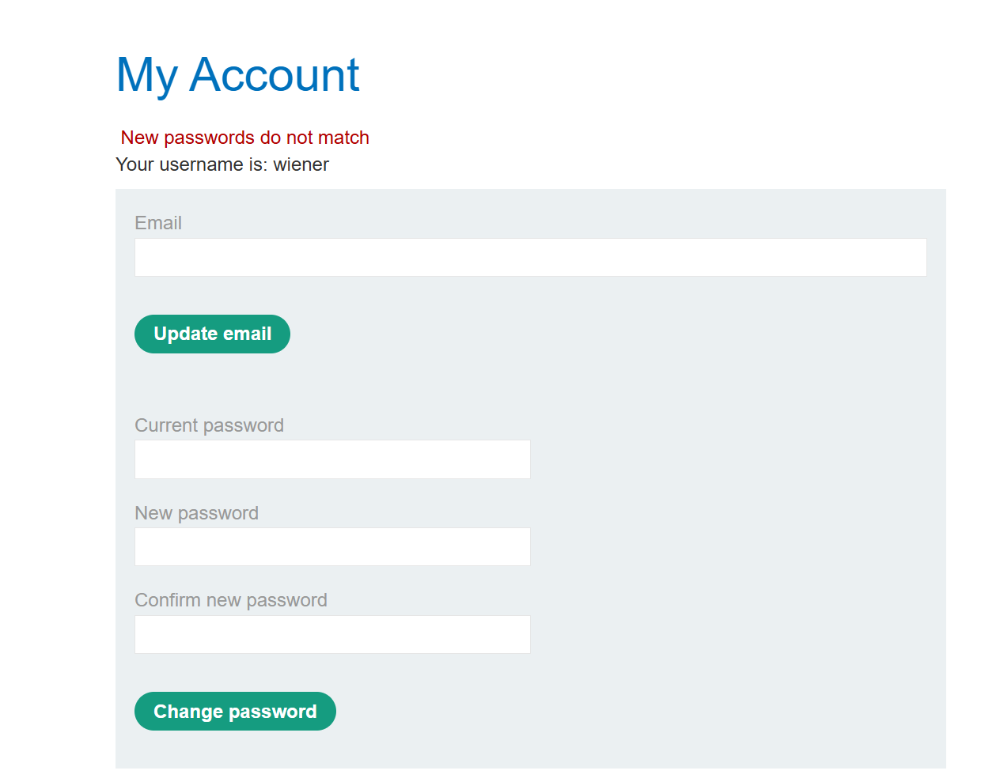
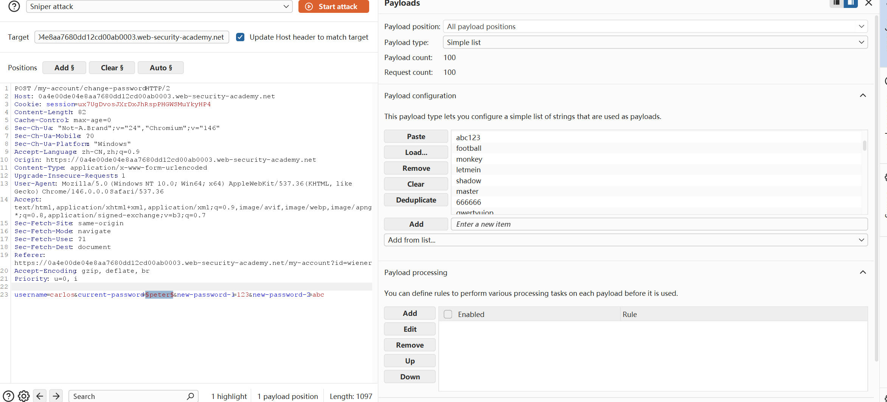
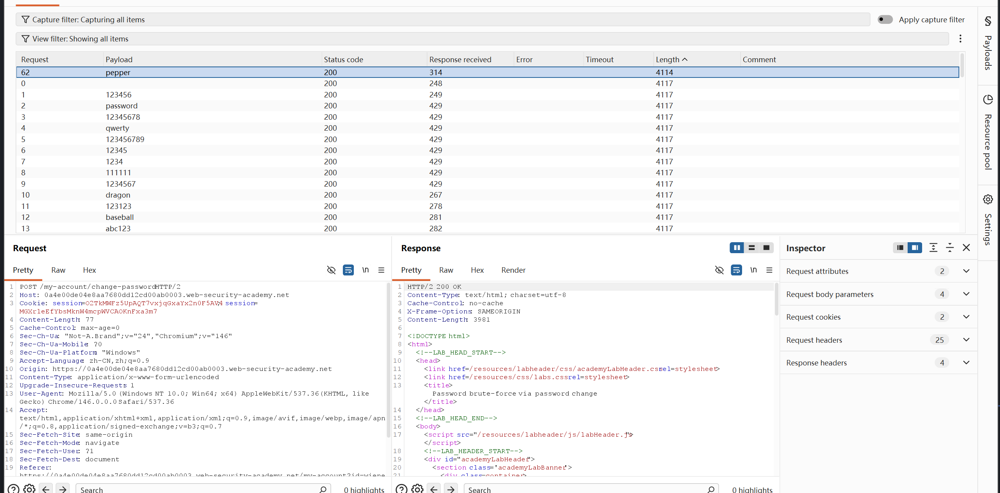

# Authentication vulnerabilities

## 一、什么是认证？
身份认证是验证用户或客户端身份的过程。任何接入互联网的人都有可能访问网站，这使得可靠的身份认证机制成为保障有效网络安全的核心环节。

身份认证主要分为三类：

- **你所知道的信息**：例如密码或安全问题的答案，这类因素有时也被称作“知识因子”。
- **你所拥有的物品**：例如手机或安全令牌这类实物，这类因素有时也被称作“持有因子”。
- **你的生理特征或行为习惯**：例如生物特征或行为模式，这类因素有时也被称作“固有因子”。

身份认证机制依托一系列技术手段，对上述一种或多种因子进行验证。

## 认证漏洞的产生
身份认证机制中的大多数漏洞主要通过以下两种方式产生：

1. 认证机制本身安全性薄弱，未能有效抵御暴力破解攻击。
2. 实现过程中存在逻辑缺陷或代码编写不规范，导致攻击者可以完全绕过认证机制。这种情况有时被称为“失效的身份认证”。

在 Web 开发的许多领域中，逻辑缺陷只会使网站出现异常行为，不一定会引发安全问题。但由于身份认证对安全至关重要，存在缺陷的认证逻辑极有可能使网站面临安全风险。


## 一、基于密码的登录漏洞

对于采用密码登录方式的网站，用户要么自行注册账号，要么由管理员分配账号。该账号关联一个唯一的用户名和一个秘密密码，用户在登录表单中输入用户名和密码进行身份验证。

### 暴力破解

暴力破解攻击是指攻击者通过反复尝试来猜测有效的用户凭据。这类攻击通常使用用户名和密码字典进行自动化操作。自动化这一过程，尤其是使用专用工具，可能使攻击者能够以极高的速度进行大量的登录尝试。

暴力破解并非总是完全随机地猜测用户名和密码。攻击者还可以利用基本逻辑或公开信息，对暴力破解攻击进行微调，从而做出更有针对性的猜测。这大大提高了此类攻击的效率。如果网站仅依赖密码登录作为用户身份验证方式，而没有实施足够的暴力破解防护措施，则这些网站将非常容易受到攻击。

#### 分类

1. 暴力破解用户名：攻击者通过某种特征或者渠道了解到用户名的规律如使用邮箱注册，然后针对性地构造用户名字典，进行暴力破解

2. 暴力破解密码：暴力破解的难度由密码的复杂度和枚举速率限制等决定，通常网站会要求你设置高强度密码包括一下要求：
- 最少字符数
- 大小写字母混合使用
- 至少一个特殊角色
，与此同时，如果网站登录设置登录频率限制，在尝试多少次之后冻结账户，也会降低暴力破解的效率。

同时，网站在防护的过程中应该尽可能地减少暴露面，如无论在用户输入密码错误还是用户名错误时，都应该返回相同的错误信息，避免攻击者通过错误信息判断用户名是否存在以及密码是否正确，从而降低暴力破解的效率。

- 基于页面回显爆破（如：输入正确的用户名提示密码错误，错误的用户名提示用户名不存在）
- 基于时间处理逻辑爆破（如：输入正确的用户名输入，后端再验证密码，则不同的用户名的response received\response completed 时间差异很大，可以据此判断用户名是否存在）


#### 防护

1. 如果远程用户登录失败次数过多，则锁定其尝试访问的帐户。

**通常，锁定账户很有用，因为它可以设置一个阈值比如3，用户在尝试登录三次时，如果仍然失败，则锁定账户，防止暴力破解。但是如果攻击者的目标是拿到一个可用账户，那么就可以横向扩展攻击，尝试不同的用户，使用弱密码(但次数小于阈值<=2),然后测试大量的用户名，也有一定概率找到一个能够登录的账户。**
**还有一种攻击方式就是撞库攻击，很多人在注册不同的网站和软件的时候为了防止记不住、嫌麻烦等原因，一直使用同一个用户名或者密码，这样在某一个网站被盗后，那么其他网站的密码也随之暴露了。攻击者也可以通过这样去尝试登录，以减少尝试次数。**

2. 如果远程用户在短时间内连续尝试登录次数过多，则屏蔽该用户的 IP 地址。

*上述都是在连续尝试多次的基础上进行校验，但只要攻击者尝试不同的ip，每隔一段时间尝试(以刷新连续登录次数限制)，防护就形同虚设，(如手机银行通常会限制每天登录失败次数限制，严重可能直接冻结账户等等，以'防范'不法分子的暴力破解行为，但实际上并没有真正解决问题。)*

3. 速率限制，如果检测到某个账户尝试在短时间内登录失败次数过多，则屏蔽登录者ip，然后只有等待一段时间、管理员手动操作、用户完成验证码等操作之后才能继续尝试登录。
*但是没有解决问题，攻击者可以使用脚本随机速率发送登录请求*

#### HTTP 基本身份验证

尽管HTTP基本身份验证技术历史悠久，但由于其相对简单易用，您有时仍会看到它被使用。在HTTP基本身份验证中，客户端会从服务器接收一个身份验证令牌，该令牌由用户名和密码连接而成，并以Base64编码。此令牌由浏览器存储和管理，浏览器会自动将其添加到Authorization每个后续请求的标头中，如下所示：
```
Authorization: Basic base64(username:password)
```

##### 使用HTTP基本身份验证的缺陷
1. 中间人攻击：由于HTTP基本身份验证是明文传输的，因此攻击者可以拦截并修改请求，包括用户名和密码。如果攻击者截获了请求，他可以获取用户名和密码，然后使用相同的身份验证方法进行身份验证。
2. HTTP基本身份验证的令牌完全由静态值组成，因此很容易收到暴力破解攻击
3. 这种验证方式也很容易收到与会话相关的攻击，比如CSRF攻击，但它本身无法提供任何防护


## 二、多因素身份验证漏洞

多因素身份验证（Multi-factor authentication，MFA）是指使用多个因素来验证用户身份，以增强用户的安全性。通常包括用户的账户密码，以及其他的一些因素，如生物特征、指纹、面部识别、声纹、智能卡或短信验证码等。  


大多数网站都通过账户密码+短信验证码的方式（2FA）验证方式实现双因素验证，但是同故宫短信向用户发送验证码的方式存在一些安全隐患，比如：

1. 验证码是通过短信发送的，而不是有设备本身生成，容易被拦截，导致被盗用，所以有一些严格的网站如google就可能要求用户自己发送短信，或者改用其他验证方式绑定，比如你设备的pin码、指纹、面部识别等。

2. 攻击者获取一张包含受害者手机号码的SIM卡，如此，攻击者就能收到发给受害者的所有短信，包括验证码短信

2FA的验证也有风险：
- 一些网站在账户密码验证之后才是验证码验证，然而在验证码验证的过程中就已经是登录状态了，然后根据你的验证码正确与否判断是否退出登录状态，这种情况直接修改url，那么就绕过了验证码验证环节。
- 一些网站在2FA的时候先确认账户密码，然后在在响应中添加一些验证信息如四位数验证码，接着进行第二部验证，这种情况下，如果攻击者获取了验证码(或者暴力枚举验证码)，那么他就可以直接登录，而不需要知道账户密码。

## 三、其他验证方式

很多网站为了避免用户反复登录影响体验，可能根据用户的cookie进行识别验证，一旦用户的cookie被盗，那么他就能直接登录，而不需要输入用户名和密码。通过简单的base64编码对于这种防范不起作用，但是可以通过极少特征的加盐hash算法来达到cookie保护的目的，并且其后还需要设置cookie的尝试次数，以减少cookie被攻陷的可能。

密码更改验证，通常web的重置密码需要验证是否是真正的本人，如果验证不当，那么重置密码行为原本就有很大风险，并且，任何一个合格的网站都不应该存储你的密码的明文，最好是通过hash映射的方式进行密码校验。在重置密码时，大多通过电话接发短信、邮箱验证等方式，前提是在可信通道下的验证，如果攻击者能够通过社会工程学攻击获取到用户的邮箱或者手机号码，那么他就能够直接重置密码，获取账户的控制权。

*Lab: Password reset broken logic*
这个实验主要依赖的就是用户进入进入修改新密码时验证用户token，但真正提交表单时，token没有验证，可以直接修改指定的用户名修改密码，据此可直接修改最后一个请求包，指定修改carlos密码，完成实验

更佳的实现方法是生成一个高熵、难以猜测的令牌，并基于该令牌创建重置 URL。理想情况下，该 URL 不应泄露任何关于正在重置哪个用户密码的信息

*Lab: Password reset poisoning via middleware*
这里就是用户可控X-Forward-Host：+域名，这里可以指定攻击者的域名，整个利用思路是，首先用户点击'forget password',然后指定请求包中的X-Forward-Host，然后中间件拦截到请求，修改要修改的目标对象carlos，然后将请求重定向到攻击者的域名，攻击者的服务器日志里面的一个请求中就会收到包含carlos修改时要验证的token，

然后我们抓后续的修改密码的包，将token一次，填入，指定修改的carlos的密码

以及最后的修改提交POST请求：


更改用户密码
通常情况下，更改密码需要输入两次当前密码，然后再输入两次新密码。这些页面在验证用户名和当前密码是否匹配方面，本质上与普通登录​​页面相同。因此，这些页面也可能受到相同技术的攻击。

如果攻击者无需以受害者用户身份登录即可直接访问密码更改功能，则该功能可能尤其危险。例如，如果用户名存储在隐藏字段中，攻击者可能能够在请求中编辑此值，从而针对任意用户。这可能被利用来枚举用户名并暴力破解密码。
*Lab: Password brute-force via password change*

这里首先等噜wiener界面，然后测试三种不同的更改密码的情况：
- 情况1：如果current密码错误，new password和confirmpassword都相同，则会锁定账户。

- 情况2：如果current密码错误，new password与confirmpassword都不同，则会提示当前密码不正确

- 情况3：如果current密码正确，new password与confirmpassword都不同，则会提示新密码和确认密码不匹配


所以根据以上信息，我们只需要在new password和confirmpassword都不同的情况下，将username改为carlos，current标记为要爆破的地方，对比返回的结果，即可暴力破解carlos的密码，密码输入正确则会返回情况3，否则返回情况2


然后爆破对比结果，之后一个结果返回字段不一样，然后使用它修改为新密码并登录，即可完成实验



## 四、防范

1. 确定所有的身份验证信息都通过加密方式进行，包括账户传输、当前密码传输、更改的新密码、cookie、token等的加密复杂度要高，不能让攻击者随意猜出，且通过HTTPS等加密协议传输。
2. **减少暴露面积**
- 在用户更改密码时候，在current密码的输入无论是否正确都应该返回相同的错误信息，而不是正确的密码和错误的密码返回不同的错误信息，这样攻击者就无法根据错误信息判断当前密码是否正确，从而降低暴力破解的难度
- 防止用户名枚举如果你泄露了某个用户在系统中的存在，攻击者就更容易破解你的身份验证机制。在某些情况下，由于网站的特殊性质，知道某个人拥有账户本身就是一种敏感信息。无论尝试输入的用户名是否有效，都必须使用相同的通用错误消息，并确保它们完全一致。每次登录请求都应返回相同的 HTTP 状态码，并且尽可能使不同场景下的响应时间保持一致。
3. **增大用户的密码复杂度**，比如要求密码至少包含大小写字母、数字和特殊字符，并且密码长度至少8位，这样攻击者就很难通过暴力枚举的方式猜出密码。
4. **增大暴力破解的难度**，与其不做任何保护的让攻击者进行枚举攻击，进行严格的登录次数限制比如ip封禁以及警用禁用部分请求头(X-Forwarded-For、X-Real-IP等)、登录时要通过滑动验证，增加枚举门槛，从而增大暴力破解的难度。
5. **补充功能面也可能称为攻击对象**，除了主页面的登录页，修改密码页面、密码重置等等需要验证的页面都可能称为攻击对象，也需要进行相应的防护，如验证码、滑动验证、安全等级等。
6. **实施多因素验证**，包括你知道的东西以及你拥有的东西等，比如在单一密码登录验证的基础上，添加2FA验证，比如生物特征、指纹、面部识别、声纹、智能卡或短信验证码等，能够增大认证被攻击者破解的难度。