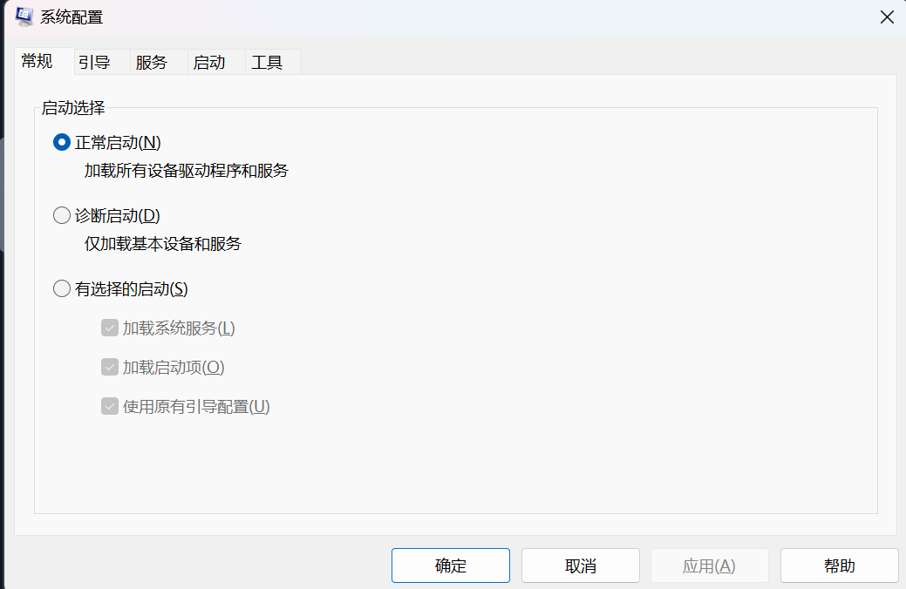

# foudmental one

windows专业版可以使用BitLocker加密功能

简单的ui介绍

文件系统：NFTFS 权限问题（①Full control
②Modify
③Read & Execute
④List folder contents
⑤Read
⑥Write）：备用数据流

 Windows 目录的系统环境变量是%windir%

账户：
- administrator
- users
*初始命令运行lusrmgr.msc window 10及以下可以查看users所有状况，windows11则需要打开：控制面板\用户帐户\用户帐户\管理帐户*

windows的UAC(User Account Control)来管理权限问题

设置与控制面板的使用（两者相通

任务控制器（task manager）或者使用ctrl+shift+esc快捷键打开

# foundamental two

**System Configuration**:MSConfig:诊断启动问题，**需要administrator才能启动**：

- **general**：
    - normal
    - diagnostic
    - slecttive

- **Boot**:
引导程序Boot

- **Services**：
