# 计算机组成

## 1-1 计算机系统的组成

### 计算机系统组成

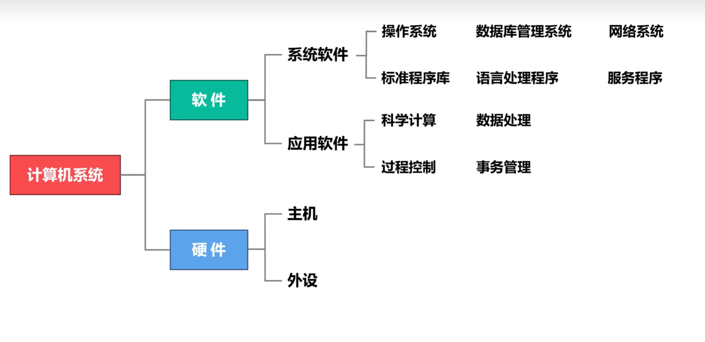

## 1-2 计算机的发展

**计算机发展**：
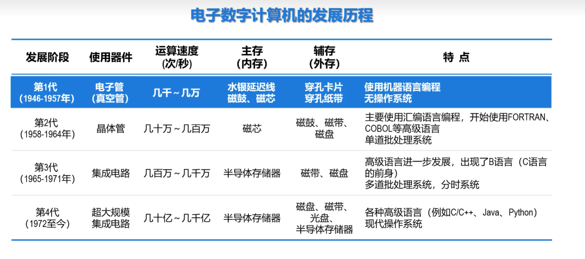

**摩尔定律**：
集成电路上可容纳的晶体管数目大约每经过18到24个月便会增加一倍。

换言之，处理器的性能大约每两年翻一倍，同时价格下降为之前的一半。

**计算机语言发展**:
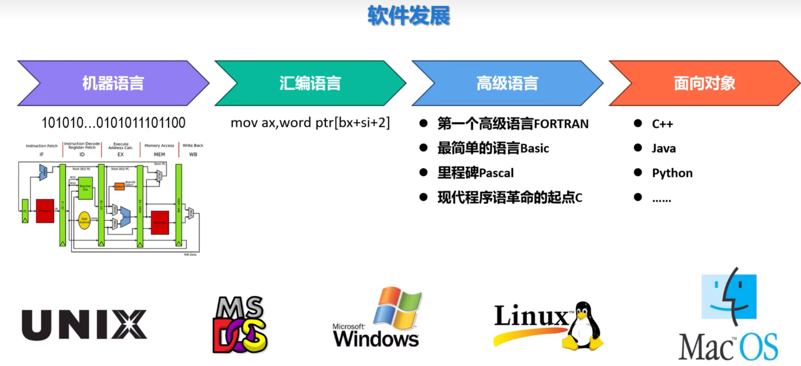

**两大发展趋势**：
- 更微型化
- 更巨型化

## 1-3 计算机硬件

冯·诺依曼计算机的主要特点如下：

- 构成程序的指令和数据均采用**二进制**表示。
- 指令和数据存放在存储器中，按地址访问。
- 指令在存储器中按顺序存放。一般情况下，指令是顺序执行的。
- 指令由**操作码**和**地址码**组成：
  - 操作码用来表示执行何种操作。
  - 地址码用来表示操作数在存储器中的位置。
- 机器以**运算器为中心**，输入/输出设备与存储器间的数据传送通过运算器完成。
- 计算机硬件由**运算器、控制器、存储器、输入设备/输出设备**5大部件组成。

**冯诺伊曼计算机结构**：
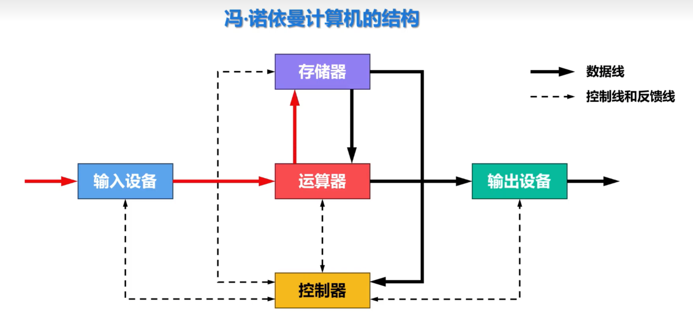
缺点：以运算器为中心，每次输入和输出(I/O)都需要计算机参与，浪费了很多可以用于运算的时间
**现代计算机结构**
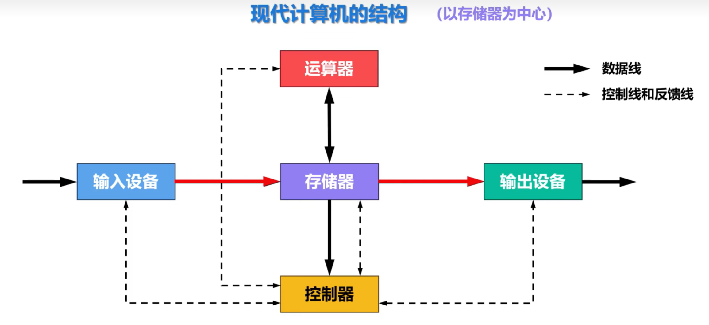

- **输入设备**：将人们熟悉的信息形式转换为计算机能够识别的信息形式，常见的有键盘、鼠标、扫描仪、摄像头等。
- **输出设备**：将计算机运算结果转换为人们熟悉的信息形式，常见的有显示器、打印机等。
- **存储器**：
    - **主存储器**：用于存放程序和数据，可以直接与CPU交换信息，又称为内存储器，简称内存或主存。
    - **辅助存储器**：用于帮助主存存储更多的信息。又称为外部存储器，简称外存或辅存。**辅存中的信息必须调入主存后，才能被CPU访问**。
- **运算器**：核心为算术逻辑单元ALU（Arithmetic Logic Unit），主要功能如下：
    - 算术运算：加、减、乘、除
    - 逻辑运算：与、或、非、异或等
- **控制器**：核心为控制单元CU（Control Unit），主要功能如下：
    - 用于解释存储器中的指令，并发出各种操作命令来执行指令。
    - I/O设备也受CU控制，用于完成相应的输入/输出操作。

优点：可以让输入输出设备直接与存储设备交换数据，提高了整体效率

**现代计算机结构示意图**
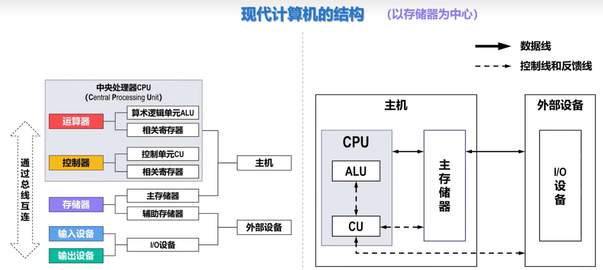

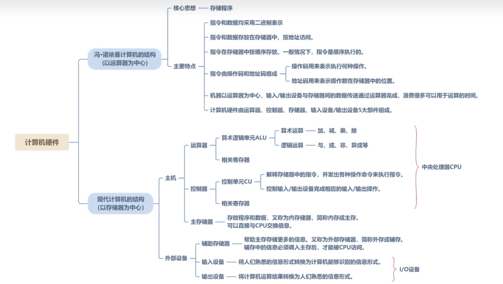

## 1-4 计算机软件

### 计算机软件的分类
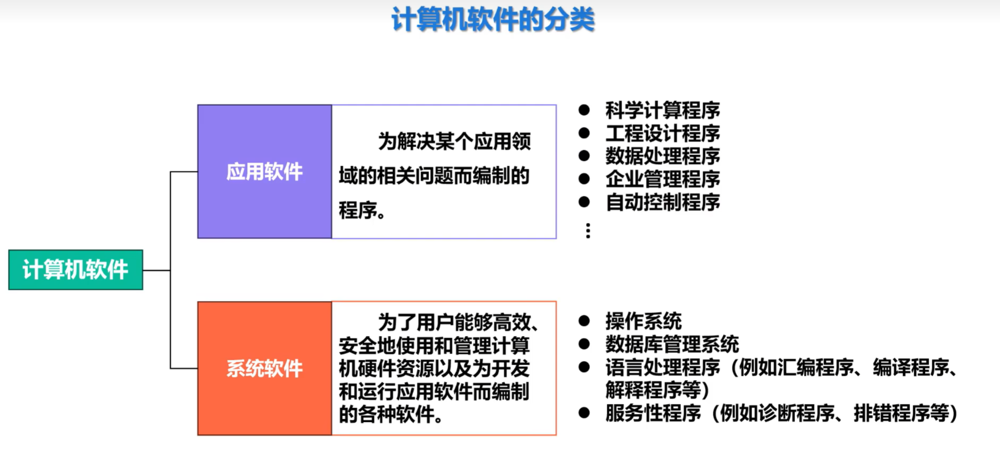

### 计算机语言的发展
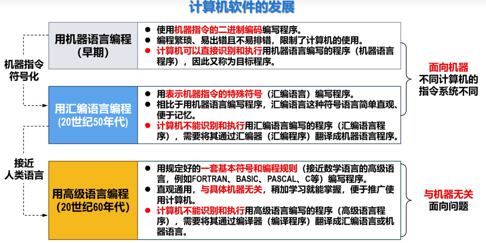

### 计算机程序语言与翻译程序之间的关系
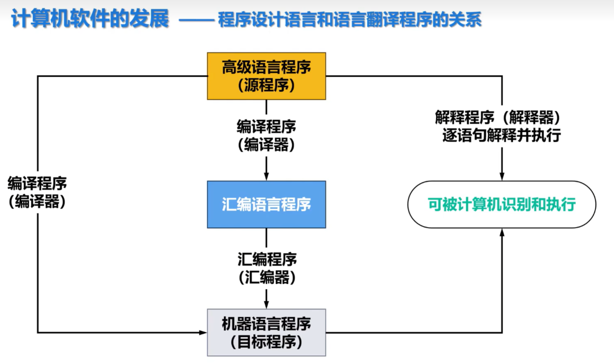
编译程序和解释程序统称为翻译程序
**一个实例**：
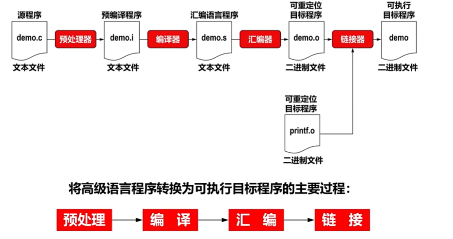

### 操作系统
- ■ 随着硬件和软件的不断发展，人们又创造出了一类程序，称为**操作系统**（属于系统软件）。
  - □ 操作系统提供了在**汇编语言和高级语言的使用和实现过程中所需的某些基本操作**。
  - □ 操作系统负责**控制并管理计算机系统全部硬件资源**（例如CPU、内存和外部设备）和**软件资源**（例如编译程序、应用程序等）。
  - □ 操作系统为**用户使用计算机系统提供了极为方便的条件**。
- ■ 随着计算机应用领域的逐渐扩大，还相应地出现了**其他各类系统软件**（例如数据库管理系统、网络系统等）以及多种多样应用软件。
- ■ 随着软件的进一步发展，将会出现**更高级的计算机语言**，其发展方向是标准化、积木化、产品化以及智能化，最终向自然语言发展，它们能够自动生成程序。

## 1-5 计算机分层思想

### 具体分层

| 层级 | 名称 | 说明 |
| --- | --- | --- |
|各类应用程序 |...|...|
| 第 6 层 | 高级语言层 | 使用与机器无关的高级语言编程，无需掌握机器的底层技术细节，只要掌握某种高级语言的语法规则以及算法和数据结构等方面的知识进行编程。 |
| 第 5 层 | 汇编语言层 | 使用汇编语言进行编程。由于汇编语言的每条语句都与机器语言的某条语句对应，因此仍要求程序员对实际机器的内部组成和指令系统非常熟悉。 |
| 第 4 层 | 操作系统层 | 设计人员不仅要对操作系统的设计理论有比较深入的理解，还需要掌握具体机器的指令集和汇编语言以及适于编写操作系统软件的高级语言。 |
| 第 3 层 | 指令集体系结构层（ISA） | 定义了某计算机可执行的所有机器指令的集合，规定了对于每条机器指令计算机应执行什么操作，所处理的操作数应存放的位置以及操作数的类型等。 |
| 第 2 层 | 微程序层 | 将一条机器指令编写成一个微程序。每个微程序包含若干条微指令，每条微指令对应一条或多条微操作。 |
| 第 1 层 | 逻辑电路层 | 计算机硬件系统的底层，由逻辑门、寄存器等逻辑电路组成。 |

其中：
第1-3层属于硬件层（本课程
第4-6层属于软降层

### 软件和硬件的逻辑功能等价性

- 在特定条件下，用软件实现的逻辑功能也可以通过硬件电路来实现，反之亦然。
- 对于一些特定的计算或控制任务，可以选择将其**使用软件编程来实现**，也可以选择**设计专用硬件电路来实现**，而两者的结果将在**功能上等效**。
- 软件和硬件的逻辑功能等价性是计算机科学中的一个重要概念，也是计算机体系结构和工程中的基本原则之一。
- 当选择在软件层面实现某些逻辑功能时，这通常意味着使用通用处理器（例如CPU）来执行程序；
- 而当选择在硬件层面实现这些逻辑功能时，这通常意味着使用专用的硬件电路，例如现场可编程门阵列FPGA（Field Programmable Gate Array）或专用集成电路ASIC（Application Specific Integrated Circuit）技术。

**具体区别**：
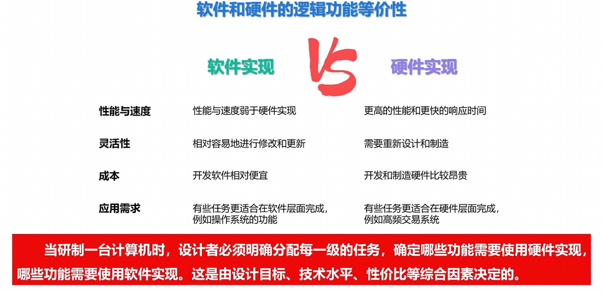

## 1-6 计算机基本工作原理

### 运算器

1-3讲的运算器还包含：ALU、ACC、MQ、
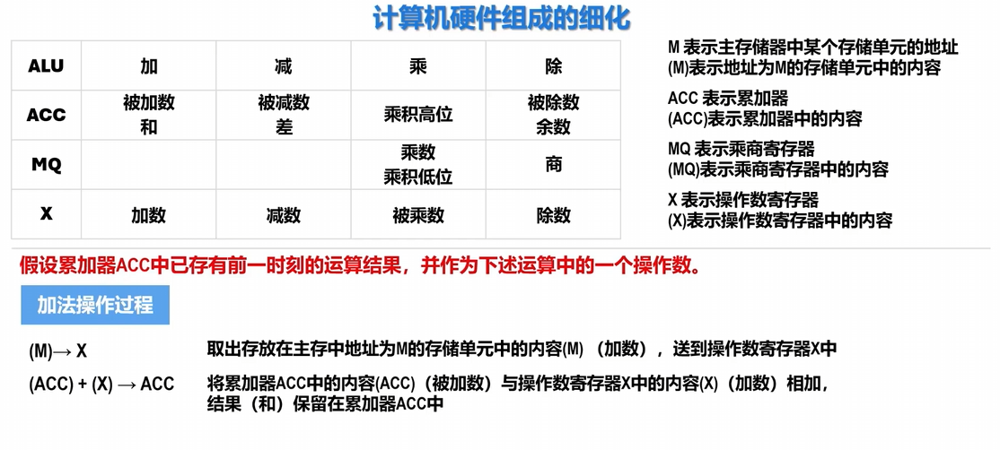

### 计算机硬件组成细化：

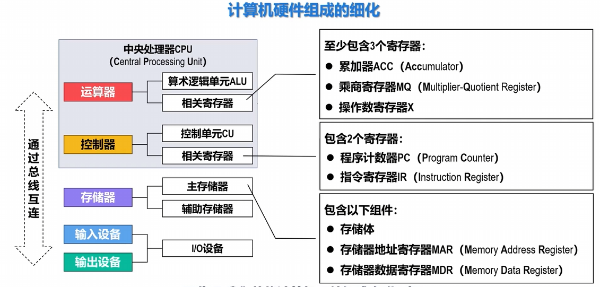

### 主存储器

- 存储体由很多个**存储单元**组成
  - 每个**存储单元**由若干个**存储元件**组成
    - 每个存储元件能存储**一位二进制数**“0”或“1”
  - 一个存储单元中可存储一串二进制信息，称这串二进制信息为一个**存储字**，这串二进制信息的位数称为**存储字长**（可以是8位、16位或32位等）。
- 给每个存储单元都赋予一个编号，称为**存储单元的地址**。
- 存储器**地址寄存器MAR**，用来存放欲访问的存储单元的地址。
  - MAR的位数（长度），决定了存储单元的数量。(2^MAR个存储单元)
- 存储器**数据寄存器MDR**，用来存放从存储体的某个存储单元取出的信息或者准备往某个存储单元存入的信息。
  - MDR的位数（长度），与**存储字长**相等。
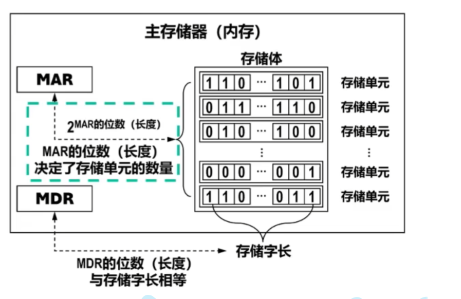

**主存（内存）的这种按存储单元的地址来实现对其写入和读取的存取操作，需要在CPU中的控制器的控制下进行。**

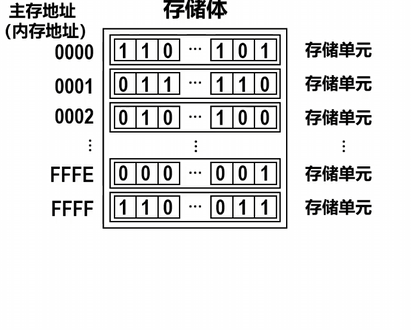

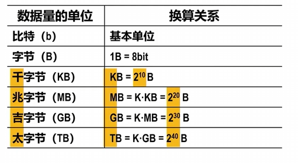‘

### 控制器细化讲解

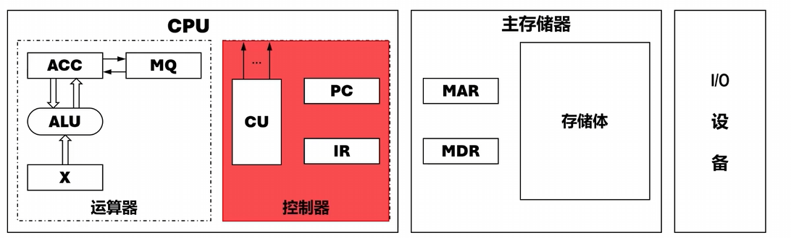

- 控制器是计算机的神经中枢，由它指挥各部件自动、协调地工作。
  ① 控制从主存中读取一条指令，称为**取指过程（阶段）**。
  ② 对指令进行分析，指出该指令要完成何种操作，并按寻址特征指明操作数的地址，称为**分析过程（阶段）**。
  ③ 根据指令的操作码和操作数所在的地址完成某种操作，称为**执行过程（阶段）**。

- 程序计数器PC用来存放当前欲执行指令的地址
  - PC与MAR之间有一条直接通路。
  - PC自动形成下一条指令的地址（“自动加1”功能）

- 指令寄存器IR用来存放当前的指令
  - IR的内容来自MDR。
  - IR中的操作码（用OP(IR)表示）会送至CU（用OP(IR) → CU表示），用来分析指令。
  - IR中的地址码（用Ad(IR)表示）作为操作数的地址送至MAR（用Ad(IR) → MAR表示），用来从内存中取操作数。

### 机器指令

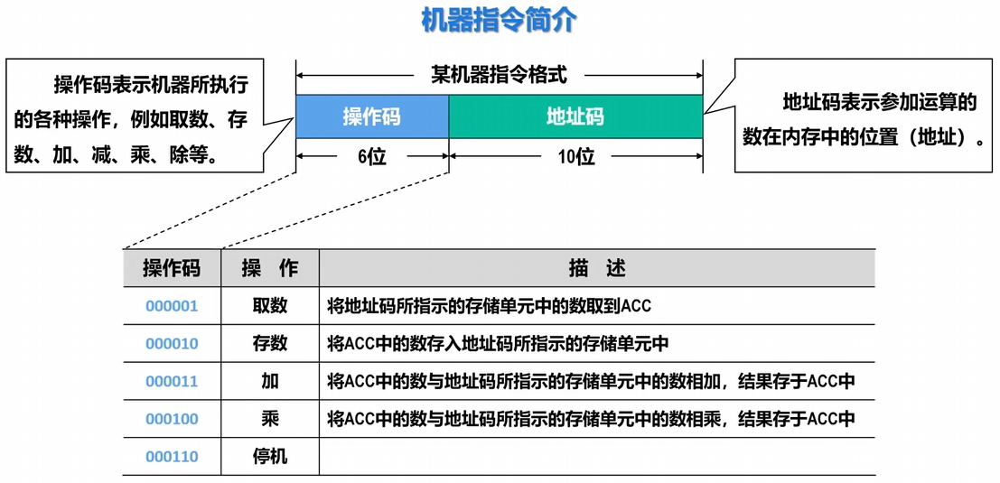

一个例子：
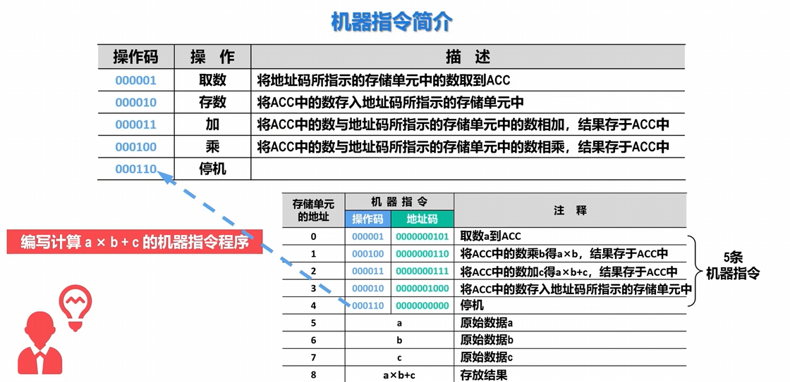

### 计算机的基本工作原理

具体为b站湖科大计组课程1-6节的24min- 29min部分

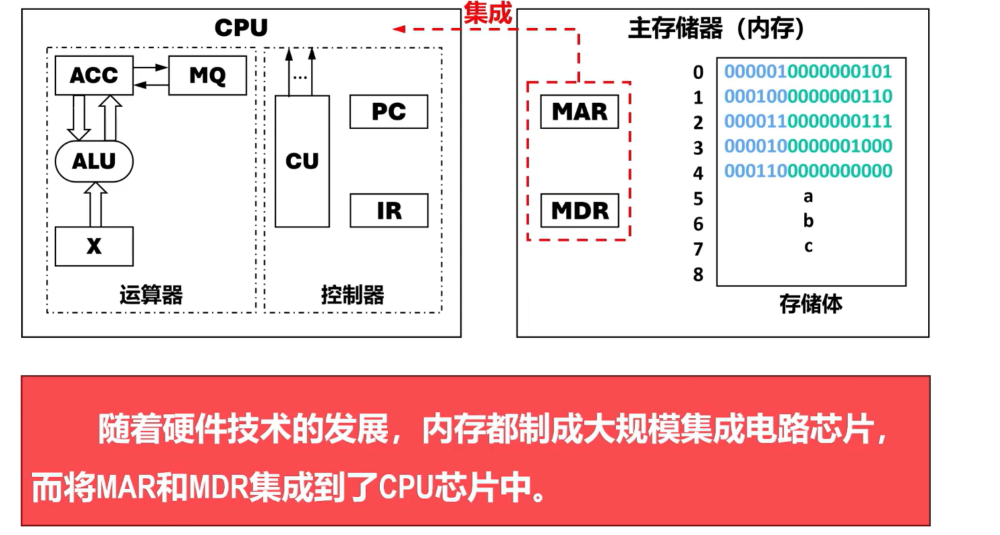
随着硬件技术的发展，内存都制成大规模集成电路芯片，而将 MAR 和 MDR 集成到了 CPU 芯片中。

## 1-7 计算机系统的性能指标

### 软硬件与计算机系统性能的关系

#### 硬件与计算机系统性能的关系
- 硬件是构建计算机系统的**物理组件**（例如CPU、内存、外部设备等）。
- 硬件对于计算机系统的性能有着**重要影响**，因为它决定了系统的**计算能力、数据传输速率和存储容量**。
  - CPU的时钟频率决定了CPU每秒钟可以执行的指令数量。
  - 内存带宽会影响数据的读写速率。

#### 软件与计算机系统性能的关系
- 软件包括用于控制、管理、应用计算机系统的各类**系统软件和应用软件**。
- 软件的优化可以**显著影响**计算机系统的性能，因为**合理的算法和代码实现可以更有效地利用硬件资源**。
  - 操作系统的调度算法会影响多任务处理的效率，从而影响系统的响应时间。
  - 在图像处理任务中，优化的软件算法可以减轻CPU和内存的负担，提高图形处理速度。
  - 软件层面的并行计算可以更好地利用多核处理器，提高吞吐量。

综上所述，计算机系统的性能指标涵盖了硬件和软件两个层面，他们之间密切相关，**优化硬件可以提供强大的计算和传输能力，而优化软件可以更有效地利用这些硬件资源，从而共同实现更好的系统性能**。正确地硬件选民免责可以为软件提供更好地执行环境，反之亦然。

### 计算机硬件相关指标
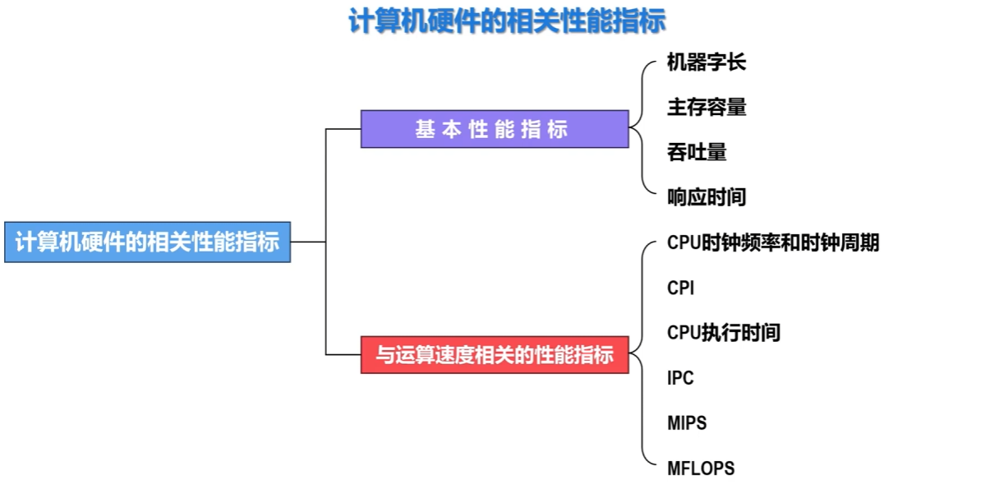

- 机器字长是指**CPU一次能够处理的二进制数据的位数**，也就是构成二进制数据的比特（bit，简写为b）数量。
  - 机器字长与CPU内部用于**整数运算的ALU的位数**以及**通用寄存器的宽度**相等。
- 机器字长对计算机系统性能的主要影响如下：
  - 字长越长，**数的表示范围**就越大、**精度**也越高。
  - 字长越长，**计算精度**也越高。
  - 字长还会影响**计算速度**。

- 主存容量是指**主存储器（内存）能够存储的最大信息量**。
  - 假设主存包含\(M\)个存储单元，每个存储单元可存储\(N\)个二进制位，可以通过下式计算主存容量：
    \[
    \text{主存容量} = N \times M \ (\text{位或} \ b)
    \]

| 数据量的单位 | 换算关系 |
| :--- | :--- |
| 比特（b） | 基本单位 |
| 字节（B） | \(1\text{B} = 8\text{bit}\) |
| 千字节（KB） | \(1\text{KB} = 2^{10}\text{B}\) |
| 兆字节（MB） | \(1\text{MB} = K \cdot \text{KB} = 2^{20}\text{B}\) |
| 吉字节（GB） | \(1\text{GB} = K \cdot \text{MB} = 2^{30}\text{B}\) |
| 太字节（TB） | \(1\text{TB} = K \cdot \text{GB} = 2^{40}\text{B}\) |

- 增加主存（内存）容量可以减少程序运行期间对辅存（外存）的访问，**由于访问内存的速度远大于访问外存的速度，因此可以提高程序的执行速度，进而提高计算机系统的性能**。

- 吞吐量是指计算机系统在**单位时间内能够处理的信息量**。
- 影响吞吐量的主要因素如下：
  - CPU的处理能力。
  - 内存（主存）的访问速度。
  - 外存（辅存，例如硬盘）的访问速度。

- 响应时间是指从向计算机系统**提交作业开始**，到系统**完成作业为止**所需要的时间。

- 响应时间构成：
  - CPU时间
    - CPU执行时间：执行用户程序本身所花费的CPU时间
    - 系统CPU时间：为执行程序而花费在操作系统上的时间
  - 其他时间：用户访问内存（主存）、外存（辅存）、其他外部设备所花费的时间

> 说明：很难精确区分一个程序执行过程中的CPU执行时间和系统CPU时间，在没有特别说明的情况下，基于CPU执行时间进行计算机性能评价。